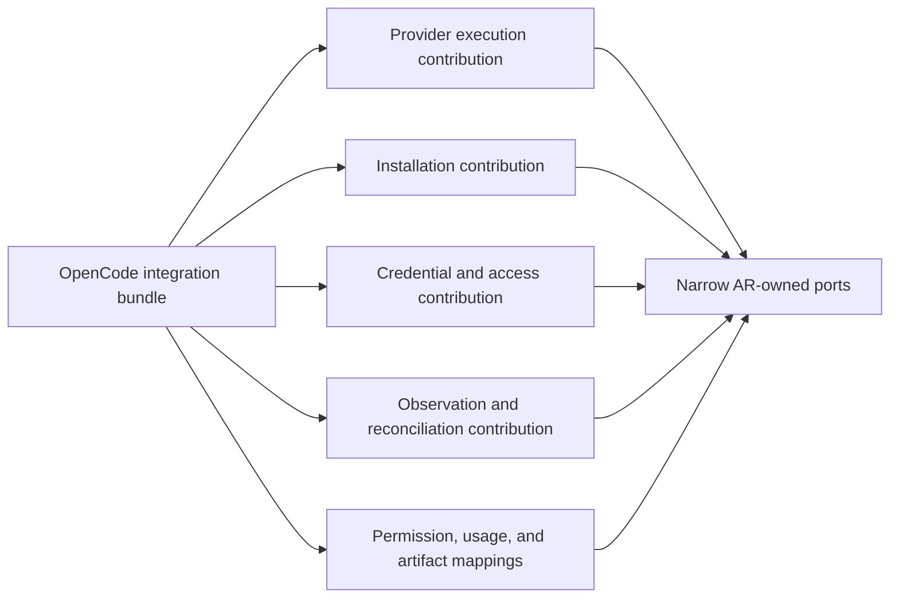

# Extension Model

## Terms

- **Extension** is a logical capability implementation with stable identity.
- **Plugin artifact** is an installable, signed, immutable OCI artifact.
- **Contribution** is one implementation of one narrow consumer-owned extension
  point.
- **Integration bundle** is one plugin artifact that carries several related
  contributions released and qualified together.
- **Extension host** is the product-owned runtime that validates, activates,
  invokes, drains, and isolates extensions for that product.
- **Catalog** supplies discovery and governance metadata from one authoritative
  PostgreSQL-backed source. It does not store the artifact or grant product
  authority.
- **Catalog snapshot** is a signed immutable publication or export of catalog
  state. It is not a writable source or product authorization.

## Simple Plugin and Integration Bundle

A simple Frontend plugin may contribute one artifact preview. An Agent Runtime
provider integration usually needs several cooperating contributions:

The bundle is one unit of publication, signature, compatibility, installation,
and rollback. It is not one large interface, one class, one transaction, or one
authority owner. Every contribution still implements a narrow product-owned
contract and can be admitted or denied by capability.

## Adapter Is Not Automatically a Plugin

Adapter describes an architectural role. Plugin describes independent
distribution and lifecycle. A plugin may contain adapters, while many internal
adapters remain built into the product.

Good extension candidates include provider integrations, task-board connectors,
workflow engines, review strategies, activity renderers, and artifact previews.
Database repositories, aggregate invariants, authorization, fencing, and
canonical-state mutation are not ordinary plugins.

Sandbox and containment implementations are privileged system extensions, if
they become extensions at all. Agent Runtime owns their policy, enforcement
contract, qualification, and evidence. An ordinary third-party plugin cannot
select its own sandbox, grant itself capabilities, or weaken Runtime Security.

## Extension-Ready, Not Plugin-First

Built-in implementations should use the same semantic contract as external
implementations when a capability is intentionally replaceable. Built-ins may
use trusted in-process composition while untrusted extensions use stronger
isolation. Internal helpers are not exposed merely to maximize plugin count.

A public SPI requires two independent implementations, stable ownership,
compatibility fixtures, and a conformance suite. Until then, the boundary stays
internal even when its design is extension-ready.
