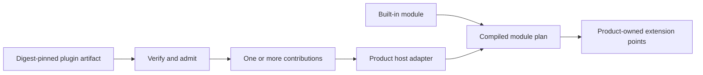

# Module and Plugin Topology Proposal

## Model

A module and a plugin are related but not interchangeable:

- a **module** is a trusted composition and lifecycle unit in one running product;
- an **extension point** is a narrow product-owned variability contract;
- a **contribution** implements one extension point;
- a **plugin artifact** is an independently distributed, signed, installable
  envelope containing one or more contributions;
- a **host adapter** turns admitted contributions into in-process modules or
  isolated proxies without exposing its implementation library.



This reuses module graph and lifecycle principles after admission while keeping
distribution, trust, permissions, installation, and update state explicit. One
plugin may supply several modules; a built-in module does not require a plugin.

## Dependency-injection neutrality

Public module definitions declare named required, optional, and provided
contracts. Activation receives a closed dependency object and a host-owned
resource scope. It never receives a container or arbitrary resolver.

```ts
defineModule({
  id: "work-coordination",
  requires: { clock: ClockContract.v1, logger: LoggerContract.v1 },
  provides: { workApi: WorkApiContract.v1 },
  activate({ clock, logger }, resources) {
    const workApi = createWorkApi({ clock, logger });
    resources.defer(() => workApi.close());
    return { workApi };
  },
});
```

A pure compiler validates identities, missing dependencies, cycles, provider
ambiguity, version compatibility, scope, and deterministic ordering before
activation. Execution is delegated through a narrow host port. Cordis, a native
runner, a process host, a browser worker, and a future Extism host are adapters,
not public semantics. No implementation is selected by this proposal.

## Proposed repository topology

```text
packages/
  contracts/
    src/features/
      extension-identity/
      capability-contracts/
      lifecycle-diagnostics/
  module-kit/
    src/features/
      module-definition/
      graph-compilation/
      activation-lifecycle/
  plugin-protocol/
    src/features/
      artifact-manifest/
      compatibility-negotiation/
      contribution-invocation/
      generation-transition/
  adapters/
    cordis-module-host/
    process-plugin-host/
    oras-distribution/
    cosign-verification/
    extism-plugin-host/        # deferred until after MVP
  testing/
    conformance/
```

Every non-trivial package uses feature-owned slices. Internal layers follow the
package role and actual behavior: complex lifecycle invariants may use domain and
application layers; codecs, schemas, adapters, and test kits do not receive
ceremonial DDD directories.

Package roots contain only curated exports and package composition. Product-owned
SPIs remain in Orchestrator, Agent Runtime, Frontend, or another consumer. This
repository never imports those product models.

## Shared architecture profile

The reusable package and feature rules should become a versioned Engineering
Foundation architecture profile. It should own generic schemas, validators, and
scaffolding. Each consumer remains the authority for its package catalog,
bounded-context map, allowed dependency edges, extension points, and local
exceptions. Orchestrator documents remain the donor until parity is proven.

## Evidence from established systems

- [Backstage modules](https://backstage.io/docs/backend-system/architecture/modules/)
  extend one owning plugin through narrow extension points and complete
  registration before the plugin initializes.
- [JupyterLab/Lumino](https://github.com/jupyterlab/lumino/blob/main/packages/coreutils/src/plugins.ts)
  demonstrates typed required, optional, and provided service tokens plus cycle
  detection, while its silent provider replacement is rejected.
- [Spring Modulith](https://docs.spring.io/spring-modulith/reference/verification.html)
  verifies acyclic modules, public-entrypoint-only access, and explicit allowed
  dependencies.
- [VS Code](https://code.visualstudio.com/api/advanced-topics/extension-host)
  demonstrates lazy activation and separate local, web, and remote hosts.
- [DeepSeek Harness and Cordis](https://github.com/deepseek-ai/deepseek-harness/blob/master/docs/cordis-primer.md)
  demonstrate reversible effects and profile-based composition, while a shared
  Context remains adapter-local.

## Open implementation choices

- exact TypeScript contract-token representation and compile-time diagnostics;
- first trusted in-process host adapter and its replacement evidence;
- collection contribution ordering and conflict policy;
- generation handover and leak-detection protocol;
- minimum two-consumer spike required before publishing the first public API.
