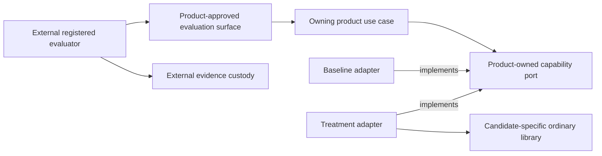
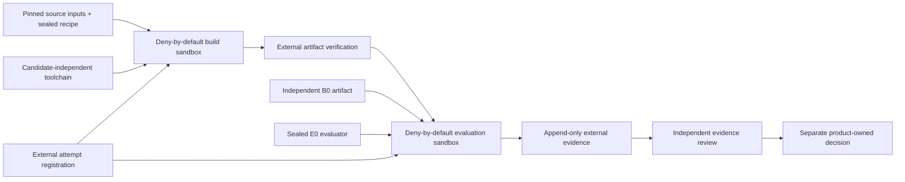

# Module System Dogfooding

## Purpose

This proposed architecture defines how a future module-system implementation
may be exercised without allowing that implementation to build, evaluate,
approve, or recover itself. It describes candidate-neutral authority and
evidence boundaries only. It does not admit a module engine, declaration
grammar, runtime graph, lifecycle coordinator, public SPI, or product rollout.

Dogfooding qualifies one implementation. It is not an independent consumer and
cannot satisfy the semantic-extraction gate in ADR-0013.

The current baseline remains product-owned ports, literal imports, pure
factories, closed dependency objects, and explicit composition roots. The
[Module System V1 productization dossier](../qualification/module-system-v1-productization/README.md)
records non-authoritative evidence, verdicts, and recommended triggers. Only
accepted ADRs and owning-product decisions authorize implementation or use.

## Design Principles

| Principle | Application here |
| --- | --- |
| Clean Architecture | Product policy and outcomes remain inside the owning product. Candidate runtime and evaluation technology stay behind outer composition boundaries. |
| SOLID | Candidate production, execution, evaluation, evidence custody, review, and product authorization are separate responsibilities. Implementations depend on stable contracts rather than framework types. |
| DDD | A product owns its language, capability seam, invariants, and decision. Foundation does not create a universal module domain or import a product model. |
| DRY | ADR-0013, ADR-0014, the productization dossier, and product decisions keep their existing responsibilities. A campaign links to them and records only campaign-specific facts. |

The future semantic kernel remains an ordinary library. It does not become a
module of itself and does not require its own graph, container, loader, or
lifecycle coordinator to compile, test, or start.

## Boundaries

### Authority roles

The roles below are logical authorities. Evidence used for promotion must bind
each role to an auditable principal and credential identity.

| Role | Owns | Must not own in the same campaign |
| --- | --- | --- |
| Product sponsor | Capability seam, product outcome, behavioral-oracle semantics, and proposed acceptance policy and thresholds | Treatment production, evaluation, evidence review, or product authorization |
| Product authorizer | Campaign admission, expiry, and any later product-use decision | Sponsorship, treatment production, harness operation, evidence custody, evaluation, or evidence review |
| Candidate producer | Treatment implementation and declared build inputs | Harness operation, evidence custody, evaluation, review, or product authorization |
| Harness operator | Sealed execution of the registered protocol | Candidate production, evidence custody, evaluation, review, or product authorization |
| Evidence custodian | Attempt registration, append-only receipts, raw outputs, provenance, and retrieval | Candidate production, harness operation, evaluation, review, or product authorization |
| Independent evaluator | Application of a sealed product-approved oracle or rubric and registered analysis | Oracle semantics, treatment implementation, harness operation, evidence custody, review, or product authorization |
| Independent reviewer | Acceptance or rejection of the evidence claim supported by one campaign | Sponsorship, authorization, implementation, execution, custody, or evaluation |

Calibration may combine roles, but its output cannot support promotion. A
campaign used for an architectural or product claim enforces the incompatible
role combinations above with separate principals or workload identities,
separate credentials, and auditable handoffs. Labels inside one process or
account are not separation.

Independence is evaluated over effective and transitive administrative control,
including the human or organization, workflow administrator, and credential
issuer. Workload identities controlled by the same effective principal do not
establish independence. The campaign evidence binds authenticated role
identities, control domains, and handoffs to the exact protocol, attempts,
review, and decision.

Foundation extraction has no role in a dogfooding campaign. If ADR-0013's
independent-consumer and conformance gates are later satisfied, a separate
accepted extraction decision names its authority. The product authorizer cannot
authorize Foundation extraction.

No shared module-system owner exists at this level. The first owning product
owns private identities, grammar, composition behavior, diagnostics, and any
lifecycle semantics. A Foundation owner can be introduced only through the
independent-consumer, conformance, and accepted-extraction process in ADR-0013.

### Source dependency direction

Product domain and application code never import a candidate container,
context, resolver, harness, receipt, or lifecycle type. The treatment adapter
depends on the product port and translates it to the candidate's own private
ordinary-library API. That candidate library imports neither product ports,
product DTOs, product domain types, nor evaluator types. This proposal creates
no cross-candidate API or Foundation-owned SPI. The evaluator invokes only an
external product-approved surface and does not import the production
implementation.

### Scope owned by a later acceptance decision

If accepted, this architecture would govern only the candidate-neutral
constraints for:

- bootstrap independence;
- role and credential separation;
- campaign identity and evidence custody;
- deterministic and stochastic evaluation isolation;
- fail-closed handling of missing evidence;
- preserving product and Foundation ownership boundaries.

The owning product must separately approve the exact capability seam, measured
problem, baseline, treatment rationale, corpus, evaluator, thresholds,
repetitions, exclusions, expiry, and any use outside a disposable campaign.
The dossier is evidence for that decision, not its authority.

## Campaign Structure

### Independent coordinates

Every campaign keeps the following coordinates distinct:

| Coordinate | Meaning |
| --- | --- |
| `ProtocolRevision` | Immutable ancestry and rules for one campaign |
| `BaselineArtifact` | Externally selected product-owned Pure DI baseline, also called `B0` |
| `TreatmentArtifact` | Candidate implementation under evaluation, also called `T1` |
| `EvaluationRevision` | Immutable evaluator inputs, execution rules, analysis, and stop rules, also called `E0` |
| `ExperimentalUnit` | The entity whose outcome contributes once to the registered analysis |
| `BuildAttemptIdentity` | One preregistered build of exact source, recipe, and toolchain inputs; its output artifact is optional |
| `AttemptIdentity` | One non-reused artifact execution, optionally linked to a prior attempt without becoming a new experimental unit |
| `LaunchAuthorization` | One-use custodian-issued capability bound to one registered attempt and exact sandbox policy |
| `BuildReceipt` | Externally captured build result with an optional verified output artifact |
| `EvidenceReceipt` | Externally captured binding between registered evaluator inputs, execution, raw output, and terminal result |

These names do not define a public schema. Serialization and storage remain
campaign-local until independent consumers justify shared extraction.

`B0` and `E0` are frozen before `T1` enters a campaign. `E0` binds immutable
content digests and retrievable locators for its corpus, runner, oracle or
rubric, model identity, prompts, context, settings, tools, permissions, budgets,
assignment order, pair identities, analysis, exclusions, thresholds, and stop
rules. Changing an evaluator input or analysis rule creates a new `E0`; changing
candidate bytes creates a new `T1`. A protocol may compare a preregistered family
of `T1` artifacts under one sealed `E0` only when the treatment sources and build
registrations are committed before the sealed corpus or any interim outcome is
revealed to the candidate producer. Outcome-informed candidate changes require
both a new `T1` and a fresh `E0` with a previously unseen independently reserved
corpus or assignment. `E0` lineage binds prior evaluations and the registered
cross-revision selection and multiplicity rule. If a fresh holdout or valid
adaptive-analysis protocol is unavailable, the result is exploratory and cannot
support promotion. Results from different evaluator revisions are not pooled.

Before a build starts, the evidence custodian registers a
`BuildAttemptIdentity` against the exact `ProtocolRevision`, source inputs,
sealed recipe, and toolchain, with an expected `BuildReceipt`. The receipt binds
the terminal build result and, on success, the optional verified `T1`. Build
failure therefore remains visible before an artifact exists.

Before artifact execution, the custodian registers an `AttemptIdentity` against
the exact `ProtocolRevision`, `B0` or verified `T1`, `E0`, and
`ExperimentalUnit`, with an expected `EvidenceReceipt`. A retry of either kind
links to its predecessor and retains the original `ExperimentalUnit`. A genuine
independently randomized replication is registered as a new experimental unit
and attempt, never relabeled as a retry.

Each registration issues a one-use `LaunchAuthorization`. The external launch
gate atomically records its consumption before the build or evaluation sandbox
can execute candidate-controlled code. Missing, reused, mismatched, or expired
authorization blocks launch. Authorization expiry is never later than campaign
expiry. Process release atomically revalidates both, and campaign expiry closes
the generation fence even when retirement has not run. The harness cannot start
an unregistered attempt and register it after observing the outcome.

### Bootstrap without recursive authority

Every candidate generation can be built and evaluated through a pinned ordinary
toolchain and immutable build recipe that do not depend on any candidate
generation. Candidate-declared inputs are data to that recipe, not execution
authority. Build, install, and evaluation run inside disposable containment with
no real projects, user credentials, or ambient network access.

A stable `N-1` artifact may be an additional comparison subject. It is never a
required builder, evaluator dependency, approval mechanism, or recovery
prerequisite for generation `N`. The candidate-independent path remains tested
and sufficient for every generation. Self-hosting never becomes
self-certification.

### First dogfood capability

This document selects no capability. The criteria below are necessary but not
sufficient. Before a treatment exists, the owning product measures the authoring
or drift problem through existing composition without introducing the
abstraction being justified. A product decision must then name and own every
admission prerequisite. It may cite dossier evidence at an exact immutable
revision, but mutable dossier fields never become authority. A candidate that
introduces a new authoring grammar also requires an accepted governance
successor that explicitly resolves the ownership conflict between ADR-0013 and
ADR-0014. An ordinary campaign or product-use decision is insufficient.

An admitted capability must be:

- product-owned and observable through a narrow existing seam;
- stateless or derived from disposable inputs;
- repeatable in a fresh sandbox without user projects or credentials;
- removable without changing product contracts;
- outside canonical writes, migrations, authorization, release, and rollback;
- useful enough to expose authoring or composition failures.

A documentation example, synthetic fixture, or Foundation repository path is
calibration evidence only. It does not become a product consumer by being
placed in this repository.

### Evidence dimensions

Architecture gates, execution environments, evaluation tracks, and allowed
claims are independent dimensions. They are not a maturity ladder.

| Environment | Track | Allowed claim | Claim explicitly not supported |
| --- | --- | --- | --- |
| Exact source audit | Dependency and export audit | Import direction, curated exports, and absence of framework leakage in inspected source | Runtime behavior or product use |
| Packed candidate artifact in a disposable workspace | Deterministic black-box conformance | Behavior of exact packed bytes for the registered corpus | Product integration, recovery, or independent consumption |
| Disposable product-owned replay | Deterministic comparison | Relative outcome for one approved seam without serving users | Product adoption or live replacement |
| Disposable product-owned replay | Stochastic AI authoring or navigation benchmark | Relative discoverability and authoring performance under one registered evaluator | Correctness, runtime safety, or another evaluator revision |
| Independent consumer evidence | Cross-consumer conformance | Input to a later L5 extraction decision | Automatic Foundation ownership |

Evidence for one claim dimension cannot substitute for another. Source review
does not prove execution. Stochastic improvement cannot offset deterministic
failure. Multiple configurations, copied repositories, or jobs under one owner
are not independent consumers.

### Evaluation tracks

The exact benchmark remains product-owned. Any deterministic campaign used for
an evidence claim must register normalized inputs and expected outputs,
non-stochastic oracle behavior, resource bounds, identical adapter treatment,
and deliberate mutants. Mutation evidence supports only the bounded claim that
the registered oracle rejects each registered mutant.

Any stochastic campaign must preregister its primary estimand, experimental
unit, pairing and randomization schedule, analysis method, sample-size or power
justification, non-inferiority or effect rule, multiplicity handling, attrition
and retry handling, fresh-context and carryover controls, and confidence rule.
Outcome assessment is masked where practical. Otherwise `E0` requires objective
scoring or a registered justification and bias control. `E0` binds the model,
prompt, context, tools, permissions, budgets, and capture and retention rules;
terminal receipts bind immutable digests and locators for resulting transcripts
and tool events.

Deterministic and stochastic tracks produce separate verdicts. Neither can waive
the other's failure. A separate source audit checks that public types and
dependency direction remain framework-neutral.

### Evidence custody

The external custodian preregisters every expected build and execution attempt
and records append-only terminal receipts. If no receipt arrives by the sealed
deadline, the custodian records a separate missing or unknown observation.
Absence alone is never reclassified as abandoned or invalid, and `E0` owns its
attrition and analysis treatment.

Every receipt binds:

- its build or execution attempt identity, `ProtocolRevision`, predecessor
  attempt, and registration, start, and completion timestamps;
- consumed `LaunchAuthorization` identity and external launch-gate receipt;
- sandbox enforcer identity, normalized policy or configuration digest, actual
  file, mount, network, environment, subprocess, and credential grants, and the
  enforcement outcome;
- raw output, terminal state, and current authorization or revocation
  observation when applicable.

Each build receipt additionally binds:

- repository, clean commit and tree, submodules, and lockfile digests; if a
  dirty input is exceptionally admitted, an immutable archive digest and
  retrievable locator for every modified and untracked byte;
- dependency resolution, sealed build recipe, builder identity, and toolchain
  or container digest;
- terminal build state and, when produced, artifact media type, digest, size,
  provenance, and immutable retrievable locator.

Each execution receipt additionally binds:

- the verified baseline or treatment artifact; treatment execution also binds
  the exact producing `BuildAttemptIdentity` and immutable `BuildReceipt`, and
  fails closed when that lineage is missing or ambiguous;
- protocol and evaluation content digests and immutable locators;
- experimental unit, pair, assignment order, and normalized result;
- immutable digests and locators for retained transcripts and tool events.

A local path, mutable tag, source claim, or hash without retrievable immutable
custody is corroboration only. Artifact identity is reverified at registration,
execution, evidence review, and any later separately approved use.

## Operational Implications

### Execution and failure behavior

Pure DI is not containment. Every candidate-controlled build step and executable
treatment runs in a deny-by-default sandbox appropriate to its placement. File,
network, environment, subprocess, and credential access are absent unless the
registered protocol grants a narrow disposable resource. Build-time code is
treated as executable candidate code.

Baseline and treatment execute independently in fresh disposable workspaces.
They do not share mutable caches, state stores, worktrees, credentials, or
candidate-only migrations. Fallback is disabled inside a scored attempt.
Unknown outcome, missing receipt, evaluator failure, artifact mismatch,
containment failure, or expired authorization fails closed for the claim.

The campaign does not serve user traffic or authorize shadow, non-production,
production, replacement, or rollback behavior. Each requires a separate
product-owned decision and architecture.

### Threat applicability

| Threat | Required treatment |
| --- | --- |
| Candidate self-certification | Candidate producer, harness, custody, evaluator, reviewer, sponsor, and authorizer remain auditable and separated as defined above |
| Recursive bootstrap | Candidate-independent build and evaluation path remains sufficient and tested for every generation |
| Omitted failed attempt | Build and evaluation sandboxes consume a one-use externally logged authorization before candidate code can run |
| Artifact substitution | Immutable locator, digest, provenance, and verification at every use |
| Evaluator drift | `E0` binds every evaluator input, model identity, assignment, and analysis rule |
| Adaptive benchmark overfitting | Treatment family is committed before unblinding; outcome-informed changes require an unseen holdout or remain non-promotional |
| Framework leakage | Export and dependency-direction audit outside black-box scoring |
| Build or process escape | Deny-by-default containment from the first candidate-controlled build or executable treatment |

Live replacement, unload, distributed cutover, and product recovery are outside
this proposal. They require their own accepted lifecycle or placement decisions
and must not be inferred from dogfooding evidence.

### Conditional implementation plan

Candidate-independent calibration phases become executable only after an
accepted revision of this architecture and a narrow product-owned calibration
authorization. Treatment phases additionally require the owning product's
immutable campaign decision. The plan is deliberately product-local: it creates
no Foundation runtime, shared candidate API, public SPI, production loader, or
reusable campaign service.

#### Pre-admission discovery

Before campaign implementation or treatment code, the owning product observes
its existing Pure DI composition using already approved instrumentation. This
discovery names the measured problem, narrow capability seam, reproducible
baseline measurements, exact `B0` candidate, and proposed outcome. It introduces
no module-system abstraction, campaign harness, candidate, or new execution
authority.

The product also classifies every proposed treatment semantic as `L0`, `L1`,
`L2`, `L3`, or `L4` under the productization roadmap. Each level above `L0` must
show its own measured trigger and accepted owning-product decision. A campaign
cannot use its disposable status to admit authoring grammar, runtime selection,
lifecycle, or process-host semantics that their level has not admitted.

#### Calibration authorization

Before Phase 0, the product authorizer records a narrow, expiring calibration
authorization containing:

- the accepted revision of this architecture;
- the discovery evidence, measured problem, exact `B0`, and current Pure DI
  baseline, captured without the candidate abstraction;
- one product-owned capability seam and the exact product outcome being tested;
- every proposed treatment semantic, its `L0`-`L4` classification, trigger
  evidence, and accepted level-specific owning-product decision;
- immutable calibration-only protocol, evaluation, and sandbox-policy
  coordinates that can bind registrations, launches, and receipts but can never
  become campaign `ProtocolRevision` or `E0` coordinates;
- the draft evaluator design, sandbox and evidence technologies, forbidden
  resources, calibration owner, estimate owner, and stop rule.

This authorization permits baseline reproduction, candidate-independent harness
work, and deliberate mutants only. It cannot allocate an `E0`, register, build,
or execute `T1`, support a promotional claim, or authorize product use.

#### Campaign admission checklist

After Phase 2 and before any treatment work, the product authorizer records all
of the following in one immutable campaign decision:

- the exact calibration authorization and its results;
- immutable `ProtocolRevision` and `B0` coordinates;
- the proposed treatment family, admitted deterministic and stochastic tracks,
  exact immutable `E0`, evaluator owner, acceptance thresholds, exclusions,
  expiry, retention, and stop rules;
- named principals, credentials, and effective control domains for every
  authority role;
- the build and execution sandbox enforcer, deny-by-default policy, and allowed
  disposable resources;
- the evidence store, immutable locator scheme, access policy, and projection
  rebuild procedure;
- immutable artifacts and configurations for the qualified registrar, launch
  gate, receipt writer and store, sandbox enforcer, and runtime reconciler, plus
  the exact Phase 2 qualification evidence for those bytes;
- an exact immutable dossier revision used as supporting evidence;
- an accepted ownership and governance successor before introducing any new
  authoring grammar.

Missing or mutable prerequisites are a no-go. A planning issue, draft ADR,
mutable branch, calibration authorization, or candidate-owned configuration
cannot substitute for campaign admission.

#### Campaign-local deliverables

| Deliverable | Responsibility | Boundary |
| --- | --- | --- |
| Protocol record | Holds campaign-specific coordinates, role bindings, thresholds, expiry, and stop rules | Data only; not a module declaration or shared Foundation schema |
| Baseline adapter | Implements the existing product-owned port with `B0` behavior | Remains the default product composition |
| Treatment adapter | Implements the same port and translates to the candidate's private ordinary-library API | Removable without changing the port, use case, or domain model |
| Attempt registrar and launch gate | Preregisters attempts and linearizes authorization consumption, campaign stop, and the process-start fence | Runs outside candidate authority and before candidate-controlled code |
| Build and evaluation sandbox adapters | Attest effective grants before release, persist runtime identity and deadline, enforce policy, and reconcile orphans | No real projects, ambient credentials, or implicit network |
| Evidence writer and reader | Persist immutable raw receipts under a monotonic finality model and reconstruct disposable projections | Candidate, harness, and evaluator cannot rewrite terminal facts |
| Admitted evaluator adapters | Apply every and only the sealed product-approved deterministic or stochastic track | Each admitted track produces its own verdict and owns no product decision |
| Disposable fixtures and deliberate mutants | Prove the harness detects registered failure classes | Calibration only; never counted as an independent consumer |
| Evidence report | Presents traceable inputs, failures, exclusions, and verdicts to reviewers using escaped inert projections | Derived and rebuildable; raw candidate bytes remain separate untrusted objects and never become active report content |

These are responsibilities, not a prescribed package topology. The owning
product places them according to its accepted feature standard. Implementations
must not extract a common campaign framework merely because adjacent adapters
look similar.

#### Phase 0 - Calibration admission and estimate

1. Validate the accepted architecture, calibration authorization, and its strict
   prohibition on treatment work and promotional evidence.
2. Verify the discovery evidence and exact `B0` candidate are reproducible.
3. Verify every proposed treatment semantic is within an admitted `L0`-`L4`
   level. Calibration-only coordinates are immutable and externally traceable,
   but have no campaign `E0` identity, promotional authority, or reuse path.
4. Record the exact forbidden product paths, credentials, networks, and process
   capabilities for containment tests.
5. Produce a technology-specific implementation estimate covering changed
   lines, engineering time, calendar dependencies, infrastructure, security
   review, and operator, evaluator, and reviewer availability.

Exit only when every calibration prerequisite has an owner, immutable reference,
and testable acceptance rule and the delivery estimate is owned. Otherwise stop
without creating treatment code.

#### Phase 1 - Baseline reproduction and product seam

1. Exercise the existing Pure DI composition through the product-owned port.
2. Reproduce the admitted baseline measurements and fail closed when they no
   longer match the discovery evidence.
3. Prove the baseline adapter remains the default and a later product-local
   treatment adapter requires no change to the use case, port, or domain.
4. Add source and packed-artifact audits for forbidden framework, evaluator,
   receipt, and product-type leakage.

Exit only when the measured problem remains reproducible and the seam is narrow,
observable, and reversible. A changed baseline invalidates the calibration
authorization and requires new pre-admission discovery, `B0`, and repetition of
Phases 0 and 1. An unmeasured convenience abstraction is a no-go.

#### Phase 2 - Candidate-independent harness

1. Implement attempt registration, one-use launch authorization, append-only
   receipts, and rebuildable read projections outside candidate authority. Every
   calibration registration, launch, and receipt binds the immutable
   calibration-only protocol, evaluation, and sandbox-policy coordinates.
2. Linearize authorization consumption, campaign-generation fencing, and process
   creation. Persist an enforcer-owned runtime identity and hard deadline before
   releasing candidate-controlled code.
3. Attest effective file, mount, network, environment, subprocess, and credential
   grants against the registered policy before candidate-controlled code runs.
4. Run build and evaluation adapters with `B0` and deliberate mutants only.
5. Exercise crash, timeout, cancellation, containment denial, receipt mutation,
   deletion, conflicting duplicates, crash durability, orphan reconciliation,
   campaign-expiry races, malicious output rendering, and restart behavior before
   treatment execution.
6. Demonstrate that no `N-1` candidate is needed to build, launch, evaluate,
   recover evidence, or clean up the campaign.
7. Produce a qualification manifest binding immutable digests and configurations
   for the registrar, launch gate, receipt writer and store, sandbox enforcer,
   runtime reconciler, and all negative-test evidence.

Exit only when all registered negative cases fail closed and a destroyed
projection can be rebuilt from immutable receipts. Mutation, deletion, or
conflicting terminal receipts must be rejected or detectably invalidate the
claim. Calibration output cannot support promotion. Only after this exit may the
product authorizer mint the immutable `ProtocolRevision`, freeze `B0`, and issue
the final `E0` and campaign decision. Any later change requires a new immutable
calibration authorization and complete Phase 2 rerun before campaign readmission.
Calibration coordinates are never promoted or reused as campaign coordinates.

#### Phase 3 - Treatment build and protocol seal

1. Validate the complete campaign admission checklist, effective role
   separation, sealed `ProtocolRevision`, `B0`, final `E0`, and exact qualified
   harness artifacts and configurations before accepting any treatment
   registration. Any harness change requires new calibration authorization,
   Phase 2 qualification, and campaign re-admission.
2. Preregister the admitted treatment source family and each
   `BuildAttemptIdentity` before a build starts, without revealing sealed corpus
   or outcomes to the candidate producer.
3. Consume the build authorization, build in containment, and record success,
   failure, or unknown outcome even when no artifact exists.
4. Run the source and packed-artifact leakage audits against every produced
   `T1`; reject it before execution on any forbidden dependency or export.
5. Verify provenance and immutable custody, then materialize a content-addressed,
   read-only snapshot or opened object whose runtime identity cannot change
   between verification and execution.

Exit only when every executable treatment has one unambiguous build lineage and
the sealed evaluator and exact runtime artifact are retrievable by immutable
locators.

#### Phase 4 - Sealed campaign execution

1. Before registrations begin, the evidence custodian persists the immutable
   roster of every attempt slot expected by `E0`, including experimental unit,
   assignment, pair, and order.
2. Preregister every execution attempt against one exact roster slot, artifact,
   `E0`, and `ExperimentalUnit`.
3. Atomically consume its one-use authorization before process creation or
   candidate-controlled code. Process creation revalidates the current campaign
   generation fence, campaign expiry, authorization expiry, and attested
   effective grants before release. Campaign expiry automatically closes the
   fence.
4. Run baseline and treatment in fresh, non-sharing disposable workspaces with
   fallback disabled.
5. Record terminal receipts or explicit non-registration, missing, or unknown
   observations for every roster slot by the sealed deadline. Retried attempts
   keep the original experimental unit.
6. Reconcile registered attempts with enforcer-owned live runtime identities on
   restart and terminate unmatched or expired sandboxes.
7. Do not expose interim outcome-correlated data to the candidate producer,
   product sponsor, product authorizer, or independent reviewer. Only an
   `E0`-registered stopping rule may preserve a promotional claim.

Exit only when every expected roster slot resolves either to an explicit
non-registration observation or to a registered attempt with a terminal or
explicit unknown record, and all artifact, sandbox, and evaluator bindings
verify. Any unresolved mismatch fails the registered claim.

#### Phase 5 - Evaluation and independent review

1. Apply every admitted evaluation track under `E0`; when both deterministic and
   stochastic tracks are admitted, keep their analyses and verdicts separate.
2. Reconcile the complete expected roster against registered, non-registered,
   missing, unknown, excluded, and terminal slots, then account for retries,
   attrition, multiplicity, treatment lineage, and prior evaluation revisions
   exactly as preregistered.
3. Apply the monotonic receipt finality rule. The deadline classification remains
   the analytic result; late receipts are appended as late and cannot rewrite it.
   Conflicting terminal receipts invalidate the claim and require a new report
   revision.
4. Generate a read-only evidence report from immutable receipts. Candidate output
   remains opaque untrusted bytes; projections use context-specific escaping and
   non-active content types, disable outbound access, and expose raw objects only
   through safe downloads.
5. Have the independent reviewer accept or reject only the registered claim and
   record unresolved limitations.

Exit with a bounded evidence verdict, not a runtime or extraction decision.

#### Phase 6 - Product decision and retirement

1. The product authorizer makes a separate decision to reject, repeat, or use
   the evidence in later product-specific design work and orders retirement.
2. The evidence custodian revokes issued authorizations; the launch gate and
   harness operator fence consumed-but-unstarted launches and prove new process
   creation is denied.
3. The harness operator reconciles every in-flight runtime to a terminal,
   forcibly terminated, missing, or unknown disposition.
4. The evidence custodian retains a complete manifest and immutable custody for
   every raw object and authorization, sandbox, evaluation, review, and decision
   event needed to rebuild the verdict, plus the retirement tombstone.
5. Remove disposable workspaces only after evidence capture and keep an owned,
   observable cleanup backlog for failures.
6. Remove the treatment adapter without modifying the product port, use case, or
   domain model when the campaign ends.

Exit only after revocation and launch denial are verified, every in-flight
runtime has a recorded disposition, the verdict remains rebuildable, baseline
composition is restored, and any cleanup backlog has an owner and deadline.

Foundation extraction remains blocked until two independently authored
consumers, executable conformance, and an accepted extraction decision satisfy
ADR-0013.

#### Negative verification matrix

| Scenario | Required result |
| --- | --- |
| Missing, reused, mismatched, expired, or revoked launch authorization | Candidate code never starts; an external denial observation is retained |
| Campaign expires after authorization consumption but before process release | Expiry closes the generation fence; process creation is denied and the denial is retained |
| Concurrent consumers race for one authorization | Exactly one consumption wins; all other launches are denied before process creation |
| Campaign stop races with a consumed but unstarted launch | The generation fence prevents process creation and records a terminal denial or unknown disposition |
| Crash after authorization consumption but before confirmed process start | Recovery reconciles the persisted runtime identity, terminates any orphan, and records missing or unknown at deadline |
| Crash after process start but before terminal receipt | Recovery finds the live runtime; no automatic outcome-changing retry occurs and deadline finality is preserved |
| Duplicate registration or replayed request | Idempotent lookup returns the original identity; no second execution is authorized |
| Build fails before producing an artifact | Terminal `BuildReceipt` records failure and no synthetic `T1` is created |
| Artifact bytes or resolution target change after verification | Execution uses the already verified immutable object or fails before process creation |
| Treatment has missing or ambiguous build lineage | Execution is rejected before launch |
| Sandbox grants undeclared file, mount, network, environment, subprocess, or credential access | Pre-release attestation blocks launch; runtime confinement loss triggers emergency termination and credential revocation |
| Candidate can read the sealed corpus, outcomes, evidence credentials, or real projects | Campaign is invalid and cannot support promotion |
| An expected `E0` slot is never registered | An explicit non-registration or unknown observation remains in attrition accounting and cannot disappear from the report |
| Retry is relabeled as an independent replication | Registration is rejected or analysis treats it as the original experimental unit |
| `E0` input or analysis changes after sealing | A new `E0` and valid unseen assignment are required; prior results are not pooled |
| Incompatible roles share effective or transitive administrative control | Evidence is calibration-only and cannot support promotion |
| Candidate, adapter, or public product surface leaks framework, receipt, evaluator, or product-domain types | Source or packed-artifact gate fails |
| Treatment failure triggers hidden baseline fallback | Attempt fails; fallback cannot contribute a successful score |
| Read projection is deleted or corrupted | Projection rebuilds from immutable receipts without changing terminal facts |
| Raw receipt is mutated, deleted, lost before durable commit, or conflicts with another terminal receipt | Integrity verification rejects the mutation or invalidates the claim; projections cannot choose a preferred terminal |
| Terminal receipt arrives after an `E0` deadline | It is retained as late evidence but cannot change the registered analytic outcome |
| Candidate output contains HTML, script, terminal controls, links, or spreadsheet formulas | Reports render only escaped inert data with outbound access disabled; raw bytes require a safe download path |
| A decision or review role requests discretionary stop after interim outcome-correlated data | Stop is recorded with actor, reason, and evidence snapshot and the campaign becomes non-promotional |
| `N-1` candidate is unavailable | Candidate-independent build, evaluation, evidence recovery, and cleanup still work |

#### Operational readout

The evidence custodian exposes a rebuildable campaign view with, at minimum:

- counts of expected, registered, non-registered, denied, consumed, started,
  terminal, missing, and unknown build and execution attempts;
- orphan registrations, reused authorization attempts, receipt verification
  failures, artifact-lineage failures, live-orphan runtimes, and forced
  terminations;
- containment denials and differences between registered and actual grants;
- campaign-generation fence state, consumed-but-unstarted launches, late or
  conflicting receipts, and each stop actor, reason, and evidence snapshot;
- cleanup backlog and elapsed time after campaign stop;
- exact protocol, evaluator, artifact, sandbox-policy, and evidence-revision
  digests for every reported verdict.

Telemetry and projections are diagnostics only. They cannot create attempts,
change terminal facts, waive a gate, or authorize execution. Raw evidence follows
the admitted access and retention policy and never records unredacted ambient
credentials.

#### Stop and rollback procedure

Stopping a campaign is an authority action, not a candidate callback. An orderly
stop performs these steps. Campaign expiry starts the same fence closure
automatically even when the retirement workflow is delayed:

1. Advance the campaign generation fence, stop issuing authorizations, revoke
   issued authorizations, and block consumed-but-unstarted launches.
2. Reconcile every persisted runtime identity. Already started, still-contained
   sandboxes may run only until the sealed deadline and resource policy.
3. Record unresolved in-flight attempts as missing or unknown; do not rewrite or
   discard them and do not silently retry them.
4. Preserve complete verdict inputs, review state, and the retirement tombstone
   before deleting disposable resources.
5. Restore the product's baseline composition by removing the treatment adapter;
   no product contract, domain migration, or candidate `N-1` artifact is needed.

Suspected containment loss, undeclared effective grants, credential exposure,
or launch-gate compromise triggers emergency stop instead. The operator advances
the fence, immediately terminates and quarantines affected sandboxes, revokes
exposed credentials, records forced termination or unknown outcomes, and marks
the campaign non-promotional. Emergency stop never waits for the scored deadline.

#### Planning estimate

For one admitted product-local campaign, the first implementation is expected to
change approximately `2,500-6,500` lines including focused tests and fixtures:

- campaign records and product-local adapters: `500-1,200` lines;
- registrar, launch gate, receipts, and projections: `600-1,400` lines;
- containment adapters and enforcement evidence: `400-1,000` lines;
- evaluator adapters and report projection: `300-800` lines;
- fault injection, mutants, restart, and packed-artifact tests: `700-2,100`
  lines.

This is a planning range, not scope authority. Re-estimate after a product owns
the exact seam, sandbox technology, and evaluator. Phase 0 must replace this
range with an owned estimate for engineering time, calendar dependencies,
infrastructure, security review, and independent operator, evaluator, and
reviewer capacity. A universal runtime, plugin distribution, hot replacement,
public SPI, production rollout, or Foundation extraction is explicitly outside
this estimate and this plan.

### Retirement and retained evidence

An admitted product protocol names an exact expiry and review owner. Before any
attempt exists, an unowned or expired proposal may be withdrawn through the
product's approved process. Once a build or execution attempt is registered, its
immutable coordinates, terminal receipt or missing or unknown observation, and
every raw object and authorization, sandbox, evaluation, review, and decision
event required to rebuild its verdict are retained with a retirement tombstone.
Verdict validity cannot outlive the shortest referenced retention period. Later
evidence expiry or destruction appends a tombstone and never rewrites the prior
record. Failed or missing attempts are never deleted or rewritten to simplify
later evidence.

This proposed architecture creates no campaign, candidate, artifact, or
authorization. Product-specific protocols and attempt records belong in the
owning product. Foundation receives only evidence required by a later,
separately approved extraction decision.

## Architectural Acceptance Criteria

A future implementation conforms to this proposal only when:

- an accepted revision of this architecture and product calibration authorization
  precede candidate-independent harness work, while an immutable campaign
  decision precedes every treatment registration, build, or execution;
- calibration registrations, launches, and receipts bind immutable
  calibration-only coordinates that cannot be promoted or reused as campaign
  coordinates;
- campaign admission binds the exact Phase 2-qualified evidence-critical harness
  artifacts and configurations, and any change requires requalification;
- every treatment semantic is classified and remains within its admitted
  `L0`-`L4` level and accepted product trigger;
- product ports, DTOs, domain types, and application use cases expose no module
  framework, container, host, harness, receipt, or candidate type;
- the semantic kernel compiles and tests without loading itself as a module;
- an ordinary candidate-independent path can build and evaluate every
  generation without a prior candidate;
- sponsor, authorizer, candidate production, harness operation, evidence
  custody, evaluation, and evidence review have auditable principal and
  credential separation over their effective and transitive administrative
  control;
- baseline and every evaluator input are frozen before treatment registration or
  build, and calibration drafts never reuse an `E0` identity;
- every build and execution attempt is preregistered and has a terminal receipt
  or detectable missing or unknown observation;
- no build or execution starts without atomically consuming its one-use external
  launch authorization;
- each launch authorization expires no later than its campaign, and process
  release atomically revalidates both expiries;
- every `E0`-expected attempt slot remains visible as a registered terminal or
  unknown attempt or an explicit non-registration observation;
- campaign stop and process creation are linearized through a generation fence,
  and recovery reconciles every persisted runtime identity;
- every candidate-controlled build and execution receipt binds the sandbox
  enforcer, policy, actual grants, and enforcement outcome;
- effective grants match the registered policy before candidate code is released,
  and runtime confinement loss triggers emergency termination;
- each treatment execution binds one unambiguous producing build attempt and
  receipt and uses the exact immutable object verified before process creation;
- outcome-informed treatment changes use an unseen holdout with registered
  lineage and selection accounting or remain non-promotional;
- deterministic and stochastic verdicts remain independent;
- each attempt has monotonic deadline finality; late evidence cannot rewrite the
  analytic result and conflicting terminal receipts invalidate the claim;
- fallback cannot hide a failed or unknown treatment outcome;
- all raw inputs needed to rebuild a verdict remain under immutable custody for
  the verdict's stated validity period;
- candidate-controlled output remains opaque untrusted data and every report
  projection renders it with context-specific inert handling;
- dogfooding, product runtime use, and Foundation extraction remain separate
  decisions;
- generated indexes and reports remain disposable projections, not additional
  authorities.

## Related Decisions

- [ADR-0013](../decisions/0013-first-consumer-module-semantics-before-foundation-extraction.md)
  keeps module semantics product-local until independent consumers and
  conformance justify extraction.
- [ADR-0014](../decisions/0014-product-local-module-authoring-composition-and-generation-guardrails.md)
  defines current Pure DI, inert authoring, literal loading, and future
  generation guardrails without admitting a runtime.
- [OD-003](../open-decisions/OD-003-module-runtime-and-public-spi-choices.md)
  retains unresolved runtime and public-SPI choices.
- The
  [Module System V1 productization dossier](../qualification/module-system-v1-productization/README.md)
  records current evidence, verdicts, and non-authoritative recommended triggers.
