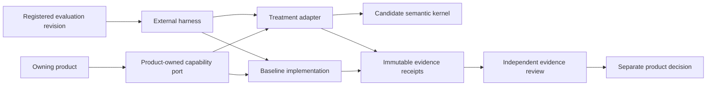
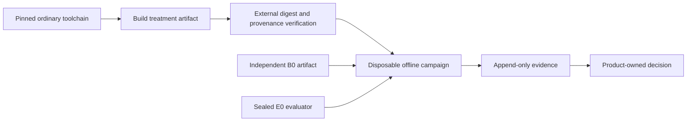

# Module System Dogfooding

## Purpose

This proposed architecture defines how a future module-system implementation
may be exercised by its own repository without allowing the implementation to
build, evaluate, approve, or recover itself. It describes authority and
evidence boundaries only. It does not admit a module engine, declaration
grammar, runtime graph, lifecycle coordinator, public SPI, or product rollout.

Dogfooding is qualification of one implementation. It is not an independent
consumer and cannot satisfy the semantic-extraction gate in ADR-0013.

The current baseline remains product-owned ports, literal imports, pure
factories, closed dependency objects, and explicit composition roots. The
[Module System V1 productization gate](../qualification/module-system-v1-productization/README.md)
remains authoritative for the current verdicts and admission triggers. This
document references that dossier rather than restating its roadmap or evidence.

## Design Principles

| Principle | Application here |
| --- | --- |
| Clean Architecture | Product policy and outcomes remain inside the owning product. Candidate runtime and evaluation technology stay behind outer composition boundaries. |
| SOLID | Candidate production, execution, evaluation, evidence custody, review, and product authorization are separate responsibilities. Implementations depend on stable product-owned contracts rather than framework types. |
| DDD | A product owns its language, capability seam, invariants, and decision. Foundation does not create a universal module domain or import a product model. |
| DRY | ADR-0013, ADR-0014, the productization dossier, and product decisions remain the sources of truth. Product protocols link to them and contain only campaign-specific facts. |

The future semantic kernel remains an ordinary library. It does not become a
module of itself and does not require its own graph, container, loader, or
lifecycle coordinator to compile or start.

## Boundaries

### Authority roles

The roles below are logical authorities. A later product decision must name
their accountable owners and enforce any required separation of credentials.

| Role | Owns | Must not own in the same campaign |
| --- | --- | --- |
| Product sponsor | Capability seam, outcome, behavioral oracle, thresholds, campaign admission, and any product-use decision | Candidate implementation or mutable evaluator inputs after registration |
| Candidate producer | Treatment implementation and its declared build inputs | Baseline selection, evaluation configuration, evidence disposition, or product adoption |
| Harness operator | Sealed execution of the registered protocol | Candidate code, oracle semantics, or product authorization |
| Evidence custodian | Append-only receipts, raw outputs, provenance, and retrieval | Rewriting failed attempts or choosing a winner |
| Independent evaluator | Deterministic oracle or blinded stochastic rubric | Treatment implementation or product rollout |
| Independent reviewer | Accepts or rejects the evidence claim supported by one campaign | Product adoption or Foundation extraction authority |

No shared module-system owner exists at this level. The first owning product
owns any private identities, grammar, composition behavior, diagnostics, and
lifecycle semantics. A Foundation owner can be introduced only by the
independent-consumer, conformance, and accepted-extraction process in ADR-0013.

### Dependency direction

The candidate depends inward on product-owned abstractions supplied at a
composition boundary. Product domain and application code never import a
candidate container, context, resolver, harness, receipt, or lifecycle type.
The evaluator invokes the subject through an external product-approved surface
and does not import its production implementation.

### Scope owned by this document

This document owns only the candidate-neutral constraints for:

- bootstrap independence;
- role and authority separation;
- campaign identity and evidence custody;
- deterministic and stochastic evaluation separation;
- fail-closed recovery and retirement;
- preserving product and Foundation ownership boundaries.

The owning product must separately decide:

- the exact capability seam and outcome;
- whether a measured problem admits a treatment;
- the baseline and treatment implementations;
- the corpus, oracle, thresholds, repetitions, and exclusions;
- any product shadow, non-production, or production use;
- state migration, lifecycle, placement, or containment.

## Structure

### Independent campaign coordinates

Every campaign keeps the following coordinates distinct:

| Coordinate | Meaning |
| --- | --- |
| `ProtocolRevision` | Immutable ancestry and rules for one campaign |
| `BaselineArtifact` | Externally selected product-owned Pure DI baseline, also called `B0` |
| `TreatmentArtifact` | Candidate implementation under evaluation, also called `T1` |
| `EvaluationRevision` | Registered corpus, runner, oracle or rubric, thresholds, exclusions, and stop rules, also called `E0` |
| `AttemptIdentity` | One non-reused execution of one artifact under one evaluation revision |
| `EvidenceReceipt` | Externally captured binding between inputs, execution, raw output, and result |

The names do not define a public schema. Exact serialization and storage remain
campaign-local until independent consumers justify shared extraction.

`BaselineArtifact` and `EvaluationRevision` are frozen before a treatment is
accepted into a campaign. Candidate-controlled source cannot supply mutable
evaluator configuration, hooks, oracle code, thresholds, or dependencies.
Changing the runner, oracle, corpus, model, rubric, or thresholds creates a new
evaluation revision. Results from different revisions are not pooled.

### Bootstrap without recursive authority

The first candidate is compiled through the repository's normal pinned
TypeScript toolchain. Its semantic kernel is ordinary library code and cannot
control repository startup, compilation, release, rollback, or the evaluator.

After a stable version exists, a later generation may use an `N-1` stable
artifact while evaluating generation `N`. The externally owned evaluator,
artifact verification, evidence custody, and product decision remain outside
both generations. Self-hosting never becomes self-certification.

### First dogfood capability

No capability is selected by this document. A product decision may admit one
only when it is:

- product-owned and observable through a narrow existing seam;
- stateless or derived from disposable inputs;
- repeatable in a fresh sandbox without user projects or credentials;
- removable without changing product contracts;
- outside canonical writes, migrations, authorization, release, and rollback;
- useful enough to expose authoring or composition failures.

A documentation example, synthetic fixture, or Foundation repository path is
calibration evidence only. It does not become a product consumer by being
placed in this repository.

### Evidence matrix

Architecture gates, execution environments, evaluation tracks, and allowed
claims are independent dimensions. They are not a maturity ladder.

| Environment | Track | Allowed claim | Claim explicitly not supported |
| --- | --- | --- | --- |
| Exact source audit | Dependency and export audit | Import direction, curated exports, and absence of framework leakage in inspected source | Runtime behavior or product use |
| Packed candidate artifact in a disposable workspace | Deterministic black-box conformance | Behavior of exact packed bytes for the registered corpus | Product integration, recovery, or independent consumption |
| Disposable product-owned replay | Deterministic comparison | Relative outcome for one approved seam without serving users | Product adoption or live replacement |
| Disposable product-owned replay | Stochastic AI authoring/navigation benchmark | Relative discoverability and authoring performance under one registered evaluator | Correctness, runtime safety, or another evaluator revision |
| Product non-production environment | Product-owned observation | Only the claim authorized by a separate product decision | Foundation extraction or public SPI stability |
| Independent consumer evidence | Cross-consumer conformance | Input to a later L5 extraction decision | Automatic Foundation ownership |

Higher-cost evidence cannot backfill a missing lower-level claim. Source review
does not prove execution. Stochastic improvement cannot offset deterministic
failure. Multiple configurations, repositories copied from one implementation,
or multiple jobs under one owner are not independent consumers.

### Evaluation tracks

The deterministic track requires:

- normalized inputs and expected outputs;
- non-stochastic oracle behavior;
- explicit time and resource bounds;
- deliberate mutants that prove the oracle detects wrong behavior;
- identical adapter treatment for baseline and treatment;
- every timeout, crash, missing result, and retry recorded as a distinct attempt.

The stochastic track requires:

- calibration tasks separated from sealed evaluation tasks;
- paired baseline and treatment tasks with randomized order;
- fixed model, settings, prompt, context, tools, permissions, and budgets;
- registered repetitions, attrition handling, and error taxonomy;
- blinded scoring where practical;
- a minimum sample size, effect or non-inferiority rule, and confidence rule;
- raw transcripts and tool events retained with the result.

The two tracks produce separate verdicts. Neither can waive the other's
failure. A separate non-promotional admission audit checks that public types
and dependency direction remain framework-neutral.

### Evidence custody

An external custodian records append-only receipts that bind:

- repository, commit, tree, submodules, and dirty-state observation;
- lockfile path and digest;
- dependency resolution and build-recipe digest;
- builder identity and toolchain or container digest;
- artifact media type, digest, size, provenance, and immutable retrievable
  locator;
- protocol, corpus, runner, oracle or rubric, and evaluation revision;
- attempt identity, raw output, normalized result, and timestamps;
- current authorization or revocation observation when applicable.

A local path, mutable tag, source claim, or hash without retrievable immutable
custody is corroboration only. Artifact identity is reverified at capture,
execution, evidence review, product adoption, and rollback where those stages
exist.

## Operational implications

### Execution and failure behavior

Baseline and treatment execute independently in fresh disposable workspaces.
They do not share mutable caches, state stores, worktrees, credentials, or
candidate-only migrations. Fallback is disabled inside a scored attempt.

The treatment result is persisted before any baseline recovery serves an
external outcome. Baseline recovery cannot rewrite the treatment result,
remove it from the denominator, or turn it green. Unknown outcome, missing
receipt, evaluator failure, artifact mismatch, or expired authorization fails
closed for the claim being evaluated.

Before any bounded product use, the owning product must rehearse restoration
after an injected partial treatment failure. A missing, revoked, incompatible,
or corrupted baseline blocks rollout; it is not silently replaced by another
artifact.

### Threat applicability

| Threat | Current tabletop or offline relevance | Required treatment |
| --- | --- | --- |
| Candidate self-certification | Applicable | Evaluator inputs, evidence custody, review, and product decision remain external to the candidate |
| Artifact substitution | Applicable | Immutable locator, digest, provenance, and verification at every use |
| Evaluator drift | Applicable | Versioned evaluation revision; any change starts a new campaign |
| Framework leakage | Applicable | Export and dependency-direction audit outside black-box scoring |
| Unauthorized capability | Applicable only when an executable treatment exists | Deny-by-default sandbox and product-issued grants; absence blocks execution |
| Stale revocation or rollback poisoning | Tabletop until artifact rollout exists | Keep explicit negative cases without claiming current runtime enforcement |
| Live replacement, unload, or process escape | Not reachable at the Pure DI level | Requires its own admitted lifecycle or placement decision and evidence |

Threats marked not reachable do not introduce synthetic runtime semantics into
the Pure DI baseline. They become active only when an owning product admits the
corresponding architecture gate.

### Admission and progression

1. The product owner approves a seam, outcome, baseline, treatment rationale,
   protocol revision, evaluation revision, and exact expiry.
2. The harness is calibrated against deliberate mutants and baseline-only runs.
3. Baseline and treatment run offline in disposable workspaces.
4. An independent reviewer accepts or rejects only the registered evidence
   claim.
5. Any product shadow or non-production use requires a separate product
   decision. Offline success does not authorize it.
6. Foundation extraction remains blocked until two independently authored
   consumers, executable conformance, and an accepted extraction decision
   satisfy ADR-0013.

### Retirement and retained evidence

An admitted protocol names an exact expiry and review owner. Before any attempt
exists, an unowned or expired proposal may be withdrawn through the
repository-approved documentation process. Once an attempt exists, immutable
protocol coordinates, receipts, raw failures, and a retirement tombstone are
retained. Failed attempts are never deleted or rewritten to simplify later
promotion evidence.

This proposed architecture itself creates no campaign, candidate, artifact,
or authorization. Product-specific protocols and attempt records belong in the
owning product. Foundation receives only the evidence required by a later,
separately approved extraction decision.

## Architectural acceptance criteria

A future implementation conforms to this proposal only when:

- product ports, DTOs, domain types, and application use cases expose no module
  framework, container, host, harness, or receipt type;
- the semantic kernel can compile and test without loading itself as a module;
- candidate production, evaluation, evidence custody, evidence review, and
  product authorization remain separately accountable;
- baseline and evaluator coordinates are frozen before treatment admission;
- deterministic and stochastic verdicts remain independent;
- fallback cannot hide a failed or unknown treatment outcome;
- product runtime use and Foundation extraction remain separate decisions;
- generated indexes and reports remain disposable projections, not additional
  authorities.

## Related decisions

- [ADR-0013](../decisions/0013-first-consumer-module-semantics-before-foundation-extraction.md)
  keeps module semantics product-local until independent consumers and
  conformance justify extraction.
- [ADR-0014](../decisions/0014-product-local-module-authoring-composition-and-generation-guardrails.md)
  defines the current Pure DI, inert authoring, literal loading, and future
  generation guardrails without admitting a runtime.
- [OD-003](../open-decisions/OD-003-module-runtime-and-public-spi-choices.md)
  retains unresolved runtime and public-SPI choices.
- The
  [Module System V1 productization gate](../qualification/module-system-v1-productization/README.md)
  owns current evidence, verdicts, and admission triggers.
