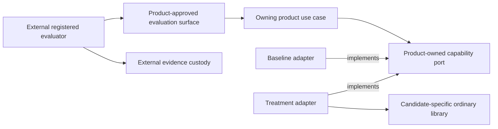
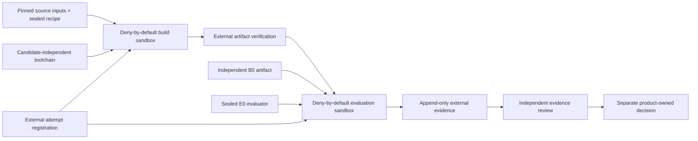

# Module System Dogfooding

## Purpose

This proposed architecture defines how a future module-system implementation
may be exercised without allowing that implementation to build, evaluate,
approve, or recover itself. It describes candidate-neutral authority and
evidence boundaries only. It does not admit a module engine, declaration
grammar, runtime graph, lifecycle coordinator, public SPI, or product rollout.

Dogfooding qualifies one implementation. It is not an independent consumer and
cannot satisfy the semantic-extraction gate in ADR-0013.

The current baseline remains product-owned ports, literal imports, pure
factories, closed dependency objects, and explicit composition roots. The
[Module System V1 productization dossier](../qualification/module-system-v1-productization/README.md)
records non-authoritative evidence, verdicts, and recommended triggers. Only
accepted ADRs and owning-product decisions authorize implementation or use.

## Design Principles

| Principle | Application here |
| --- | --- |
| Clean Architecture | Product policy and outcomes remain inside the owning product. Candidate runtime and evaluation technology stay behind outer composition boundaries. |
| SOLID | Candidate production, execution, evaluation, evidence custody, review, and product authorization are separate responsibilities. Implementations depend on stable contracts rather than framework types. |
| DDD | A product owns its language, capability seam, invariants, and decision. Foundation does not create a universal module domain or import a product model. |
| DRY | ADR-0013, ADR-0014, the productization dossier, and product decisions keep their existing responsibilities. A campaign links to them and records only campaign-specific facts. |

The future semantic kernel remains an ordinary library. It does not become a
module of itself and does not require its own graph, container, loader, or
lifecycle coordinator to compile, test, or start.

## Boundaries

### Authority roles

The roles below are logical authorities. Evidence used for promotion must bind
each role to an auditable principal and credential identity.

| Role | Owns | Must not own in the same campaign |
| --- | --- | --- |
| Product sponsor | Capability seam, product outcome, behavioral-oracle semantics, and proposed acceptance policy and thresholds | Treatment production, harness operation, evidence custody, evaluation, evidence review, or product authorization |
| Product authorizer | Campaign admission, expiry, and any later product-use decision | Sponsorship, treatment production, harness operation, evidence custody, evaluation, or evidence review |
| Candidate producer | Treatment implementation and declared build inputs | Harness operation, evidence custody, evaluation, review, or product authorization |
| Harness operator | Sealed execution of the registered protocol | Sponsorship, candidate production, evidence custody, evaluation, review, or product authorization |
| Evidence custodian | Attempt registration, append-only receipts, raw outputs, provenance, and retrieval | Sponsorship, candidate production, harness operation, evaluation, review, or product authorization |
| Custody transaction authority | Authoritative durable time, root allocation, authorization consumption, corpus-release intents, evidence-state transitions, generation fences, and family closure | Sponsorship, candidate production, harness operation, evaluation, review, or product authorization |
| Corpus and assignment custodian | Distinct qualification- and final-corpus commitments, access-policy and audit streams, hidden assignments, and registered unblinding | Sponsorship, candidate production, harness operation, evidence custody, evaluation, review, or product authorization |
| Independent qualification reviewer | Acceptance or rejection of Phase 2 behavioral qualification evidence | Harness authorship or operation, candidate production, corpus custody, consistency verification, evaluation, or product authorization |
| Independent consistency verifier | Exact dossier, product-source, source-roster, and `B0` provenance equality; authenticated consistency receipt | Sponsorship, authorization, candidate production, harness operation, evidence custody, evaluation, or review |
| Independent evaluator | Application of a sealed product-approved oracle or rubric and registered analysis | Oracle semantics, treatment implementation, harness operation, evidence custody, review, or product authorization |
| Independent reviewer | Acceptance or rejection of the evidence claim supported by one campaign | Sponsorship, authorization, implementation, execution, custody, or evaluation |

Calibration may combine roles only for disposable outputs that cannot support a
campaign. Any execution-, scoring-, custody-, or report-affecting component
eligible for a campaign `HarnessQualificationRevision` must, from authoring and
build through qualification and operation, exclude the candidate producer and
its effective control domain. Independently verified source and build provenance
binds that exclusion. A component touched under combined-role calibration is
non-reusable and must be rebuilt and qualified again under campaign-compatible
role separation.

Neither the future candidate producer nor any principal in its declared effective
control domain may access the qualification corpus, final campaign corpus, hidden
assignments, oracle outcomes, or interim results while those inputs are sealed.
The corpus and assignment custodian defines separate custody boundaries and audit
intervals for qualification and final corpora before Phase 2 or source work,
respectively, and emits authenticated commitment, access-policy, audit-coverage,
access-observation, and unblinding receipts. Campaign admission can prove
non-access only within each declared boundary; incomplete control-domain
enumeration or audit coverage fails closed rather than becoming a universal
non-access claim. A campaign used for an
architectural or product claim enforces the incompatible role combinations above
with separate principals or workload identities, separate credentials, and
auditable handoffs. Labels inside one process or account are not separation.

The custody transaction authority is a logical role even when implemented by a
service that also stores evidence. Every transition it owns binds its auditable
principal, credential lineage, effective control domain, durable-store identity,
authority generation, and authenticated predecessor. Sharing its administrative
control with the sponsor, candidate producer, evaluator, reviewer, or product
authorizer invalidates promotional evidence.

Independence is evaluated over effective and transitive administrative control,
including the human or organization, workflow administrator, and credential
issuer. Workload identities controlled by the same effective principal do not
establish independence. The campaign evidence binds authenticated role
identities, control domains, and handoffs to the exact protocol, attempts,
review, and decision.

Foundation extraction has no role in a dogfooding campaign. If ADR-0013's
independent-consumer and conformance gates are later satisfied, a separate
accepted extraction decision names its authority. The product authorizer cannot
authorize Foundation extraction.

No shared module-system owner exists at this level. The first owning product
owns private identities, grammar, composition behavior, diagnostics, and any
lifecycle semantics. A Foundation owner can be introduced only through the
independent-consumer, conformance, and accepted-extraction process in ADR-0013.

### Source dependency direction

Product domain and application code never import a candidate container,
context, resolver, harness, receipt, or lifecycle type. The treatment adapter
depends on the product port and translates it to the candidate's own private
ordinary-library API. That candidate library imports neither product ports,
product DTOs, product domain types, nor evaluator types. This proposal creates
no cross-candidate API or Foundation-owned SPI. The evaluator invokes only an
external product-approved surface and does not import the production
implementation.

### Scope owned by a later acceptance decision

If accepted, this architecture would govern only the candidate-neutral
constraints for:

- bootstrap independence;
- role and credential separation;
- campaign identity and evidence custody;
- deterministic and stochastic evaluation isolation;
- fail-closed handling of missing evidence;
- preserving product and Foundation ownership boundaries.

The owning product must separately approve the exact capability seam, measured
problem, baseline, treatment rationale, corpus, evaluator, thresholds,
repetitions, exclusions, expiry, and any use outside a disposable campaign.
The dossier is evidence for that decision, not its authority.

## Campaign Structure

### Independent coordinates

Every campaign keeps the following coordinates distinct:

| Coordinate | Meaning |
| --- | --- |
| `ProtocolRevision` | Immutable ancestry and rules for one campaign |
| `BaselineArtifact` | Externally selected product-owned Pure DI baseline, also called `B0` |
| `TreatmentArtifact` | Candidate implementation under evaluation, also called `T1` |
| `EvaluationRevision` | Immutable evaluator inputs, execution rules, analysis, and stop rules, also called `E0` |
| `ExperimentalUnit` | The entity whose outcome contributes once to the registered analysis |
| `ProductSourceSnapshot` | Typed content-addressed projection of the source fields one record is authorized to emit; field applicability and equality joins are fixed by the source matrix below |
| `ProductSourceFieldCatalog` | Campaign-local immutable enumeration of source fields, emitters, applicability predicates, normalization and digest rules, and equality peers |
| `TreatmentEvaluationCommitment` | Pre-source immutable commitment to the product base, estimand, evaluator semantics, attrition rules, thresholds, stops, and independently held corpus selection |
| `SourceClaimFamilyIdentity` | One preregistered claim family joining every source root attempted for materially unchanged treatment and evaluation coordinates, including abandoned roots |
| `SourceClaimFamilyRosterReceipt` | One authenticated append-only family roster and terminal allocation-fence receipt enumerating every allocated root and disposition before campaign admission |
| `SourceFamilyRootIdentity` | One preregistered root joining every authorized preparation lineage and disposition eligible for one campaign claim |
| `SourcePreparationSlotIdentity` | One immutable, preregistered source-authoring slot created before source work; its terminal source is optional |
| `SourcePreparationReceipt` | One authenticated durable terminal record for an expected source slot, discriminated as `started`, `release-denied`, `start-unknown`, or `never-started`, ending in an exact source digest or explicit failed, missing, denied, or unknown no-source disposition |
| `SourcePreparationClosureReceipt` | One authenticated durable fence transition that closes an entire source-family root and freezes every related lineage, authorization, slot, disposition, and source digest before campaign admission |
| `TreatmentSlotIdentity` | One campaign slot mapped one-to-one from a source-preparation slot, linking an optional exact source and build inputs to all expected no-source, no-artifact, and execution observations |
| `BuildAttemptIdentity` | One preregistered build of exact source, recipe, and toolchain inputs; its output artifact is optional |
| `AttemptIdentity` | One non-reused artifact execution, optionally linked to a prior attempt without becoming a new experimental unit |
| `LaunchAuthorization` | One-use custodian-issued capability bound to one registered attempt and exact sandbox policy |
| `StopEvaluationCheckpointIdentity` | One preregistered outcome-independent boundary at which the sealed evaluator must produce a terminal continue or stop decision before later launch release |
| `StopEvaluationReceipt` | One authenticated terminal continue, stop, missing, or unknown observation for an expected checkpoint; missing, late, or unknown output fails closed |
| `CorpusCustodyReceipt` | One item in an append-only qualification- or final-corpus custody stream: commitment, policy, audit coverage, release intent, terminal release outcome, access observation, assignment, or registered unblinding |
| `CorpusCustodyHighWatermarkReceipt` | Custodian-signed terminal stream position proving the complete observed custody prefix and terminal outcome of every release intent through admission or verdict publication |
| `BuildReceipt` | Externally captured build result with an optional verified output artifact |
| `BuildConsistencyReceipt` | Authenticated post-build reconciliation comparing one treatment build with its pre-build admission and closed source lineage, or recording an explicit missing or unknown build observation |
| `BuildConsistencyTerminalObservation` | Custodian-authenticated missing-verifier or unknown-verifier terminal fact for one expected consistency result; it asserts no equality result and never passes the build gate |
| `EvidenceReceipt` | Externally captured binding between registered evaluator inputs, execution, raw output, and terminal result |
| `CampaignAdmissionManifest` | Immutable pre-decision payload containing every proposed campaign coordinate and roster but excluding its own authorization envelope |
| `DossierConsistencyReceipt` | Authenticated independent equality result binding the exact admission manifest, dossier tree, product source trees, and `B0` provenance |
| `HarnessQualificationRevision` | Immutable manifest of every execution-, scoring-, custody-, and report-affecting artifact and configuration qualified before treatment work |
| `HarnessQualificationVerdict` | Qualification-reviewer-signed acceptance or rejection binding the exact revision, coverage obligations, raw Phase 2 evidence, and component identities |

These names do not define a public schema. Serialization and storage remain
campaign-local until independent consumers justify shared extraction.

`ProductSourceSnapshot` is the only source equality surface shared by records
that actually emit an observed snapshot. Before discovery, the measurement
authorization binds one immutable `ProductSourceFieldCatalog`. It enumerates
every field identity and path or logical key, authorized emitter, applicability
predicate and inputs, normalization and digest rule, equality peers, and allowed
`not-applicable` reason. Each snapshot field is either `observed` under that
catalog or `not-applicable` with the catalog reason; an unknown field, omitted
applicable field, ambiguous predicate, or changed catalog fails closed.

| Record | Authorized source fields | Required join |
| --- | --- | --- |
| Current dossier custody | Observed repository, commit, tree, blob and gitlink mapping only | Equal matching Git fields; it does not prove workspace cleanliness, lock resolution, or generated inputs |
| Measurement authorization | Expected repository constraints and baseline-selection rule; no observed snapshot | Validate later discovery through the authorization's native rule, not snapshot equality |
| Discovery and Phase 1 reproduction | Observed repository, commit, tree, submodules, applicable lockfiles, generated production inputs, and clean-state evidence | Equal the corresponding clean `B0` source fields |
| Clean `B0` build provenance | The complete observed source snapshot plus build-native recipe, dependency, material, and toolchain evidence | Equal discovery source fields; validate build-only fields under the build contract |
| Source-preparation closure | The admitted `B0` snapshot, allowlisted delta, and optional candidate-source digest | Equal the admitted base and delta constraints |
| Treatment build | The actual input snapshot and build-native evidence | Equal the admission-time expected source and material closure |

Each phase retains its complete native manifest separately. The consistency
verifier records the exact field-catalog digest, emitter, predicate result, and
normalization rule for every comparison. Product ownership remains local: this
document defines the catalog contract, not universal field names. It never
widens the current dossier's exact-Git-custody claim into evidence that the
dossier did not produce.

`B0` and `E0` are frozen before `T1` enters a campaign. `E0` binds immutable
content digests and retrievable locators for its corpus, runner, oracle or
rubric, model identity, prompts, context, settings, tools, permissions, budgets,
assignment order, pair identities, analysis, exclusions, thresholds, and stop
rules. Changing an evaluator input or analysis rule creates a new `E0`; changing
candidate bytes creates a new `T1`. A protocol may compare a preregistered family
of `T1` artifacts under one sealed `E0` only when the treatment sources and build
registrations are committed before the sealed corpus or any interim outcome is
revealed to the candidate producer. Outcome-informed candidate changes require
both a new `T1` and a fresh `E0` with a previously unseen independently reserved
corpus or assignment. `E0` lineage binds prior evaluations and the registered
cross-revision selection and multiplicity rule. If a fresh holdout or valid
adaptive-analysis protocol is unavailable, the result is exploratory and cannot
support promotion. Results from different evaluator revisions are not pooled.

Before any treatment-source preparation, the product authorizer records one
immutable `TreatmentEvaluationCommitment`. It binds the exact repository,
clean commit, and tree from which clean `B0` inputs were built; the allowlisted treatment-delta
surface; estimand; analysis; exclusions; retry, attrition, lineage, and
multiplicity handling; thresholds; stop rules; and an independently held corpus
commitment or fixed selection rule. Before the first final-corpus object or
custody receipt exists, the commitment or a preceding corpus-custody authorization
also binds its retention class and duration, immutable-locator validity, review
and deletion authority, expiry review, and append-only tombstone policy. It also
instructs the custody transaction
authority to create one append-only `SourceClaimFamilyIdentity` roster with a
maximum root count, root-successor rule, and outcome-independent abandonment
reasons for materially unchanged coordinates. Every root identity is allocated
through that one family-scoped ordering authority; neither the sponsor nor
candidate producer can mint or omit a root independently. A successor can follow
only an objectively abandoned predecessor; the first successfully closed root
closes allocation for the family.
The final `E0` may reveal and instantiate only the already committed hidden
assignment and exact qualified evaluator artifacts. It cannot change those
semantics after any source, disposition, or source digest is known. A source-
informed change requires a fresh claim family, pre-source commitment, unseen
holdout, and campaign coordinates; results from the earlier family remain
retained and cannot be pooled into the new claim.

Before a build starts, the evidence custodian registers a
`BuildAttemptIdentity` against the exact `ProtocolRevision`, `B0` product
repository, commit, and tree, allowlisted source delta, source inputs, sealed
recipe, and toolchain, with an expected `BuildReceipt`. The receipt binds those
inputs, the observed delta, terminal build result and, on success, the optional
verified `T1`. An independently operated qualified consistency verifier then
emits one append-only `BuildConsistencyReceipt` that binds the immutable campaign
admission, source-preparation closure, treatment slot, build attempt and actual
build receipt and records every expected-versus-observed repository, commit,
tree, source, delta, recipe, toolchain, resolved dependency and build-material
comparison. A missing, foreign, stale, or unequal comparison blocks `T1`
execution. Build failure or product-base drift therefore remains visible before
an artifact exists.

Before artifact execution, the custodian registers an `AttemptIdentity` against
the exact `ProtocolRevision`, `B0` or verified `T1`, `E0`, and
`ExperimentalUnit`, with an expected `EvidenceReceipt`. A retry of either kind
links to its predecessor and retains the original `ExperimentalUnit`. A genuine
independently randomized replication is registered as a new experimental unit
and attempt, never relabeled as a retry.

Each registration issues a one-use `LaunchAuthorization`. The external launch
gate atomically records its consumption before the build or evaluation sandbox
can execute candidate-controlled code. Missing, reused, mismatched, or expired
authorization blocks launch. Campaign authorizations expire no later than the
campaign; calibration authorizations expire no later than the calibration
window. Each authority has its own generation fence. Process release atomically
revalidates the applicable fence and expiries at an admitted authoritative-time
linearization point. Unavailable time or uncertainty outside the admitted bound
fails closed. Expiry closes the corresponding fence even when retirement has not
run. The harness cannot start an unregistered attempt and register it after
observing the outcome.

### Bootstrap without recursive authority

Every candidate generation can be built and evaluated through a pinned ordinary
toolchain and immutable build recipe that do not depend on any candidate
generation. Candidate-declared inputs are data to that recipe, not execution
authority. Build, install, and evaluation run inside disposable containment with
no real projects, user credentials, or ambient network access.

A stable `N-1` artifact may be an additional comparison subject. It is never a
required builder, evaluator dependency, approval mechanism, or recovery
prerequisite for generation `N`. The candidate-independent path remains tested
and sufficient for every generation. Self-hosting never becomes
self-certification.

### First dogfood capability

This document selects no capability. The criteria below are necessary but not
sufficient. Before a treatment exists, the owning product measures the authoring
or drift problem through existing composition without introducing the
abstraction being justified. A product decision must then name and own every
admission prerequisite. It may cite dossier evidence at an exact immutable
revision, but mutable dossier fields never become authority. A candidate that
introduces a new authoring grammar must remain within ADR-0014's accepted
product-local ownership and the exact level-specific owning-product decision.
The campaign neither creates a successor governance gate nor authorizes shared
Foundation extraction.

An admitted capability must be:

- product-owned and observable through a narrow existing seam;
- stateless or derived from disposable inputs;
- repeatable in a fresh sandbox without user projects or credentials;
- removable without changing product contracts;
- outside canonical writes, migrations, authorization, release, and rollback;
- useful enough to expose authoring or composition failures.

A documentation example, synthetic fixture, or Foundation repository path is
calibration evidence only. It does not become a product consumer by being
placed in this repository.

### Evidence dimensions

Architecture gates, execution environments, evaluation tracks, and allowed
claims are independent dimensions. They are not a maturity ladder.

| Environment | Track | Allowed claim | Claim explicitly not supported |
| --- | --- | --- | --- |
| Exact source audit | Dependency and export audit | Import direction, curated exports, and absence of framework leakage in inspected source | Runtime behavior or product use |
| Packed candidate artifact in a disposable workspace | Deterministic black-box conformance | Behavior of exact packed bytes for the registered corpus | Product integration, recovery, or independent consumption |
| Disposable product-owned replay | Deterministic comparison | Relative outcome for one approved seam without serving users | Product adoption or live replacement |
| Disposable product-owned replay | Stochastic AI authoring or navigation benchmark | Relative discoverability and authoring performance under one registered evaluator | Correctness, runtime safety, or another evaluator revision |
| Independent consumer evidence | Cross-consumer conformance | Input to a later L5 extraction decision | Automatic Foundation ownership |

Evidence for one claim dimension cannot substitute for another. Source review
does not prove execution. Stochastic improvement cannot offset deterministic
failure. Multiple configurations, copied repositories, or jobs under one owner
are not independent consumers.

### Evaluation tracks

The exact benchmark remains product-owned. Any deterministic campaign used for
an evidence claim must register normalized inputs and expected outputs,
non-stochastic oracle behavior, resource bounds, identical adapter treatment,
and deliberate mutants. Mutation evidence supports only the bounded claim that
the registered oracle rejects each registered mutant.

Any stochastic campaign must preregister its primary estimand, experimental
unit, pairing and randomization schedule, analysis method, sample-size or power
justification, non-inferiority or effect rule, multiplicity handling, attrition
and retry handling, fresh-context and carryover controls, and confidence rule.
Outcome assessment is masked where practical. Otherwise `E0` requires objective
scoring or a registered justification and bias control. `E0` binds the model,
prompt, context, tools, permissions, budgets, and capture and retention rules;
terminal receipts bind immutable digests and locators for resulting transcripts
and tool events.

Deterministic and stochastic tracks produce separate verdicts. Neither can waive
the other's failure. A separate source audit checks that public types and
dependency direction remain framework-neutral.

### Evidence custody

The external custodian preregisters every expected build and execution attempt
and records append-only terminal receipts. If no receipt arrives by the sealed
deadline, the custodian records a separate missing or unknown observation.
Absence alone is never reclassified as abandoned or invalid, and `E0` owns its
attrition and analysis treatment.

Every `BuildReceipt` and execution `EvidenceReceipt` carries a common envelope
that binds:

- its build or execution attempt identity, `ProtocolRevision`, predecessor
  attempt, and registration, start, and completion timestamps;
- consumed `LaunchAuthorization` identity and external launch-gate receipt;
- sandbox enforcer identity, normalized policy or configuration digest, actual
  file, mount, network, environment, subprocess, and credential grants, and the
  enforcement outcome;
- raw output, terminal state, and current authorization or revocation
  observation when applicable.

Other receipt families bind only facts their owning transition can observe. Each
still carries its receipt type, immutable protocol or pre-campaign coordinate,
qualified issuer identity and credential, authoritative sequence or predecessor
where ordering matters, generation, terminal time, and authenticated content
digest. A corpus-custody, source-closure, roster, stop, admission, or consistency
receipt must not invent a build attempt, launch authorization, sandbox grant, or
raw output that does not exist.

Each build receipt additionally binds:

- repository, clean commit and tree, submodules, and lockfile digests. Campaign
  `B0` and every treatment build input must be clean; a dirty source tree is
  inadmissible even when an archive digest could be produced;
- complete content-addressed dependency and build-material resolution, sealed
  build recipe, builder identity, and toolchain or container digest;
- terminal build state and, when produced, artifact media type, digest, size,
  provenance, and immutable retrievable locator.

Each execution receipt additionally binds:

- the verified baseline or treatment artifact; treatment execution also binds
  the exact producing `BuildAttemptIdentity` and immutable `BuildReceipt`, and
  fails closed when that lineage is missing or ambiguous;
- protocol and evaluation content digests and immutable locators;
- experimental unit, pair, assignment order, and normalized result;
- immutable digests and locators for retained transcripts and tool events.

A local path, mutable tag, source claim, or hash without retrievable immutable
custody is corroboration only. Artifact identity is reverified at registration,
execution, evidence review, and any later separately approved use.

## Operational Implications

### Execution and failure behavior

Pure DI is not containment. Every candidate-controlled source-authoring step,
build step, and executable treatment runs in a deny-by-default sandbox
appropriate to its placement. File, network, environment, subprocess, and
credential access are absent unless the registered protocol grants a narrow
disposable resource. Source imports are content-addressed; build-time code is
treated as executable candidate code.

Baseline and treatment execute independently in fresh disposable workspaces.
They do not share mutable caches, state stores, worktrees, credentials, or
candidate-only migrations. Fallback is disabled inside a scored attempt.
Unknown outcome, missing receipt, evaluator failure, artifact mismatch,
containment failure, or expired authorization fails closed for the claim.

The campaign does not serve user traffic or authorize shadow, non-production,
production, replacement, or rollback behavior. Each requires a separate
product-owned decision and architecture.

### Threat applicability

| Threat | Required treatment |
| --- | --- |
| Candidate self-certification | Candidate producer, harness, custody, evaluator, reviewer, sponsor, and authorizer remain auditable and separated as defined above |
| Recursive bootstrap | Candidate-independent build and evaluation path remains sufficient and tested for every generation |
| Omitted failed attempt | Build and evaluation sandboxes consume a one-use externally logged authorization before candidate code can run |
| Artifact substitution | Immutable locator, digest, provenance, and verification at every use |
| Evaluator drift | `E0` binds every evaluator input, model identity, assignment, and analysis rule |
| Adaptive benchmark overfitting | Treatment family is committed before unblinding; outcome-informed changes require an unseen holdout or remain non-promotional |
| Source-selection bias | A pre-source evaluation commitment and complete claim family retain every closed or abandoned root, lineage, disposition, and multiplicity outcome |
| Product-base substitution | Every preparation and build receipt binds the exact `B0` product tree and allowlisted treatment delta |
| Unknown live runtime | Analytic finality does not release containment; quarantine remains until termination or absence is authoritatively proven |
| Framework leakage | Export and dependency-direction audit outside black-box scoring |
| Build or process escape | Deny-by-default containment from the first candidate-controlled build or executable treatment |

Live replacement, unload, distributed cutover, and product recovery are outside
this proposal. They require their own accepted lifecycle or placement decisions
and must not be inferred from dogfooding evidence.

### Conditional implementation plan

Candidate-independent calibration phases become executable only after an
accepted revision of this architecture and a narrow product-owned calibration
authorization. Promotional treatment phases and every `T1` operation additionally
require the owning product's immutable campaign decision; the separately bounded
exploratory path below creates no campaign treatment coordinate. The plan is deliberately product-local: it creates
no Foundation runtime, shared candidate API, public SPI, production loader, or
reusable campaign service.

#### Pre-admission discovery

Before campaign implementation or treatment code, the owning product may inspect
existing operational telemetry from its Pure DI composition using already
approved instrumentation. Passive observations may form a hypothesis and name a
candidate seam, but cannot become trigger measurements or select a favorable
`B0`, corpus, outcome, or threshold after results are known.

Before any deliberate discovery run, the product authorizer records a narrow,
expiring measurement authorization. It preregisters the benchmark protocol,
baseline selection rule, measured outcome, corpus or sampling rule, exclusions,
analysis, threshold, retention, stop rule, and exact immutable
`ProductSourceFieldCatalog`. Only then may deliberate discovery
measure the problem, reproduce the baseline, and identify the exact proposed
`B0`. This work introduces no module-system abstraction, campaign harness,
candidate, or new treatment execution authority.

Every deliberate discovery and Phase 1 reproduction runs from an attested clean
workspace and records a complete content-addressed source and input manifest,
including repository identity, commit, tree, submodules, lockfiles, generated
inputs, configuration, and absence of modified or untracked bytes. Discovery from
a dirty or incompletely manifested input is diagnostic only and cannot select
`B0`, satisfy a trigger, or support campaign admission. The independent
consistency verifier later derives and compares the exact `ProductSourceSnapshot`
projection from these manifests and clean `B0` build provenance. It retains and
validates discovery-only and build-only inputs separately instead of requiring
their unequal native manifests to be byte-for-byte identical.

The product also classifies every proposed treatment semantic as `L0`, `L1`,
`L2`, `L3`, or `L4` under the productization roadmap. Each level above `L0` must
show its own measured trigger and accepted owning-product decision. A campaign
cannot use its disposable status to admit authoring grammar, runtime selection,
lifecycle, or process-host semantics that their level has not admitted.

#### Calibration authorization

Before Phase 0, the product authorizer records a narrow, expiring calibration
authorization containing:

- the accepted revision of this architecture;
- the exact measurement authorization and its preregistered protocol, discovery
  evidence with clean-workspace attestations and complete source/input manifests,
  measured problem, exact `B0`, and current Pure DI baseline, captured without the
  candidate abstraction;
- one product-owned capability seam and the exact product outcome being tested;
- every proposed treatment semantic, its `L0`-`L4` classification, trigger
  evidence, and accepted level-specific owning-product decision;
- immutable calibration-only protocol, evaluation, and sandbox-policy
  coordinates that can bind registrations, launches, and receipts but can never
  become campaign `ProtocolRevision` or `E0` coordinates;
- a calibration generation fence, authoritative durable time source, maximum
  uncertainty, calibration expiry, and the transactional linearization points
  used for authorization consumption, process release, and receipt arrival;
- the calibration evidence retention class, immutable-locator validity, review
  and deletion authority, expiry review, and append-only tombstone policy;
- the draft evaluator design, sandbox and evidence technologies, forbidden
  resources, calibration owner, estimate owner, and stop rule.

This authorization permits baseline reproduction, candidate-independent harness
work, and deliberate mutants only. It cannot allocate an `E0`, register, build,
or execute `T1`, support a promotional claim, or authorize product use.
The authoritative time is owned by the durable custody transaction authority;
sandbox-host wall clocks are diagnostic only and cannot extend an expiry or
reclassify a receipt.

#### Non-promotional exploratory treatment

An owning product may authorize a bounded exploratory treatment before building
the promotional campaign machinery. That authorization pins the accepted
level-specific product decision, capability seam, clean `B0`, candidate source,
candidate-independent toolchain, disposable containment policy, visible
development fixtures, expiry, evidence retention terms, recorder, and cleanup
owner. Before release, the recorder durably creates an exploration-only run,
attempt slot, one-use launch authorization, and prospective runtime and
containment identity. The launch gate consumes the authorization and revalidates
the exploration fence before release. Every slot receives a terminal, missing, or
unknown observation; a crash-ambiguous runtime remains quarantined, and cleanup
cannot complete until termination or absence is authoritatively proven. The path
denies real projects and hidden or final corpus data and restores the baseline
adapter only after reconciliation.

These exploration-only coordinates can never be converted to campaign
coordinates. This tier creates neither `T1`, `E0`, reusable
qualification evidence, nor product-use authority. Its output is diagnostic and
cannot enter a later campaign, select a final holdout, satisfy Phase 2, justify
Foundation extraction, or support a promotional claim. It provides a reversible
product-development path while the complete independently operated campaign is
still unjustified.

#### Blinded treatment-source preparation

After Phase 2 exits and the `TreatmentEvaluationCommitment` is immutable, the
product authorizer may issue a narrow, expiring source preparation authorization
under the already accepted level-specific owning-product decision. It binds the
commitment, exact `B0` product repository, commit, and tree, allowlisted treatment
delta, allowed treatment semantics, `SourceClaimFamilyIdentity`,
`SourceFamilyRootIdentity`, candidate producer, inputs, forbidden resources,
expiry, a fresh source-preparation generation fence, exactly one root-bound
accountable retirement owner and root-scoped credential lineage, evidence
retention class and duration, immutable-locator validity, review and deletion
authority, expiry review, append-only tombstone policy, and the complete immutable roster of
`SourcePreparationSlotIdentity` values before any source authoring starts. No
slot may be added, deleted, substituted, or reused after authorization. The
pre-source commitment preregisters the claim-family identity, maximum source
roots, root-successor rule, and outcome-independent abandonment reasons before
the first root exists. The custody transaction authority allocates the root by
appending it to that family's ordered roster before issuing any root-bound
authorization. It allocates a successor only after the predecessor has a
terminal `abandoned` disposition and only while the family allocation fence is
open. A `closed` predecessor admits no successor. The first authorization also
preregisters the source-family root, retirement owner and credential lineage,
initial source lineage, maximum source lineages and rounds, successor rule, and
selection and multiplicity rules. Every later
related authorization must reference that root and all prior source lineages,
slots, and dispositions and must bind the same retirement owner and credential
lineage. Custody-controlled credential rotation may advance a generation inside
that lineage but cannot transfer ownership. The
retirement owner and its effective control domain must be independent of the
candidate producer and cannot observe source, qualification, or campaign
outcomes. It may abandon only for a preregistered objective reason whose evidence
is retained by custody. An unplanned successor, ownership mismatch, or
outcome-informed abandonment is ineligible for the campaign. The authorization
permits source authoring only. It cannot
allocate campaign coordinates, register or build a `T1`, execute candidate
code, access the final corpus or assignment, observe qualification or campaign
outcomes, support a promotional claim, authorize product use, or imply
Foundation extraction.

The candidate producer receives only blinded, outcome-independent authoring
inputs inside a fresh custody-controlled, deny-by-default disposable sandbox
that rejects preexisting source bytes, denies ambient network and credentials,
admits only content-addressed imported objects, and closes imports after the
admitted terminal time. The qualified source-preparation enforcer attests the
declared policy and actual file, mount, network, environment, subprocess, and
credential grants before authoring starts, persists its recovery identity, and
records every imported-object digest and enforcement outcome.
Before work, the evidence custodian registers every authorized source slot. It
starts immutable retention and retirement-tombstone obligations at that
registration even if no source, campaign, build, or execution follows. It then
issues one slot-bound, one-use authoring launch authorization. The external
source launch gate atomically consumes it and revalidates the preparation fence,
expiry, authoritative time, enforcer attestation, and actual grants before any
producer-controlled tool or process is released. The custodian retains exactly
one authenticated durable `SourcePreparationReceipt` per slot as a discriminated
terminal record. A `started` record binds launch-authorization consumption,
authorization digest and generation, source-family root, lineage, slot, exact
product base and allowed delta, authorized inputs, producer principal, qualified
registrar and sandbox-enforcer identities, workspace clean-state attestation,
actual grants, imported-object digests, enforcement and recovery identity, and
authoritative-time start and terminal events. A `release-denied` record binds a
consumed authorization, generation, the prospective containment identity,
qualified launch-gate decision, authoritative terminal time, and externally
verified proof that no producer-controlled process or runtime was released. It
must not claim a start, runtime execution, or source bytes. A `start-unknown`
record instead binds a consumed authorization, the prospective enforcer-owned
runtime and containment identity persisted before possible release, the fence
generation, reconciliation attempts, deadline, quarantine, and the inability to
prove either start or absence. It terminates analytically as an inadmissible
unknown no-source disposition while resource reconciliation continues
independently. A `never-started` record binds slot registration, the unconsumed
authorization or external denial before consumption, generation, expiry or
deadline, gate and registrar identities, authoritative terminal time, and the
reason no authorization was consumed; it must not claim consumption, a clean-
workspace start, runtime identity, or grants that never existed. Every variant
ends in the exact source digest or an explicit failed, missing, denied, or unknown
no-source disposition appropriate to its evidence. Expiry, scope
violation, a changed digest, a roster mismatch, or source bytes existing outside
the admitted window closes the preparation fence and makes the slot inadmissible.

Source preparation has an evidence lifecycle and an independent resource-
retirement lifecycle; neither depends on campaign admission or Phase 6. On
withdrawal, expiry, containment failure, or abandonment while the evidence
lifecycle is still `open`, the root-bound source-preparation retirement owner
uses a current credential from the preregistered lineage to request one durable
abandonment transition.
The custody transaction authority atomically advances the preparation fence,
marks the evidence root `abandoned`, revokes authoring credentials and unconsumed
authorizations, and records each unresolved slot as denied, missing, or unknown
without rewriting prior facts. An abandoned evidence root can never be admitted
or reopened. Later source work for materially unchanged `B0`, allowed delta,
treatment semantics, estimand, or selection rules remains under the same claim-
family identity and its preregistered root-successor and maximum-root rules. A
materially different claim requires a new pre-source commitment and claim-family
identity and cannot combine evidence with the earlier family.

Resource retirement may begin after either evidence abandonment or successful
evidence closure, including when campaign admission later fails. It reconciles
every persisted authoring runtime identity, while workspaces and containment
remain quarantined whenever a runtime is unknown. Cleanup is permitted only
after the custody authority proves the exact runtime terminated or is absent.
The custodian then appends one source-preparation retirement tombstone that binds
the immutable evidence terminal state and receipt, root, all lineages,
authorizations, slot dispositions, revocations, reconciliation evidence,
retained objects, cleanup outcome, owner, and authoritative retirement time.
Retirement never rewrites a closed root, makes it admissible, or deletes evidence
required to rebuild a later admission failure or campaign verdict.

Successful preparation closes only through the custody transaction authority.
At one authoritative-time linearization point it advances the preparation
generation fence, atomically marks the root `closed`, closes the claim-family
allocation fence, prevents any further root or root-bound authorization from
being issued, verifies one terminal receipt for every slot in every related
authorization, and emits both an authenticated durable
`SourcePreparationClosureReceipt` and `SourceClaimFamilyRosterReceipt`. Related
root allocation, authorization issuance, successful closure, abandonment, and
family-fence closure use the same durable evidence-lifecycle ordering authority.
Issuance succeeds only while the root and family allocation fence are `open`;
exactly one of `closed` or `abandoned` can win for the root, and recovery
idempotently completes the winning evidence transition without emitting the
other terminal outcome. The independent resource-retirement lifecycle may then
complete from either terminal evidence state. The closure receipt binds the
source-family root, every lineage, closed generation, every authorization and
slot roster, every terminal disposition and source digest, product base and
allowed deltas, actual-grant and import evidence, the applicable successor,
selection, attrition, and multiplicity rules, custodian identity, qualified
closure-gate artifact and configuration, and authoritative closure time. A
missing, stale, mismatched, or superseded closure receipt blocks campaign
admission. Reopening a closed source-family root is forbidden. Further materially
unchanged source work may use an authorized successor only after an objectively
abandoned root; a successfully closed root ends source work for that claim
family. Materially changed coordinates require a new commitment and claim family
and cannot reuse the earlier evidence.

The custody transaction authority may also close an exhausted or withdrawn
family with no successful root, but that family is not admissible. The roster
receipt binds the commitment, family identity, maximum-root and successor rules,
complete ordered root roster, every root terminal disposition and receipt, and
closure generation and time. Root allocation, root closure or abandonment, and
family-fence closure share the same ordering domain. After family closure no
root can be added or replaced; missing, duplicate, non-terminal, or out-of-order
roots make admission fail.

A later campaign admission maps every preparation slot one-to-one to exactly one
`TreatmentSlotIdentity`; a no-source slot remains an explicit non-buildable `E0`
observation and cannot disappear. A produced source becomes eligible for a
campaign only through that mapping and becomes a `T1` only after an admitted
build produces and verifies the artifact.

#### Campaign admission checklist

After Phase 2 and any separately authorized blinded source preparation, but
before treatment registration, build, or execution, the sponsor prepares an
immutable `CampaignAdmissionManifest`. The independent consistency verifier
checks it and issues a `DossierConsistencyReceipt`. The product authorizer then
records one immutable decision binding the exact manifest and receipt. Changing
either invalidates admission. Together they contain all of the following:

- the exact calibration authorization and its results;
- the pre-source `TreatmentEvaluationCommitment`, `SourceClaimFamilyIdentity`,
  its closed allocation fence and authenticated `SourceClaimFamilyRosterReceipt`,
  every root ever allocated under that claim family, every abandonment reason and
  disposition, and the root-successor and maximum-root rules; for the selected
  closed `SourceFamilyRootIdentity`, every lineage, related authorization and
  fence history, preregistered successor, selection, attrition, and multiplicity
  rule, immutable slot roster, one terminal `SourcePreparationReceipt` per
  expected slot, and the exact authenticated `SourcePreparationClosureReceipt`
  that froze them; abandoned roots remain explicit attrition and can never be
  omitted merely because a later root closed successfully;
- immutable `ProtocolRevision` and `B0` coordinates;
- the committed treatment source family and immutable `TreatmentSlotIdentity`
  roster, including a receipt-bound bijection from every preparation slot, each
  optional exact source, recipe, toolchain, and complete mapping to no-source,
  build, and execution observations before the final holdout is revealed;
- the admitted deterministic and stochastic tracks, exact immutable `E0`,
  evaluator owner, acceptance thresholds, exclusions, expiry, retention, and
  stop rules, complete `StopEvaluationCheckpointIdentity` roster, checkpoint
  boundaries and deadlines, and expected `StopEvaluationReceipt` identities,
  with proof that they mechanically instantiate the pre-source commitment
  without source-informed changes;
- independently held final corpus and assignment coordinates, the declared
  custody and effective-control boundary, and the complete append-only
  `CorpusCustodyReceipt` stream prefix covering commitment, access policy, audit
  completeness, observed access, hidden-assignment commitment, and every release
  intent and terminal outcome through admission; unblinding is forbidden before
  admission. Every
  receipt binds the campaign commitment, corpus and assignment identities,
  custody epoch, policy and control-domain generation, authoritative coverage
  interval, sequence, and predecessor. A `CorpusCustodyHighWatermarkReceipt`
  closes the complete stream prefix through admission; evidence claims non-access
  only inside that boundary and incomplete or gapped coverage blocks admission;
- the campaign generation fence, authoritative durable time source, maximum
  uncertainty, and transactional linearization points for every expiry and
  deadline decision;
- named principals, credentials, and effective control domains for every
  authority role;
- the custody transaction authority's principal, credential lineage, effective
  control domain, durable-store identity, authority generation, and qualified
  implementation and configuration digests;
- a stop-authority matrix binding exactly one accountable owner and scoped
  credential to registered analytic stop, discretionary abort, automatic expiry,
  and emergency containment stop; the independent evaluator owns and signs an
  outcome-dependent analytic determination under `E0`, while custody validates
  only its identity, registration, and integrity; any transition not registered
  by `E0` is non-promotional;
- the source-preparation, build, and execution sandbox enforcers,
  deny-by-default policies, allowed disposable resources, and exact actual-grant
  and imported-object evidence;
- the evidence store, immutable locator scheme, access policy, and projection
  rebuild procedure;
- one `HarnessQualificationRevision` and independently signed
  `HarnessQualificationVerdict` binding immutable artifacts and
  configurations for the registrar, launch gate, receipt writer and store,
  sandbox enforcer, runtime reconciler, build and evaluation adapters, evaluator
  runner and oracle, report renderer, source-preparation registrar, launch gate,
  sandbox enforcer and closure gate, custody transaction authority, qualification-
  corpus storage and access enforcer, custody receipt and audit emitters, assignment
  and unblinding gate, and consistency verifier, plus the exact
  Phase 2 qualification evidence for those bytes, including the complete
  content-addressed qualification corpus roster, canonical case identities,
  preregistered source-lineage or leakage-group identities, corpus digests, and
  the domain-specific equivalence policy used to derive those identities, a
  terminal `CorpusCustodyHighWatermarkReceipt` over the qualification interval,
  the complete coverage obligations and raw Phase 2 evidence, and the exact
  qualification-reviewer principal and credential;
- an exact immutable dossier revision used as supporting evidence and an
  authenticated `DossierConsistencyReceipt`. The receipt binds the verifier
  principal and credential; verifier artifact, configuration, and toolchain
  digests; `CampaignAdmissionManifest` and `TreatmentEvaluationCommitment`
  digests; `SourceClaimFamilyIdentity`, its `SourceClaimFamilyRosterReceipt`,
  every allocated source root and abandonment disposition, and the selected
  closed `SourceFamilyRootIdentity`;
  dossier commit, tree, and file manifest;
  measurement authorization and discovery records with their clean-workspace
  attestations and complete source/input manifests; every relied-upon product
  commit and tree; `B0` artifact, build receipt, and provenance; the exact
  treatment product-base repository, commit, and tree plus allowlisted source
  deltas; complete source-family lineages, preparation authorizations, closure
  receipt, treatment rosters, and the expected repository, commit, tree, source,
  delta, recipe, toolchain, and complete content-addressed dependency and build
  material closure for every future treatment build; and
  the exact admission-time equality result. For
  every mandatory join declared by the field-by-source matrix and exact
  `ProductSourceFieldCatalog`, the receipt enumerates the catalog digest, each
  field identity, emitter, predicate result, normalization rule, applicable
  expected and observed
  `ProductSourceSnapshot` field, and native validation result. Measurement
  authorization is checked as an expected selection rule rather than an observed
  snapshot, while current dossier custody contributes only its exact Git fields.
  The verifier retains phase-specific complete manifests and validates their
  separately registered fields without asserting cross-phase equality. Treatment `BuildReceipt`s do
  not yet exist and are not admission prerequisites. Their actual values are
  checked later by one authenticated `BuildConsistencyReceipt` per build against
  these immutable expected coordinates before any `T1` execution.
  Every relied-upon product state must be equal across those records; an absent
  join, source outside the allowlisted delta, unresolved placeholder, foreign or
  missing receipt, or unequal value is a no-go;
- evidence that any new authoring grammar remains product-local under ADR-0014
  and its accepted level-specific owning-product decision.

The consistency verifier also compares the complete Phase 2 qualification corpus
with the complete final `E0` corpus under the preregistered domain-specific
equivalence policy. Admission requires retained zero-intersection results for
canonical case identity, content identity, source lineage, and leakage-group
identity, plus complete independently authenticated qualification- and final-
corpus custody streams proving the declared access policy, audit coverage,
observations, assignments, and unblinding order for every control-domain
principal inside each admitted custody boundary. Their admission high-watermarks
must be current, contiguous, campaign-scoped, and independently verified.
Re-serialization, wrapping, or a semantics-preserving transformation cannot
create a disjoint case. Opaque commitments, incomplete audit coverage, receipt
gaps, stale or foreign custody epochs, or identities outside the declared
boundary cannot support a non-access claim.

Every qualification- or final-corpus access, assignment delivery, export, and
unblinding operation persists a uniquely identified, sequenced release intent
before data can leave the access enforcer. A later receipt terminates that intent
as `delivered`, `denied`, or `unknown`. Crash ambiguity becomes `unknown`;
it is never inferred as denial. The custody transaction authority admits a
high-watermark only when every intent through the sealed coverage boundary has a
contiguous terminal outcome and none is unknown, and linearizes admission or
verdict publication with that boundary. The data plane accepts only a scoped
release capability minted after the transaction authority commits the matching
intent; no alternate release path is admitted. A contiguous stream that omits a
pre-release intent therefore cannot be created by a conforming access enforcer.

Before verdict publication, the corpus custodian emits a second terminal
`CorpusCustodyHighWatermarkReceipt` covering the interval from admission through
registered unblinding and evaluation. The independent verifier rejects a gap,
omitted access observation, stale or replayed receipt, changed control-domain or
policy generation, foreign campaign binding, or any post-admission observation
that invalidates the claim. Admission high-watermarks alone cannot authorize a
final promotional verdict.

Missing or mutable prerequisites are a no-go. A planning issue, draft ADR,
mutable branch, calibration authorization, or candidate-owned configuration
cannot substitute for campaign admission.

#### Campaign-local deliverables

| Deliverable | Responsibility | Boundary |
| --- | --- | --- |
| Protocol record | Holds campaign-specific coordinates, role bindings, thresholds, expiry, and stop rules | Data only; not a module declaration or shared Foundation schema |
| Consistency verifier adapter | Verifies the exact proposed admission manifest against dossier, product source, source roster, and `B0` provenance and signs the result | Independent from candidate production and evidence custody; qualified bytes only |
| Custody transaction adapter | Owns authoritative time, root allocation, authorization consumption, evidence transitions, generation fences, and family closure | One durable ordering domain; no sponsorship, candidate, evaluation, review, or product-decision authority |
| Corpus custody adapters | Commit qualification and final corpora, persist release intents before access, reconcile terminal release outcomes, enforce hidden assignment, emit append-only audit streams, and close admission and verdict high-watermarks | Distinct corpus identities and custody epochs; unresolved or candidate-control access fails closed |
| Qualification review adapter | Reviews exact Phase 2 evidence and signs the `HarnessQualificationVerdict` | Independent from harness authorship and operation, candidate production, corpus custody, consistency verification, evaluation, and product authorization |
| Source-preparation registrar, launch gate, and closure gate | Registers the complete slot lineage, authorizes each source process once, and atomically closes its fence before campaign admission | Uses authoritative durable ordering; cannot author treatment source or decide campaign admission |
| Source-preparation sandbox adapter | Enforces and attests clean inputs, exact imports, actual grants, recovery identity, and terminal source capture | Deny by default; no ambient network, credentials, or real projects |
| Baseline adapter | Implements the existing product-owned port with `B0` behavior | Remains the default product composition |
| Treatment adapter | Implements the same port and translates to the candidate's private ordinary-library API | Removable without changing the port, use case, or domain model |
| Attempt registrar and launch gate | Preregisters attempts and linearizes authorization consumption, campaign stop, and the process-start fence | Runs outside candidate authority and before candidate-controlled code |
| Build and evaluation sandbox adapters | Attest effective grants before release, persist runtime identity and deadline, enforce policy, and reconcile orphans | No real projects, ambient credentials, or implicit network |
| Evidence writer and reader | Persist immutable raw receipts under a monotonic finality model and reconstruct disposable projections | Candidate, harness, and evaluator cannot rewrite terminal facts |
| Admitted evaluator adapters | Apply every and only the sealed product-approved deterministic or stochastic track | Each admitted track produces its own verdict and owns no product decision |
| Disposable fixtures and deliberate mutants | Prove the harness detects registered failure classes | Calibration only; never counted as an independent consumer |
| Evidence report | Presents traceable inputs, failures, exclusions, and verdicts to reviewers using escaped inert projections | Derived and rebuildable; raw candidate bytes remain separate untrusted objects and never become active report content |

These are responsibilities, not a prescribed package topology. The owning
product places them according to its accepted feature standard. Implementations
must not extract a common campaign framework merely because adjacent adapters
look similar.

#### Phase 0 - Calibration admission and estimate

1. Validate the accepted architecture, calibration authorization, and its strict
   prohibition on treatment work and promotional evidence.
2. Verify the discovery evidence and exact `B0` candidate are reproducible.
3. Verify every proposed treatment semantic is within an admitted `L0`-`L4`
   level. Calibration-only coordinates are immutable and externally traceable,
   but have no campaign `E0` identity, promotional authority, or reuse path.
4. Record the exact forbidden product paths, credentials, networks, and process
   capabilities for containment tests.
5. Produce a technology-specific implementation estimate covering changed
   lines, engineering time, calendar dependencies, infrastructure, security
   review, and operator, evaluator, and reviewer availability.

Exit only when every calibration prerequisite has an owner, immutable reference,
and testable acceptance rule and the delivery estimate is owned. Otherwise stop
without creating treatment code.

#### Phase 1 - Baseline reproduction and product seam

1. Exercise the existing Pure DI composition through the product-owned port.
2. Reproduce the admitted baseline measurements and fail closed when they no
   longer match the discovery evidence.
3. Prove the baseline adapter remains the default and a later product-local
   treatment adapter requires no change to the use case, port, or domain.
4. Add source and packed-artifact audits for forbidden framework, evaluator,
   receipt, and product-type leakage.

Exit only when the measured problem remains reproducible and the seam is narrow,
observable, and reversible. A changed baseline invalidates the calibration
authorization and requires new pre-admission discovery, `B0`, and repetition of
Phases 0 and 1. An unmeasured convenience abstraction is a no-go.

#### Phase 2 - Candidate-independent harness

1. Before qualification execution, preregister a complete negative-case coverage
   plan covering every row of the negative verification matrix. The classification
   follows the non-downgradable minimum-gate rules below rather than product
   discretion. Each stable row binds its earliest applicable gate, owner, evidence
   emitter, qualified component identities, inputs, expected result, and required
   receipt or check. Phase 2 executes every `fixture-conformance` entry; it cannot
   claim to prove rows whose real admission or operational inputs do not yet exist.
2. Implement attempt registration, one-use launch authorization, append-only
   receipts, and rebuildable read projections outside candidate authority. Every
   calibration registration, launch, and receipt binds the immutable
   calibration-only protocol, evaluation, and sandbox-policy coordinates.
3. Linearize authorization consumption, calibration-generation fencing, and
   process creation against the authorized durable time source. A calibration
   launch token expires no later than its calibration authorization. Persist an
   enforcer-owned runtime identity, qualified-component attestations, and hard
   deadline before releasing candidate-controlled code.
4. Attest effective file, mount, network, environment, subprocess, and credential
   grants against the registered policy before candidate-controlled code runs.
5. Before any qualification case is revealed, the independent corpus and
   assignment custodian commits a dedicated qualification-corpus identity,
   hidden assignment, custody epoch, access policy, control-domain roster and
   generation, audit coverage interval, receipt sequence origin, and qualified
   storage, access-enforcement, audit, assignment, and unblinding components.
   Candidate-producer access fails qualification even when final-corpus identities
   remain disjoint.
6. Run build and evaluation adapters with `B0` and deliberate mutants only,
   against that qualification corpus, which remains disjoint from the final
   campaign holdout. Seal a no-treatment evaluator qualification binding the
   exact proposed final runner, oracle implementation, scoring configuration, and
   report renderer plus the complete qualification-corpus roster, canonical case,
   source-lineage and leakage-group identities, equivalence policy, and corpus
   digests, complete custody stream, and terminal qualification high-watermark.
   The final `E0` may reference only these qualified artifacts
   and configurations, while its independently held corpus and assignment are
   sealed later in campaign admission. Qualification results remain
   non-promotional.
7. Qualify the source-preparation registrar, one-use launch gate, deny-by-default
   sandbox enforcer, source capture, recovery identity, and closure gate using
   deliberate inert source fixtures only. Exercise reused or expired launch
   authority, preexisting bytes, ambient egress, undeclared imports and grants,
   crash/restart, late capture, closure races, and incomplete source-family
   accounting without creating a real treatment.
8. Exercise crash, timeout, cancellation, containment denial, receipt mutation,
   deletion, conflicting duplicates, crash durability, orphan reconciliation,
   campaign-expiry races, malicious output rendering, and restart behavior before
   treatment execution.
9. Demonstrate that no `N-1` candidate is needed to build, launch, evaluate,
   recover evidence, or clean up the campaign.
10. Produce a `HarnessQualificationRevision` binding immutable digests and
   configurations for every execution-, scoring-, custody-, and report-affecting
   component: registrar, build and execution launch gate, receipt writer and
   store, sandbox enforcer,
   runtime reconciler, build and evaluation adapters, evaluator runner and oracle,
   report renderer, source-preparation registrar, source-preparation launch gate,
   sandbox enforcer and closure gate, custody transaction authority,
   qualification-corpus storage
   and access enforcer, custody receipt and audit emitters, assignment and
   unblinding gate, consistency verifier, the complete qualification-corpus
   identity and leakage-group roster, equivalence policy, terminal custody
   high-watermark, and all negative-test evidence.
11. Have the independent qualification reviewer inspect the exact revision,
   complete coverage obligations, raw Phase 2 receipts, component identities,
   custody high-watermark, and unresolved limitations, then issue a signed
   `HarnessQualificationVerdict`. Rejection, missing evidence, unknown evidence,
   or reviewer control by a harness author or operator is a no-go.
12. Prove each registration, authorization consumption, terminal append, and
   reconciliation binds externally verified identities and digests for the
   participating components through that revision. Every restarted component
   re-attests before serving; unavailable or mismatched attestation closes the
   calibration fence.

Exit only when every preregistered `fixture-conformance` obligation has a verified
passing disposition, every later `admission-audit` and `operational-fault-drill`
obligation has its immutable expected owner, trigger, and receipt or check
registered, the independent `HarnessQualificationVerdict` accepts the exact
revision, and a destroyed projection can be rebuilt from immutable receipts. Missing,
unknown, or retrospectively excluded Phase 2 cases are a no-go. Later classes
must terminate at their registered gate before the campaign can pass that gate.
Mutation, deletion, or conflicting terminal receipts must be rejected or
detectably invalidate the claim.
Calibration output cannot support promotion. Only after this exit may the product
authorizer record the `TreatmentEvaluationCommitment`; only after that commitment
may it issue the bounded blinded source-preparation authorization.
After the custody transaction authority atomically closes that source-family
root and emits its authenticated `SourcePreparationClosureReceipt`, the
sponsor prepares the complete receipt-bound source-slot bijection as the
`TreatmentSlotIdentity` roster and immutable `ProtocolRevision` around the
already selected `B0`; the corpus and assignment custodian instantiates the
previously committed hidden assignment under its sealed custody boundary; and the
independent evaluator instantiates final `E0`. The consistency verifier then
checks the exact manifest and receipts. The authorizer only approves or rejects
that independently assembled and verified admission package; it cannot mint the
roster, assignment, or evaluator inputs it approves. The final `E0`
mechanically instantiates the pre-source commitment and references only evaluator
artifacts and configurations qualified by the exact
`HarnessQualificationRevision`. Any later change to the harness, evaluator,
report path, treatment roster, or final holdout requires new calibration or
campaign coordinates as applicable and campaign readmission. Calibration and
source-preparation coordinates are never promoted or reused as campaign
coordinates.

#### Phase 3 - Treatment build and protocol seal

1. Validate the complete campaign admission checklist, effective role
   separation, sealed `ProtocolRevision`, `B0`, final `E0`, exact
   `HarnessQualificationRevision`, accepted `HarnessQualificationVerdict`, and
   qualified harness artifacts and configurations before accepting any treatment
   registration. Any harness change requires new calibration authorization,
   Phase 2 qualification, independent review, and campaign re-admission.
2. Validate the admitted immutable preparation-to-treatment bijection and total
   no-source-to-build-to-execution mapping, exact `B0` product repository, commit,
   and tree, and the allowlisted treatment delta before the first build
   registration. The final corpus and outcomes remain unavailable to the
   candidate producer.
3. Preregister one `BuildAttemptIdentity` for each source-present treatment slot.
   Retain an explicit no-source `E0` observation for every non-buildable slot.
   Reconcile every expected buildable slot to explicit non-registration, success,
   failure, or unknown; no variant may disappear before registration.
4. Consume the build authorization, build in containment, and record success,
   failure, or unknown outcome even when no artifact exists. The `BuildReceipt`
   binds the exact product base, source digest, observed delta, recipe, toolchain,
   complete resolved dependency and material closure, actual grants, and output
   identity; any unrelated product change fails the build gate.
5. For every expected build attempt, including failure and no-output outcomes,
   preregister one expected consistency result and deadline. Require the qualified
   independent consistency verifier to append one authenticated
   `BuildConsistencyReceipt`. It compares every actual
   `BuildReceipt` with the immutable campaign admission, expected build
   coordinates, dependency and material closure, source-family closure and
   treatment-slot mapping, or records a verifier result that the build receipt is
   missing or unknown. If the verifier itself produces no usable result by the
   deadline, the evidence custodian appends a distinct authenticated
   `BuildConsistencyTerminalObservation` classified as `missing-verifier` or
   `unknown-verifier`; it asserts no equality and never passes the gate. A
   coordinate, identity, or
   material mismatch invalidates the protocol claim and cannot become ordinary
   treatment attrition. Missing, forged, replayed, foreign, stale, wrong-slot,
   wrong-attempt, wrong-closure, or unqualified verification blocks execution and
   is retained as an explicit non-executable observation.
6. Run the source and packed-artifact leakage audits against every produced
   `T1`; reject it before execution on any forbidden dependency or export.
7. Verify provenance and immutable custody, then materialize a content-addressed,
   read-only snapshot or opened object whose runtime identity cannot change
   between verification and execution.

Exit only when every treatment slot has a no-source or build disposition, every
expected build attempt has an authenticated `BuildConsistencyReceipt` or its
externally recorded `BuildConsistencyTerminalObservation`, every executable treatment
has one unambiguous passing build lineage, every no-source, failed, or unknown
no-artifact slot remains mapped to non-executable `E0` observations, no coordinate
or material mismatch remains eligible for analysis, and the sealed evaluator and
exact runtime artifacts are retrievable by immutable locators.

#### Phase 4 - Sealed campaign execution

1. Before registrations begin, the evidence custodian materializes the immutable
   roster of every attempt slot expected by `E0` from the admitted
   `TreatmentSlotIdentity` mapping, including treatment slot, build disposition,
   experimental unit, assignment, pair, and order. It cannot independently omit
   a treatment slot.
2. Preregister every execution attempt against one exact roster slot, artifact,
   `E0`, and `ExperimentalUnit`.
3. Atomically consume its one-use authorization before process creation or
   candidate-controlled code. Process creation revalidates the current campaign
   generation fence, campaign expiry, authorization expiry, authoritative time,
   participating qualified-component attestations, and effective grants before
   release. Campaign expiry automatically closes the fence. Any time source or
   attestation mismatch fails closed.
4. Run baseline and treatment in fresh, non-sharing disposable workspaces with
   fallback disabled.
5. Record terminal receipts or explicit non-registration, missing, or unknown
   observations for every roster slot by the sealed deadline. Retried attempts
   keep the original experimental unit.
6. Reconcile registered attempts with enforcer-owned live runtime identities on
   restart and terminate unmatched or expired sandboxes.
7. Do not expose interim outcome-correlated data to the candidate producer,
   product sponsor, product authorizer, or independent reviewer. Only an
   `E0`-registered stopping rule may preserve a promotional claim.

Exit only when every expected roster slot resolves either to an explicit
non-registration observation or to a registered attempt with a terminal or
explicit unknown record, and all artifact, sandbox, and evaluator bindings
verify. Any unresolved mismatch fails the registered claim.

#### Phase 5 - Evaluation and independent review

1. Apply every admitted evaluation track under `E0`; when both deterministic and
   stochastic tracks are admitted, keep their analyses and verdicts separate.
2. Reconcile the complete treatment, build, and execution join against registered,
   non-registered, non-executable, missing, unknown, excluded, and terminal slots,
   then account for retries, attrition, multiplicity, treatment lineage, and prior
   evaluation revisions exactly as preregistered.
3. Apply the monotonic receipt finality rule at the registered authoritative-time
   linearization point. The deadline classification remains the analytic result;
   late receipts are appended as late and cannot rewrite it.
   Conflicting terminal receipts invalidate the claim and require a new report
   revision.
4. Generate a read-only evidence report from immutable receipts. Candidate output
   remains opaque untrusted bytes; projections use context-specific escaping and
   non-active content types, disable outbound access, and expose raw objects only
   through safe downloads.
5. Have the independent reviewer accept or reject only the registered claim and
   record unresolved limitations.

Exit with a bounded evidence verdict, not a runtime or extraction decision.

#### Phase 6 - Product decision and retirement

1. The product authorizer makes a separate decision to reject, repeat, or use
   the evidence in later product-specific design work and orders retirement.
2. The evidence custodian requests authorization revocation and retains its
   evidence. Only the custody transaction authority durably revokes issued
   authorizations and advances or closes the campaign fence. The launch gate and
   harness operator observe that ordered transition, deny consumed-but-unstarted
   launches, and prove new process creation is denied.
3. Revoke every candidate-visible credential at terminal disposition or stop,
   before raw evidence becomes readable. Such credentials expire no later than
   their attempt and campaign. Receipts retain only credential identity, scope,
   and revocation evidence, never secret material.
4. The harness operator reconciles every in-flight runtime. A deadline may give
   an attempt an immutable analytic `unknown` disposition, but it does not prove
   process termination. Every unresolved runtime and its exact containment,
   workspace, handles, and credentials remain quarantined until authoritative
   reconciliation proves that runtime terminated or is absent.
5. The evidence custodian retains a complete manifest and immutable custody for
   every raw object and authorization, source-preparation receipt, dossier
   consistency receipt, sandbox, evaluation, review, and decision event needed
   to rebuild the verdict, plus the retirement tombstone.
6. Remove disposable workspaces only after evidence capture and authoritative
   proof that their exact runtime is terminated or absent. Keep an owned,
   observable quarantine and cleanup backlog for unresolved failures.
7. Remove the treatment adapter without modifying the product port, use case, or
   domain model when the campaign ends.

Exit only after revocation and launch denial are verified, every in-flight
runtime is authoritatively proven terminated or absent, the verdict remains
rebuildable, baseline composition is restored, and any non-runtime cleanup
backlog has an owner and deadline. An analytically final `unknown` attempt with
an unresolved runtime blocks retirement completion.

Foundation extraction remains blocked until two independently authored
consumers, executable conformance, and an accepted extraction decision satisfy
ADR-0013.

#### Negative verification matrix

The owning protocol decomposes every row below into atomic assertions with stable
identities. Each assertion maps to one or more mandatory evidence obligations:
executable `fixture-conformance` in Phase 2, `admission-audit` when real custody
and campaign coordinates exist, and an `operational-fault-drill` at a registered
Phase 4-6 trigger. Each obligation names its accountable owner and terminal
receipt or check. A mixed row therefore requires both its inducible fixture and
its real-history audit or deployment drill; one result cannot stand in for the
other. A later-gate obligation cannot be reported as passed by a deliberate
mutant, and an unexecuted due obligation cannot be waived or silently removed.

The following minimum gate is normative and cannot be deferred by an owning
product:

- every deterministically inducible mechanism failure, malformed identity,
  authorization or fence race, replay, stale or conflicting receipt, binding
  mismatch, dirty input, protocol violation, and synthetic containment failure is
  `fixture-conformance` in Phase 2;
- `admission-audit` is limited to facts that require real campaign coordinates,
  historical corpus custody, access observations, or effective administrative
  control and cannot be faithfully established by a synthetic fixture;
- an `operational-fault-drill` proves deployment-specific recovery only. When the
  underlying fault is inducible, the drill supplements its Phase 2 fixture and
  never replaces it.

The product may move evidence to an earlier gate or add a later drill, but cannot
downgrade or remove the minimum. The independent consistency verifier checks the
classification and rationale against these rules before Phase 2 exit and again at
campaign admission; an ambiguous row is treated as `fixture-conformance`.

| Scenario | Required result |
| --- | --- |
| Missing, reused, mismatched, expired, or revoked launch authorization | Candidate code never starts; an external denial observation is retained |
| Campaign expires after authorization consumption but before process release | Expiry closes the generation fence; process creation is denied and the denial is retained |
| Calibration expires after authorization consumption but before process release | Calibration expiry closes its separate generation fence; process creation is denied and cannot produce qualification evidence |
| Calibration-only authority attempts to allocate or reuse an `E0` | Coordinate allocation is rejected and retained before any campaign registration |
| Calibration-only authority attempts to register a `T1` or treatment slot | Registration is rejected and no build authorization is issued |
| Calibration-only authority attempts to build or execute `T1` | Launch is denied before candidate code or toolchain execution and the denial is retained |
| Calibration receipt, artifact, or coordinate is presented as promotional evidence or campaign identity | Admission fails; calibration evidence remains permanently non-promotional and non-reusable |
| Exploratory candidate output or attempt evidence is presented as qualification, campaign, or product-use authority | Admission fails; the evidence remains diagnostic, non-promotional, and non-reusable |
| Exploratory code is released without a durable exploration attempt, one-use authorization, prospective runtime identity, terminal observation, or retention and cleanup owner | Release is denied or the run remains an explicit unknown; its containment is quarantined and baseline restoration cannot claim cleanup until termination or absence is proven |
| `TreatmentEvaluationCommitment` is missing, changed after source work, or final `E0` changes its estimand, analysis, attrition, threshold, stop, or corpus-selection semantics | Campaign admission fails; a fresh claim family, source root, commitment, unseen holdout, and campaign coordinates are required, and earlier evidence cannot be pooled |
| Source preparation starts before Phase 2 exit, without its authorization, after expiry, or across a closed preparation fence | Source work is inadmissible, the slot records a denied or unknown disposition, and no resulting bytes may enter a campaign |
| Source authoring launch authorization is missing, reused, mismatched, expired, or consumed across a changed preparation fence | Producer-controlled tools never start; an external denial disposition is retained for the source slot |
| A registered source slot expires, is denied, or is abandoned before authorization consumption | Its `never-started` terminal record binds registration, non-consumption or pre-consumption denial, deadline, and disposition without inventing start, runtime, workspace, or grant evidence |
| Source authorization is consumed but the qualified launch gate proves process release was denied | Its `release-denied` terminal record binds consumption, fence generation, gate decision, prospective containment, and authoritative proof of no released process without inventing a start or runtime |
| Source-family authorization lacks the root-bound retirement owner or credential lineage, a related authorization changes either binding, or an unregistered principal requests retirement | Authorization or transition fails closed; no root is silently abandoned or finalized |
| Source preparation presents preexisting or late bytes, or its receipt lacks authorization, generation, producer, workspace, registrar, input, or authoritative-time bindings | The slot is inadmissible and remains a no-source observation; campaign admission fails on any attempted reuse |
| Source preparation has ambient egress or credentials, undeclared imports or grants, missing enforcer or recovery identity, or mismatched actual-grant evidence | Authoring is denied or the source remains inadmissible; no resulting bytes may enter a campaign |
| A preparation slot is omitted, added, substituted, reused, or resolves to changed source bytes | The preparation fence closes; the mismatch is retained and campaign admission fails |
| A later preparation authorization omits prior lineage, exceeds preregistered multiplicity, or changes the selection rule | Every related round remains retained and the campaign is inadmissible under that lineage |
| A successor lineage is omitted from its source-family root or a favorable lineage is admitted while an earlier lineage or disposition is excluded | The complete root remains in attrition and multiplicity accounting; selective admission fails closed |
| A root allocation, authorization consumption, evidence transition, or family closure lacks the registered custody-transaction principal, credential lineage, durable-store identity, authority generation, or predecessor, or shares prohibited administrative control | The transition and promotional evidence fail closed; another role cannot substitute as transaction authority |
| A source root is minted outside the family ordering authority, allocated after family closure, omitted from the roster receipt, or abandoned after source or outcome observation | Allocation, abandonment, or admission fails; every ordered root and disposition remains in claim-family attrition and outcome shopping cannot produce a promotional claim |
| Related authorization issuance, successful preparation closure, and source abandonment race | One durable evidence-lifecycle authority admits issuance only while open and lets exactly one of closure or abandonment win; recovery cannot emit both outcomes |
| Source preparation is withdrawn, expires, or is abandoned before campaign admission while an authoring runtime is missing or unknown | Its own fence closes, credentials and launch authority are revoked, the exact runtime and workspace remain quarantined until termination or absence is proven, and an immutable source-retirement tombstone is retained without requiring campaign admission |
| Source evidence closes successfully but campaign admission later fails | The closure receipt and failed-admission evidence remain immutable; the owner-bound resource-retirement lifecycle revokes residual authority, reconciles runtimes, preserves quarantine until absence is proven, and appends its tombstone without changing the root from `closed` |
| Preparation-to-treatment mapping is missing, duplicated, or not one-to-one | Campaign admission fails; every expected slot remains visible as an explicit no-source or invalid observation |
| Dossier consistency receipt is missing, foreign, stale, forged, produced by an unqualified verifier, or binds different dossier, product source, manifest, or `B0` provenance | Campaign admission fails closed and the mismatch is retained |
| Discovery or Phase 1 uses a dirty or incompletely manifested input despite matching repository, commit, and tree coordinates | Its result remains diagnostic; it cannot select `B0`, satisfy the trigger, or support admission |
| The `ProductSourceFieldCatalog` is absent, ambiguous, changed after discovery, or omits an emitter, predicate, normalization rule, digest rule, or equality peer | Discovery and admission fail closed; two verifiers cannot choose different field applicability for the same coordinates |
| An applicable `ProductSourceSnapshot` field is absent or unequal between emitters joined by the field-by-source matrix, or an authorization-only or exact-Git record is presented as a fuller observed snapshot | The consistency verifier records emitter, applicability, expected and observed values and campaign admission fails; native contracts remain narrow and `not-applicable` is not invented evidence |
| Phase 2 lacks an independent signed `HarnessQualificationVerdict`, or its reviewer shares prohibited control with harness authors or operators | Phase 2 cannot exit and campaign admission fails even when all artifact digests and fixture results exist |
| Phase 2 qualification corpus identity is absent, opaque, equivalent under the sealed policy, or shares a source lineage or leakage group with final `E0` | Campaign admission fails; disjointness must be recomputable across canonical case, content, source-lineage, and leakage-group identities |
| Candidate producer or its effective control domain accessed qualification corpus content capable of informing treatment authoring | Campaign admission fails even when qualification and final item digests differ |
| Authoritative time is unavailable, uncertain beyond policy, rolls backward, jumps forward, or differs after restart | Registration, release, and receipt classification use admitted transactional time rules or fail closed; no later interpretation can reclassify the event |
| Concurrent consumers race for one authorization | Exactly one consumption wins; all other launches are denied before process creation |
| Campaign stop races with a consumed but unstarted launch | The generation fence prevents process creation and records a terminal denial or unknown disposition |
| The custody transaction authority crashes after accepting an analytic-stop transition but before advancing the fence | The durable stop determination is recovered and idempotently completed before another launch; unprovable ordering makes the campaign non-promotional |
| An expected analytic-stop checkpoint has missing, late, unknown, or unauthenticated evaluator output | Evidence custody appends the terminal checkpoint observation and the custody transaction authority closes the launch fence; later releases are rejected and later output cannot reopen it |
| Crash after authorization consumption but before confirmed process start | Recovery reconciles the persisted prospective runtime identity, terminates any orphan, and records a terminal `start-unknown` disposition at deadline when start or absence remains unprovable |
| Crash after process start but before terminal receipt | Recovery finds the live runtime; no automatic outcome-changing retry occurs and deadline finality is preserved |
| An attempt is analytically `unknown` while its runtime termination is unproven | Exact containment and workspace remain quarantined and retirement cannot complete until authoritative reconciliation proves termination or absence |
| Duplicate registration or replayed request | Idempotent lookup returns the original identity; no second execution is authorized |
| Build fails before producing an artifact | Terminal `BuildReceipt` records failure and no synthetic `T1` is created |
| Campaign `B0` or treatment build input is dirty despite matching repository, commit, and tree coordinates | Build or admission fails; archive digests cannot make dirty campaign inputs equivalent to the committed clean source state |
| Treatment source or build uses a different product repository, commit, tree, or a change outside its allowlisted delta | Source or build admission fails; no `T1` is created or executed |
| Treatment dependency or build-material closure differs from its admission-time content-addressed closure | The protocol claim is invalid; the difference cannot become treatment attrition or an executable `T1` |
| Expected build attempt or failed/no-output build lacks a usable build receipt | The verifier records an authenticated missing or unknown consistency result; the slot remains non-executable and visible |
| The consistency verifier produces no usable terminal result by its registered deadline | Evidence custody appends a `missing-verifier` or `unknown-verifier` terminal observation that asserts no equality; execution and the protocol claim fail closed |
| `BuildConsistencyReceipt` is forged or produced by an unqualified verifier | Authentication fails, execution is denied, and the protocol claim is invalid |
| `BuildConsistencyReceipt` is replayed, foreign, or binds the wrong treatment slot, build attempt, source closure, or campaign | Binding validation fails, execution is denied, and the protocol claim is invalid |
| `BuildConsistencyReceipt` is stale, superseded, or differs from admission-time coordinates or material closure | Equality validation fails, execution is denied, and the sealed admission cannot be changed to repair it |
| An expected treatment build slot is omitted before registration | Its immutable roster slot resolves to explicit non-registration or unknown and remains in attrition accounting |
| A build slot lacks an execution mapping or produces no artifact | The admitted treatment-to-build-to-execution join retains explicit non-executable observations; the variant remains in attrition analysis |
| Artifact bytes or resolution target change after verification | Execution uses the already verified immutable object or fails before process creation |
| Treatment has missing or ambiguous build lineage | Execution is rejected before launch |
| Sandbox grants undeclared file, mount, network, environment, subprocess, or credential access | Pre-release attestation blocks launch; runtime confinement loss triggers emergency termination and credential revocation |
| Candidate can read the sealed corpus, outcomes, evidence credentials, or real projects | Campaign is invalid and cannot support promotion |
| Qualification- or final-corpus custody boundary or audit coverage is incomplete, unblinding is unordered, or a candidate-control principal accessed sealed corpus data | Qualification, admission, or verdict publication fails at its gate; fresh independently held inputs and coordinates are required, and no universal non-access claim is inferred |
| Corpus data, assignment, export, or unblinding is released without a persisted sequenced intent, or that intent has no terminal delivered, denied, or unknown outcome | Qualification, admission, or verdict publication fails; crash ambiguity is unknown, the affected boundary remains sealed, and a high-watermark cannot skip the intent |
| A corpus-custody receipt is omitted, replayed, stale, foreign, has a sequence or predecessor gap, binds the wrong custody epoch or control-domain generation, or post-admission access is absent from the verdict high-watermark | Admission or verdict publication fails closed; authenticated earlier receipts cannot prove stream completeness |
| An expected `E0` slot is never registered | An explicit non-registration or unknown observation remains in attrition accounting and cannot disappear from the report |
| Retry is relabeled as an independent replication | Registration is rejected or analysis treats it as the original experimental unit |
| `E0` input or analysis changes after sealing | A new `E0` and valid unseen assignment are required; prior results are not pooled |
| Evaluator, oracle, adapter, renderer, or harness component changes after qualification or on restart | Re-attestation fails, the fence closes, and Phase 2 plus campaign admission must be repeated |
| Incompatible roles share effective or transitive administrative control | Evidence is calibration-only and cannot support promotion |
| Sponsor can operate harness or custody, or an unregistered principal requests stop | Admission or transition fails closed; any already stopped campaign is non-promotional |
| Candidate, adapter, or public product surface leaks framework, receipt, evaluator, or product-domain types | Source or packed-artifact gate fails |
| Treatment failure triggers hidden baseline fallback | Attempt fails; fallback cannot contribute a successful score |
| Read projection is deleted or corrupted | Projection rebuilds from immutable receipts without changing terminal facts |
| Raw receipt is mutated, deleted, lost before durable commit, or conflicts with another terminal receipt | Integrity verification rejects the mutation or invalidates the claim; projections cannot choose a preferred terminal |
| Terminal receipt arrives after an `E0` deadline | It is retained as late evidence but cannot change the registered analytic outcome |
| Candidate output contains HTML, script, terminal controls, links, or spreadsheet formulas | Reports render only escaped inert data with outbound access disabled; raw bytes require a safe download path |
| Candidate echoes a sandbox credential into raw output | The secret is never copied into receipts or reports; the credential is revoked before raw evidence access and the exposure test remains auditable by non-secret identity |
| A decision or review role requests discretionary stop after interim outcome-correlated data | Stop is recorded with actor, reason, and evidence snapshot and the campaign becomes non-promotional |
| `N-1` candidate is unavailable | Candidate-independent build, evaluation, evidence recovery, and cleanup still work |

#### Operational readout

The evidence custodian exposes a rebuildable campaign view with, at minimum:

- counts of expected, registered, non-registered, denied, consumed, started,
  terminal, missing, and unknown build and execution attempts;
- orphan registrations, reused authorization attempts, receipt verification
  failures, artifact-lineage failures, live-orphan runtimes, and forced
  terminations;
- containment denials and differences between registered and actual grants;
- campaign-generation fence state, consumed-but-unstarted launches, late or
  conflicting receipts, and each stop actor, reason, and evidence snapshot;
- calibration-generation fence state, admitted authoritative-time observations,
  uncertainty failures, participating component attestations, and credential
  revocation evidence;
- claim-family allocation-fence generation and roster receipt, every source root,
  preparation lineage, root fence generation and closure receipt, actual grants,
  imported objects, related authorization and slot disposition, rejected post-
  closure issuance, and independent source-preparation retirement and quarantine
  state;
- qualification- and final-corpus custody epochs, boundaries, policy and control-
  domain generations, contiguous receipt sequences and high-watermarks, observed
  access, and registered unblinding without exposing hidden corpus data;
- expected admission-time treatment build and material coordinates and every
  post-build `BuildConsistencyReceipt` or
  `BuildConsistencyTerminalObservation`;
- quarantined unresolved runtimes, authoritative reconciliation state, cleanup
  backlog, and elapsed time after campaign stop;
- exact protocol, evaluator, artifact, sandbox-policy,
  `HarnessQualificationRevision`, `HarnessQualificationVerdict`, and
  evidence-revision digests for every reported verdict.

Telemetry and projections are diagnostics only. They cannot create attempts,
change terminal facts, waive a gate, or authorize execution. Raw evidence follows
the admitted access and retention policy and never records unredacted ambient
credentials.

#### Stop and rollback procedure

Stopping a campaign is an authority action, not a candidate callback. The
admitted stop-authority matrix determines the only credential and accountable
owner allowed to initiate each transition. Campaign admission preregisters every
outcome-dependent `StopEvaluationCheckpointIdentity`, its exact effective
boundary, deadline, evaluator, sealed `E0` rule, and expected terminal
`StopEvaluationReceipt`. Once the checkpoint becomes effective, the launch gate
blocks later process release until custody accepts an authenticated `continue`
receipt or closes the fence. The independent evaluator applies the sealed rule
and issues an authenticated `continue` or `stop` determination. The evidence
custodian validates only the determination's checkpoint, evaluator identity,
`E0` registration, signature, freshness, and integrity. If the expected output
is missing, late, or unknown at its deadline, the evidence custodian appends that
terminal observation and requests closure; the custody transaction authority
closes the launch fence in its ordering domain and makes the campaign
non-promotional. A later receipt is retained but cannot reopen the fence or
rewrite the checkpoint. Before acknowledging a valid stop determination, the
evidence custodian durably appends it and its exact campaign generation. The
custody transaction authority consumes that record through an idempotent ordered
fence transition, and the launch gate enforces the resulting generation; restart
recovery must continue any appended but incomplete
transition before admitting another launch. If the durable order between a valid
checkpoint result and any later process release cannot be proven, the campaign
becomes non-promotional and no new launch is admitted.
Expiry is automatic; a discretionary abort is non-promotional. An orderly stop
performs these steps. Campaign expiry starts the same fence closure
automatically even when the retirement workflow is delayed:

1. The accountable stop owner requests closure. The custody transaction authority
   advances the campaign generation fence, stops issuance, durably revokes issued
   authorizations, and records the ordered transition. Credential and launch-gate
   owners revoke candidate-visible credentials and block consumed-but-unstarted
   launches from that transition.
2. Reconcile every persisted runtime identity. Already started, still-contained
   sandboxes may run only until the sealed deadline and resource policy.
3. Record unresolved in-flight attempts as missing or unknown; do not rewrite or
   discard them and do not silently retry them. Keep their exact containment and
   workspace quarantined while reconciliation continues.
4. Preserve complete verdict inputs, review state, and the retirement tombstone.
   Delete no disposable resource until authoritative reconciliation proves its
   exact runtime terminated or absent.
5. Restore the product's baseline composition by removing the treatment adapter;
   no product contract, domain migration, or candidate `N-1` artifact is needed.

Suspected containment loss, undeclared effective grants, credential exposure,
or launch-gate compromise triggers emergency stop instead. The operator requests
the emergency transition; only the custody transaction authority advances the
fence and records its durable order. The operator immediately terminates and
quarantines affected sandboxes, credential owners revoke exposed credentials,
and evidence custody records forced termination or unknown outcomes and marks the
campaign non-promotional. Emergency stop never waits for the scored deadline.

#### Planning estimate

For one admitted product-local campaign, the first implementation is expected to
change approximately `4,300-10,500` lines including focused tests and fixtures:

- measurement, calibration, campaign records, and product-local adapters:
  `700-1,600` lines;
- registrar, launch gate, source-family closure, durable time, receipts, and
  projections: `1,000-2,300`
  lines;
- source-preparation, build, and execution containment, credential, attestation,
  and reconciliation adapters: `900-2,200` lines;
- evaluator qualification, adapters, and inert report projection: `500-1,200`
  lines;
- fault injection, mutants, source-lineage, time, restart, and packed-artifact
  tests: `1,200-3,200`
  lines.

This is a planning range, not scope authority. Re-estimate after a product owns
the exact seam, sandbox technology, and evaluator. Phase 0 must replace this
range with an owned estimate for engineering time, calendar dependencies,
infrastructure, security review, and independent operator, evaluator, and
reviewer capacity. A universal runtime, plugin distribution, hot replacement,
public SPI, production rollout, or Foundation extraction is explicitly outside
this estimate and this plan.

### Retirement and retained evidence

The measurement, calibration, and source-preparation authorizations each name an
exact evidence retention class and duration, immutable-locator validity, review
and deletion authority, expiry review, and append-only tombstone policy before
their first retained object or slot exists. The pre-source final-corpus custody
authorization binds the same terms before its first corpus object or custody
receipt exists. Campaign admission binds the same
terms for campaign evidence and may extend, but cannot silently shorten, an
already active obligation. Before any source slot or campaign roster exists, an
unowned or expired proposal may be withdrawn through the product's approved
process. Once a source-preparation slot,
campaign manifest or roster, build attempt, or execution attempt is registered,
its complete lineage, immutable coordinates, terminal receipt or missing or
unknown observation, and every raw object and authorization,
source-preparation receipt, source-preparation closure receipt, claim-family
roster receipt, corpus-custody stream and high-watermark receipt, dossier
consistency receipt, sandbox and
actual-grant evidence, quarantined-runtime identity, evaluation, review, and
decision event required to rebuild its verdict are retained with a
retirement tombstone even when no build or execution attempt ever starts.
Verdict validity cannot outlive the shortest referenced retention period. Only
the preregistered deletion authority may approve destruction after its retention
and review conditions are satisfied. Expiry or destruction appends a tombstone
binding the authority, policy revision, deleted object identities, time, and
surviving immutable locators and never rewrites the prior record. Failed or
missing attempts are never deleted or rewritten to simplify later evidence.

This proposed architecture creates no campaign, candidate, artifact, or
authorization. Product-specific protocols and attempt records belong in the
owning product. Foundation receives only evidence required by a later,
separately approved extraction decision.

## Architectural Acceptance Criteria

A future implementation conforms to this proposal only when:

- an accepted revision of this architecture and product calibration authorization
  precede candidate-independent harness work, while an immutable campaign
  decision precedes every campaign `T1` registration, build, or execution;
  separately authorized exploratory operations remain outside campaign coordinates
  and can never produce qualification, product-use, or promotional authority;
- every deliberate discovery and Phase 1 reproduction binds an attested clean
  workspace, complete content-addressed source/input manifest, and the exact
  pre-discovery `ProductSourceFieldCatalog`; every applicable field emitted under
  the catalog and field-by-source matrix equals admitted clean `B0`
  provenance, while authorization-only expectations and phase-specific inputs are
  separately retained and validated without invented snapshot evidence;
- blinded treatment-source preparation starts only after Phase 2 under its own
  expiring authorization and generation fence, cannot access final holdout or
  outcomes, preregisters its complete immutable slot roster before authoring, and
  gives every expected source slot one retained terminal disposition before
  campaign admission;
- an immutable pre-source evaluation commitment binds the exact `B0` product
  repository, clean commit, and tree, allowed treatment delta, estimand, evaluator
  semantics, attrition and multiplicity handling, thresholds, stops, held corpus
  selection, claim-family identity, maximum roots, root-successor rule, and
  outcome-independent abandonment reasons before any treatment source is
  authored;
- each source-preparation receipt is exactly one authenticated terminal variant:
  a `started` record proves an admitted clean-workspace start and terminal event,
  a `release-denied` record proves authorization consumption and authoritative
  denial before any producer-controlled process or runtime was released,
  a `start-unknown` record proves consumption and prospective runtime identity but
  preserves unknown start and quarantine, and a `never-started` record proves
  registration, non-consumption or pre-consumption denial, deadline, and disposition without
  inventing runtime or start evidence;
- no producer-controlled source-authoring tool or process starts without atomic
  consumption of its one-use slot authorization and revalidation of the current
  preparation fence, expiry, attestation, and grants;
- source-preparation lineage, root succession, multiplicity, and selection rules
  are preregistered; every root belongs to one claim family, every lineage belongs
  to one source root, and every abandoned root, authorization, and disposition
  remains in campaign attrition and retained evidence even when a later root
  closes successfully;
- one family-scoped ordering authority allocates every source root and closes the
  allocation fence before admission; its authenticated roster receipt enumerates
  every root and terminal disposition and no later root can be added;
- successful source preparation closes through one authenticated durable fence
  transition that is totally ordered with related authorization issuance,
  freezes every authorization, slot, disposition, and source digest, and cannot
  be reopened or omitted from campaign admission;
- withdrawn, expired, or abandoned source preparation can stop and retire before
  campaign admission through one root-bound owner and credential lineage shared
  by every related authorization and administratively separated from the
  candidate producer and outcome access,
  retains all slot dispositions and a retirement tombstone, and never cleans an
  unresolved runtime or reopens the source-family root;
- authorization issuance, successful source closure, and source abandonment
  share one durable evidence-lifecycle ordering authority, and exactly one of
  closure or abandonment can win;
- resource retirement is an independent owner-bound lifecycle that may complete
  after either evidence outcome, including failed admission after closure, and
  cannot rewrite the evidence terminal state or clean an unresolved runtime;
- calibration registrations, launches, and receipts bind immutable
  calibration-only coordinates that cannot be promoted or reused as campaign
  coordinates;
- calibration authority cannot allocate `E0`, register, build, or execute `T1`,
  authorize product use, or produce promotional evidence;
- an optional exploratory treatment uses pinned candidate-independent tooling,
  disposable containment, visible fixtures, durable pre-release run and attempt
  registration, one-use authorization, prospective runtime identity, complete
  terminal or unknown observations, bounded retention and reconciliation before
  baseline restoration, while its output remains permanently non-promotional and
  cannot satisfy qualification or campaign gates;
- campaign admission binds the exact Phase 2-qualified evidence-critical harness
  artifacts and configurations, and any change requires requalification;
- `HarnessQualificationRevision` binds the complete content-addressed
  qualification corpus roster, canonical case, source-lineage and leakage-group
  identities, equivalence policy, storage, access enforcement, audit, assignment,
  unblinding components, complete custody stream, and terminal qualification
  high-watermark; admission retains recomputable
  zero-intersection results against the complete final `E0` corpus under every
  identity class, while an independent corpus and assignment custodian binds each
  declared custody boundary, epoch, audit interval, access observation, assignment,
  and unblinding through contiguous campaign-scoped receipts;
- an independent qualification reviewer signs a
  `HarnessQualificationVerdict` over the exact revision, atomic coverage
  obligations, raw Phase 2 receipts, component identities, custody high-watermark,
  and limitations before Phase 2 can exit;
- final corpus custody has independently verified terminal high-watermarks at
  admission and verdict publication; every access, assignment delivery, export,
  and unblinding release has a persisted sequenced intent and terminal delivered,
  denied, or unknown outcome before the relevant high-watermark; gaps, unresolved
  intents, omitted access, replay, stale epochs, or changed policy and
  control-domain generations fail closed;
- every campaign-reusable evidence-critical component excludes candidate-producer
  control throughout authoring, build, qualification, and operation and has
  independently verified provenance;
- a complete preregistered negative-case coverage plan gives every atomic matrix
  assertion a stable identity and one or more required fixture-conformance,
  admission-audit, and operational-fault-drill obligations, each with its owner,
  earliest gate, and terminal evidence under the non-downgradable minimum-gate
  rules; every inducible mechanism fault executes in Phase 2, later audits and
  drills only supplement fixtures, and every due missing, unknown, or
  retrospectively excluded obligation blocks that gate;
- an independently operated, qualified consistency verifier signs a receipt over
  the exact admission manifest, dossier tree, product source trees,
  claim-family roster and source-preparation closure receipts, source-slot
  bijection, and `B0` provenance, enumerates expected and observed values for
  every applicable field-by-source `ProductSourceSnapshot` join, validates
  authorization-only expectations and phase-specific inputs through their native
  contracts, and records that all applicable checks pass without widening dossier
  evidence;
- admission seals expected coordinates for every future treatment build without
  requiring not-yet-existing build receipts, including complete
  content-addressed dependency and build-material closure;
- every expected build attempt, including failed and no-output builds, later
  receives an authenticated `BuildConsistencyReceipt` or an externally recorded
  `BuildConsistencyTerminalObservation` when the verifier is missing or unknown;
  the latter never asserts equality, and any coordinate, identity, dependency, or
  material mismatch invalidates the protocol claim rather than becoming attrition;
- every treatment semantic is classified and remains within its admitted
  `L0`-`L4` level and accepted product trigger;
- product ports, DTOs, domain types, and application use cases expose no module
  framework, container, host, harness, receipt, or candidate type;
- the semantic kernel compiles and tests without loading itself as a module;
- an ordinary candidate-independent path can build and evaluate every
  generation without a prior candidate;
- sponsor, authorizer, candidate production, harness operation, evidence custody,
  custody transaction authority, corpus and assignment custody, qualification
  review, consistency verification, evaluation, and evidence review have auditable
  principal and credential separation over their effective and transitive
  administrative control;
- every custody transaction binds that authority's principal, credential lineage,
  effective control domain, durable-store identity, authority generation, and
  authenticated predecessor; no other role can silently become its transition
  authority;
- final `E0` mechanically instantiates the pre-source evaluation commitment,
  baseline and every evaluator input remain frozen, and calibration drafts never
  reuse an `E0` identity;
- the sponsor prepares the treatment roster and protocol, the corpus custodian
  instantiates the hidden assignment, the independent evaluator instantiates
  `E0`, and the product authorizer only approves or rejects their independently
  verified admission package;
- every build and execution attempt is preregistered and has a terminal receipt
  or detectable missing or unknown observation;
- no build or execution starts without atomically consuming its one-use external
  launch authorization;
- each launch authorization expires no later than its campaign, and process
  release atomically revalidates both expiries;
- every `E0`-expected attempt slot remains visible as a registered terminal or
  unknown attempt or an explicit non-registration observation;
- campaign stop and process creation are linearized through a generation fence,
  only the custody transaction authority durably mutates that fence or
  authorization state, and recovery reconciles every persisted runtime identity;
- every analytic stop checkpoint, deadline, evaluator, and expected terminal
  receipt is preregistered; process release blocks at the effective checkpoint,
  and missing, late, unknown, or invalid output closes the fence and makes the
  campaign non-promotional;
- each valid analytic stop is durably appended before acknowledgement and its
  idempotent fence transition is recovered before another launch; uncertain
  ordering makes the campaign non-promotional;
- every candidate-controlled build and execution receipt binds the sandbox
  enforcer, policy, actual grants, and enforcement outcome;
- every treatment build receipt proves the exact `B0` product base and only its
  allowlisted source delta before producing `T1`;
- campaign `B0` and treatment build inputs are clean; matching Git coordinates
  never admit uncommitted or untracked bytes;
- effective grants match the registered policy before candidate code is released,
  and runtime confinement loss triggers emergency termination;
- each treatment execution binds one unambiguous producing build attempt and
  receipt and uses the exact immutable object verified before process creation;
- outcome-informed treatment changes use an unseen holdout with registered
  lineage and selection accounting or remain non-promotional;
- deterministic and stochastic verdicts remain independent;
- each attempt has monotonic deadline finality; late evidence cannot rewrite the
  analytic result and conflicting terminal receipts invalidate the claim;
- an analytic missing or `unknown` disposition never authorizes cleanup of an
  unresolved runtime; containment remains quarantined and retirement remains
  incomplete until termination or absence is authoritatively proven;
- fallback cannot hide a failed or unknown treatment outcome;
- all raw inputs needed to rebuild a verdict remain under immutable custody for
  the verdict's stated validity period;
- measurement, calibration, source-preparation, pre-admission final-corpus
  custody, and campaign evidence binds its retention class and duration,
  immutable-locator validity, review and deletion authority, expiry review, and
  tombstone policy before the first retained object in that scope exists;
- candidate-controlled output remains opaque untrusted data and every report
  projection renders it with context-specific inert handling;
- dogfooding, product runtime use, and Foundation extraction remain separate
  decisions;
- generated indexes and reports remain disposable projections, not additional
  authorities.

## Related Decisions

- [ADR-0013](../decisions/0013-first-consumer-module-semantics-before-foundation-extraction.md)
  keeps module semantics product-local until independent consumers and
  conformance justify extraction.
- [ADR-0014](../decisions/0014-product-local-module-authoring-composition-and-generation-guardrails.md)
  defines current Pure DI, inert authoring, literal loading, and future
  generation guardrails without admitting a runtime.
- [OD-003](../open-decisions/OD-003-module-runtime-and-public-spi-choices.md)
  retains unresolved runtime and public-SPI choices.
- The
  [Module System V1 productization dossier](../qualification/module-system-v1-productization/README.md)
  records current evidence, verdicts, and non-authoritative recommended triggers.
