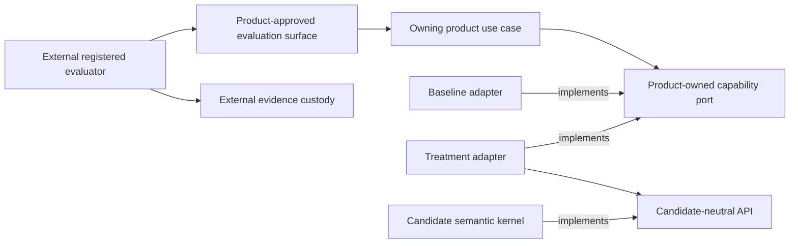
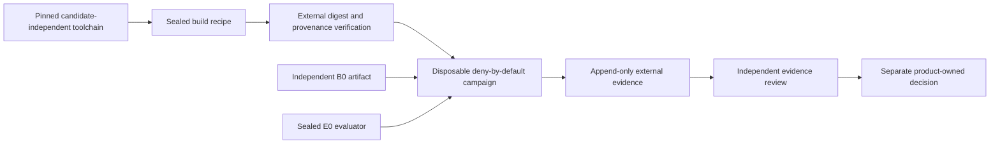

# Module System Dogfooding

## Purpose

This proposed architecture defines how a future module-system implementation
may be exercised without allowing that implementation to build, evaluate,
approve, or recover itself. It describes candidate-neutral authority and
evidence boundaries only. It does not admit a module engine, declaration
grammar, runtime graph, lifecycle coordinator, public SPI, or product rollout.

Dogfooding qualifies one implementation. It is not an independent consumer and
cannot satisfy the semantic-extraction gate in ADR-0013.

The current baseline remains product-owned ports, literal imports, pure
factories, closed dependency objects, and explicit composition roots. The
[Module System V1 productization dossier](../qualification/module-system-v1-productization/README.md)
records non-authoritative evidence, verdicts, and recommended triggers. Only
accepted ADRs and owning-product decisions authorize implementation or use.

## Design Principles

| Principle | Application here |
| --- | --- |
| Clean Architecture | Product policy and outcomes remain inside the owning product. Candidate runtime and evaluation technology stay behind outer composition boundaries. |
| SOLID | Candidate production, execution, evaluation, evidence custody, review, and product authorization are separate responsibilities. Implementations depend on stable contracts rather than framework types. |
| DDD | A product owns its language, capability seam, invariants, and decision. Foundation does not create a universal module domain or import a product model. |
| DRY | ADR-0013, ADR-0014, the productization dossier, and product decisions keep their existing responsibilities. A campaign links to them and records only campaign-specific facts. |

The future semantic kernel remains an ordinary library. It does not become a
module of itself and does not require its own graph, container, loader, or
lifecycle coordinator to compile, test, or start.

## Boundaries

### Authority roles

The roles below are logical authorities. Evidence used for promotion must bind
each role to an auditable principal and credential identity.

| Role | Owns | Must not own in the same campaign |
| --- | --- | --- |
| Product sponsor | Capability seam, product outcome, behavioral-oracle semantics, acceptance policy, thresholds, campaign admission, and later product decisions | Treatment production, evidence evaluation, or evidence review |
| Candidate producer | Treatment implementation and declared build inputs | Harness operation, evidence custody, evaluation, review, or product admission |
| Harness operator | Sealed execution of the registered protocol | Candidate production, evidence custody, evaluation, review, or product admission |
| Evidence custodian | Attempt registration, append-only receipts, raw outputs, provenance, and retrieval | Candidate production, harness operation, evaluation, review, or product admission |
| Independent evaluator | Application of a sealed product-approved oracle or rubric and registered analysis | Oracle semantics, treatment implementation, harness operation, evidence custody, review, or product rollout |
| Independent reviewer | Acceptance or rejection of the evidence claim supported by one campaign | Sponsorship, implementation, execution, custody, evaluation, or product adoption |

Calibration may combine roles, but its output cannot support promotion. A
campaign used for an architectural or product claim enforces the incompatible
role combinations above with separate principals or workload identities,
separate credentials, and auditable handoffs. Labels inside one process or
account are not separation.

No shared module-system owner exists at this level. The first owning product
owns private identities, grammar, composition behavior, diagnostics, and any
lifecycle semantics. A Foundation owner can be introduced only through the
independent-consumer, conformance, and accepted-extraction process in ADR-0013.

### Source dependency direction

Product domain and application code never import a candidate container,
context, resolver, harness, receipt, or lifecycle type. The treatment adapter
depends on both the product port and the candidate-neutral API. The candidate
semantic kernel imports neither product ports, product DTOs, product domain
types, nor evaluator types. The evaluator invokes only an external
product-approved surface and does not import the production implementation.

### Scope owned by a later acceptance decision

If accepted, this architecture would govern only the candidate-neutral
constraints for:

- bootstrap independence;
- role and credential separation;
- campaign identity and evidence custody;
- deterministic and stochastic evaluation isolation;
- fail-closed handling of missing evidence;
- preserving product and Foundation ownership boundaries.

The owning product must separately approve the exact capability seam, measured
problem, baseline, treatment rationale, corpus, evaluator, thresholds,
repetitions, exclusions, expiry, and any use outside a disposable campaign.
The dossier is evidence for that decision, not its authority.

## Campaign Structure

### Independent coordinates

Every campaign keeps the following coordinates distinct:

| Coordinate | Meaning |
| --- | --- |
| `ProtocolRevision` | Immutable ancestry and rules for one campaign |
| `BaselineArtifact` | Externally selected product-owned Pure DI baseline, also called `B0` |
| `TreatmentArtifact` | Candidate implementation under evaluation, also called `T1` |
| `EvaluationRevision` | Immutable evaluator inputs, execution rules, analysis, and stop rules, also called `E0` |
| `ExperimentalUnit` | The entity whose outcome contributes once to the registered analysis |
| `AttemptIdentity` | One non-reused execution, optionally linked to a prior attempt without becoming a new experimental unit |
| `EvidenceReceipt` | Externally captured binding between registered inputs, execution, raw output, and terminal result |

These names do not define a public schema. Serialization and storage remain
campaign-local until independent consumers justify shared extraction.

`B0` and `E0` are frozen before `T1` enters a campaign. `E0` binds immutable
content digests and retrievable locators for its corpus, runner, oracle or
rubric, model identity, prompts, context, settings, tools, permissions, budgets,
assignment order, pair identities, analysis, exclusions, thresholds, and stop
rules. Changing any treatment factor creates a new evaluation revision. Results
from different revisions are not pooled.

Before execution, the evidence custodian registers an `AttemptIdentity` against
the exact `ProtocolRevision`, `B0` or `T1`, `E0`, and `ExperimentalUnit`, with an
expected terminal receipt. Every registered attempt ends as succeeded, failed,
timed out, crashed, abandoned, or invalid. A retry links to its predecessor and
does not increase the registered sample size unless the product-approved
analysis explicitly defines a new experimental unit.

### Bootstrap without recursive authority

Every candidate generation can be built and evaluated through a pinned ordinary
toolchain and immutable build recipe that do not depend on any candidate
generation. Candidate-declared inputs are data to that recipe, not execution
authority. Build, install, and evaluation run inside disposable containment with
no real projects, user credentials, or ambient network access.

A stable `N-1` artifact may be an additional comparison subject. It is never a
required builder, evaluator dependency, approval mechanism, or recovery
prerequisite for generation `N`. The candidate-independent path remains tested
and sufficient for every generation. Self-hosting never becomes
self-certification.

### First dogfood capability

This document selects no capability. The criteria below are necessary but not
sufficient. Before a treatment exists, the owning product must satisfy the
applicable prerequisites in the productization dossier, including measuring the
authoring or drift problem through existing composition without introducing the
abstraction being justified. An accepted product decision is then required.

An admitted capability must be:

- product-owned and observable through a narrow existing seam;
- stateless or derived from disposable inputs;
- repeatable in a fresh sandbox without user projects or credentials;
- removable without changing product contracts;
- outside canonical writes, migrations, authorization, release, and rollback;
- useful enough to expose authoring or composition failures.

A documentation example, synthetic fixture, or Foundation repository path is
calibration evidence only. It does not become a product consumer by being
placed in this repository.

### Evidence dimensions

Architecture gates, execution environments, evaluation tracks, and allowed
claims are independent dimensions. They are not a maturity ladder.

| Environment | Track | Allowed claim | Claim explicitly not supported |
| --- | --- | --- | --- |
| Exact source audit | Dependency and export audit | Import direction, curated exports, and absence of framework leakage in inspected source | Runtime behavior or product use |
| Packed candidate artifact in a disposable workspace | Deterministic black-box conformance | Behavior of exact packed bytes for the registered corpus | Product integration, recovery, or independent consumption |
| Disposable product-owned replay | Deterministic comparison | Relative outcome for one approved seam without serving users | Product adoption or live replacement |
| Disposable product-owned replay | Stochastic AI authoring or navigation benchmark | Relative discoverability and authoring performance under one registered evaluator | Correctness, runtime safety, or another evaluator revision |
| Independent consumer evidence | Cross-consumer conformance | Input to a later L5 extraction decision | Automatic Foundation ownership |

Evidence for one claim dimension cannot substitute for another. Source review
does not prove execution. Stochastic improvement cannot offset deterministic
failure. Multiple configurations, copied repositories, or jobs under one owner
are not independent consumers.

### Evaluation tracks

The exact benchmark remains product-owned. Any deterministic campaign used for
an evidence claim must register normalized inputs and expected outputs,
non-stochastic oracle behavior, resource bounds, identical adapter treatment,
and deliberate mutants. Mutation evidence supports only the bounded claim that
the registered oracle rejects each registered mutant.

Any stochastic campaign must preregister its primary estimand, experimental
unit, pairing and randomization schedule, analysis method, sample-size or power
justification, non-inferiority or effect rule, multiplicity handling, attrition
and retry handling, fresh-context and carryover controls, and confidence rule.
Model, prompt, context, tools, permissions, budgets, transcripts, and tool events
are bound to `E0` and each receipt.

Deterministic and stochastic tracks produce separate verdicts. Neither can waive
the other's failure. A separate source audit checks that public types and
dependency direction remain framework-neutral.

### Evidence custody

The external custodian preregisters every expected attempt and records an
append-only terminal receipt. Missing receipts remain detectable abandoned or
invalid attempts rather than disappearing from the denominator.

Each receipt binds:

- repository, clean commit and tree, submodules, and lockfile digests; if a
  dirty input is exceptionally admitted, an immutable archive digest and
  retrievable locator for every modified and untracked byte;
- dependency resolution, sealed build recipe, builder identity, and toolchain
  or container digest;
- artifact media type, digest, size, provenance, and immutable retrievable
  locator;
- protocol and evaluation content digests and immutable locators;
- experimental unit, pair, assignment order, predecessor attempt, and attempt
  identity;
- raw output, normalized result, terminal state, timestamps, and current
  authorization or revocation observation when applicable.

A local path, mutable tag, source claim, or hash without retrievable immutable
custody is corroboration only. Artifact identity is reverified at registration,
execution, evidence review, and any later separately approved use.

## Operational Implications

### Execution and failure behavior

Pure DI is not containment. Every candidate-controlled build step and executable
treatment runs in a deny-by-default sandbox appropriate to its placement. File,
network, environment, subprocess, and credential access are absent unless the
registered protocol grants a narrow disposable resource. Build-time code is
treated as executable candidate code.

Baseline and treatment execute independently in fresh disposable workspaces.
They do not share mutable caches, state stores, worktrees, credentials, or
candidate-only migrations. Fallback is disabled inside a scored attempt.
Unknown outcome, missing receipt, evaluator failure, artifact mismatch,
containment failure, or expired authorization fails closed for the claim.

The campaign does not serve user traffic or authorize shadow, non-production,
production, replacement, or rollback behavior. Each requires a separate
product-owned decision and architecture.

### Threat applicability

| Threat | Required treatment |
| --- | --- |
| Candidate self-certification | Candidate producer, harness, custody, evaluator, reviewer, and sponsor remain auditable and separated as defined above |
| Recursive bootstrap | Candidate-independent build and evaluation path remains sufficient and tested for every generation |
| Omitted failed attempt | External preregistration requires one detectable terminal receipt for every attempt |
| Artifact substitution | Immutable locator, digest, provenance, and verification at every use |
| Evaluator drift | `E0` binds every treatment factor, model identity, assignment, and analysis input |
| Framework leakage | Export and dependency-direction audit outside black-box scoring |
| Build or process escape | Deny-by-default containment from the first candidate-controlled build or executable treatment |

Live replacement, unload, distributed cutover, and product recovery are outside
this proposal. They require their own accepted lifecycle or placement decisions
and must not be inferred from dogfooding evidence.

### Conditional progression

If an owning product later admits a campaign, the sequence is:

1. Measure the problem through the current Pure DI baseline without introducing
   the candidate abstraction.
2. Accept a product decision naming the seam, outcome, rationale, protocol,
   baseline, evaluator, thresholds, owners, and expiry.
3. Seal `B0`, `T1`, and `E0`, then preregister expected attempts externally.
4. Calibrate the harness against baseline-only runs and deliberate mutants.
5. Execute baseline and treatment only in disposable containment.
6. Have an independent reviewer accept or reject only the registered evidence
   claim.
7. Use that result only as input to a later product decision. It authorizes no
   runtime use by itself.
8. Keep Foundation extraction blocked until two independently authored
   consumers, executable conformance, and an accepted extraction decision
   satisfy ADR-0013.

### Retirement and retained evidence

An admitted product protocol names an exact expiry and review owner. Before any
attempt exists, an unowned or expired proposal may be withdrawn through the
product's approved process. Once an attempt is registered, its immutable
coordinates, terminal or abandoned state, receipts, raw failures, and a
retirement tombstone are retained. Failed or missing attempts are never deleted
or rewritten to simplify later evidence.

This proposed architecture creates no campaign, candidate, artifact, or
authorization. Product-specific protocols and attempt records belong in the
owning product. Foundation receives only evidence required by a later,
separately approved extraction decision.

## Architectural Acceptance Criteria

A future implementation conforms to this proposal only when:

- product ports, DTOs, domain types, and application use cases expose no module
  framework, container, host, harness, receipt, or candidate type;
- the semantic kernel compiles and tests without loading itself as a module;
- an ordinary candidate-independent path can build and evaluate every
  generation without a prior candidate;
- sponsor, candidate production, harness operation, evidence custody,
  evaluation, evidence review, and later product authorization have auditable
  principal and credential separation;
- baseline and every evaluator input are frozen before treatment admission;
- every attempt is preregistered and has a detectable terminal or abandoned
  state;
- deterministic and stochastic verdicts remain independent;
- fallback cannot hide a failed or unknown treatment outcome;
- dogfooding, product runtime use, and Foundation extraction remain separate
  decisions;
- generated indexes and reports remain disposable projections, not additional
  authorities.

## Related Decisions

- [ADR-0013](../decisions/0013-first-consumer-module-semantics-before-foundation-extraction.md)
  keeps module semantics product-local until independent consumers and
  conformance justify extraction.
- [ADR-0014](../decisions/0014-product-local-module-authoring-composition-and-generation-guardrails.md)
  defines current Pure DI, inert authoring, literal loading, and future
  generation guardrails without admitting a runtime.
- [OD-003](../open-decisions/OD-003-module-runtime-and-public-spi-choices.md)
  retains unresolved runtime and public-SPI choices.
- The
  [Module System V1 productization dossier](../qualification/module-system-v1-productization/README.md)
  records current evidence, verdicts, and non-authoritative recommended triggers.
