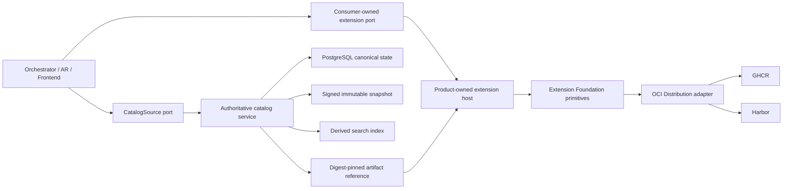

# Architecture Overview

Extension Foundation is a product-neutral technical library and tooling
repository. It is not a product control plane, marketplace, domain model, or
global plugin host.

## Ownership

Extension Foundation may own:

- manifest, package, capability-request, and permission-request schemas;
- extension, publisher, artifact, installation, and generation identities;
- lifecycle protocol primitives and compatibility negotiation;
- profile and lock-file schemas;
- OCI artifact resolution and registry conformance fixtures;
- signature, provenance, digest, and revocation verification primitives;
- shared test kits and AI-readable diagnostics.

Extension Foundation does not own:

- Orchestrator teams, work, runs, messages, policies, or workflows;
- Agent Runtime sessions, operations, custody, sandbox policy, or provider
  execution;
- Frontend layout, commands, views, routing, or application state;
- Platform tenants, memberships, entitlements, placements, or managed rollout;
- a universal service locator, aggregate repository, or shared product database.

## Dependency Direction

Products depend on released Foundation contracts. Foundation never imports a
product. Product-specific SPI remains physically located in the consuming
product and maps to Foundation lifecycle primitives only at composition and host
boundaries.

Full DDD belongs inside products where business invariants exist. This
repository uses domain modelling only for real extension lifecycle and trust
semantics; adapters, schema codecs, and OCI clients do not receive artificial
aggregates.

## Catalog State and Publication

Each writable catalog source owns one PostgreSQL canonical store. Signed
snapshots, search indexes, and OCI artifacts are derived or separately owned;
none can write back into catalog state. Federation selects one authority for an
extension route and does not merge records or fall back after an authority
failure.

The future `extension-catalog` owns Catalog Governance business behavior and
persistence. Foundation may provide portable source descriptors, snapshot
schemas, verification primitives, ports, and conformance fixtures without
becoming a catalog service or shared product database.
