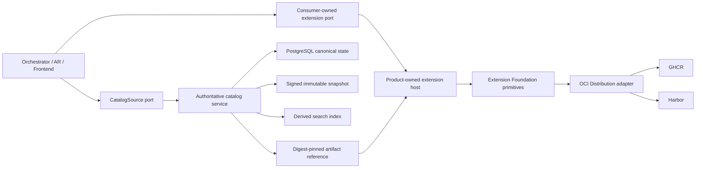

# Architecture Overview

Extension Foundation is a product-neutral technical library and tooling
repository. It is not a product control plane, marketplace, domain model, or
global plugin host.



## Ownership

Extension Foundation may own:

- manifest, package, capability-request, and permission-request schemas;
- extension, publisher, artifact, installation, and generation identities;
- lifecycle protocol primitives and compatibility negotiation;
- profile and lock-file schemas;
- OCI artifact resolution and registry conformance fixtures;
- signature, provenance, digest, and revocation verification primitives;
- shared test kits and AI-readable diagnostics.

Extension Foundation does not own:

- Orchestrator teams, work, runs, messages, policies, or workflows;
- Agent Runtime sessions, operations, custody, sandbox policy, or provider
  execution;
- Frontend layout, commands, views, routing, or application state;
- Platform tenants, memberships, entitlements, placements, or managed rollout;
- a universal service locator, aggregate repository, or shared product database.

## Dependency Direction

Products depend on released Foundation contracts. Foundation never imports a
product. Product-specific SPI remains physically located in the consuming
product and maps to Foundation lifecycle primitives only at composition and host
boundaries.

Full DDD belongs inside products where business invariants exist. This
repository uses domain modelling only for real extension lifecycle and trust
semantics; adapters, schema codecs, and OCI clients do not receive artificial
aggregates.

## Package Admission

The package catalog is closed and intentionally empty until an effective
accepted ADR binds the exact package ID, name, path, and feature names. A
package is admitted in one reviewed change that adds its catalog entry,
deterministic scaffold output, value-level `src/features/<feature>/`
implementation, and executable package-specific test evidence. Reserving empty packages or
root-level `domain`, `application`, `contracts`, or `adapters` directories is
not allowed.

Feature-specific contracts and adapters stay inside their owning feature.
Only product-neutral contracts with an independent release lifecycle may
become package boundaries. Technology adapters become separate packages only
when they are independently replaced, released, or deployed.

Use the reviewable scaffolding sequence. The repository-owned adapter publishes
the plan create-only and rejects traversal, symbolic-link ancestry, stale catalog
identity, or operations outside the cataloged package root:

```bash
pnpm architecture:scaffold:plan -- <intent-path> architecture/scaffolding-plans/<name>.json
pnpm architecture:scaffold:apply -- architecture/scaffolding-plans/<name>.json <printed-plan-digest>
pnpm architecture:scaffold:recover
pnpm architecture:check
```

The generic scaffold creates a private internal package boundary, `tsconfig`,
and curated package entrypoint. This is not publication of a public extension
SPI. Before apply output can pass admission, the author must add the
package-specific feature implementation and its exact `package.<catalog-id>`
source boundary in the same change. Each package keeps the governed check,
typecheck, build, and test scripts; CI never skips them with `--if-present`.

Publishing an external extension SPI remains a separate decision and requires
the stable product owner, real product slice, independent implementations,
compatibility fixtures, negative tests, and conformance evidence defined by the
extension safety ADR. Internal package exports do not satisfy that gate.

The current filesystem adapter proves journaled process-crash recovery in a
trusted single-writer workspace. Plan apply additionally requires the digest
printed during review. This
repository does not claim power-loss durability on every operating system until
the shared Foundation publishes that qualification evidence.

Until the shared source graph models JSX import-source directives, triple-slash
references, CommonJS loading, runtime code generation, `process.getBuiltinModule`,
and TypeScript path or project-reference edges, package admission rejects those
constructs fail-closed rather than silently omitting them.

The Engineering Foundation owns the source-graph and scaffolding protocols.
This repository owns its package roles, catalog entries, allowed dependency
edges, feature names, and owner documents.

## Catalog State and Publication

Each writable catalog source owns one PostgreSQL canonical store. Signed
snapshots, search indexes, and OCI artifacts are derived or separately owned;
none can write back into catalog state. Federation selects one authority for an
extension route and does not merge records or fall back after an authority
failure.

The future `extension-catalog` owns Catalog Governance business behavior and
persistence. Foundation may provide portable source descriptors, snapshot
schemas, verification primitives, ports, and conformance fixtures without
becoming a catalog service or shared product database.
