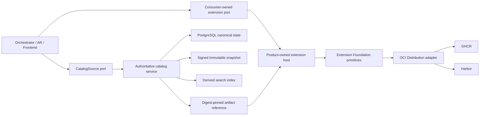

# Architecture Overview

Extension Foundation is a product-neutral technical library and tooling
repository. It is not a product control plane, marketplace, domain model, or
global plugin host.



## Ownership

Extension Foundation may own:

- manifest, package, capability-request, and permission-request schemas;
- extension, publisher, artifact, installation, and generation identities;
- lifecycle protocol primitives and compatibility negotiation;
- profile and lock-file schemas;
- OCI artifact resolution and registry conformance fixtures;
- signature, provenance, digest, and revocation verification primitives;
- shared test kits and AI-readable diagnostics.

Extension Foundation does not own:

- Orchestrator teams, work, runs, messages, policies, or workflows;
- Agent Runtime sessions, operations, custody, sandbox policy, or provider
  execution;
- Frontend layout, commands, views, routing, or application state;
- Platform tenants, memberships, entitlements, placements, or managed rollout;
- a universal service locator, aggregate repository, or shared product database.

## Dependency Direction

Products depend on released Foundation contracts. Foundation never imports a
product. Product-specific SPI remains physically located in the consuming
product and maps to Foundation lifecycle primitives only at composition and host
boundaries.

Full DDD belongs inside products where business invariants exist. This
repository uses domain modelling only for real extension lifecycle and trust
semantics; adapters, schema codecs, and OCI clients do not receive artificial
aggregates.

## Package Admission

The package catalog is closed and intentionally empty until an effective
accepted ADR binds the exact package ID, name, path, and feature names. A
package is admitted in one reviewed change that adds its catalog entry,
deterministic scaffold plan and output, value-level `src/features/<feature>/`
implementation, explicit feature entrypoint, and executable structural evidence
under `test/features/<feature>/`. The same change must include a versioned
`architecture/package-admissions/<encoded-package-id>.json` record that binds
the accepted extraction decision, one explicit ADR-0013 package-admission basis, exact
source commits, conformance results, implementation identities, and
digest-bearing evidence references. A second-consumer basis requires two real
consumer identities. A public-SPI basis requires two independently authored
implementation identities. Independent replacement/release or
deployment/isolation lifecycles may justify a package with one evidence record;
they do not imply that its exports are a public extension SPI. Repository
identities are canonical lowercase `owner/repository` values and reject
transport/path aliases such as `.git` or trailing dots. Local evidence paths
must remain under `docs/` and use exactly one digest fragment. External HTTPS
locations are compared by their canonical URL, and independent evidence records
must have distinct SHA-256 locations and digests; aliases, one location with
conflicting claimed digests, or mirrors of the same bytes cannot satisfy a gate
twice.

These checks prove topology and evidence syntax, not business completeness or
the referenced evidence bytes. Package admission does not prove Foundation
ownership of module declarations, graph semantics, lifecycle, or diagnostics;
ADR-0013 separately requires two real independently authored consumers,
cross-consumer conformance, and an accepted semantic-extraction decision. A
non-empty catalog therefore fails closed until
an executable admission verifier is supplied. That verifier must resolve each
repository slug through its provider to a stable repository ID, prove the
selected admission basis and any claimed implementation independence, and hash
the evidence bytes before admission. Publication re-verifies the immutable
receipt. The admitting ADR and review evidence establish that the slice is
semantically real. Reserving empty packages or root-level
`domain`, `application`, `contracts`, or `adapters` directories is not allowed.

Feature-specific contracts and adapters stay inside their owning feature.
Only product-neutral contracts with an independent release lifecycle may
become package boundaries. Technology adapters become separate packages only
when they are independently replaced, released, or deployed.

Use the reviewable scaffolding sequence. The repository-owned adapter syncs a
private temporary and publishes it through a create-only hard link, so process
loss cannot leave a partial destination. Repeating the same digest is
idempotent; a different destination is never overwritten. The adapter rejects
traversal, symbolic-link ancestry, stale catalog identity, or operations outside
the cataloged package root:

```bash
pnpm architecture:scaffold:plan -- <intent-path> architecture/scaffolding-plans/<encoded-package-id>.json
pnpm architecture:scaffold:apply -- architecture/scaffolding-plans/<encoded-package-id>.json <printed-plan-digest>
pnpm architecture:scaffold:recover
pnpm architecture:check
```

The plan path is derived reversibly from the catalog package ID: dots become
`-dot-` and hyphens become `-dash-`. The reviewed plan remains committed as
immutable materialization evidence. Package scripts, root export map, and
`tsconfig` are validated against its generated operations, so the shared
Foundation recipe remains the source of truth.

The generic scaffold creates a private internal package boundary, `tsconfig`,
and curated package entrypoint. This is not publication of a public extension
SPI. Before apply output can pass admission, the author must add the
package-specific feature implementation, its exact runtime and development
boundaries, and its test evidence in the same change. The package public
boundary may reach only declared feature entrypoints. Each feature has its own
runtime boundary, and its tests live outside the production build in a
development boundary. Cross-feature dependencies are explicit and deep imports
fail closed. The root export must reach each feature entrypoint, each feature
entrypoint must reach an exported value-level implementation, and executable
tests must make an assertion over a runtime value imported from the owning
feature entrypoint. Unreachable files, private placeholder declarations, and
no-op tests are not admission evidence.

Package ownership is a bijection: every catalog entry requires one effective
accepted ADR declaration, and every package declaration in an effective
accepted ADR requires one exact catalog entry. Either side drifting alone fails
CI.

Each package keeps the governed clean, typecheck, build, test, check, and
prepack scripts and cannot add implicit lifecycle hooks. Its source-only
TypeScript inputs, cache, declarations, and build output remain package-local.
CI never skips package checks with `--if-present`. The initial private package
surface exposes only the reviewed root `types` and `import` entrypoint. After
every build CI verifies regular artifacts under `dist`, resolves the package
self-reference to that exact root artifact, and imports it in a separate Node
process. Tracked symbolic links, Git submodules, generated directory escapes,
and Git-discovery failure are rejected fail-closed.

Publishing an external extension SPI remains a separate decision and requires
the stable product owner, real product slice, independent implementations,
compatibility fixtures, negative tests, and conformance evidence defined by the
extension safety ADR. Internal package exports do not satisfy that gate.

The current filesystem adapter tests plan publication loss before and after its
create-only link plus every exposed apply fault point in a trusted single-writer
workspace. A crash either converges automatically or returns stable,
fail-closed manual-recovery evidence without overwriting files. Plan apply
additionally requires the digest printed during review. This repository does
not claim power-loss durability on every operating system until the shared
Foundation publishes that qualification evidence.

Until the shared source graph models JSX import-source directives, triple-slash
references, CommonJS loading, `createRequire`, runtime code generation,
computed property access, ambient `globalThis` or `process` access,
`process.getBuiltinModule`, and TypeScript path or project-reference edges,
package admission rejects those constructs fail-closed rather than silently
omitting them.

The Engineering Foundation owns the source-graph and scaffolding protocols.
This repository owns its package roles, catalog entries, allowed dependency
edges, feature names, and owner documents.

## Catalog State and Publication

Each writable catalog source owns one PostgreSQL canonical store. Signed
snapshots, search indexes, and OCI artifacts are derived or separately owned;
none can write back into catalog state. Federation selects one authority for an
extension route and does not merge records or fall back after an authority
failure.

The future `extension-catalog` owns Catalog Governance business behavior and
persistence. Foundation may provide portable source descriptors, snapshot
schemas, verification primitives, ports, and conformance fixtures without
becoming a catalog service or shared product database.
