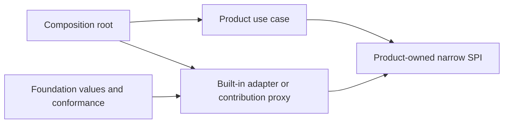
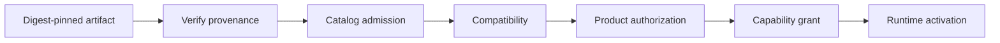

# ADR-0006: Extension Module Safety Boundaries

## Context

Extension Foundation must support built-in modules, first-party engines, and
independently distributed plugins without turning a dependency-injection
container, event bus, or plugin runtime into product authority. The same
product extension point may have a trusted in-process implementation and an
isolated process or WASM implementation, but those runtimes do not have the
same invocation or containment guarantees.

The Foundation therefore needs durable boundaries before it publishes module
or plugin APIs. Product invariants, authorization, transactions, and canonical
state must remain owned by the consuming product.

## Decision

### Ownership and dependency direction

- A product owns every extension point, application use case, authorization
  decision, durable installation intent, active routing decision, and canonical
  state mutation.
- Extension Foundation owns product-neutral identities, immutable manifest and
  lifecycle values, serializable protocols, pure graph validation, and
  conformance fixtures. It does not run product workflows or store product
  installation state.
- Engineering Foundation owns generic repository schemas, source and package
  boundary validation, scaffolding protocols, and diagnostics. Products own
  their package catalogs, allowed dependency edges, and exceptions.
- Product domain and application code depend on narrow product-owned ports.
  Host adapters implement those ports and are bound only in composition.
  Container, resolver, Cordis Context, Awilix, and framework types never cross
  a product-owned port.
- A module receives a closed dependency object. Parent fallback, ambient
  discovery, string lookup, registration order, and global service locators
  cannot satisfy a dependency.

### Admission, authority, and identity

Artifact verification, catalog admission, compatibility, commercial
entitlement, product authorization, capability grants, and runtime enforcement
are separate decisions. Success at one stage does not imply success at another.

- Publisher, extension, artifact, manifest, installation, contribution,
  graph-generation, runtime-generation, proxy, invocation, and grant identities
  are distinct. The term plugin artifact refers only to immutable distributed
  bytes and metadata, never to a running actor.
- A capability grant binds product and tenant scope, installation,
  contribution, artifact and manifest digests, exact capabilities, and runtime
  generation. Any expansion or digest change requires a new authorization.
- Revocation fences new invocations before drain starts. A stale handle or
  generation cannot exercise a newer grant.
- Mutable tags such as `latest` are discovery hints only. Admission, activation,
  lock files, rollback, and audit evidence use immutable digests.
- One artifact installation may expose multiple contributions. The host either
  admits the declared compatible contribution set atomically or records an
  explicit product-owned partial-admission decision. No accidental per-item
  activation is allowed.

### Runtime and invocation boundaries

- Trusted built-in modules and isolated contributions use different host ports.
  A trusted module may use in-process functions and objects. A process, worker,
  browser, or WASM contribution uses explicitly serializable messages and
  cannot receive functions, classes, native handles, or object identity.
- Only product-built and fully trusted code may run in-process. Cleanup and
  dependency scopes provide cooperative lifecycle management, not security
  containment. Third-party code requires a runtime the host can terminate.
- Calls crossing a process, trust, streaming, or external-effect boundary have
  explicit deadlines, cancellation, bounded input and output, backpressure, and
  typed terminal outcomes. Pure local function calls are not forced through a
  network-shaped protocol.
- Plugin or provider calls never occur inside a product Unit of Work. The
  product commits durable intent first, invokes the effect after commit, and
  reconciles an unknown outcome before retrying.
- Events represent observed facts. A command, query, or optional interception
  uses a named product-owned typed port or ordered chain with explicit
  authority, result, failure, and ordering semantics. An event bus is never a
  hidden request-response service locator.

### Graph generation and lifecycle

- Discovery and graph compilation are pure and cannot import or execute
  extension code. Compilation rejects missing dependencies, cycles, provider
  ambiguity, incompatible versions, undeclared edges, and nondeterministic
  ordering.
- Activation is atomic at graph-generation scope. The host computes the full
  affected dependency closure, starts and health-checks a candidate generation,
  commits routing once, then drains the prior generation. Failure before the
  routing commit disposes the whole candidate generation; failure after it
  invokes explicit reconciliation and rollback for the whole affected closure.
- Activation, drain, deactivation, uninstall, data export, and deletion are
  separate operations. Cleanup hooks are necessary but do not prove that
  timers, processes, streams, listeners, or remote effects stopped.
- Registration order is not business semantics. Multiple providers require an
  explicit selection or collection contract.

### State and data ownership

- Product canonical state and migrations remain product-owned and cannot be
  written by an extension.
- Foundation protocol schemas are immutable versioned contracts, not a shared
  product database.
- Plugin-private state is installation-scoped. Its owner declares schema
  version, idempotent migration policy, compatibility window, checkpoint or
  backup behavior, retention, export, and deletion. The product host
  orchestrates lifecycle but does not infer destructive migration or deletion.
- Uninstall never deletes product or plugin-private user data implicitly.
- Credentials remain inside product-owned secret adapters. Contributions
  receive scoped capabilities or opaque references, not raw secrets or an
  unrestricted secret-store interface.

### Public API gate

- A public extension point requires a stable product owner, one real product
  slice, at least two independently authored conforming implementations,
  compatibility fixtures, negative tests, and a conformance suite.
- Two consuming repositories do not prove two independent implementations.
- Foundation publishes no broad universal plugin interface. Products map narrow
  capability contracts to Foundation lifecycle and distribution primitives.
- One contract starts with one version family. Exact compatibility direction,
  evolution rules, and supported version windows must be decided before public
  release.

## Consequences

- Products retain explicit authority and transaction boundaries while sharing
  lifecycle, trust, graph, and distribution primitives.
- Built-in and isolated implementations can share outcome traces and relevant
  conformance cases without pretending their runtime APIs are identical.
- Extension updates can use staged generation replacement without in-place
  mutation of the active object graph.
- The host and conformance surface are larger than a global plugin manager, but
  failures, ownership, and security remain reviewable.
- Cordis, a native runner, process hosts, browser workers, and a future Extism
  host remain replaceable adapters rather than public semantics.

## Rejected alternatives

- A global `PluginManager`, container, resolver, or event bus. It hides
  dependencies, authority, ordering, and failure semantics.
- One host API for trusted closures and isolated serializable contributions. It
  either leaks in-process assumptions over the wire or weakens local typing.
- Treating manifest requests, signatures, entitlements, or catalog admission as
  product authorization.
- Calling extension code inside database transactions or blindly retrying an
  ambiguous external effect.
- In-place hot mutation of an active graph. Generation replacement with explicit
  routing, drain, and rollback is required.
- Publishing an SPI after one implementation or only two consumers.
