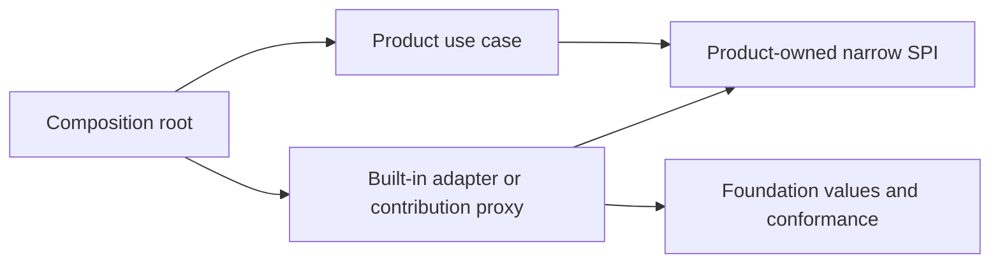
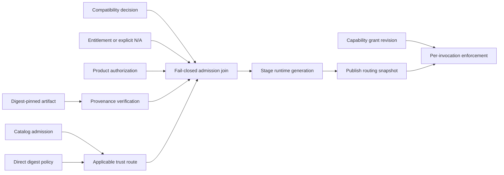

# ADR-0008: Extension Authority And Lifecycle Corrections

## Context

ADR-0007 clarified the module and plugin safety floor, but final adversarial
review identified remaining ambiguity in grant revision lineages, direct-digest
entitlement handling, graph authority scope, successful activation, and
private-state attachment. This ADR supersedes ADR-0007 while preserving its
product-owned authority and transaction model.

Extension Foundation must support built-in modules, first-party engines, and
independently distributed plugins without turning a dependency-injection
container, event bus, or plugin runtime into product authority. The same
product extension point may have a trusted in-process implementation and an
isolated process or WASM implementation, but those runtimes do not have the
same invocation or containment guarantees.

The Foundation therefore needs durable boundaries before it publishes module
or plugin APIs. Product invariants, authorization, transactions, and canonical
state must remain owned by the consuming product.

## Decision

### Ownership and dependency direction

- A product owns every extension point, application use case, authorization
  decision, durable installation intent, active routing decision, and canonical
  state mutation.
- Extension Foundation owns product-neutral identities, immutable manifest and
  lifecycle values, lifecycle, distribution, verification, and transport
  envelopes and codecs, pure graph validation, and conformance fixtures. Product
  contribution commands, queries, events, and payload schemas remain
  product-owned. Foundation does not run product workflows or store product
  installation state.
- Engineering Foundation owns generic repository schemas, source and package
  boundary validation, scaffolding protocols, and diagnostics. Products own
  their package catalogs, allowed dependency edges, and exceptions.
- Product domain and application code depend on narrow product-owned ports.
  Host adapters implement those ports and are bound only in composition.
  Container, resolver, Cordis Context, Awilix, and framework types never cross
  a product-owned port.
- A module receives a closed dependency object. Parent fallback, ambient
  discovery, string lookup, registration order, and global service locators
  cannot satisfy a dependency.

### Admission, authority, and identity

Artifact verification, catalog admission, compatibility, commercial
entitlement, product authorization, capability grants, and runtime enforcement
are separate decisions. Success at one stage does not imply success at another.

Catalog admission may be explicitly not applicable only when product policy
selects a product-approved direct-digest trust route. Commercial entitlement may
be explicitly not applicable only when product policy declares that no
entitlement requirement or entitlement plane applies to that deployment and
capability. Direct installation never bypasses an applicable entitlement
decision. Runtime enforcement is a continuing invocation boundary, not evidence
produced once by activation.

- Publisher, extension, artifact, manifest, artifact-installation,
  contribution-installation, graph-generation, runtime-generation, proxy,
  invocation, grant, and state-space identities are distinct. The term plugin
  artifact refers only to immutable distributed bytes and metadata, never to a
  running actor.
- An artifact installation belongs to exactly one product deployment and one
  explicit product authority scope. That scope can represent a deployment,
  tenant, project, or another product-owned boundary, but is never implicit.
  Each contribution installation belongs to exactly one artifact installation.
- A runtime generation belongs to exactly one contribution installation. An
  immutable graph generation belongs to exactly one explicit product authority
  scope and is a routing snapshot that references one or more same-scope runtime
  generations. Cross-scope routes require separate graph generations. An
  unchanged same-scope runtime generation may appear in successive graph
  snapshots.
- A capability grant binds the product authority scope, artifact and
  contribution installations, artifact and manifest digests, exact
  capabilities, runtime generation, an immutable grant identity, and a monotonic revision that
  is never reused within that grant lineage. Any scope or capability expansion,
  digest change, revoke-and-reissue, or lineage replacement requires a new
  authorization and cannot inherit an old revision tuple.
- Every proxy and invocation carries the graph generation, runtime generation,
  grant identity, and grant revision it observed. Enforcement validates the
  authority scope, current grant tuple, and graph-to-runtime-to-grant relationship
  at each dispatch and capability boundary. Revocation advances or invalidates
  the grant revision and fences routing before drain starts; stale handles cannot
  exercise either an old revoked grant or a different grant with the same numeric
  revision.
- Mutable tags such as `latest` are discovery hints only. Admission, activation,
  lock files, rollback, and audit evidence use immutable digests.
- One artifact installation may expose multiple contributions. The manifest
  declares required and optional contribution dependencies. Product admission
  selects an explicit contribution set, closes its required dependency graph,
  and authorizes each contribution separately. Installation, contribution
  authorization, graph activation, and artifact rollback remain separate
  records; no accidental per-item activation or unspecified partial admission is
  allowed.

### Runtime and invocation boundaries

- Trusted built-in modules and isolated contributions use different host ports.
  A trusted module may use in-process functions and objects. A process, worker,
  browser, or WASM contribution uses explicitly serializable messages and
  cannot receive functions, classes, native handles, or object identity.
- Only product-built and fully trusted code may run in-process. Cleanup and
  dependency scopes provide cooperative lifecycle management, not security
  containment. Third-party code requires a runtime the host can terminate.
- Calls crossing a process, trust, streaming, or external-effect boundary have
  explicit deadlines, cancellation, bounded input and output, backpressure, and
  typed terminal outcomes. Pure local function calls are not forced through a
  network-shaped protocol.
- No extension code executes inside a product Unit of Work, regardless of
  whether it is built in, isolated, invoked through a direct port, used as an
  interceptor, or subscribed to an event. The transaction may validate an
  already returned proposal and commit canonical state, durable intent, and an
  outbox record. Extension effects run after commit and an unknown outcome is
  reconciled before retry.
- Events represent observed facts. A command, query, or optional interception
  uses a named product-owned typed port or ordered chain with explicit
  authority, result, failure, and ordering semantics. An event bus is never a
  hidden request-response service locator.

### Graph generation and lifecycle

- Discovery and graph compilation are pure and cannot import or execute
  extension code. Compilation rejects missing dependencies, cycles, provider
  ambiguity, incompatible versions, undeclared edges, and nondeterministic
  ordering.
- The host computes the full affected dependency closure and stages a candidate
  graph without invocation or external-effect authority. Unavoidable startup
  effects require declared compensation and reconciliation; cleanup alone does
  not make them atomic.
- Atomicity applies only to publishing and fencing one immutable routing
  snapshot. Exact health gates, route-versus-drain ordering, in-flight behavior,
  and rollback eligibility are contract-specific choices governed by OD-003.
  On failure or abandonment before publication, the host disposes the complete
  candidate closure and reconciles startup effects. A healthy candidate remains
  live for successful publication. After publication, recovery creates another
  explicit routing generation and reconciles or rolls forward; it is not a
  transactional reversal of external effects.
- Activation, drain, deactivation, uninstall, data export, and deletion are
  separate operations. Cleanup hooks are necessary but do not prove that
  timers, processes, streams, listeners, or remote effects stopped.
- Registration order is not business semantics. Multiple providers require an
  explicit selection or collection contract.

### State and data ownership

- Product canonical state and migrations remain product-owned and cannot be
  written by an extension.
- Foundation protocol schemas are immutable versioned contracts, not a shared
  product database.
- Plugin-private state uses a durable state-space identity with a discriminated
  owner `{ ownerKind: extension | contribution, ownerId }` bound to one product
  authority scope. Extension-owned state accepts only the corresponding artifact
  installation attachment; contribution-owned state accepts only the
  corresponding contribution installation attachment. Binding requires the same
  authority scope and compatible schema lineage. Sibling contributions cannot
  read, migrate, rebind, or reuse one another's state. Uninstall detaches the
  exact attachment without creating an orphan or authorizing automatic reuse.
- The publisher owns private-state schema and migration intent. The product or
  tenant owns custody, retention, export, backup, and deletion authority. The
  product host orchestrates idempotent migration, compatibility, checkpoint, and
  explicit rebind or tombstone transitions without inferring destructive action.
- Uninstall never deletes product or plugin-private user data implicitly.
- Credentials remain inside product-owned secret adapters. Contributions
  receive scoped capabilities or opaque references, not raw secrets or an
  unrestricted secret-store interface.

### Public API gate

- A public extension point requires a stable product owner, one real product
  slice, at least two independently authored conforming implementations,
  compatibility fixtures, negative tests, and a conformance suite.
- Two consuming repositories do not prove two independent implementations.
- Foundation publishes no broad universal plugin interface. Products map narrow
  capability contracts to Foundation lifecycle and distribution primitives.
- One contract starts with one version family. Exact compatibility direction,
  evolution rules, and supported version windows must be decided before public
  release.

## Consequences

- Products retain explicit authority and transaction boundaries while sharing
  lifecycle, trust, graph, and distribution primitives.
- Built-in and isolated implementations can share outcome traces and relevant
  conformance cases without pretending their runtime APIs are identical.
- Extension updates can use staged generation replacement without in-place
  mutation of the active object graph.
- The host and conformance surface are larger than a global plugin manager, but
  failures, ownership, and security remain reviewable.
- Cordis, a native runner, process hosts, browser workers, and a future Extism
  host remain replaceable adapters rather than public semantics.

## Rejected alternatives

- A global `PluginManager`, container, resolver, or event bus. It hides
  dependencies, authority, ordering, and failure semantics.
- One host API for trusted closures and isolated serializable contributions. It
  either leaks in-process assumptions over the wire or weakens local typing.
- Treating manifest requests, signatures, entitlements, or catalog admission as
  product authorization.
- Calling extension code inside database transactions or blindly retrying an
  ambiguous external effect.
- In-place hot mutation of an active graph. Generation replacement with explicit
  routing, fencing, drain, and reconciliation is required.
- Publishing an SPI after one implementation or only two consumers.
