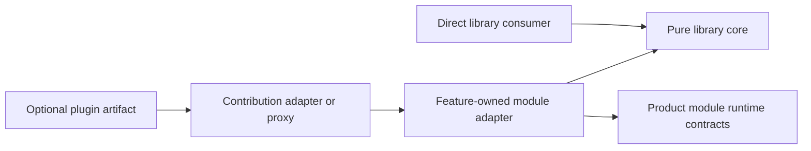
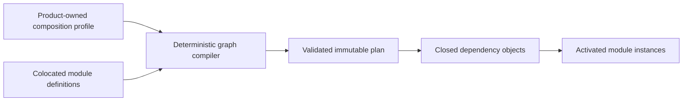

# ADR-0012: Reusable Library, Module, And Plugin Boundaries

## Context

The same implementation may begin as product-owned feature code, later gain a
runtime lifecycle inside a product module graph, and eventually become a
reusable package or independently installed plugin. Treating library, module,
feature, package, and plugin as synonyms creates either a central dumping ground
or package and compatibility churn. Keeping every integration in an unrelated
top-level directory instead makes ownership and local navigation unclear.

The architecture needs colocated ownership without making reusable business or
technical logic depend on a module runtime, dependency-injection container,
plugin distribution protocol, or product host.

## Decision

### Orthogonal roles

- A **feature** owns one coherent capability, its language, contracts,
  implementation, adapters, and tests.
- A **library core** is ordinary reusable code with explicit constructor or
  factory dependencies. It has no module-runtime lifecycle.
- A **module adapter** connects feature-owned code to a product module graph,
  lifecycle, and capability contract.
- A **package** is a physical build and release boundary. It is created only
  when an independent release, replacement, deployment, or proven reuse
  lifecycle justifies it.
- A **plugin artifact** is an independently distributed trust, installation,
  update, and rollback envelope. One artifact may provide one or more module
  contributions.

The compile-time dependency direction is one-way:



The library core never imports the module adapter, Foundation runtime, product
host, dependency-injection container, artifact manifest, or plugin SDK. A module
adapter may depend on the core. The diagram describes code dependencies, not
merely activation flow.

### Colocation and extraction

Before extraction, the core and module adapter remain beside the owning feature
using that product's native feature-slice structure. Wiring belongs in the
feature's `composition/` boundary. A host protocol translator belongs in the
feature's inbound adapter boundary. Neither belongs in `domain/` or in a global
`modules/`, `contracts/`, or `adapters/` directory.

When independent publication becomes justified, related artifacts remain
discoverable under one capability group while retaining separate package
boundaries:

```text
packages/<capability>/
  core/                  # product-neutral or explicitly product-scoped library
  module-adapter/        # optional integration with the module runtime
  test-kit/              # optional reusable conformance fixtures
  adapters/<technology>/ # only independently released integrations
```

These are package roles, not mandatory folders. A capability with one consumer
stays in its feature. The module adapter may remain product-owned even when the
core becomes public. Framework-specific adapters are separate only when their
dependency or release lifecycle is independently meaningful.

Capabilities graduate through evidence-backed stages rather than starting as a
framework:

```text
feature-owned implementation
  -> reusable core + product-owned module adapter
  -> independently distributed plugin artifact
  -> isolated process or service when the trust or deployment boundary requires it
```

Moving forward is allowed when the extraction gates below are met. Moving back
or stopping is required when the first two product slices spend more than 30%
of their changed production code on generic framework glue, when ordinary
feature work repeatedly requires Foundation changes, or when a candidate
runtime needs a second overlapping lifecycle state machine. These are review
signals rather than a target LOC quota; a safety requirement may justify the
cost only with explicit evidence.

Contracts remain with the owning feature by default. A contract becomes a
separate package only when it is a real Published Language or public consumer
contract with stable ownership, compatibility policy, and independent
consumers. Foundation never centralizes product domain contracts.

### Module dependencies

A module depends on a typed capability contract, not on a concrete provider
module or an ambient container lookup. Its definition declares complete
`requires`, optional requirements, provided capabilities, scope, and provider
cardinality. The graph compiler validates the complete selected profile before
executing any factory.

The compiler rejects missing requirements, duplicate single providers,
ambiguous selection, incompatible scopes, cycles, invalid lifetimes, and
unstable ordering. Single-provider and ordered multi-provider contracts are
distinct. Provider selection is explicit and deterministic; registration order
and object iteration order are never business semantics.

Each activated module receives one closed dependency object containing only the
capabilities admitted for that graph generation. Parent fallback, `get<T>()`, a
global service locator, and access to the host container are forbidden.



Ordinary source dependencies remain ordinary package imports when no runtime
replacement is needed. Runtime module edges are reserved for intentionally
replaceable capabilities or independently managed lifecycle. Cross-bounded-
context interaction still uses consumer-owned ports or versioned Published
Language; the module graph does not authorize domain imports or cross-context
transactions.

There is no hand-maintained global runtime registry. Module definitions remain
colocated with owners, product composition selects the closed module set, and
tooling may generate a derived registry, graph index, and AI-readable report.
The extension catalog is discovery and governance state, not a service locator
or graph owner.

### Extraction and publication gates

Extract or publish only when at least one of these is proven:

- a second real consumer needs the same semantics;
- the implementation has an independent replacement or release lifecycle;
- it must deploy or isolate independently;
- a public SPI has the independent implementations and conformance evidence
  required by ADR-0010.

Every published library uses curated package exports, packed-artifact consumer
fixtures, API compatibility review, and explicit SemVer intent. Framework,
container, Cordis, host, ORM, and product-internal types may not leak through a
core package's public declarations.

### Runtime implementation neutrality

The canonical module definition, graph semantics, lifecycle outcomes, and
diagnostics are Foundation-owned. Cordis, Awilix, a graph library, or another
runtime may implement a private adapter but cannot define the public model.
Adapters qualify through the same black-box conformance suite. Node resource
management, property-based testing, graph algorithms, telemetry, OCI transport,
and signature tooling are reused as commodity primitives behind these
boundaries rather than reimplemented.

[`modularity_dart`](https://github.com/cherrypick-agency/modularity_dart) is a
non-normative design reference only.
Its explicit imports, private bindings, public exports, cycle diagnostics, and
graph visualization are useful precedents. Its ambient `get<T>()` resolution,
parent fallback, concrete module-instance imports, and state-preserving hot
reload are not adopted. No code is copied and no dependency is introduced.

## Consequences

- Reusable code can be consumed without installing the Agent Teams module or
  plugin stack.
- Feature ownership and nearby navigation remain visible before and after
  extraction.
- Module-to-module dependencies are deterministic and machine-checkable without
  exposing a service locator.
- Products can replace the internal runtime implementation without changing
  library APIs or product-owned extension points.
- Some thin module and technology adapters intentionally duplicate wiring. This
  is cheaper than coupling a reusable core to every host and framework.
- Package extraction remains evidence-driven, so some code moves after reuse is
  demonstrated. The one-way dependency rule makes that move mechanical.

## Rejected alternatives

- Put a module adapter inside every reusable core package. This forces consumers
  to install runtime dependencies they do not use and reverses the dependency
  direction.
- Make every feature a separately published module or plugin. This creates
  package, version, compatibility, and support explosion before reuse exists.
- Keep one central registry, contracts package, or adapters directory as source
  of truth. Ownership becomes ambiguous and the registry becomes a service
  locator or shared kernel.
- Let modules import concrete provider modules. This prevents provider
  selection, independent testing, and future process or service extraction.
- Resolve dependencies through parent scopes or container fallback. Hidden
  dependencies cannot be validated, authorized, versioned, or diagnosed
  reliably.
- Treat events as the only module interaction mechanism. Commands and queries
  retain explicit typed ports; events remain facts, asynchronous integration,
  observation, and optional interception.
