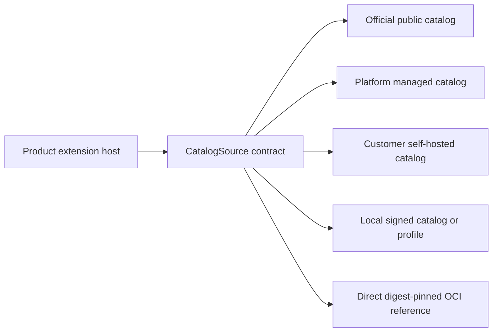

# OD-001: Federated Extension Catalog Topology

## Decision Required

Which independently deployable component owns official catalog data and
governance, and how do managed, self-hosted, offline, and direct OCI installation
coexist without making Platform mandatory?

## Recommended Direction Under Review

Use a federated `CatalogSource` contract. A product host may resolve extensions
from several independently configured sources:

Candidate repository topology:

- `extension-foundation` owns catalog schemas, verification primitives, and the
  source contract;
- a future separate `extension-catalog` repository owns the official public
  catalog data, moderation workflow, and catalog service if one is required;
- Platform may operate a managed catalog adapter, organization-private overlays,
  publisher identity, entitlements, and rollout policy;
- self-hosted products can use a local or self-hosted catalog and can always
  install an explicitly trusted digest-pinned OCI artifact without Platform.

An official catalog entry references an immutable OCI artifact. It does not copy
artifact blobs, grant product authority, or become the installation source of
truth.

## Why Not Put the Catalog in Platform

Platform has a different lifecycle and owns managed tenancy, identity,
entitlements, and deployment policy. Making it the only catalog owner would make
self-hosted and air-gapped installation depend on a SaaS control plane. Platform
may provide one catalog source without owning the portable catalog protocol.

## Required Proof Before Resolution

- direct OCI installation works without any catalog or Platform;
- one host can combine official and private sources deterministically;
- duplicate identity, conflicting metadata, revoked publishers, stale indexes,
  unavailable catalogs, and compromised signing keys fail safely;
- a catalog cannot grant permissions, entitlement, or execution authority;
- private metadata and credentials do not leak into public catalog queries;
- signed snapshots support offline and air-gapped operation.

## Resolution

Open. Do not create the `extension-catalog` repository or service until catalog
governance, federation, signatures, conflict semantics, and lifecycle are
accepted.
