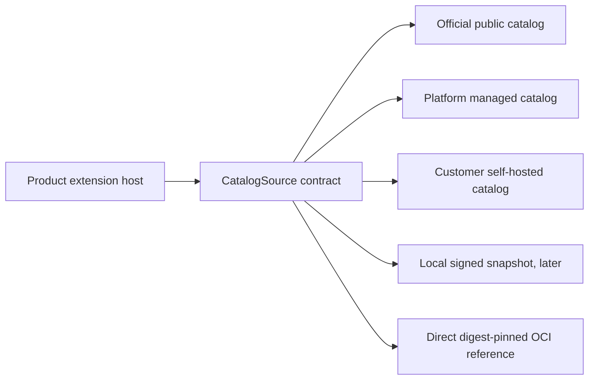

# OD-001: Federated Extension Catalog Topology

## Decision Required

Which independently deployable component owns official catalog data and
governance, and how do managed, self-hosted, offline, and direct OCI installation
coexist without making Platform mandatory?

## Accepted Direction

Use a federated `CatalogSource` contract with one deterministic authoritative
source per extension route:

Candidate repository topology:

- `extension-foundation` owns catalog schemas, verification primitives, and the
  source contract;
- a future separate `extension-catalog` repository owns catalog governance,
  PostgreSQL state, migrations, moderation workflow, and snapshot publication;
- Platform may operate a managed catalog source, organization-private overlays,
  identity-provider integration, entitlements, and rollout policy, while the
  selected catalog source remains authoritative for catalog identities;
- self-hosted products operate their own catalog service and PostgreSQL database;
- direct, explicitly trusted digest-pinned OCI installation remains possible
  without Platform or a catalog.

An official catalog entry references an immutable OCI artifact. It does not copy
artifact blobs, grant product authority, or become the installation source of
truth.

## Why Not Put the Catalog in Platform

Platform has a different lifecycle and owns managed tenancy, identity,
entitlements, and deployment policy. Making it the only catalog owner would make
self-hosted and air-gapped installation depend on a SaaS control plane. Platform
may provide one catalog source without owning the portable catalog protocol.

## Resolution

Resolved by ADR-0003, ADR-0004, and ADR-0005 on 2026-08-17.

PostgreSQL is canonical per writable source; signed snapshots, search indexes,
and OCI artifacts have separate ownership. Federation uses explicit authority
routing and fails closed rather than merging or falling back. Trust and
moderation planes remain independent. Concrete signing, retention, and offline
operating parameters remain open in OD-002.
