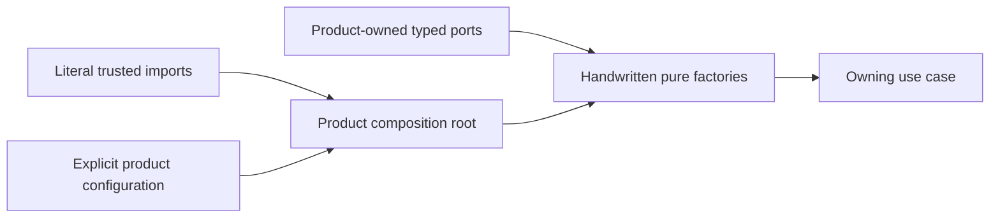

# Executive Verdict

## Layered Decision

| Level | Verdict | Meaning |
| --- | --- | --- |
| `L0` Product-owned Pure DI | `SOURCE_CUSTODY_BASELINE_RECORDED` | The canonical lock records exact Git origin, commit, tree, and selected regular-file blobs for three candidate product sources. It proves no product topology or behavior and grants no promotion authority. |
| `L1` Static authoring | `NO_GO_MEASUREMENT_CANDIDATE` | Pinned Agent Runtime and Frontend sources are nominated only as inputs to a future owning-product measurement; no portable evidence proves an authoring problem. |
| `L2` Private selection graph | `NO_GO` | No portable owning-product evidence admits runtime selection beyond static composition. |
| `L3` Lifecycle coordinator | `NO_GO` | No portable owning-product evidence admits dependency-aware readiness, drain, or rollback. |
| `L4` Process or WASM host | `NO_GO` | No portable owning-product evidence admits placement or isolation. |
| `L5` Shared Foundation API | `NO_GO` | No portable evidence proves two independent implementations of the same semantics with executable conformance. |
| Public SPI or runtime package | `NO_GO` | Existing decisions deliberately withhold these surfaces. |

This dossier is qualification evidence, not an accepted product decision. It
does not authorize production changes in Agent Runtime, Orchestrator, or
Frontend.

## Current Baseline

The canonical source lock selects files from Agent Runtime, Frontend, and
Orchestrator as candidate product evidence. The verifier does not read or
interpret their contents. Any semantic or topology interpretation belongs to
the owning product and is non-authoritative reference material here.

The exact local Git origin, commit, tree, and declared regular-file blobs are
checked by `pnpm qualification:product-sources:check --` followed by explicit
`--repository product=/absolute/path` mappings for every product. The command verifies a local mirror
and its configured origin string; it does not authenticate remote publication
or prove independent ownership or product approval. The records therefore
remain `candidate-source-records`: they record a source-custody baseline but
cannot authorize a product grammar, shared extraction, or publication decision.

## Why The Levels Stay Separate

A declaration/profile layer solves authoring and drift. A selection graph
solves runtime binding. A lifecycle coordinator solves resource transitions.
A process host solves placement and isolation. Combining them would introduce
authority and failure modes before a product proves the corresponding need.

Cordis remains a private resource-scope candidate only. It cannot own graph
closure, readiness, generations, routing, recovery, or public contracts.

## Governance Boundary

ADR-0015 supersedes ADR-0013 only for extraction timing: an independent
product-neutral Get Modular `0.x` is now authorized. ADR-0013's product-first,
Pure DI, private-runtime trigger, public-SPI, and stop safeguards continue
through ADR-0015, while ADR-0014 remains the product-local authoring authority.
Product-local adoption still requires the owning-product decisions and measured
triggers that those accepted decisions specify. Get Modular adoption adapters
do not count as independent implementations of a public plugin SPI.

The package-policy consumer-identity defect remains externally owned: two IDs
from one repository can still satisfy its present independence calculation.
This dossier treats that gate as unsatisfied regardless of checker output and
does not modify the concurrently owned implementation.

## Reversal Conditions

- Reopen `L1` only after an owning product approves a benchmark and measured
  root drift, duplicate wiring, navigation cost, or zero-evaluation discovery
  cost shows that direct factories do not meet the product outcome.
- Reopen `L2` when one product must select providers without rebuild.
- Reopen `L3` when independently managed resources require bounded lifecycle
  coordination.
- Reopen `L4` when a named consumer requires process/WASM placement or
  containment.
- Reopen `L5` only after two independent products implement the same candidate
  and pass executable cross-consumer conformance.
