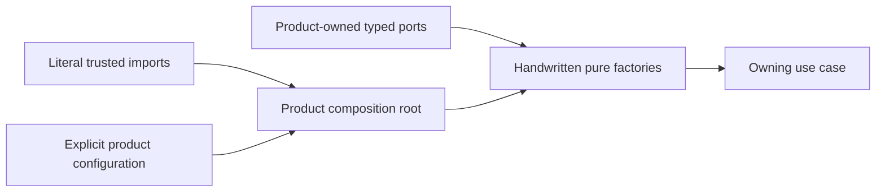

# Executive Verdict

## Layered Decision

| Level | Verdict | Meaning |
| --- | --- | --- |
| `L0` Product-owned Pure DI | `GO_PRODUCT_SOURCE_TOPOLOGY` | At Agent Runtime `7be9982`, exact Git custody and narrow named-call topology show declared capability/member names, literal feature-factory imports and direct calls before one direct host-factory return, and named host dependency properties. No reference-value relationship or runtime behavior is proved. Frontend remains candidate-only evidence. |
| `L1` Static authoring | `NO_GO_MEASUREMENT_CANDIDATE` | Agent Runtime has a repeated setup-inspection workflow and Frontend has a same-seam case worth measuring, but neither has the required product decision, benchmark, or proved authoring problem. |
| `L2` Private selection graph | `NO_GO` | No inspected product must change a provider set without rebuild or static configuration. |
| `L3` Lifecycle coordinator | `NO_GO` | No inspected candidate owns multiple independently managed resources requiring dependency-aware readiness, drain, or rollback. |
| `L4` Process or WASM host | `NO_GO` | No admitted module candidate has a proved placement or isolation requirement. |
| `L5` Shared Foundation API | `NO_GO` | Two products have not independently implemented the same semantics or executable conformance. |
| Public SPI or runtime package | `NO_GO` | Existing decisions deliberately withhold these surfaces. |

This dossier is qualification evidence, not an accepted product decision. It
does not authorize production changes in Agent Runtime, Orchestrator, or
Frontend.

## Current Baseline

Agent Runtime supplies exact production source for Codex Setup and Claude Code
Setup. The verifier establishes only named declarations, imports, direct lexical
feature-factory calls before one direct host-factory return, and named host
dependency properties. It does not establish that a reference carries a value,
execute the host, or prove runtime behavior. Frontend Recent Projects supplies a
literal named-topology record of two fixed source constructions, one consumer
construction using that list, and one facade publication. Orchestrator Host
Discovery has a typed port and tests but no committed production adapter at the
inspected revision.

The exact local Git objects, exported symbols, negative searches, narrow
Frontend literal-provider topology, and narrow Agent Runtime named-call
topology are checked by
`pnpm qualification:product-sources:check`. The command verifies a local mirror
and its configured origin string; it does not authenticate remote publication
or prove independent ownership or product approval. The records therefore
remain `candidate-source-records`: they can demonstrate the inspected Agent
Runtime `L0` named-call topology, but cannot authorize a new product grammar,
shared extraction, or publication decision.

## Why The Levels Stay Separate

A declaration/profile layer solves authoring and drift. A selection graph
solves runtime binding. A lifecycle coordinator solves resource transitions.
A process host solves placement and isolation. Combining them would introduce
authority and failure modes before a product proves the corresponding need.

Cordis remains a private resource-scope candidate only. It cannot own graph
closure, readiness, generations, routing, recovery, or public contracts.

## Governance Boundary

ADR-0013 assigns private module semantics to the first product, and ADR-0014 is
the accepted product-local authoring authority under that assignment. They do
not conflict, and qualification evidence adds no successor gate. Product-local
adoption still requires the owning-product decisions and measured triggers that
the accepted ADRs specify.

The package-policy consumer-identity defect remains externally owned: two IDs
from one repository can still satisfy its present independence calculation.
This dossier treats that gate as unsatisfied regardless of checker output and
does not modify the concurrently owned implementation.

## Reversal Conditions

- Reopen `L1` only after an owning product approves a benchmark and measured
  root drift, duplicate wiring, navigation cost, or zero-evaluation discovery
  cost shows that direct factories do not meet the product outcome.
- Reopen `L2` when one product must select providers without rebuild.
- Reopen `L3` when independently managed resources require bounded lifecycle
  coordination.
- Reopen `L4` when a named consumer requires process/WASM placement or
  containment.
- Reopen `L5` only after two independent products implement the same candidate
  and pass executable cross-consumer conformance.
