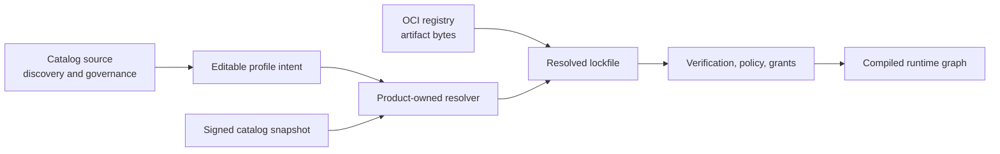
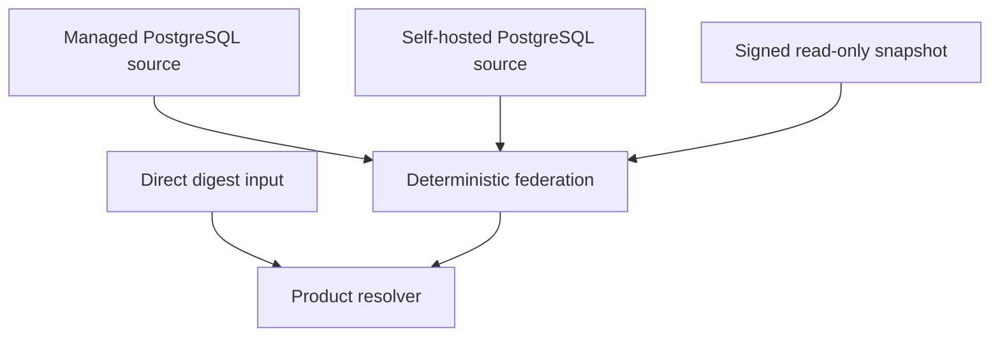
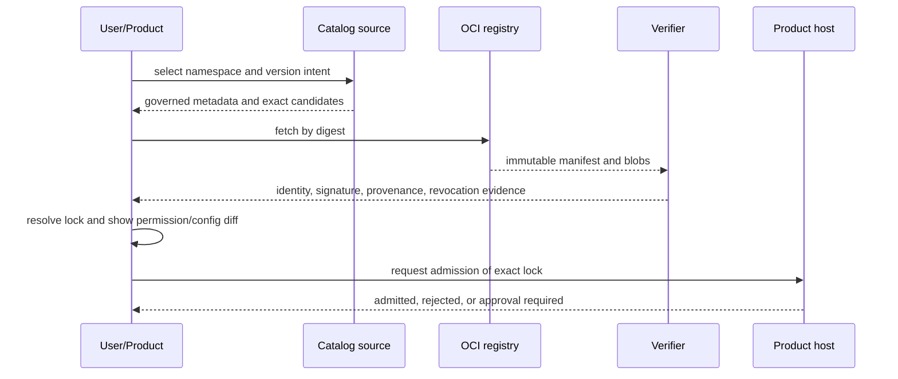

# Catalog And Profiles

## Separate Planes



- Catalog answers what is discoverable and governed.
- OCI registry stores immutable artifacts.
- Profile expresses desired composition and configuration.
- Lockfile records exact resolved evidence.
- Grant set records environment-specific authority and remains outside the lock.
- Offline bundle transports authenticated lock closure without becoming authority.
- Product admission decides whether the resolved inputs may run.
- Module graph resolves runtime capabilities for one authority scope.

Catalog discovery is never runtime service resolution. Presence in a catalog,
signature validity, entitlement, product authorization, and capability grants
are independent checks.

## Profile Intent

An `orchestration-profile.yaml`-style file is product-owned. Foundation may
standardize reusable envelope fields, but product-specific capability names and
configuration remain in product schemas.

Conceptual contents:

```yaml
schema: agent-teams.profile/v1
profileId: example
targets:
  - product: orchestrator
    modules:
      - source: ghcr.io/example/work-placement
        versionIntent: 2.x
        configurationRef: config.work-placement
        permissionRequestsRef: permissions.work-placement
secrets:
  providerCredential: SecretRef
```

Profiles contain no raw secret, bearer token, private key, mutable resolved URL,
or implicit `latest`. Permission declarations are requests and are displayed as
a diff before product grants are issued.

## Lock Evidence

The generated lockfile is immutable input to admission and records:

- profile schema and resolver versions;
- resolver-policy and canonicalization digests;
- exact catalog source identity and revision or snapshot digest;
- source-bound namespace, package name and version identity;
- artifact repository, manifest digest, platform variants, and content digests;
- publisher identity and verified provenance references;
- selected contribution identities and compatibility decisions;
- explicit target tuple and complete target-specific graph;
- bound optional edges or enumerated semantic omission records;
- configuration schema version and non-secret fingerprint;
- requested capability set;
- product and host compatibility ranges;
- graph input digest;
- resolution timestamp and freshness evidence;
- signature over the lock when required by policy.

The lockfile never contains grants, raw secrets, product authorization, or
runtime service instances. Re-resolution is explicit and creates a reviewable
diff. Normal verification performs no dependency solving and no catalog or
registry lookup; it verifies the exact authenticated closure already recorded.

MVP resolution uses exact source mappings, explicit or unique capability
bindings and deterministic closed-world constraints. A general SAT/PubGrub
solver remains deferred until real product profiles demonstrate version or
capability constraints that the small resolver cannot express safely.

## Catalog Sources

The accepted direction is PostgreSQL-canonical state for writable catalog
sources and signed immutable snapshots for distribution, cache, backup, and
offline use.



Each source has namespace authority, monotonic revision/sequence, trust policy,
moderation state, and freshness. Federation conflict resolution is explicit;
source list order and last response do not decide identity.

GHCR is the first hosted OCI target. Harbor is the first self-hosted conformance
target. ORAS is a transport primitive. Cosign/Sigstore supplies signature and
provenance verification. These are replaceable adapters behind OCI and
verification ports.

## Self-Hosted And Offline

Self-hosted operation supports:

- a self-hosted PostgreSQL catalog source;
- Harbor or another conforming OCI registry;
- direct digest-pinned installation without any catalog;
- signed catalog snapshots imported read-only;
- local derived search index;
- no mandatory Platform or GitHub account.

An offline bundle is an export, not another writable authority. It contains the
signed snapshot, required digest-pinned artifact manifests/blobs, verification
material allowed by policy, schema/version metadata, and an index. Import checks
freshness and rollback policy before use. Import is quarantined and bounded by
entry count, expanded bytes and nesting; traversal, links, duplicate paths,
digest mismatch and decompression bombs fail before promotion. Trust roots are
provisioned separately from the bundle.

PostgreSQL full-text search is the first hosted derived search adapter. SQLite
FTS5 is a candidate local/offline derived adapter. Search results never become
canonical catalog records.

## Install And Update



Update prepares a new lock and candidate generation. It never mutates the
installed identity in place. Rollback is a new higher generation using a
previously approved digest, subject to current revocation and rollback policy.

Uninstall removes activation and installation references after bounded drain.
It does not automatically delete product or user data. Revocation can stop new
activation while preserving evidence and controlled recovery.

## Remaining Decisions

OD-001 still owns namespace delegation, federation priority, moderation
lifecycle, source health, and operator contracts. OD-002 still owns signing key
custody, quorum, transparency/freshness rules, offline validity windows,
revocation retention, and rollback thresholds.

No new catalog service or repository schema should be implemented until those
decisions have a proposed contract and conformance fixtures.
