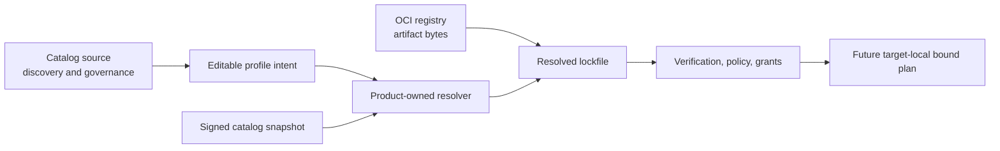
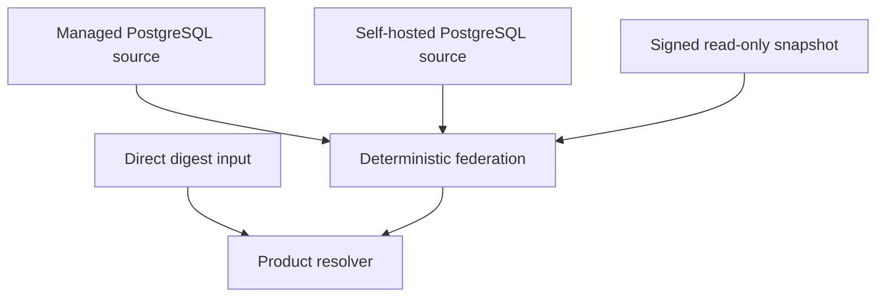
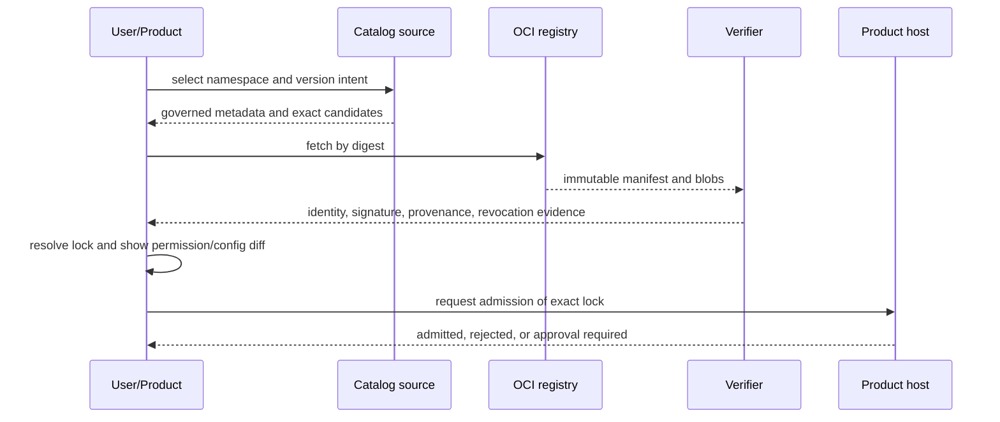

# Catalog And Profiles

## Separate Planes



- Catalog answers what is discoverable and governed.
- OCI registry stores immutable artifacts.
- Profile expresses desired composition and configuration.
- Lockfile records exact resolved evidence.
- Grant set records environment-specific authority and remains outside the lock.
- Offline bundle transports authenticated lock closure without becoming authority.
- Product admission decides whether the resolved inputs may run.
- If triggered, a product-private module graph resolves runtime capabilities
  for one authority scope and one execution target. No such production compiler
  exists in Foundation today.

Catalog discovery is never runtime service resolution. Presence in a catalog,
signature validity, entitlement, product authorization, and capability grants
are independent checks.

## Profile Intent

An `orchestration-profile.yaml`-style file is product-owned. Foundation may
standardize reusable envelope fields, but product-specific capability names and
configuration remain in product schemas.

Conceptual contents:

```yaml
schema: agent-teams.profile/v1
profileId: example
targets:
  - product: orchestrator
    modules:
      - source: ghcr.io/example/work-placement
        versionIntent: 2.x
        configurationRef: config.work-placement
        permissionRequestsRef: permissions.work-placement
secrets:
  providerCredential: SecretRef
```

Profiles contain no raw secret, bearer token, private key, mutable resolved URL,
or implicit `latest`. Permission declarations are requests and are displayed as
a diff before product grants are issued.

## Lock Evidence

The generated lockfile is immutable input to admission and records:

- profile schema and resolver versions;
- resolver-policy and canonicalization digests;
- exact catalog source identity and revision or snapshot digest;
- source-bound namespace, package name and version identity;
- artifact repository, manifest digest, platform variants, and content digests;
- publisher identity plus immutable signature, attestation, transparency,
  provenance-subject, builder/source and dependency evidence required to
  re-evaluate the original decision without disappearing registry references;
- selected contribution identities and compatibility decisions;
- exact binding coordinates in the form
  `(consumerModuleId, localSlotId) -> providerContributionId | null | ordered
  providerContributionIds`, preserving required, optional, and many semantics;
- explicit target tuple and complete target-specific graph;
- bound optional edges or enumerated semantic omission records;
- configuration schema version and non-secret fingerprint;
- requested capability set;
- product and host compatibility ranges;
- graph input and `PlanTemplateDigest` where a triggered private graph exists;
  post-admission `PlanContentDigest` belongs only to `AdmittedPlanReceipt`;
- resolution timestamp and freshness evidence;
- signature over the lock when required by policy.

The lockfile never contains grants, raw secrets, product authorization,
graph generations, active-head revisions, or runtime service
instances. Re-resolution is explicit and creates a reviewable diff. Normal
verification performs no dependency solving and no catalog or registry lookup;
it verifies the exact authenticated closure already recorded.

For an absent optional provider, the binding value is literal `null`; omission
is malformed. Ordered-many order and minimum/maximum are graph cardinality and
semantic order, never runtime concurrency controls.

## Future Artifact Contribution Index

A future admission pipeline may derive an immutable
`ArtifactContributionIndex` for each verified artifact. This is a target model,
not an implemented Foundation contract, catalog table, or discovery service.
Each canonical entry binds:

- artifact digest and stable contribution ID;
- digest of the inert contribution descriptor;
- exact execution target and trust/isolation tier;
- entrypoint plus complete digest-pinned blob closure;
- configuration, message, state, and capability schema references and digests;
- declared host/product compatibility;
- requested capabilities, which remain requests rather than grants; and
- an isolated-host loader key, never an interpolated built-in import.

The index is derived only from admitted inert descriptors, OCI evidence, and
verification receipts. Discovery can read these inert bytes without importing
or evaluating the contribution's executable code. It does not select providers,
grant authority, establish compatibility by itself, or make an artifact active.

MVP resolution uses exact source mappings, explicit capability bindings and
deterministic closed-world constraints. `UMEQ-011` is accepted by ADR-0014:
every provider binding is materialized explicitly, and an apparently unique
installed provider never auto-binds. A general SAT/PubGrub
solver remains deferred until real product profiles demonstrate version or
capability constraints that the small resolver cannot express safely.

## Catalog Sources

The accepted direction is PostgreSQL-canonical state for writable catalog
sources and signed immutable snapshots for distribution, cache, backup, and
offline use.



Each source has namespace authority, monotonic revision/sequence, trust policy,
moderation state, and freshness. Federation conflict resolution is explicit;
source list order and last response do not decide identity.

GHCR is the first hosted OCI target. Harbor is the first self-hosted conformance
target. ORAS is a transport primitive. Cosign/Sigstore supplies signature and
provenance verification. These are replaceable adapters behind OCI and
verification ports.

## Self-Hosted And Offline

Self-hosted operation supports:

- a self-hosted PostgreSQL catalog source;
- Harbor or another conforming OCI registry;
- direct digest-pinned installation without any catalog;
- signed catalog snapshots imported read-only;
- local derived search index;
- no mandatory Platform or GitHub account.

An offline bundle is an export, not another writable authority. It contains the
signed snapshot, required digest-pinned artifact manifests/blobs, verification
material allowed by policy, schema/version metadata, and an index. Import checks
freshness and rollback policy before use. Import is quarantined and bounded by
entry count, expanded bytes and nesting; traversal, links, duplicate paths,
digest mismatch and decompression bombs fail before promotion. Trust roots are
provisioned separately from the bundle.

A signed snapshot is not fresh merely because its signature verifies. The
consumer compares expiry and monotonic sequence against a separately trusted
local high-water mark or TUF-equivalent metadata. Direct-digest installation
also requires an explicit local trust policy for signer authorization,
provenance, dependencies and revocation; digest equality alone proves identity,
not permission or safety.

The manual exact-digest profile uses the complete immutable OCI manifest
descriptor and selected executable child digests as its only revocation subject.
Its authoritative input is the product-configured authenticated local monotonic
revocation set defined in [Trust and Security](trust-and-security.md#manual-exact-digest-revocation-profile).
Every import receipt records the checked revision. Unknown or stale revision
state fails closed at admission and execution; propagation advances product
fences and blocks matching digests at affected hosts and sinks. Tags, versions,
names, URLs and catalog entries are never revocation identity. This profile
makes no remote freshness or publisher-currentness claim, and remote mutable
metadata still requires the separately qualified TUF profile.

PostgreSQL full-text search is the first hosted derived search adapter. SQLite
FTS5 is a candidate local/offline derived adapter. Search results never become
canonical catalog records.

## Install And Update



Update prepares a new lock and inert plan candidate. Only successful product
admission issues `AdmittedPlanReceipt` and `PlanContentDigest`; the digest is
never a lock input or caller-selected identity. A future triggered runtime graph
then allocates a fresh monotonic `CandidateGeneration` bound to that receipt and
its explicit provider-binding digest. Any concrete runtime is named separately
by `RuntimeGeneration` and requires an ADR-0010 staged reference pin before an
existing runtime can be reused. It never mutates installed identity in place.
Equivalent content can receive the same post-admission digest, but every new
candidate and rollback uses a higher generation and `ActiveHeadRevision`,
subject to current revocation and rollback policy.

Catalog and lock evidence describe one target at a time. Relationships among
services, processes, Workers, and isolated hosts belong to a separate
product-owned deployment plan; catalog federation does not synthesize a global
runtime graph.

Uninstall removes activation and installation references after bounded drain.
It does not automatically delete product or user data. Revocation can stop new
activation while preserving evidence and controlled recovery.

## Remaining Decisions

OD-001 is resolved. ADR-0003 owns canonical catalog state and snapshots,
ADR-0004 owns namespace authority and federation priority, and ADR-0005 owns
trust and moderation boundaries. OD-002 still owns signing key custody, quorum,
transparency/freshness rules, offline validity windows, revocation retention,
and rollback thresholds. Concrete source-health and operator contracts remain
implementation work under those accepted boundaries rather than a reopened
OD-001 decision.

No new catalog service or repository schema should be implemented until those
decisions have a proposed contract and conformance fixtures.
