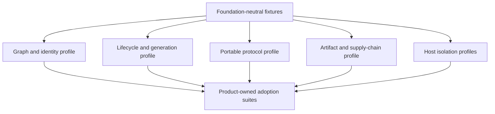

# Conformance Plan

## Layered Suites

Foundation owns neutral schemas, fixture generators, diagnostic meanings and
minimum traces. Products own authorization, data invariants, persistence,
placement and stronger security claims. Passing Foundation conformance never
grants a plugin permission to execute.

## Core Profiles

| Profile | Mandatory proof |
| --- | --- |
| `GRAPH-1` | Closed-world closure; duplicate, missing, cycle and ambiguous provider rejection; deterministic plan/digest; exact dependency object; zero effects before admission |
| `LIFECYCLE-1` | Single activation per fingerprint; explicit readiness; one publication; reverse rollback; idempotent stop; absolute deadlines; cleanup debt |
| `GENERATION-1` | Immutable generation identity; monotonic fence; stale request/write rejection; bounded drain; rollback as a forward generation |
| `PROTOCOL-1` | Version negotiation; bounded frames; identity/deadline validation; duplicate/reordered messages; cancellation; malformed peer failure |
| `PACKAGE-1` | Exact exports; no framework leakage; packed consumer E2E; browser/Node condition checks; API report and compatibility fixtures |
| `SUPPLY-1` | Digest-pinned artifact; namespace-authorized signature; provenance; dependency closure; install receipt; revocation and rollback evidence |
| `HOST-T0` | Trusted in-process declaration; deterministic cleanup; no claim of hostile isolation |
| `HOST-T1` | Worker/process fault containment; crash and tree-cleanup evidence; explicit same-user authority warning |
| `HOST-T2` | Deny-by-default browser/Wasm capabilities, quotas, broker enforcement and negative escape fixtures |
| `HOST-T3` | OS-enforced identity, filesystem, network, IPC, process-tree and resource isolation per platform |

`HOST-T4` for VM or remote disposable execution is post-MVP.

## Adapter Matrix

Every adapter must run the neutral suite plus its own negative cases:

- native TypeScript graph compiler versus an independent Graphlib oracle;
- optional Cordis adapter versus the native lifecycle trace oracle;
- Node process and Worker protocol adapters;
- future browser Worker and sandboxed iframe adapters;
- future Extism/WASI adapter inside an independently qualified host;
- OCI/GHCR and Harbor artifact-source adapters;
- PostgreSQL canonical catalog and signed offline snapshot adapters;
- product-specific persistence, broker and authority-fence adapters.

An adapter cannot advertise a guarantee stronger than its deployment binding.
For example, an in-memory compare-and-set proves only one-process publication;
a distributed claim requires a linearizable store and sink-enforced fences.

## Required Negative Families

1. Graph ambiguity, duplicate IDs, missing providers, hard/soft cycles, descriptor bombs and canonicalization collisions.
2. Concurrent start/stop/update, late readiness, stale candidate, deadline expiry, hung cleanup and double publication.
3. Crash before/after intent, readiness, route commit, outbox publish, effect acknowledgement and drain completion.
4. Stale generation, stale replica incarnation, lost acknowledgement, duplicate operation and ambiguous remote effect.
5. Malformed, oversized, deeply nested, reordered, replayed and unauthenticated protocol frames.
6. Tag movement, digest corruption, wrong publisher, stale metadata, revoked signer, dependency confusion and incomplete mirror/snapshot.
7. Filesystem escape, egress bypass, secret recovery, inherited handles, process-tree escape, IPC confusion and resource exhaustion.
8. Package framework leakage, broken conditional exports, bundler side effects, missing declarations and N/N-1 incompatibility.

## Product Adoption Gate

Before an Orchestrator, AR or Frontend contribution point is published, its
owning feature provides:

- two independent implementations, or one real implementation plus a bounded
  reference adapter and explicit approval;
- a product authority statement and prohibited mutations;
- host placement and trust tier;
- capability request mapped to a separate grant decision;
- failure, timeout, cancellation, retention, deletion and recovery semantics;
- contract fixtures consumable from a packed artifact;
- one adversarial fixture proving the extension cannot bypass the owning use case.

## CI Shape

Fast PR checks run deterministic graph, package boundary and focused lifecycle
fixtures. Affected host/profile suites run from the machine-readable manifest.
Cross-platform isolation, crash, OCI/Harbor and N/N-1 matrices run as scheduled
or release gates. Evidence is keyed by exact commit, dependency lock digest,
platform and conformance version so unchanged heavy evidence can be reused.

No suite is accepted solely because the implementation generated its own
expected output. Every authority, lifecycle and security claim needs an
independent oracle or externally observable negative fixture.
