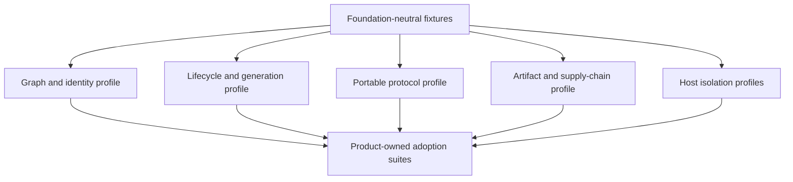

# Conformance Plan

## Layered Suites

Accepted ADR-0013 gives the first product ownership of its private schemas,
fixtures, diagnostics, and minimum traces. Two independently authored consumers
must prove the same module semantics through executable cross-consumer
conformance before those semantics can be extracted to Foundation. A separate
accepted extraction decision must name the exact neutral subset. Package
admission may still use any evidence basis preserved by ADR-0013, but package
boundary evidence never substitutes for semantic-intersection evidence.
Public package publication is a third, separate stage: it requires immutable
packed-artifact, API, compatibility, and promotion evidence. Foundation-owned
module semantics additionally require proof from two real independently
authored conforming consumers of the exact publication candidate. Ordinary
libraries retain the independent release/replacement, deployment/isolation, or
other package basis accepted by ADR-0013. Neither semantic-extraction evidence
nor a package admission record substitutes for the publication evidence that is
applicable to the selected basis.
Products always own authorization, data invariants, persistence, placement and
stronger security claims. Passing conformance never grants a plugin permission
to execute.

## Core Profiles

These rows are promotion requirements. A row is not implemented merely because
the dossier has status `qualified`.

| Profile | Mandatory proof |
| --- | --- |
| `GRAPH-1` | Closed-world closure; duplicate, missing, cycle and ambiguous provider rejection; deterministic plan/digest; exact dependency object; zero effects before admission |
| `LIFECYCLE-1` | Post-admission plan receipt mapped immutably to graph generation and explicit providers; single activation per operation identity and exact activation fingerprint; selected-provider startup/readiness failure aborts the candidate; product-owned first-graph validation; one publication commit point; disable CAS before seal; old-state-preserving migration; dynamically derived fences; three distinct non-renewable admission/validation, provider-execution and activation/handoff deadlines with their clock/receipt proofs; cleanup and ambiguous-effect debt; no automatic retry after an unknown external result |
| `GENERATION-1` | Immutable generation identity; monotonic fence; desired-state CAS over both expected desired and active heads; deterministic conflict diagnostics; bounded queue/supersede/reject policy; stale request/write rejection; bounded drain; rollback as a forward generation; durable host-incarnation `restart_required` high-water mark and fresh-host debt closure |
| `ORDERING-1` | Typed lifecycle/order edges; separately derived and digested activation, drain, discriminated retirement and state-migration plans; projection-specific positive/negative ordering fixtures; no universal-DAG assumption |
| `RUNTIME-PIN-1` | ADR-0010 staged pin acquisition serialized with retirement; atomic publication promotion; abandonment release after terminal/reconciled effects; crash reconstruction; late-pin rejection; live-route/pin/lease retirement recheck; no T0 runtime reuse before this profile passes |
| `STATE-MIGRATION-1` | Persistent-state attach/rebind/migrate is blocked before publication unless the exact migration plan and independent custody authorization pass; compatibility alone fails; per-step fenced receipts, crash recovery and ambiguous-step reconciliation |
| `PROTOCOL-1` | Version negotiation; bounded frames; identity/deadline validation; duplicate/reordered messages; cancellation; malformed peer failure |
| `PACKAGE-1` | Exact exports; no framework leakage; packed consumer E2E; browser/Node condition checks; API report and compatibility fixtures |
| `SUPPLY-1` | Digest-pinned artifact; namespace-authorized signature; provenance; dependency closure; install receipt; manual exact-OCI-digest revocation identity with monotonic authoritative input and fail-closed propagation; rollback evidence |
| `HOST-T0` | Trusted in-process declaration; deterministic cleanup; no claim of hostile isolation |
| `HOST-T1` | Worker/process fault containment; crash and tree-cleanup evidence; explicit same-user authority warning |
| `HOST-T2` | Deny-by-default dedicated-document or Wasm capabilities, quotas, broker enforcement and negative escape fixtures; an ordinary Worker remains `T1` |
| `HOST-T3` | OS-enforced identity, filesystem, network, IPC, process-tree and resource isolation per platform |

`HOST-T4` for VM or remote disposable execution is post-MVP.

## Current Evidence Status

These results describe synthetic, in-memory or smoke evidence only. A passing
row does not satisfy the production profiles above unless the row explicitly
names durable, independently observable evidence for the whole profile; none of
the current rows does.

| Evidence | Status | Meaning |
| --- | --- | --- |
| ID-DAG scheduling primitive | implemented/passed locally | Narrow graph algorithm only, not `GRAPH-1` |
| In-memory lifecycle/CAS model | implemented/passed locally | One expected-active CAS and one activation deadline only; no dual-head desired update, bounded update arbitration, three-deadline durable intent, durable coordinator or sink fence |
| Portable strict JSON codec | implemented/passed locally | Canonical JSON subset, safe-integer numeric domain, fatal UTF-8, duplicate-key and request-direction rejection, authority tuple and deadline checks; no method schemas, receiver deadline horizon, N/N-1 negotiation, authenticated channel or operation journal |
| Process, Node Worker, browser Worker | smoke/passed locally | Placement transport and authority-envelope checks, not isolation conformance |
| Packed toy consumer | harness/passed locally | Validates the harness shape, not `PACKAGE-1` |
| Recovery checkpoint/reducer examples | implemented/passed locally | Fresh in-memory coordinators restore immutable serialized checkpoints; no process-crash, persistent store, durable host-incarnation debt, staged runtime pins or migration recovery |
| Supply chain and `HOST-T2/T3` negatives | planned | Required before their corresponding claims |

## Qualification Gap Matrix

This matrix records named disposable fixtures under `tests/qualification`.
Test counts, timings and exact commits are intentionally not embedded here:
only an exact-head evidence manifest produced by the qualification run can bind
those facts to a tree, lock digest, platform and profile. The rows are not a
production package, public SPI, ownership decision or production qualification.

| Required evidence | Executable evidence | Result and remaining limit |
| --- | --- | --- |
| Deterministic graph identity across input permutations | `permutations produce the same graph plan and digest` | Passed; digest is private qualification vocabulary |
| Required, optional and ordered-many cardinality | `qualification bindings preserve required, optional, and ordered-many semantics` | A resolved empty provider list is the disposable compiler's explicit unbound outcome; no executable fixture yet proves that failure of a selected optional provider aborts a lifecycle candidate, and no product grammar is admitted |
| Missing, duplicate, ambiguous and incompatible providers | `invalid ID-DAG inputs produce deterministic diagnostics without loading hooks`; binding cardinality, duplicate-demand, provider-ambiguity, collision-free coordinate and cycle cases | Passed before executable hooks; duplicate offers fail even without a consumer, and structured coordinate keys avoid delimiter collisions |
| Cycles, self-cycles and independent oracle | `native compiler agrees with Graphlib on generated directed-graph validity`; `graph compiler remains stack-safe within 1k and 10k hard caps` | Passed; Graphlib remains test-only |
| Deeply immutable serializable plan and stable diagnostics | `compiled ID-DAG plan is deeply immutable and serializable`; duplicate/missing ID-DAG diagnostics | Passed; an identifier grammar intentionally remains not admitted |
| 1,000 and 10,000-node stack and performance budgets | `graph compiler remains stack-safe within 1k and 10k hard caps` | Passed with five timing samples per size and an observed heap-delta measurement; max-of-five values are diagnostic until reference CI baselines exist, while 500-ms/5-second and 256-MiB hard caps fail immediately |
| Invalid graph performs zero implementation effects | `invalid ID-DAG inputs produce deterministic diagnostics without loading hooks`; lifecycle hook preflight cases | Passed |
| Honest two-module T0 source and consumer | `two fixed T0 built-ins publish a detached result and release the source resource` | Gap closed; source owns a bounded fake resource and consumer publishes a detached immutable result |
| Prepare, start, readiness, publication and shutdown ordering | two-built-in rehearsal; readiness/publication cases; shutdown drain/order and reentrant single-flight cases | Passed only for the synthetic activation/stop projection; it does not prove selected-optional-provider failure semantics or separate drain, retirement and migration plans |
| Single-flight, activation fingerprint and caller cancellation | concurrent-start, idempotency-conflict and waiter-cancellation cases | Passed |
| Sibling settlement, reverse cleanup and bounded cleanup debt | parallel-failure, multi-level rollback and hung-cleanup cases | Passed |
| Generation, authority-scope and stale-write fencing | authority-scope, invocation-handle, drain and stale-write cases | Passed only for the in-memory model; dual-head desired admission, bounded update arbitration and durable restart debt are unimplemented |
| Candidate remains unpublished until ready; old route survives failed candidate | readiness and failed-candidate cases | Passed |
| Recovery across every represented durable phase | `crash recovery decisions are deterministic at durable boundaries` | Prepared, started, ready, published, draining and retired checkpoints are serialized and restored into fresh in-memory coordinators before reconciliation |
| Corrupt, stale, conflicting and unknown recovery evidence | recovery boundary cases with malformed shapes, stale tuples, uncertain outcomes and conflicting generations | Passed fail-closed as `CONTROLLED_RECOVERY` |
| Cleanup never retires a still-referenced generation | recovery cases combining in-flight, termination and cleanup evidence | Passed in the reducer's represented states only; ADR-0010 staged pins, live routing references, accepted leases and retirement-fence races are not implemented |

No production graph, lifecycle, or recovery implementation is justified by this
gap pass. Process-crash injection, a persistent store, a durable coordinator,
sink-enforced fencing, and a second independently authored implementation remain
production admission gaps. The two synthetic built-ins qualify only test
behavior and cannot be promoted into a product feature or Foundation package
without the unresolved ownership decision.

## Unproved Production Gates

The following gates are future requirements, not claims about the synthetic
spikes. Promotion requires durable evidence keyed by the exact tested commit;
documentation prose or an in-memory trace cannot close a row.

| Gate | Required production evidence |
| --- | --- |
| Selected binding and readiness | A compiled-plan fixture binds a provider to an optional slot, injects startup and readiness failures, and proves the whole candidate aborts with no fallback or null conversion; only a separately compiled null/unbound fixture admits absence |
| Three lifecycle deadlines | Durable intent persists distinct admission/validation, provider-execution and activation/handoff deadlines; admission-authority, host-monotonic and authority-clock CAS/sink receipts prove each boundary across queueing, retries, crashes and clock faults without renewal or substitution by caller/cleanup waits |
| Desired-state concurrency | Linearizable comparison of `expectedDesiredHead` and `expectedActiveHead`, fixed queue bounds, explicit durable supersede/reject decisions and byte-stable conflict diagnostics under generated races and crash replay |
| Restart debt | Persistent host-incarnation high-water marks block admission, publication, staged pins and runtime reuse; process exit alone fails; a fresh-incarnation closure receipt proves all old routes, work, pins, leases, effects and resources reconciled before reopening |
| Typed ordering | Independent oracles validate separately derived activation, drain, discriminated retirement and migration plans; fixtures demonstrate a case where their valid orders differ and reject use of an activation DAG as a substitute |
| Staged runtime pins | Every ADR-0010 acquire/promote/release/reconstruct/retirement-fence case passes against a persistent store, including race and crash injection; T0 reuse stays disabled until this gate closes |
| State migration | Update publication cannot attach persistent state without an exact current custody authorization and admitted migration plan; compatibility-only, stale/wrong tuple and every interrupted/ambiguous migration step fail closed |
| Replacement and recovery | Fault injection on both sides of intent, provider dispatch/readiness, publication, bounded drain, forced termination, cleanup/debt writes and retirement proves forward-only generation replacement and deterministic reconciliation |
| Ambiguous effects | Unknown external outcomes persist full attempt evidence and never retry automatically after timeout, cancellation, controller/host crash or replay; external query/reconciliation is independently observed |

No production lifecycle profile may be marked passed while any applicable row
is absent, simulated only in memory, or evidenced solely by the implementation's
own expected trace.

At a production-host governance gate, only durable independently observable
evidence from the named production host can mark the host requirement
`production-proven`. Non-production fixtures, in-memory models, smoke tests,
planned work, and aspirational documentation cannot satisfy it.

## Adapter Matrix

Every adapter must run the neutral suite plus its own negative cases:

- native TypeScript graph compiler versus an independent Graphlib cycle oracle,
  with each result checked separately for topological validity;
- optional Cordis adapter versus the native lifecycle trace oracle;
- Node process and Worker protocol adapters;
- future browser Worker and sandboxed iframe adapters;
- future Extism/WASI adapter inside an independently qualified host;
- OCI/GHCR and Harbor artifact-source adapters;
- PostgreSQL canonical catalog and signed offline snapshot adapters;
- product-specific persistence, broker and authority-fence adapters.

An adapter cannot advertise a guarantee stronger than its deployment binding.
For example, an in-memory compare-and-set proves only one-process publication;
a distributed claim requires a linearizable store and sink-enforced fences.

## Required Negative Families

1. Graph ambiguity, duplicate IDs, missing providers, hard/soft cycles, descriptor bombs and canonicalization collisions.
2. Concurrent start/stop/update, dual-head mismatch combinations, queue overflow, explicit supersede/reject, selected optional-provider startup/readiness failure, late readiness, stale candidate, incomplete hook binding, each lifecycle deadline's expiry, attempted deadline renewal, cancelled waiter cleanup, hung cleanup, post-publication cleanup failure and double publication.
3. Crash before/after intent, staged-pin acquire/promote/release, readiness, route commit, outbox publish, effect acknowledgement, drain completion, old-generation stop, restart-debt recording/fresh-host closure, migration steps, cleanup reconciliation and each discriminated retirement checkpoint.
4. Stale generation, stale replica incarnation, process restart with open high-water debt, lost acknowledgement, duplicate operation, ambiguous remote effect and prohibited automatic retry after an unknown effect.
5. Malformed, oversized, deeply nested, reordered, replayed and unauthenticated protocol frames.
6. Tag movement, digest corruption, wrong publisher, stale metadata, revoked signer, dependency confusion and incomplete mirror/snapshot.
7. Filesystem escape, egress bypass, secret recovery, inherited handles, process-tree escape, IPC confusion and resource exhaustion.
8. Package framework leakage, broken conditional exports, bundler side effects, missing declarations and N/N-1 incompatibility.

## Product Adoption Gate

Before an Orchestrator, AR or Frontend contribution point is published, its
owning feature provides:

- two independently authored implementations that pass the same applicable
  positive and negative conformance fixtures;
- a product authority statement and prohibited mutations;
- host placement and trust tier;
- capability request mapped to a separate grant decision;
- failure, timeout, cancellation, retention, deletion and recovery semantics;
- contract fixtures consumable from a packed artifact;
- one adversarial fixture proving the extension cannot bypass the owning use case.

## Foundation Semantic Publication Candidate Consumer Gate

Publication of Foundation-owned module semantics requires immutable evidence
from two distinct real consumer products using the exact same packed candidate
artifact. Ordinary libraries admitted under independent release/replacement or
deployment/isolation use their own ADR-0013 basis and do not inherit this
two-consumer requirement. The immutable accepted owner ADR declares the package
classification, and CI rejects an admission record that selects a different
route. Two
implementations, fixtures, profiles, or workspaces inside one consumer do not
count as two consumers. Each consumer record binds:

- consumer repository and exact source revision;
- candidate package identity, version, packed artifact digest, and conformance
  version;
- independently authored implementation identity and owning product boundary;
- installation from the packed artifact without workspace links or source-path
  substitution;
- the applicable positive and negative conformance results and their immutable
  evidence digests.

The verifier resolves each referenced evidence object, hashes the observed
bytes, and compares that digest to the record. Package name and exact version,
canonical repository identity, source revision, implementation identity,
evidence reference, and evidence digest must all be non-empty and valid. String
aliases such as a `.git` repository suffix do not create a second independent
consumer. The resulting admission receipt is bound to the exact admission-file
digest and the stronger semantic gate selected from its classification; an
unbound boolean is not evidence.

The gate compares both records against the same candidate digest and rejects
missing, duplicated, self-reported-only, mutable, or differently versioned
evidence. Product-adoption evidence may contribute, but cannot substitute for
these two artifact-specific consumer records.

## Target CI Shape

This is the target shape after the first production package exists. The current
research branch intentionally runs the complete `pnpm check` gate in CI;
`check:fast` does not claim qualification coverage.

Future fast PR checks run deterministic graph, package boundary and focused
lifecycle fixtures. Affected host/profile suites run from the machine-readable manifest.
Cross-platform isolation, crash, OCI/Harbor and N/N-1 matrices run as scheduled
or release gates. Evidence is keyed by exact commit, dependency lock digest,
platform and conformance version so unchanged heavy evidence can be reused.

No suite is accepted solely because the implementation generated its own
expected output. Every authority, lifecycle and security claim needs an
independent oracle or externally observable negative fixture.
