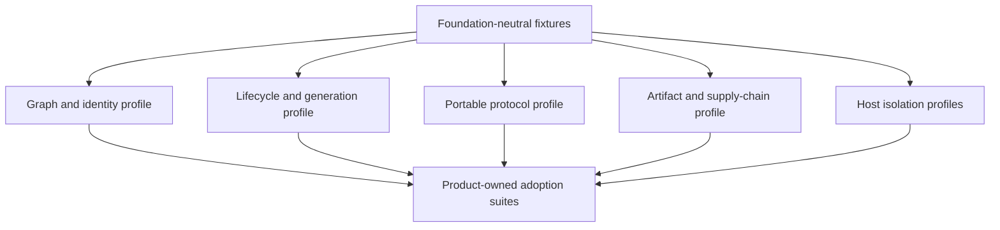

# Conformance Plan

## Layered Suites

The recommended first-consumer model gives the first product ownership of its
private schemas, fixtures, diagnostics and minimum traces only after ADR-0013 is
accepted. While ADR-0012 remains effective, Foundation retains semantic
ownership and cannot implement the runtime until `UMEQ-011` and `UMEQ-013` are
resolved through `OD-003`. Under the product-local ADR-0013 path, two independent
consumers must prove the same semantics before extraction is approved. Under the
effective ADR-0012 path, the selected accepted admission basis and its applicable
evidence control extraction; a second consumer is not imposed on the other
accepted bases. Foundation may then own only the admitted neutral subset.
Products always own authorization, data invariants, persistence, placement and
stronger security claims. Passing conformance never grants a plugin permission
to execute.

## Core Profiles

These rows are promotion requirements. A row is not implemented merely because
the dossier has status `qualified`.

| Profile | Mandatory proof |
| --- | --- |
| `GRAPH-1` | Closed-world closure; duplicate, missing, cycle and ambiguous provider rejection; deterministic plan/digest; exact dependency object; zero effects before admission |
| `LIFECYCLE-1` | Single activation per operation identity and exact activation fingerprint; distinct operation identities remain separate candidates even for identical source and plan inputs; complete hook preflight before effects; explicit readiness; one publication commit point; aggregate sibling failures; reverse rollback only before publication; idempotent stop; bounded waiter resources; absolute effect deadlines; explicit bounded result-observation deadlines; cleanup debt |
| `GENERATION-1` | Immutable generation identity; monotonic fence; stale request/write rejection; bounded drain; rollback as a forward generation |
| `PROTOCOL-1` | Version negotiation; bounded frames; identity/deadline validation; duplicate/reordered messages; cancellation; malformed peer failure |
| `PACKAGE-1` | Exact exports; no framework leakage; packed consumer E2E; browser/Node condition checks; API report and compatibility fixtures |
| `SUPPLY-1` | Digest-pinned artifact; namespace-authorized signature; provenance; dependency closure; install receipt; revocation and rollback evidence |
| `HOST-T0` | Trusted in-process declaration; deterministic cleanup; no claim of hostile isolation |
| `HOST-T1` | Worker/process fault containment; crash and tree-cleanup evidence; explicit same-user authority warning |
| `HOST-T2` | Deny-by-default dedicated-document or Wasm capabilities, quotas, broker enforcement and negative escape fixtures; an ordinary Worker remains `T1` |
| `HOST-T3` | OS-enforced identity, filesystem, network, IPC, process-tree and resource isolation per platform |

`HOST-T4` for VM or remote disposable execution is post-MVP.

## Current Evidence Status

| Evidence | Status | Meaning |
| --- | --- | --- |
| ID-DAG scheduling primitive | implemented/passed locally | Narrow graph algorithm only, not `GRAPH-1` |
| In-memory lifecycle/CAS model | implemented/passed locally | No durable coordinator or sink fence |
| Portable strict JSON codec | implemented/passed locally | Canonical JSON subset, safe-integer numeric domain, fatal UTF-8, duplicate-key and request-direction rejection, authority tuple and deadline checks; no method schemas, receiver deadline horizon, N/N-1 negotiation, authenticated channel or operation journal |
| Process, Node Worker, browser Worker | smoke/passed locally | Placement transport and authority-envelope checks, not isolation conformance |
| Packed toy consumer | harness/passed locally | Validates the harness shape, not `PACKAGE-1` |
| Recovery checkpoint/reducer examples | implemented/passed locally | Fresh in-memory coordinators restore immutable serialized checkpoints; no process-crash or persistent-store recovery |
| Supply chain and `HOST-T2/T3` negatives | planned | Required before their corresponding claims |

## Qualification Gap Matrix

This matrix was refreshed at
`a95b3efda046161839d44b83f619e4e160aabf14` before gap-only changes. The
unchanged baseline passed 86 qualification tests in 11.1 seconds. The code
listed below remains disposable evidence under `tests/qualification`; it is not
a production package, public SPI, or ownership decision.

| Required evidence | Executable evidence | Result and remaining limit |
| --- | --- | --- |
| Deterministic graph identity across input permutations | `permutations produce the same graph plan and digest` | Passed; digest is private qualification vocabulary |
| Required, optional and ordered-many cardinality | `qualification bindings preserve required, optional, and ordered-many semantics` | Gap closed with explicit bindings; no product grammar admitted |
| Missing, duplicate, ambiguous and incompatible providers | `invalid ID-DAG inputs produce deterministic diagnostics without loading hooks`; binding cardinality, duplicate-demand, provider-ambiguity, collision-free coordinate and cycle cases | Passed before executable hooks; duplicate offers fail even without a consumer, and structured coordinate keys avoid delimiter collisions |
| Cycles, self-cycles and independent oracle | `native compiler agrees with Graphlib on generated directed-graph validity`; `graph compiler remains stack-safe for ten thousand modules` | Passed; Graphlib remains test-only |
| Deeply immutable serializable plan and stable diagnostics | `compiled ID-DAG plan is deeply immutable and serializable`; duplicate/missing ID-DAG diagnostics | Passed; an identifier grammar intentionally remains not admitted |
| 1,000 and 10,000-node stack and performance budgets | `graph compiler remains stack-safe within 1k and 10k hard caps` | Passed with five timing samples per size and an observed heap-delta measurement; max-of-five values are diagnostic until reference CI baselines exist, while 500-ms/5-second and 256-MiB hard caps fail immediately |
| Invalid graph performs zero implementation effects | `invalid ID-DAG inputs produce deterministic diagnostics without loading hooks`; lifecycle hook preflight cases | Passed |
| Honest two-module T0 source and consumer | `two fixed T0 built-ins publish a detached result and release the source resource` | Gap closed; source owns a bounded fake resource and consumer publishes a detached immutable result |
| Prepare, start, readiness, publication and shutdown ordering | two-built-in rehearsal; readiness/publication cases; shutdown drain/order and reentrant single-flight cases | Passed for replacement and terminal explicit shutdown; shutdown reserves its flight before injected code and permanently closes admission |
| Single-flight, activation fingerprint and caller cancellation | concurrent-start, idempotency-conflict and waiter-cancellation cases | Passed |
| Sibling settlement, reverse cleanup and bounded cleanup debt | parallel-failure, multi-level rollback and hung-cleanup cases | Passed |
| Generation, authority-scope and stale-write fencing | authority-scope, invocation-handle, drain and stale-write cases | Passed only for the in-memory model |
| Candidate remains unpublished until ready; old route survives failed candidate | readiness and failed-candidate cases | Passed |
| Recovery across every represented durable phase | `crash recovery decisions are deterministic at durable boundaries` | Prepared, started, ready, published, draining and retired checkpoints are serialized and restored into fresh in-memory coordinators before reconciliation |
| Corrupt, stale, conflicting and unknown recovery evidence | recovery boundary cases with malformed shapes, stale tuples, uncertain outcomes and conflicting generations | Passed fail-closed as `CONTROLLED_RECOVERY` |
| Cleanup never retires a still-referenced generation | recovery cases combining in-flight, termination and cleanup evidence | Passed in reducer model |

No production graph, lifecycle, or recovery implementation is justified by this
gap pass. Process-crash injection, a persistent store, a durable coordinator,
sink-enforced fencing, and a second independently authored implementation remain
production admission gaps. The two synthetic built-ins qualify only test
behavior and cannot be promoted into a product feature or Foundation package
without the unresolved ownership decision.

## Adapter Matrix

Every adapter must run the neutral suite plus its own negative cases:

- native TypeScript graph compiler versus an independent Graphlib cycle oracle,
  with each result checked separately for topological validity;
- optional Cordis adapter versus the native lifecycle trace oracle;
- Node process and Worker protocol adapters;
- future browser Worker and sandboxed iframe adapters;
- future Extism/WASI adapter inside an independently qualified host;
- OCI/GHCR and Harbor artifact-source adapters;
- PostgreSQL canonical catalog and signed offline snapshot adapters;
- product-specific persistence, broker and authority-fence adapters.

An adapter cannot advertise a guarantee stronger than its deployment binding.
For example, an in-memory compare-and-set proves only one-process publication;
a distributed claim requires a linearizable store and sink-enforced fences.

## Required Negative Families

1. Graph ambiguity, duplicate IDs, missing providers, hard/soft cycles, descriptor bombs and canonicalization collisions.
2. Concurrent start/stop/update, late readiness, stale candidate, incomplete hook binding, deadline expiry, cancelled waiter cleanup, hung cleanup, post-publication cleanup failure and double publication.
3. Crash before/after intent, readiness, route commit, outbox publish, effect acknowledgement, drain completion, old-generation stop, cleanup reconciliation and retirement recording.
4. Stale generation, stale replica incarnation, lost acknowledgement, duplicate operation and ambiguous remote effect.
5. Malformed, oversized, deeply nested, reordered, replayed and unauthenticated protocol frames.
6. Tag movement, digest corruption, wrong publisher, stale metadata, revoked signer, dependency confusion and incomplete mirror/snapshot.
7. Filesystem escape, egress bypass, secret recovery, inherited handles, process-tree escape, IPC confusion and resource exhaustion.
8. Package framework leakage, broken conditional exports, bundler side effects, missing declarations and N/N-1 incompatibility.

## Product Adoption Gate

Before an Orchestrator, AR or Frontend contribution point is published, its
owning feature provides:

- two independently authored implementations that pass the same applicable
  positive and negative conformance fixtures;
- a product authority statement and prohibited mutations;
- host placement and trust tier;
- capability request mapped to a separate grant decision;
- failure, timeout, cancellation, retention, deletion and recovery semantics;
- contract fixtures consumable from a packed artifact;
- one adversarial fixture proving the extension cannot bypass the owning use case.

## Target CI Shape

This is the target shape after the first production package exists. The current
research branch intentionally runs the complete `pnpm check` gate in CI;
`check:fast` does not claim qualification coverage.

Future fast PR checks run deterministic graph, package boundary and focused
lifecycle fixtures. Affected host/profile suites run from the machine-readable manifest.
Cross-platform isolation, crash, OCI/Harbor and N/N-1 matrices run as scheduled
or release gates. Evidence is keyed by exact commit, dependency lock digest,
platform and conformance version so unchanged heavy evidence can be reused.

No suite is accepted solely because the implementation generated its own
expected output. Every authority, lifecycle and security claim needs an
independent oracle or externally observable negative fixture.
