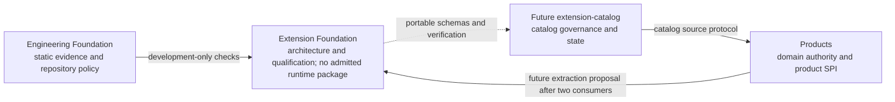

# Current State

This file records the exact state of the earlier universal qualification pass.
For newer product revisions and current admission verdicts, use the
[Module System V1 Productization Gate](../module-system-v1-productization/README.md).
The historical filename is retained so existing evidence links stay stable.

## Repository Inputs

The audit captured the following immutable historical repository revisions
before research started. Only
inputs marked `qualified` are independently reproducible evidence. Private
repositories are orientation context and cannot support a qualification claim.

| Repository | Revision | Evidence status | Role |
| --- | --- | --- | --- |
| `agent-teams-ai/extension-foundation` | `78850cbc57a1a688913a3694ca6f0efde34ab192` | qualified | Qualification baseline for proposed product-neutral extension semantics |
| `agent-teams-ai/engineering-foundation` | `3211447cff927c39821603c298ebb44d031013d7` | qualified | Development-only static policy, docs, scaffolding, and diagnostics |
| `agent-teams-ai/agent-teams-orchestrator` | `fc06a0aecb6c37e6cade8841fa781df9193858de` | qualified | Orchestration product and product-owned extension points |
| `agent-teams-ai/agent-runtime` | `fffa22486afb470ba5347f2ed6a8c3dc738b3add` | qualified | Runtime execution, provider, sandbox, and enforcement authority |
| `agent-teams-ai/agent-teams-platform` | `2e0804e0c290f1a3078145f5948cdf62d233fea7` | private orientation only | Managed deployment context; excluded from independently reproducible conclusions |
| `777genius/agent-teams-ai` | `7d0c0210a4e9420d6fb3f8c3a26d8c80f5c941e4` | qualified | Web/Electron target branch used for frontend adoption analysis |

Platform ownership statements in this dossier are derived from Extension
Foundation's accepted ADR-0003 through ADR-0005 and resolved OD-001. The private
Platform revision informed orientation only; no finding depends on inaccessible
bytes from that repository.

The research branch was `research/universal-module-extension-qualification`,
created from the Extension Foundation revision above in an isolated worktree.
No related product worktree or active pull request is modified by this dossier.

At the 2026-08-25 coordination snapshot, Extension Foundation, Engineering
Foundation, Orchestrator, and Agent Runtime had no open pull request. Platform
PR #22 was unrelated governance work. Frontend PR #252 was the relevant draft
for the target Web/Electron revision; its worktrees and the other open Frontend
PRs were inspected read-only and left untouched. Existing worktrees, including
legacy and prunable entries, were enumerated before creating the dedicated
qualification worktree; their presence is not implementation evidence.

The unmodified baseline passed `pnpm check`, including Foundation, Docs
Protocol, architecture topology, source-dependency, type, scaffolding fault, and
package-artifact checks.

## Effective Decision Set

ADR-0013 is the accepted cumulative successor to ADR-0012 and retains the useful
library/module/plugin role boundaries while moving first-consumer semantics to
the owning product. ADR-0012 is superseded historical authority, not an
alternative Foundation implementation path. ADR-0014 records the static-first
rehearsal direction. ADR-0006 through ADR-0009 remain historical and superseded
by ADR-0010. ADR-0011 remains proposed and is not silently treated as accepted.
Open decisions remain non-operative until their owners resolve them.

The effective accepted direction is:

- Extension Foundation is product-neutral; products own their extension ports,
  host policy, authority, domain state, and transactions.
- OCI Distribution, ORAS, Cosign, immutable digests, GHCR, and Harbor form the
  artifact baseline.
- Catalog state is PostgreSQL-canonical; signed snapshots and search indexes are
  derived.
- Catalog, artifact verification, entitlement, product authorization,
  capability grants, custody authorization, and runtime enforcement are
  independent decisions.
- Extension code is not invoked inside a product Unit of Work.
- The W11 recommendation was a product-owned static `T0` rehearsal. The later
  [productization roadmap](../module-system-v1-productization/current-roadmap.yaml)
  is the current sequencing authority and retains Pure DI as `L0`.
- A static Pure DI rehearsal comes first; private product graph only after the
  exact measured runtime-selection or independent-lifecycle trigger is
  demonstrated.
- The application composition root, not the feature factory, selects the
  implementation, configuration, and lifetime. No global service locator is
  introduced.
- A runtime graph is added only after the exact measured Phase 2 trigger:
  runtime selection that static configuration cannot meet or independently
  managed lifecycles needing dependency-aware operation. It remains private to
  the owning product until later gates.
- A reusable library core has no module-runtime dependency. A feature-owned
  module adapter may depend on the core. A plugin artifact is an optional
  distribution and trust envelope that can provide several contributions.
- Product-specific contracts remain feature-owned. A public SPI requires stable
  ownership, two independent implementations, compatibility fixtures, negative
  tests, and conformance evidence.

The accepted-decision ledger uses Engineering Foundation's canonical semantic
payload, not raw Markdown bytes: LF-normalized body without frontmatter plus
key-sorted immutable metadata excluding `status` and `superseded_by`, serialized
as JSON and hashed with SHA-256. Exact Git blob comparison remains separate
historical provenance evidence. The current documentation SHA is not, by
itself, production qualification or package admission.

## Current Implementation State

Extension Foundation remains an architecture and qualification repository. The
package catalog is intentionally empty. No public runtime SPI, module graph
kernel, lifecycle coordinator, process host, browser host, or extension catalog
service has been admitted.

No product-local Phase 1 rehearsal is implemented in this repository. No
Foundation package is promoted by the W11 synthesis, the accepted roadmap
decisions, or this documentation update.

Engineering Foundation is already integrated as an exact, development-only
dependency. Its source graph, dependency policy, architecture-decision guard,
scaffolding protocol, Docs Protocol, and agent workflow are executable. These
mechanisms do not model runtime contributions, activation graphs, grants,
generation replacement, or extension isolation.

## Product Ownership Snapshot

### Orchestrator

Candidate product-owned seams include workflow scheduling, work-placement
proposals, completion evidence providers, context sources and transformers,
automation conditions and post-commit effects, integration ACLs, and
deterministic observation processors. The owning bounded context retains every
business invariant and validates every proposed result.

Work Completion evidence is the candidate first static rehearsal. It is not an
accepted product SPI and does not begin with a graph.

### Agent Runtime

Provider bundles, provider/runtime adapters, artifact storage, and observation
or redaction adapters may become extension planes. Runtime sessions, execution
identity, process custody, sandbox policy, capability enforcement, permission
enforcement, fencing, and recovery remain Agent Runtime authority.

The proposed non-executable AR provider-bundle descriptor has no runtime
selection or independently managed lifecycle. It therefore does not count as a
second graph/lifecycle consumer for extraction.

### Frontend

Commands, views, panels, navigation, settings, activity renderers, artifact
previews, and themes are candidate frontend-owned contributions. Browser and
Electron placements have different authority. The final contribution model and
isolation policy remain a product decision.

### Platform And Catalog

The future `extension-catalog` owns catalog governance and each writable
source's canonical PostgreSQL state. Platform may operate a managed source and
may own identity linkage, commercial entitlement, and managed rollout policy,
but its current accepted model has not yet adopted extension-specific
contracts. Self-hosted and direct-digest use must not require Platform.

## Confirmed Gaps

- OD-001 frontmatter names only ADR-0003 as its resolver, while its resolution
  section names ADR-0003, ADR-0004, and ADR-0005. This qualification records the
  mismatch but does not rewrite historical decision metadata.
- `accepted-decisions.json` is an immutable digest ledger and includes
  superseded ADR-0006 through ADR-0009; the decision index remains authoritative
  for effective status despite the registry filename. Package ownership
  validation cross-checks locally parsed ADR status against both the accepted
  decision history ledger and the canonical decision-index lifecycle;
  uncross-checkable or disagreeing status metadata fails closed.
- OD-003 still needs contract-token, runtime-host, ordering, handover,
  compatibility, and evidence choices.
- OD-002 still owns key custody, signing quorum, freshness, retention, and
  offline operating parameters.
- The package catalog has no admitted implementation slice.
- The historical graph-first roadmap and graph/lifecycle dossier remain useful
  bounded research, but are superseded as implementation sequencing by W11's
  static-first recommendation.
- No admitted production graph/lifecycle conformance suite exists yet. This
  dossier adds only disposable qualification evidence under
  `tests/qualification`; promotion requires a separate implementation change.
- Platform and the future catalog need an explicit operator-versus-semantic-owner
  contract before managed catalog implementation.
- Frontend contribution and isolation decisions require a separate future
  product approval.
