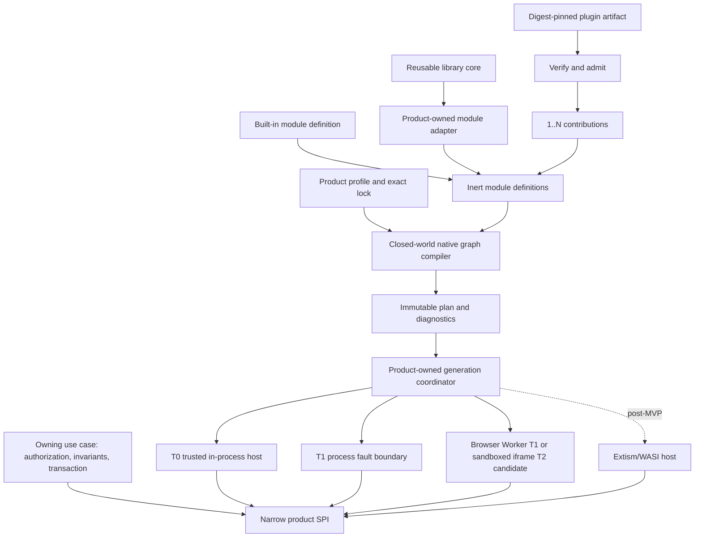

# Final Recommendation

## Architecture

Use one product-neutral contract and conformance foundation, while every product
retains its feature-owned SPI, DDD authority and deployment adapters.

The module system composes capabilities. It never replaces product aggregates,
authorization, transactions or recovery policy. A plugin may propose, transform
or perform a post-commit effect; the owning use case validates its result before
any canonical mutation.

## Status Separation

### Accepted Earlier

- Reusable library core does not depend on module/plugin runtime.
- Product-owned module adapter may depend on a reusable core.
- Plugin artifact is a distribution, trust, install and update envelope; one
  artifact may provide multiple contributions.
- Built-ins do not receive synthetic artifact identities.
- Product-specific SPI, aggregates, invariants, authorization and transactions
  remain with the owning product/feature.
- No plugin/provider call occurs inside a Unit of Work.
- Requests are not grants; signatures are not sandboxes; graph validity is not
  authorization.
- No global service locator, ambient container, registration-order semantics or
  public framework types.
- Production SPI requires a real owner, two independently authored conforming
  implementations and compatibility evidence.

### Verified By This Qualification

- A small native ID-DAG compiler can produce immutable deterministic
  batches/digest, reject duplicate/missing/cyclic IDs before hook resolution
  and remain stack-safe at 10,000 modules.
- One hundred concurrent starts can share one activation; waiter cancellation
  detaches; changed source, scope, policy, cleanup or graph identity conflicts;
  different candidates admit one expected-active compare-and-set winner.
- Failed readiness preserves the active generation; deadlines prevent late
  publication; hung cleanup is bounded and visible.
- Parallel startup failure waits for every bounded sibling wrapper before
  reverse cleanup. A hook that ignores cancellation may still overlap cleanup,
  so the result is explicitly `termination_unproven`.
- Generation replacement can drain admitted work and reject stale leases in an
  in-memory fence model. Publication is a commit point: later cleanup failure
  leaves the candidate active and old-generation termination unproven. Durable
  sink fencing, stop evidence and debt ordering remain product adapter obligations.
- Identity-bound crash/recovery choices can be represented as a deterministic
  reducer rather than process-memory continuation; crash injection and durable
  recovery are not yet proved.
- Node process, Node Worker and real browser Worker use one strict portable codec
  bound to authority scope, extension instance, graph/module generations, host
  incarnation, peer, audience and deadline; authenticated negotiation remains open.
- Cordis-backed resource hooks preserve the trace shape owned by the same
  neutral coordinator in the applicability fixture; this is not an independent
  lifecycle-equivalence proof.
- A packed toy fixture validates the isolated-consumer harness shape; it is not
  evidence for a production package or declaration surface.
- Extism 1.0.3 can execute release-hosted Wasm bytes matching a pinned digest,
  but publisher provenance was not established, Node reports experimental WASI,
  and npm `latest` is a 2.0 release candidate.

### Recommended

- Native TypeScript closed-world compiler as the first private implementation.
- Explicit profile bindings for V1 single-provider slots.
- One generation lifecycle vocabulary with separate distributed fence,
  route-revision, rollout-intent and replica-incarnation identities.
- Side-by-side generation replacement plus bounded drain; restart is an honest
  fallback, arbitrary hot unload is not baseline.
- Environment-neutral structural contracts, explicit Node/process/browser/
  Electron adapters and no smart root package that changes product semantics by
  export condition.
- JSON Schema for serialized wire data and handwritten TypeScript for
  executable ports, pending approval.
- The repository-local packed rehearsal is ESM-only. Reusable/public package
  format remains open under `UMEQ-014`; a fixed-version train also requires
  ADR-0010 evidence.
- OCI/ORAS plus Cosign/Sigstore for digest-pinned artifacts, with TUF required
  before mutable managed channels or delegated publisher updates.

### Hypotheses Still Needing Product Evidence

- Exact product SPI shapes and cardinality/version grammar.
- First Orchestrator and AR adoption slices.
- Frontend contribution API and Web/Electron permission UX.
- Durable database schema, process protocol encoding and distributed bindings.
- Whether Cordis deletes enough owned code in a future real consumer.
- `T2/T3` untrusted-host portability and full cross-platform sandbox claims.

### Deferred

- Stable public SPI and npm publication.
- CommonJS without a demonstrated consumer.
- Arbitrary HMR/hot unload.
- Extism/WASI production host and non-TypeScript plugin authoring.
- General SAT dependency solver, multiple coexisting module versions and
  implicit parent scopes.
- Distributed consensus, multi-router rollout and VM isolation in the first
  local module slice.

## Cordis Verdict

Do not adopt Cordis as the baseline module runtime.

Its exact 4.0.1 implementation is useful for Fiber-owned scoped effects, but it
does not provide closed-world compilation, product readiness, generation
fencing, atomic publication, bounded drain, durable recovery or hostile-code
isolation. The trivial adapter does not demonstrate meaningful owned-code
deletion and risks a second lifecycle authority. The 25% threshold has not been
measured on a real consumer.

Keep Cordis pinned only as a development qualification dependency and design
reference. Reopen adoption if a real product adapter stays private, passes the
same conformance traces, uses no private API, requires no vendor fork and meets
the measured deletion threshold.

## Implementation Roadmap

### Phase 0: Approvals And Baseline

No graph implementation begins until one ownership path is explicitly opened.
The recommended product-local path requires acceptance of ADR-0013 plus an
owning-product feature decision naming the graph owner, two fixed `T0` built-ins,
explicit bindings and the authority that remains outside the graph. If ADR-0012
remains effective, the Foundation path instead requires resolution of
`UMEQ-011` and `UMEQ-013` through `OD-003` before Foundation admits graph or
runtime semantics. Contract source, process, Frontend, update, distributed
cutover and managed-update decisions remain deferred. This qualification does
not make either approval path operative.

Estimated change: 300-700 documentation/tooling LOC, 1-3 days.

### Phase 1: First Graph Kernel, Decision-Gated

This phase begins only through one of two mutually exclusive approval paths:

1. accept ADR-0013 and the owning product's feature decision for a product-local
   graph-only compiler; or
2. retain ADR-0012 and resolve `UMEQ-011` plus `UMEQ-013` through `OD-003` for a
   Foundation-owned graph-only compiler.

Until one complete path is approved, Phase 1 is blocked. In either approved path,
promote the proven ID-DAG primitive, then add only explicit bindings,
cardinality, compatibility, scope and source validation. Do not create
installation, container, process, catalog, public SPI, runtime reuse or
distributed behavior in this phase.

The ledger currently recognizes ADR-0013 literally. A future accepted successor
does not silently satisfy this gate: that decision must explicitly amend the
ledger before implementation begins.

Exit criteria: two fixed `T0` built-ins, one independent graph oracle,
10,000-node budget, invalid-input loader sentinel and framework-free local
declarations.

Estimated change: 1,500-3,000 LOC including tests, 1-2 weeks.

### Phase 2: One Two-Module Product Rehearsal

Use two fixed trusted built-ins in one owning product feature, connected to the
graph compiler admitted through Phase 1. Under the product-local path that
compiler remains feature-owned; under the Foundation path the product adapter
consumes the admitted Foundation compiler without moving product contracts or
authority into Foundation. Prove
`prepare -> start -> ready -> publish -> drain -> stop`, absolute deadlines,
single-flight, reverse cleanup, generation fences and structured diagnostics.
Do not load artifacts, install plugins, expose public SPI, share private state
across scopes, call external effects or generalize a reusable runtime.

Exit criteria: feature authority remains product-owned; two independently
authored implementations produce matching applicable positive and negative
traces; no lifecycle framework leakage.

Estimated change: 3,000-6,000 LOC including product tests, 1-3 weeks.

### Phase 3: Reusable Internal Contracts And Conformance

After the selected extraction path proves its applicable evidence, extract only
repeated semantics: structural IDs/envelopes, graph fixtures, lifecycle outcomes
and the packed conformance runner. The
`phase-3-reusable-contract-extraction` ledger gate must select one path. The
product-local ADR-0013 path preserves the owning product feature decision,
requires a second independent consumer and requires a separate Foundation
extraction decision. The existing ADR-0012
Foundation-owned path instead requires immutable evidence naming one of
ADR-0012's accepted admission bases, a schema-valid package admission record,
independent conformance, resolved runtime decisions and an artifact-specific
package admission decision; it is not silently narrowed to the second-consumer
basis. Both paths require the contract-source decision `UMEQ-012`. Product
contracts and adapters stay local. Internal extraction may proceed after the
selected gate passes.

Public package publication additionally requires the cumulative
`phase-3-package-publication` gate: the reusable-extraction gate is satisfied;
`UMEQ-014`, `UMEQ-015` and `UMEQ-016` are resolved; `PACKAGE-1` packed-package
conformance and the public API report pass; the immutable package admission
record is verified; and the Foundation owner accepts both the artifact-specific
package admission decision and publication decision. `UMEQ-015` is one of the
ten strategic UMEQ forks. These artifact-specific decisions are release
authority and are not additional strategic forks.

Estimated change: 4,000-8,000 LOC including fixtures, 2-4 weeks.

### Phase 4: Process Host

Do not begin this production-oriented host phase until ADR-0011 is accepted and
`UMEQ-009` is resolved through `OD-003` for the selected process wire format.
The ledger currently recognizes ADR-0011 literally. A future accepted successor
must explicitly amend the ledger before it can authorize this phase; prose alone
cannot substitute another decision.

Implement mandatory handshake, N/N-1 codecs, absolute monotonic deadlines,
request journal, readiness proof, byte-credit streams, drain watermark,
process-tree custody and crash reconciliation. Start with explicitly supported
OS containment; unsupported hard guarantees fail closed.

Estimated change: 8,000-13,000 LOC including Linux/Windows tests, 4-8 weeks.

### Phase 5: Artifact, Profile And Catalog Path

This phase has the same ADR-0011 closure gate as Phase 4. A proposed decision is
not implementation authority and cannot be treated as an implicit approval.

Implement digest-pinned OCI artifact verification, signer/provenance policy,
profile/lock separation, PostgreSQL catalog source, signed snapshot and direct
digest install. Remain pin-only unless TUF-managed update metadata is ready.

Estimated change: 10,000-18,000 LOC including conformance, 5-10 weeks.

### Phase 6: Frontend And Untrusted Hosts

This phase has the same ADR-0011 closure gate as Phases 4 and 5 because a Web
Worker, iframe or Electron process that executes a contribution is a production
extension host. After that closure and separate Frontend approval, add
declarative contributions, a strict capability broker, Web Worker/iframe
placement and Electron main/preload/renderer adapters. Extism is a separate
post-MVP host qualification.

Estimated change: 10,000-20,000 LOC including browser/Electron/platform tests,
6-12 weeks.

Phases overlap only where ownership and write sets are independent. The first
usable internal module system is roughly 8,000-15,000 LOC including tests. A
cross-product plugin platform with process, artifact and frontend hosts is
roughly 40,000-75,000 LOC before product-specific plugin behavior.

## Main Risks

| Risk | Control |
| --- | --- |
| Foundation becomes a product shared kernel | Product-owned SPI and authority tests; no product models in public declarations |
| Two graph/lifecycle authorities | One neutral plan/trace; adapter kill criteria and differential conformance |
| Public API freezes before evidence | Internal packages and Draft ADR until two implementations pass packed tests |
| Hidden security downgrade | Explicit `T0-T4` tier and required-control feature reporting; fail closed |
| Distributed system promises false atomicity | Separate route decision, admission and sink-effect guarantees |
| Package explosion | Colocate by default; extraction needs a second consumer or independent lifecycle |
| Compatibility matrix grows without bound | Fixed release train, ESM-first, N/N-1 only and explicit defer list |
| AI agents cannot locate ownership | Machine-readable descriptors, stable diagnostics and generated views from one model |
| Research framework delays product delivery | Two-module rehearsal, LOC/time kill criteria and no general DSL in first slice |

## Decision

The architecture guides Phase 1 only after one complete ownership path in Phase
1 is approved. The recommended path is acceptance of ADR-0013 plus an owning
product feature decision fixing the two `T0` built-ins and authority boundary.
If ADR-0012 remains effective, `UMEQ-011` and `UMEQ-013` must instead be resolved
through `OD-003` before a Foundation implementation begins. The result is not
ready for a stable public SPI, Cordis adoption, untrusted plugin claim or
production package publication.

The recommended design is intentionally smaller than “Everything is a Plugin”:

- everything composable is a module;
- everything intentionally replaceable has a narrow extension point;
- only independently distributed, trusted and lifecycle-managed artifacts are
  plugins.

That retains the constructor-like flexibility without moving every class,
domain invariant or internal feature behind a runtime framework.
