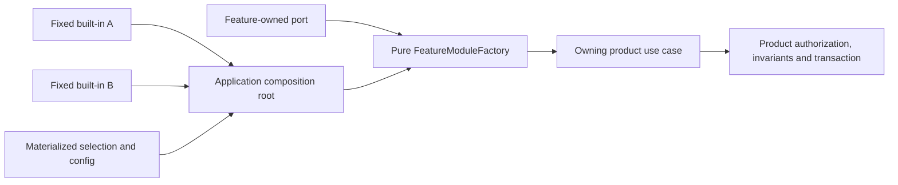

# Final Recommendation

## Current Recommendation

Start with one product-owned, trusted `T0` feature seam composed through static
imports and Pure DI. The feature exports a pure `FeatureModuleFactory`; the
application composition root chooses the implementation, configuration, and
lifetime and passes only explicit dependencies. Do not introduce a runtime
graph, global container, service locator, plugin loader, or Foundation package
for the first rehearsal.

The factory is pure feature composition, not a runtime module definition. It
does not read an ambient container, discover implementations, own application
configuration, or decide process lifetime. The composition root may call the
factory more than once when the application explicitly needs distinct
instances, but lifetime remains an application decision rather than a product
identity or module-scope convention.

This is the only current implementation recommendation. The earlier
graph-first roadmap remains useful historical qualification research: its DAG,
lifecycle, fencing, host, and packaging evidence constrains later work if a
real trigger appears, but it is superseded as implementation sequencing. It is
not a competing recommendation and does not authorize a Foundation runtime.

## Boundaries That Apply Now

- Product-specific ports, models, authorization, state, invariants,
  transactions, result revalidation, and recovery remain with the owning
  product feature.
- A reusable library core does not depend on module or plugin runtime code.
- Selection is a closed literal, enum, or equally reviewable value materialized
  before execution. Registration order and ambient discovery are not semantics.
- Extension/provider work does not run inside a product Unit of Work. The
  owning use case revalidates the result before canonical mutation.
- Manifest permissions are requests, signatures are evidence rather than
  sandboxes, and graph validity is never authorization.
- `FeatureModuleFactory`, `ExtensionModuleDefinition`, and `PluginArtifact`
  describe different roles. The first rehearsal uses only the first role.
- No global registry, universal plugin interface, parent-container fallback,
  framework type in a product port, or service locator is introduced.

## Evidence Status

The qualification established useful but bounded evidence:

- The W11 corpus recommends only a product-local static trusted rehearsal and
  records immutable custody under manifest
  `4302a0b02f1b54f876a5824919e5e195594843ce778e74aa59852d65363fd8fe`.
  Its integrity passed, while `promotionAllowed=false` remains authoritative.
- Synthetic graph spikes demonstrated deterministic DAG compilation, invalid
  graph rejection, stable diagnostics, and a 10,000-node budget. They did not
  demonstrate that a real product needs a graph.
- Lifecycle spikes exposed bounded-waiting, cleanup, cancellation, fencing,
  and crash-recovery constraints. They do not qualify a production lifecycle
  coordinator or justify one for statically constructed `T0` built-ins.
- Cordis 4.0.1 reproduced selected trace shapes only. It did not prove complete
  lifecycle equivalence or delete enough owned code in a real consumer.
- Process, Worker, browser, Electron, Wasm, artifact, and packed-consumer spikes
  remain placement or harness evidence, not admitted production packages,
  public contracts, authenticated protocols, or hostile-code containment.

The exact source revisions and worker-result hashes remain in
[current state](current-state.md), the
[W11 executive report](nightly/01-executive-report.md), and the
[bounded claim ledger](nightly/claim-ledger.yaml). Neither this documentation
change nor its Git SHA is production qualification, package admission, or SPI
promotion.

## Implementation Roadmap

### Phase 0: Governance Alignment

Accept the cumulative ownership decision and the owning product's feature
decision before implementation. The product decision names the bounded context,
accountable owner, candidate capability, two fixed audited `T0` built-ins,
authority exclusions, explicit selection, success measures, deletion criteria,
and LOC accounting. It also states that runtime graph and lifecycle semantics
remain out of scope until Phase 2 triggers.

Keep OD-002, OD-003, and UMEQ choices open unless the phase actually reaches
their scope. Governance alignment does not admit a Foundation package or a new
product SPI.

Estimated change: 100-300 documentation and test-policy LOC, 1-3 working days.

### Phase 1: Product-Owned Two-Module Static Rehearsal

Implement one product feature with a private handwritten TypeScript port, two
fixed trusted built-ins, static imports, direct constructors or pure factories,
and one application composition root. The feature exports a pure
`FeatureModuleFactory`; the application root selects implementation,
configuration, and lifetime. Persist or otherwise materialize the closed
selection before execution, and test ownership navigation, configuration,
negative results, stale-result rejection, and authority revalidation.

This phase has no runtime graph, module descriptor grammar, global container,
service locator, plugin loading, artifact identity, dynamic discovery,
Foundation package, public SPI, generic lifecycle coordinator, or hot unload.
Restart the smallest authority realm for update or recovery. Stop or simplify
if generic glue exceeds 30% of changed production code or the seam does not
improve the named product measure.

Exit evidence: both built-ins run through the same product-owned port; selection
is explicit and deterministic; no provider runs in a Unit of Work; product
authority tests pass; production, tests, configuration, documentation, and glue
LOC are reported separately.

Estimated change: 1,500-4,500 LOC including product tests, 1-3 weeks.

### Phase 2: Measure Need; Add A Private Product Graph Only If Triggered

Measure the rehearsal before designing runtime machinery. Continue direct
composition unless the product demonstrates at least one of these needs:

- the implementation set must change at runtime without a product rebuild and
  static selection cannot meet a named product outcome;
- multiple independently managed resource lifecycles need dependency-aware
  start, readiness, failure cleanup, or stop; or
- direct composition repeatedly causes measured configuration or ownership
  defects that a bounded graph prototype is expected to remove.

If no trigger is met, Phase 2 ends with the static design unchanged. If a
trigger is met, approve the product-local scope and build the smallest private
product graph that addresses the measured need. Keep descriptors, graph
semantics, diagnostics, and lifecycle policy in the owning product. Use explicit
bindings and closed dependency objects; expose no resolver or global container.
Compare against the static baseline and delete the graph if it fails the named
measure or exceeds the 30% glue threshold.

Estimated measurement: 100-300 LOC/instrumentation, 2-5 working days. Triggered
private graph prototype: 2,000-5,000 LOC including differential and failure
tests, 2-4 weeks.

### Phase 3: Second Real Consumer And Semantic Reconciliation

Seek a second real consumer only after its own product need exists. It must
author its expectations independently; copying the first consumer's code or
reusing a non-executable descriptor is not independent semantic evidence.
Reconcile identity, selection, configuration, lifetime, diagnostics, failure,
and ownership differences across the two consumers, and retain product-local
variants where the semantics do not actually coincide.

One-way imports bound the candidate movement but do not make extraction
automatic or purely mechanical. File movement is followed by reviewed semantic
reconciliation, API and schema versioning, compatibility policy, repository and
support ownership, release policy, and migration planning.

Estimated change: 1,500-4,500 product LOC plus conformance, 1-3 weeks for the
second slice; 1-2 weeks for reconciliation before any extraction proposal.

### Separate Gate: Foundation Extraction

Extraction requires a separate accepted decision naming the proven neutral
intersection, both real consumers, independent expectations, executable
cross-consumer conformance, owner repository, compatibility/version policy,
release policy, and migration obligations. Product ports, DTOs, authorization,
configuration, adapters, and consumer-specific lifecycle policy stay local.

Extraction is not publication. Internal Foundation admission remains closed
until its artifact-specific admission evidence and repository checks pass.

Estimated change after approval: 4,000-8,000 LOC including fixtures and
migrations, 2-4 weeks.

### Separate Gate: Publication

Stable/public publication additionally requires two independently authored
conforming implementations, packed-artifact consumer tests, public API and
compatibility review, immutable package admission evidence, explicit SemVer and
support ownership, release-promotion verification, and an artifact-specific
publication decision. Repository count, internal extraction, or one shared
implementation does not satisfy this gate.

Estimated change: 6,000-11,000 incremental LOC and 3-8 weeks, plus ongoing
release and support cost.

### Later Gated Phases

| Capability | Earliest explicit trigger and gate | Estimate |
| --- | --- | --- |
| Process host | Named executable consumer, accepted production-host decision, UMEQ-009/012 closure, authenticated protocol, custody and termination evidence | 8,000-13,000 LOC, 4-8 weeks |
| Browser/Electron host | Separate Frontend ownership decision, independent loading value, capability broker, Web/Electron containment and compatibility evidence | 10,000-22,000 LOC, 6-12 weeks |
| Wasm/Extism host | Funded non-TypeScript or isolation need plus ABI, provenance, broker, quota, lifecycle, and cross-platform containment qualification | Re-estimate after trigger |
| Plugin artifact distribution | Independent install/update value, admitted host, digest/signature/provenance policy, grants, custody, rollback and uninstall model | 10,000-18,000 LOC, 5-10 weeks |
| Catalog and managed channels | Independent distribution exists; one PostgreSQL canonical writer; explicit federation route; TUF from first remotely refreshed mutable metadata | Additional 3,500-11,000 LOC plus operations |
| Distributed or side-by-side lifecycle | Restart misses a numeric SLO; named topology proves fencing, state, capacity, cleanup, rollback, recovery and sink semantics | 10,000-35,000 LOC, multiple months |

These phases do not become inevitable because Phase 1 succeeds. A cross-product
plugin platform remains roughly 40,000-75,000 LOC before product-specific
behavior and requires multiple quarters plus continuing operations and support.

## Main Risks And Controls

| Risk | Control |
| --- | --- |
| Static feature factory becomes an ambient container | Pure factory inputs; application root owns selection/config/lifetime; source checks reject lookup APIs |
| Historical graph research is mistaken for the active roadmap | Label it superseded historical research and link to this document as the sole current recommendation |
| Foundation becomes a product shared kernel | Product-local first; separate extraction decision; no product models in Foundation |
| A graph is built because a spike exists | Require a measured Phase 2 trigger and comparison against the static baseline |
| Extraction is treated as file movement | Review semantic reconciliation, ownership, compatibility, versioning, migration, and release policy |
| Public API freezes before evidence | Separate extraction, admission, and publication gates |
| Plugin distribution is mistaken for runtime composition | Map contributions through product adapters to product ports; add runtime modules only for measured graph/lifecycle need |

## Decision

Proceed only with Phase 0 and, after its approvals, the Phase 1 product-local
static Pure DI rehearsal. Generalize to a private product graph only after a
measured Phase 2 trigger. A second real consumer, Foundation extraction,
publication, process/browser/Wasm hosting, and plugin distribution are separate
decisions with separate evidence. No current package or Git SHA is promoted by
this recommendation.
