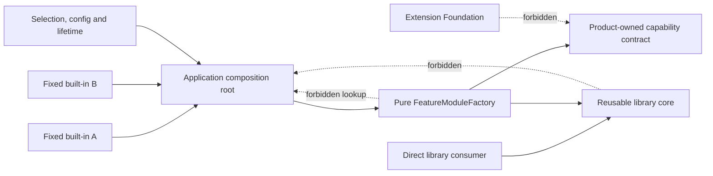

# Invariant Map

> Historical qualification evidence. This page is non-operative. Use the
> [current productization gate](../module-system-v1-productization/README.md),
> [ADR-0014](../../decisions/0014-product-local-module-authoring-composition-and-generation-guardrails.md),
> and [ADR-0015](../../decisions/0015-authorize-get-modular-semantic-extraction.md)
> for current authority and implementation gates.

## Dependency Direction

The arrows are compile-time dependencies for the current rehearsal. Foundation
never imports product models. A library consumer never needs the module or
plugin stack. The feature factory receives explicit dependencies and remains
pure; the application composition root alone selects implementation,
configuration, and lifetime. Neither exposes a global service locator.

## Ownership Invariants

| Invariant | Owner | Mechanical evidence |
| --- | --- | --- |
| Aggregate transitions and business invariants | Owning product bounded context | Source graph, use-case tests, repository/UoW boundaries |
| Product extension contract | Owning product feature | Feature entrypoint, compatibility fixtures, conformance suite |
| Static rehearsal selection, configuration and lifetime | Owning application's composition root | Static imports, materialized selection, composition tests |
| Pure feature composition | Owning product feature | `FeatureModuleFactory` tests and source dependency checks |
| Triggered first-consumer private graph semantics and lifecycle outcomes | Owning product after measured need and separate approval | Product-local descriptors, diagnostics, traces and comparison with static baseline |
| Admitted cross-product module identity, graph semantics and lifecycle outcomes | Extension Foundation after extraction approval | Serializable descriptors and cross-host traces from two independent consumers |
| Artifact identity and immutable digest | Extension Foundation protocol | OCI digest and signature/provenance verification |
| Catalog governance records | Selected catalog authority | PostgreSQL revision and signed snapshot evidence |
| Product authorization | Product Access Control or owning policy | Revision/fence-bound decision evidence |
| Runtime enforcement | Owning product host; AR for runtime execution | Invocation grant, generation fence, audit result |
| Private state custody | Product or tenant authority | Operation-specific custody authorization |

## Conditional Graph Invariants

No graph is part of the current rehearsal. The following preserved invariants
apply only if measured runtime-selection or independent-lifecycle need triggers
an approved private product graph. They are constraints on later work, not
evidence that the graph should be built.

1. The complete selected profile is validated and admitted before executable
   extension code is evaluated. The owning product validates its first graph
   against its product invariants; Foundation cannot do so on its behalf.
2. Provider selection is explicit and deterministic, and the exact provider
   authority/installation/contribution/digest binding is carried by the plan
   receipt and graph generation. Registration order, object
   iteration order, filesystem order, and mutable tags are not semantics.
3. Single-provider and ordered multi-provider contracts are distinct.
4. Missing required providers, duplicate single providers, ambiguous selection,
   invalid scopes, incompatible versions, and hard cycles fail closed.
5. A module receives an immutable dependency object containing only declared
   direct capabilities. No resolver, parent fallback, global registry, or
   container is exposed.
6. The plan candidate has canonical serialization and an authority scope.
   `PlanContentDigest` exists only on the post-admission receipt and is never a
   caller input. Each non-reused graph generation maps to exactly one such
   receipt and provider-binding digest.
7. A graph is composition evidence, not authorization.

## Lifecycle And Concurrency Invariants

These invariants likewise apply only to a triggered lifecycle runtime. Phase 1
uses application-owned construction and reconstruction of the smallest owned
authority realm for recovery; it does not claim a universal restart rule or
generalize these research outcomes into a coordinator.

1. Discovery, verification, admission, and graph compilation do not execute
   extension code.
2. Candidate resources are isolated from active routing until readiness passes.
3. Startup is single-flight per operation identity and exact activation
   fingerprint; caller cancellation does not silently cancel shared startup.
   Distinct operation identities are distinct competing candidates even when
   their source and plan match, and publication CAS still admits only one.
4. Admission/validation, provider execution, and activation/handoff have three
   distinct absolute deadlines. None is collapsed into a generic timeout or
   refreshed between phases; caller observation and cleanup/reconciliation are
   separate bounded wait policies.
5. Publication has one linearization point and atomically selects one active
   graph generation for the authority scope.
6. Invocation admission binds graph generation, module activation generation,
   activation source, an independent current product-authorization revision,
   and a current capability-grant revision.
7. A stale generation cannot publish routes or commit fenced durable writes.
8. Rollback and stop follow the reverse successful-activation dependency DAG,
   continue bounded cleanup after individual failures, and preserve all errors.
9. External effects have durable intent and explicit confirmed, failed, pending,
   or uncertain outcomes. Uncertain effects are reconciled before retry.
10. Local mutexes and distributed leases may optimize work but do not replace
    revisions, compare-and-set, fences, idempotency, or reconciliation.
11. Every fenced operation rereads its applicable current heads, generation,
    revisions, custody owner and sink fence from authoritative state at the
    linearization point; cached and caller-asserted values establish no fence.
12. Disablement wins its required compare-and-set before sealing. A stale writer
    cannot seal, revoke, drain, stop, or finalize disabled state.
13. Migration preserves the old active generation and valid state until the
    admitted replacement passes product comparison/fencing rules and handoff.
14. Artifact verification, plan admission, provider execution, graph
    construction, activation, product authorization and runtime enforcement
    remain independent facts. Executable evaluation waits for their complete
    applicable authority intersection.

## Trust Invariants

- In-process modules are fully trusted.
- A Node worker or `utilityProcess` is a responsiveness and crash boundary, not
  automatically a malicious-code sandbox.
- A Web Worker removes DOM authority but normally retains origin network and
  storage authority unless independently restricted.
- Arbitrary third-party Node/native code requires an OS-enforced process,
  container, or stronger isolation boundary.
- Manifest permissions are requests. The product grants narrower revocable
  capabilities and mediates every privileged call.
- Signatures and provenance establish identity and build evidence according to
  policy; they do not prove benign behavior.
- Manual revocation identifies the complete immutable OCI descriptor and
  executable child digests, consumes a monotonic authenticated local revocation
  revision, propagates by advancing product fences, and never uses mutable tags
  or names as revocation identity.
- Secrets remain behind `SecretRef` and a product-owned secret broker. Raw
  secrets, ambient environment, cookies, and broad credentials are not module
  dependencies.

## Evidence Invariants

- One validated model drives compiler output, diagnostics, tests, diagrams, and
  AI-readable navigation.
- Every diagnostic has a stable code, source/manifest evidence, useful
  deterministic dependency path, owner, and remediation. Shortest-path
  optimality is a separate production requirement where it materially improves
  diagnosis.
- Runtime observations never overwrite intended architecture.
- Public packages are tested as packed artifacts from empty consumers against
  oldest and newest supported combinations.
- A production SPI is admitted only after two independently authored
  implementations pass the same positive and negative conformance suite.
- A second consumer must have a real executable semantic need. A copied
  implementation or non-executable AR descriptor is not independent graph or
  lifecycle evidence.
- One-way imports bound candidate file movement but do not make extraction
  mechanical. Semantic reconciliation, ownership, versioning, compatibility,
  migration, and release policy require explicit review.
