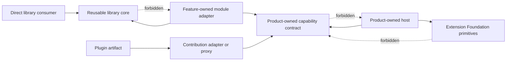

# Invariant Map

## Dependency Direction

The arrows are compile-time dependencies. Foundation never imports product
models. A library consumer never needs the module or plugin stack.

## Ownership Invariants

| Invariant | Owner | Mechanical evidence |
| --- | --- | --- |
| Aggregate transitions and business invariants | Owning product bounded context | Source graph, use-case tests, repository/UoW boundaries |
| Product extension contract | Owning product feature | Feature entrypoint, compatibility fixtures, conformance suite |
| Effective pre-implementation module identity, graph semantics and lifecycle outcomes | Extension Foundation under ADR-0012; implementation blocked pending `UMEQ-011` and `UMEQ-013` | Accepted ownership plus unresolved runtime-admission gates |
| Proposed first-consumer private module identity, graph semantics and lifecycle outcomes | Owning product feature only after ADR-0013 acceptance | Product-local descriptors, diagnostics and traces |
| Admitted cross-product module identity, graph semantics and lifecycle outcomes | Extension Foundation after extraction approval | Serializable descriptors and cross-host traces from two independent consumers |
| Artifact identity and immutable digest | Extension Foundation protocol | OCI digest and signature/provenance verification |
| Catalog governance records | Selected catalog authority | PostgreSQL revision and signed snapshot evidence |
| Product authorization | Product Access Control or owning policy | Revision/fence-bound decision evidence |
| Runtime enforcement | Owning product host; AR for runtime execution | Invocation grant, generation fence, audit result |
| Private state custody | Product or tenant authority | Operation-specific custody authorization |

## Graph Invariants

1. The complete selected profile is validated before executable extension code
   is loaded.
2. Provider selection is explicit and deterministic. Registration order, object
   iteration order, filesystem order, and mutable tags are not semantics.
3. Single-provider and ordered multi-provider contracts are distinct.
4. Missing required providers, duplicate single providers, ambiguous selection,
   invalid scopes, incompatible versions, and hard cycles fail closed.
5. A module receives an immutable dependency object containing only declared
   direct capabilities. No resolver, parent fallback, global registry, or
   container is exposed.
6. The plan has canonical serialization, a digest, an authority scope, and a
   non-reused graph generation.
7. A graph is composition evidence, not authorization.

## Lifecycle And Concurrency Invariants

1. Discovery, verification, admission, and graph compilation do not execute
   extension code.
2. Candidate resources are isolated from active routing until readiness passes.
3. Startup is single-flight per operation identity and exact activation
   fingerprint; caller cancellation does not silently cancel shared startup.
   Distinct operation identities are distinct competing candidates even when
   their source and plan match, and publication CAS still admits only one.
4. Every phase uses one absolute operation deadline. A cleanup cap may shorten
   the remaining budget but never refresh or extend it.
5. Publication has one linearization point and atomically selects one active
   graph generation for the authority scope.
6. Invocation admission binds graph generation, module activation generation,
   activation source, an independent current product-authorization revision,
   and a current capability-grant revision.
7. A stale generation cannot publish routes or commit fenced durable writes.
8. Rollback and stop follow the reverse successful-activation dependency DAG,
   continue bounded cleanup after individual failures, and preserve all errors.
9. External effects have durable intent and explicit confirmed, failed, pending,
   or uncertain outcomes. Uncertain effects are reconciled before retry.
10. Local mutexes and distributed leases may optimize work but do not replace
    revisions, compare-and-set, fences, idempotency, or reconciliation.

## Trust Invariants

- In-process modules are fully trusted.
- A Node worker or `utilityProcess` is a responsiveness and crash boundary, not
  automatically a malicious-code sandbox.
- A Web Worker removes DOM authority but normally retains origin network and
  storage authority unless independently restricted.
- Arbitrary third-party Node/native code requires an OS-enforced process,
  container, or stronger isolation boundary.
- Manifest permissions are requests. The product grants narrower revocable
  capabilities and mediates every privileged call.
- Signatures and provenance establish identity and build evidence according to
  policy; they do not prove benign behavior.
- Secrets remain behind `SecretRef` and a product-owned secret broker. Raw
  secrets, ambient environment, cookies, and broad credentials are not module
  dependencies.

## Evidence Invariants

- One validated model drives compiler output, diagnostics, tests, diagrams, and
  AI-readable navigation.
- Every diagnostic has a stable code, source/manifest evidence, useful
  deterministic dependency path, owner, and remediation. Shortest-path
  optimality is a separate production requirement where it materially improves
  diagnosis.
- Runtime observations never overwrite intended architecture.
- Public packages are tested as packed artifacts from empty consumers against
  oldest and newest supported combinations.
- A production SPI is admitted only after two independently authored
  implementations pass the same positive and negative conformance suite.
