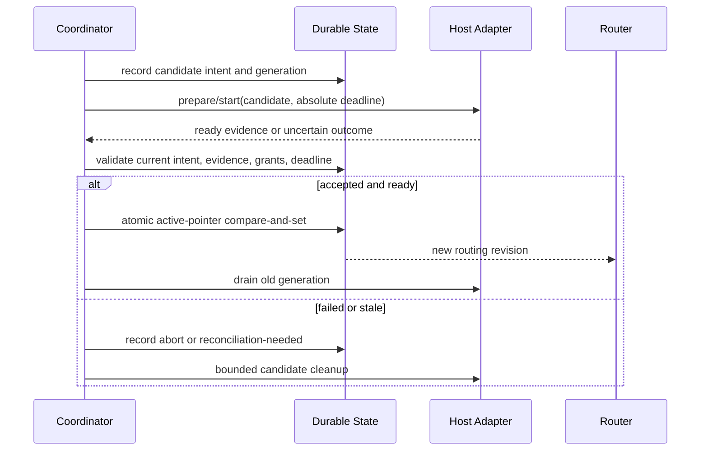
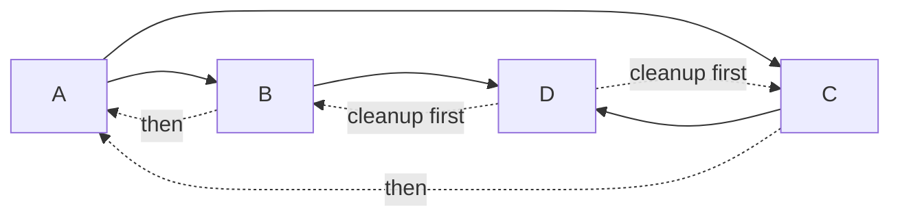
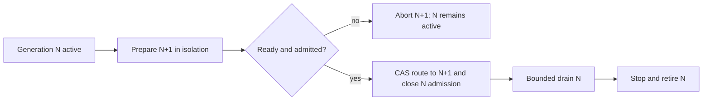

# Lifecycle And Concurrency

## Recommended Model

Use one monotonic `GraphGeneration` per product authority scope and one
`ModuleActivationGeneration` per module activation within that graph. A host may map
these values to database revisions, compare-and-set tokens, process epochs, or
leases, but it must not expose competing generation models to module code.

Distributed adapters keep additional infrastructure identities separate:

- `Fence` strictly increases when effect authority moves;
- `RouteRevision` changes weights or replica membership without transferring
  effect authority;
- `IntentId` identifies the durable rollout and its idempotency scope;
- `ReplicaIncarnation` changes after every replica restart;
- `OperationId` deduplicates or reconciles one externally visible attempt.

Rollback is a forward transition to a fresh generation and higher fence. It
never revives a prior epoch or decrements authority.


Discovery, verification, admission, and graph compilation are effect-free.
`prepare` may allocate only generation-scoped staging resources. No candidate
receives traffic or canonical mutation authority before the publish commit.

## Phase Contract

| Phase | Allowed work | Durable evidence |
| --- | --- | --- |
| Discover | Parse inert metadata | Source and descriptor identity |
| Verify | Digest, signature, provenance, schema checks | Verification result |
| Admit | Product policy and requested capability evaluation | Admission decision and expiry |
| Plan | Compile complete graph | Plan digest and generation |
| Prepare | Allocate staging resources | Durable activation intent |
| Start | Start generation-scoped runtime | Start attempt and host evidence |
| Ready | Prove actual service readiness | Readiness evidence bound to generation |
| Publish | Atomically select candidate routing | One active-generation pointer |
| Drain | Reject new old-generation admission, finish bounded work | Drain cutoff and in-flight evidence |
| Stop | Release resources in reverse activation order | Cleanup results and debt |
| Retire | Remove target references according to retention policy | Tombstone and retirement evidence |

The lifecycle coordinator invokes no plugin or provider code inside a product
Unit of Work. Durable intent is committed first, dispatch happens after commit,
and results are accepted only when operation, scope, generation, deadline, and
current authority still match.

## Prepare, Commit, And Abort



Candidate failure never changes active routing. A successful candidate has one
publication linearization point. Cleanup is not the linearization point and
may continue after a failed cleanup is recorded as bounded debt.

## Single-Flight And Races

Startup is one logical flight per `(authority scope, module identity, candidate
generation, activation fingerprint)`. One hundred concurrent same-fingerprint
starts join one attempt and observe the same durable result. A waiter's timeout
or cancellation detaches that waiter; it does not cancel shared startup.

The disposable in-memory spike retains completed operation results and sealed
generations for its process lifetime so qualification can prove replay and stale
rejection. A completed replay remains available after the original waiter's
deadline; cancellation and an explicit deadline belong to the current waiter.
It is not a production retention design. A product coordinator must
persist idempotency outcomes for an explicit bounded policy, compact them only
after the retry and reconciliation horizon, and preserve a tombstone sufficient
to reject stale generations.

The activation fingerprint binds the exact resolved hook bundle and host-adapter
implementation through an activation-source digest, plus plan, authority scope,
profile/configuration/grant/host-policy revisions, deadline, and cleanup policy.
Functions are never serialized to invent identity. Resolution creates the
digest before lifecycle admission and snapshots the corresponding hook bindings.
The complete caller-owned activation identity is copied and frozen at the same
boundary. Later caller mutation cannot change idempotency, compare-and-set, or
publication authority for an admitted flight.

An in-process invocation handle is an object-identity capability issued by one
lifecycle instance. Its private membership, exact authority scope, generation,
and release state are checked together. Numeric lease fields are diagnostics,
not durable or cross-process authority; a structurally identical object or a
handle issued by another scope is rejected.

| Race | Required result |
| --- | --- |
| Same candidate start/start | Join one attempt |
| Different candidate start/start | Explicit conflict; no last-writer-wins |
| Start ready callback versus stop | Higher current generation rejects stale callback |
| Stop versus pending reload | Stop supersedes or follows a committed cutover deterministically |
| Two publishers | One compare-and-set wins; loser aborts candidate |
| Lease/admission versus drain seal | Ordered authority admits before seal or rejects after seal |
| Old invocation versus cutover | Commit-time fence orders success before barrier or rejects after it |
| Caller timeout versus success | Caller receives outcome-unknown and may reconcile |
| Late completion versus deadline | Late result is stale and cannot publish |
| Reentrant `A -> B -> A` | Fail synchronously with a causal-cycle diagnostic |

Relative timeout refresh is forbidden. One absolute deadline follows every hop,
retry, joiner, and adapter. Authority time determines expiry. An in-process host
also carries one independent monotonic wall-time bound for correctness: a stalled,
throwing, or non-finite injected clock fails closed and cannot refresh activation,
drain, or cleanup budgets between phases. `cleanupTimeoutMs` is only a tighter
cap inside that operation deadline; it never extends the lifecycle operation.

A correctness deadline remains a referenced event-loop obligation while its
result is awaited. Its timer must stay referenced: a standalone host must stay
alive long enough to record timeout or `termination_unproven` evidence before
orderly exit. Process custody may use stronger external supervision, but never
weaker in-process deadline semantics.

The disposable spike proves waiter detachment and publication CAS. Reentrant
causal-path detection remains a required Phase 2 fixture; it is not implemented
by the current ID-DAG compiler.

## Readiness

Process availability, transport connection, provider acceptance, and readiness
are distinct. Readiness evidence is generation-bound and policy-specific. It
may include health checks, protocol negotiation, dependency readiness, and
product conformance, but it is never inferred solely from a process PID or a
successful `start` return.

Required dependents cannot start until providers are ready. Optional provider
failure does not automatically fail a consumer; the compiled dependency object
must represent absence explicitly. Readiness regression after publication
creates an observable failure and product policy chooses restart, replacement,
degradation, or stop.

## Rollback And Cleanup

Rollback traverses the successful activation DAG, not descriptor order. Modules
in the same reverse level may stop concurrently when their host tier permits it.



Cleanup requirements:

- idempotency by operation and module activation generation;
- one bounded deadline;
- continue independent cleanup after one failure;
- aggregate all errors without losing the first cause;
- record ownership and compensator or cleanup debt for every resource;
- never delete resources owned by another generation;
- prevent late callbacks from recreating retired state;
- detect leaked timers, listeners, streams, child processes, and unresolved
  promises in conformance tests.

A hung disposer is fenced or force-stopped only when its host provides that
authority. A trusted in-process hook that ignores cancellation is reported as
`termination_unproven`; late canonical effects remain fenced, but JavaScript
termination is not claimed. The coordinator waits only for bounded wrappers;
ignored hook work may overlap cleanup and remains cleanup debt until a stronger
host proves termination. A synchronous CPU-blocking `T0` hook can also block the
event loop and therefore cannot receive a hard in-process time bound. The
wrapper detects elapsed deadline after a finite blocking call and refuses to
confirm it, but code requiring a hard bound must run in a Worker, process, WASM
host, or another externally supervised boundary with forced termination.

## Replacement And Update

V1 uses restart-safe generation replacement, not arbitrary hot unload.



Publication is the commit point. Any drain, stop, clock, or cleanup failure after
that point leaves the new generation active and records `termination_unproven`
cleanup debt for the old generation. It must never enter candidate rollback or
silently restore the old route. Recovery may record retirement only after host
observation proves the old generation stopped and cleanup reconciliation is
confirmed; absence of in-flight work alone is not termination evidence.

An in-process trusted module may implement a proven reversible reload hook, but
the baseline still allows the host to restart the affected graph or process.
Third-party plugin updates default to side-by-side candidate preparation and
process replacement. A cleanup hook is useful evidence, not proof that arbitrary
code can be unloaded safely.

Uninstall stops new activation and removes the installation reference. It does
not automatically delete user or product data. Data export, retention,
detachment, and deletion are separate product-owned operations.

## Drain And Fencing

Drain has two boundaries:

1. **Admission cutoff:** no new work enters the old module activation generation.
2. **Commit cutoff:** after the absolute drain deadline or cutover barrier, old
   work cannot commit fenced durable effects.

Stopping a process alone is not correctness evidence. Stale routers and resumed
processes must fail current generation or grant checks. Local hosts may use an
in-memory single writer plus persisted revisions. Distributed hosts need a
linearizable compare-and-set or ordered commit authority. Both implement the
same observable contract.

Distributed atomicity claims remain explicit:

1. **Decision atomicity** is one linearizable route-head compare-and-set.
2. **Admission atomicity** needs one shared request gate or a confirmed barrier
   across every old effect-capable replica.
3. **Effect atomicity** exists only where the authoritative sink validates the
   current fence at transaction commit.

Routers converge asynchronously. A stale router is therefore expected and must
be made harmless by request and sink fencing. Multiple independent effect
stores cannot honestly claim globally atomic cutover without a shared
transaction authority, serialized gate, or explicit saga.

External side effects cannot be made exactly once by the module runtime. The
allowed patterns are:

- transactional fence validation with the product mutation;
- ordered durable intent/outbox with idempotency;
- resource-native fencing or idempotency keys;
- reconciliation after an ambiguous outcome.

Blind retry after an unknown external result is forbidden.

## Crash And Recovery

The durable model stores intent and evidence, not call-stack continuation:

```text
LifecycleIntent
  operationId
  authorityScope
  graphGeneration
  moduleActivationGeneration
  activationFingerprint
  phase
  absoluteDeadline
  planDigest
  grantRevision
  expectedActiveGeneration

LifecycleEvidence
  operationId
  intentDigest
  authorityScope
  graphGeneration
  moduleActivationGeneration
  activationFingerprint
  expectedActiveGeneration
  routeRevision
  sinkFence
  replicaIncarnation
  phase
  outcome: confirmed | failed | pending | uncertain
  hostEvidenceRef
  payloadDigest
  observedAt
```

After restart, reconciliation compares durable intent, current active routing,
host facts, deadlines, and generation ownership. It resumes only idempotent
steps. An uncertain process or provider effect is queried before retry. If the
host cannot prove continuity, it fences the old generation and prepares a new
one or enters controlled recovery.

The current spike exercises deterministic reducer examples only. Before a
production lifecycle claim, fault-injection fixtures must crash a fresh
coordinator on both sides of durable intent, dispatch, ready acknowledgement,
publication compare-and-set, drain cutoff, debt recording and cleanup. Those
fixtures must replay duplicate and reordered messages and bind every observed
host fact to the complete intent/generation/fence/incarnation tuple.

## Host Tiers

| Host | Universal contract | Host-specific mechanism |
| --- | --- | --- |
| Trusted in-process | Closed dependencies, readiness, generation, bounded cleanup | Functions and scoped resource stack |
| Node Worker/Electron utility process | Same lifecycle plus serialized messages | Message ports, process health, force termination |
| OS-isolated process | Same lifecycle plus explicit protocol negotiation | IPC/RPC, OS containment, process-tree termination |
| Distributed service | Same lifecycle plus durable routing and reconciliation | CAS/consensus store, inbox/outbox, routers |
| Browser Worker/iframe | Same lifecycle plus origin and capability mediation | `postMessage`, schema validation, CSP/sandbox flags |
| WASM host | Same lifecycle plus component capability imports | Deferred Extism/WASI adapter |

One lifecycle state machine is shared semantically, but each host adapter has
its own containment, transport, and health implementation. Foundation does not
pretend that a Worker, process, browser iframe, or WASM component provides the
same security guarantees.

Controller leases support liveness only. Safety always comes from expected-state
compare-and-set and sink-enforced fences. After failover, a controller rebuilds
its decision from durable intent, route head, readiness attestations, outbox
state and absolute deadlines; process memory is never recovery authority.

## Qualification Rehearsal Boundary

Implement now in a disposable qualification spike:

- closed two-module graph;
- `prepare -> start -> ready -> publish`;
- single-flight concurrent starts;
- one absolute deadline;
- reverse-DAG abort and stop;
- active and candidate generations;
- one atomic in-memory compare-and-set seam;
- bounded drain and an in-memory fence simulation;
- deterministic traces and reducer-level crash/recovery examples.

Specify but defer production implementation and executable fault injection of:

- distributed consensus authority and multi-router deployment;
- arbitrary hot unload;
- public process wire protocol;
- durable database schema and migration;
- crash points around durable intent, dispatch, readiness, publication, drain
  and cleanup;
- Extism/WASM host;
- automatic retry policy for product-specific effects.

This keeps the first spike below roughly 1,500 implementation and test LOC. If
an adapter needs another overlapping lifecycle coordinator, it fails
qualification rather than enlarging the kernel.

## Conformance Minimum

- Invalid graph causes zero effects.
- One hundred concurrent starts produce one activation.
- Readiness blocks dependents and publication.
- Failed candidate leaves active routing unchanged.
- Successful candidate performs one cutover.
- Rollback follows reverse successful-activation dependencies.
- Timeout prevents late publication.
- A production sink rejects stale generation in the same atomic commit as its
  durable mutation; the spike proves only the in-memory ordering model.
- Hung cleanup remains bounded and observable.
- Restart/replay reaches the same stable or terminal result.
- Different host adapters produce the same applicable semantic trace.
- Test teardown reports no leaked timer, listener, process, or unhandled
  rejection.
