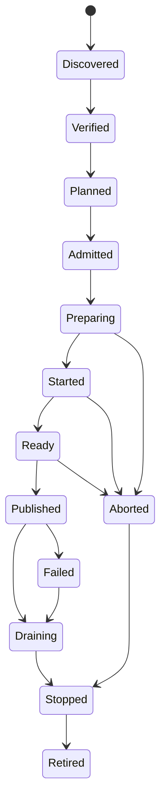
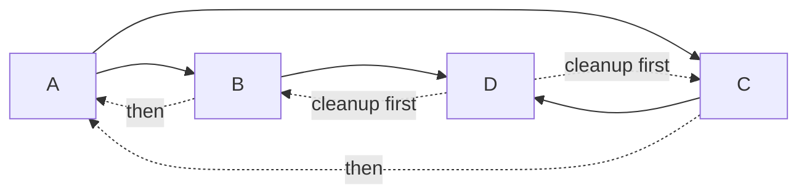
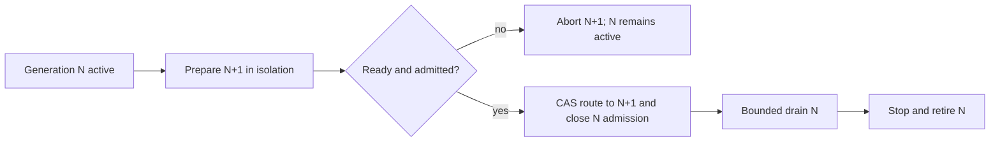

# Lifecycle And Concurrency

## Recommended Model

Use one monotonic `CandidateGeneration` per product authority scope, one
distinct `RuntimeGeneration` per concrete runtime incarnation, and one
`ModuleActivationGeneration` per module activation within that candidate and
runtime. A host may map these values to database revisions, compare-and-set
tokens, process epochs, or leases, but it must not collapse or expose competing
generation models to module code.

Distributed adapters keep additional infrastructure identities separate:

- `Fence` strictly increases when effect authority moves;
- `RouteRevision` changes weights or replica membership without transferring
  effect authority;
- `IntentId` identifies the durable rollout and its idempotency scope;
- `ReplicaIncarnation` changes after every replica restart;
- `OperationId` deduplicates or reconciles one externally visible attempt.

Rollback is a forward transition to a fresh generation and higher fence. It
never revives a prior epoch or decrements authority.

`CandidateGeneration` is allocated only from one immutable `AdmittedPlanReceipt`.
The durable projection records authority scope, `PlanContentDigest`, exact
provider-binding digest, admission decision and generation together. A retry of
the same durable candidate retains its generation; every newly allocated
activation, replacement, disablement, restart, or forward rollback receives a
higher generation even when admitted content is byte-identical. No generation
may float to another receipt, scope, provider binding, or inferred provider. A
candidate references a `RuntimeGeneration` only through a durable
`StagedRuntimeReferencePin` serialized with runtime retirement. Publication
promotes that exact pin; abandonment releases it only after candidate effects
are terminal or reconciled.



Discovery, verification, graph compilation, and admission are effect-free.
The compiler emits an inert admission candidate; successful admission then
issues `AdmittedPlanReceipt` and its `PlanContentDigest`. The owning product,
not ordinary extension infrastructure, validates its first graph against its
own invariants before that receipt can authorize activation.
`prepare` may allocate only generation-scoped staging resources. No candidate
receives traffic or canonical mutation authority before the publish commit.

## Phase Contract

| Phase | Allowed work | Durable evidence |
| --- | --- | --- |
| Discover | Parse inert metadata | Source and descriptor identity |
| Verify | Digest, signature, provenance, schema checks | Verification result |
| Plan | Compile complete inert graph candidate with explicit providers | Template and candidate comparison digests; no `PlanContentDigest` or generation |
| Admit | Product policy, requested capability, provider binding, and product-owned graph validation | `AdmittedPlanReceipt`, `PlanContentDigest`, provider-binding digest, decision and expiry |
| Prepare | Allocate staging resources | Durable activation intent |
| Start | Start generation-scoped runtime | Start attempt and host evidence |
| Ready | Prove actual service readiness | Readiness evidence bound to generation |
| Publish | Atomically select candidate routing | One active-generation pointer |
| Drain | Reject new old-generation admission, finish bounded work | Drain cutoff and in-flight evidence |
| Stop | Release resources in reverse activation order | Cleanup results and debt |
| Retire | Remove target references according to retention policy | Tombstone and retirement evidence |

Each receipt establishes only the fact named by its phase. Verification does
not admit; admission does not authorize provider execution; graph construction
does not activate; readiness does not grant product authorization; publication
does not prove runtime enforcement. The lifecycle coordinator invokes no plugin or provider code inside a product
Unit of Work. Durable intent is committed first, dispatch happens after commit,
and results are accepted only when operation, scope, generation, all applicable
deadlines, and current authority still match.

## Prepare, Commit, And Abort

```mermaid
sequenceDiagram
    participant C as Coordinator
    participant S as Durable State
    participant H as Host Adapter
    participant R as Router

    C->>S: validate/admit inert plan by admission deadline; allocate generation
    C->>S: read current heads, grants, authorization and fence inputs
    C->>H: prepare/start(explicit providers, provider execution deadline)
    H-->>C: ready evidence or uncertain outcome
    C->>S: reread authoritative current heads, grants and fences
    alt accepted and ready
        C->>S: atomic active-pointer compare-and-set by handoff deadline
        S-->>R: new routing revision
        C->>H: drain old generation
    else failed or stale
        C->>S: record abort or reconciliation-needed
        C->>H: bounded candidate cleanup
    end
```

Candidate failure never changes active routing. A successful candidate has one
publication linearization point. Cleanup is not the linearization point and
may continue after a failed cleanup is recorded as bounded debt.

## Single-Flight And Races

Startup is one logical flight per `(operation identity, activation
fingerprint)`. One hundred concurrent starts with the same operation identity
and fingerprint join one attempt and observe the same durable result. Reusing
that operation identity with a changed fingerprint is an idempotency conflict.
Distinct operation identities intentionally represent distinct competing
candidates even when source and plan match; expected-active compare-and-set
still permits only one publication. A waiter's timeout or cancellation detaches
that waiter; it does not cancel shared startup.

The disposable in-memory spike retains completed operation results and sealed
generations for its process lifetime so qualification can prove replay and stale
rejection. A completed replay remains available after the original waiter's
deadline; cancellation and an explicit deadline belong to the current waiter.
It is not a production retention design. A product coordinator must
persist idempotency outcomes for an explicit bounded policy, compact them only
after the retry and reconciliation horizon, and preserve a tombstone sufficient
to reject stale generations.

The post-admission activation fingerprint binds the admitted provider identities, exact
resolved hook bundle and host-adapter implementation through an
activation-source digest, plus admission receipt, plan, authority scope,
profile/configuration, independent product-authorization, capability-grant and
host-policy revisions, all three fixed deadline values, and cleanup policy.
Functions are never serialized to invent identity. Before admission, only inert
provider references and verified executable digests are resolved. Executable
hook lookup and evaluation occur after admission and only when verification,
current revocation status, explicit provider binding, product authorization,
grants, host policy, and the freshly read generation fence intersect.
The complete caller-owned activation identity is copied and frozen at the same
boundary. Later caller mutation cannot change idempotency, compare-and-set, or
publication authority for an admitted flight.

An in-process invocation handle is an object-identity capability issued by one
lifecycle instance. Its private membership, exact authority scope, generation,
and release state are checked together. Numeric lease fields are diagnostics,
not durable or cross-process authority; a structurally identical object or a
handle issued by another scope is rejected.

| Race | Required result |
| --- | --- |
| Same candidate start/start | Join one attempt |
| Different candidate start/start | Explicit conflict; no last-writer-wins |
| Start ready callback versus stop | Higher current generation rejects stale callback |
| Stop versus pending reload | Stop supersedes or follows a committed cutover deterministically |
| Two publishers | One compare-and-set wins; loser aborts candidate |
| Lease/admission versus drain seal | Ordered authority admits before seal or rejects after seal |
| Old invocation versus cutover | Commit-time fence orders success before barrier or rejects after it |
| Caller timeout versus success | Caller receives outcome-unknown and may reconcile |
| Late completion versus provider or handoff deadline | Late result is stale and cannot publish |
| Reentrant `A -> B -> A` | Fail synchronously with a causal-cycle diagnostic |

Relative timeout refresh is forbidden. Before verification begins, the product
persists one idempotent `AdmissionIntent` containing the operation identity,
authority scope, candidate comparison digest, inert provider references, an
`AdmissionRequestFingerprint`, and all three distinct non-renewable absolute
deadlines on authority clocks. The request fingerprint covers only immutable
pre-admission inputs: inert source and plan-template digests, verified executable
digest references, configuration and policy revisions, provider references,
authority scope, and the three clock-qualified cutoffs. It cannot include an
admission receipt, admitted provider binding, candidate generation, evaluated
hook, or other fact that does not yet exist. A retry with the same operation and
request fingerprint reuses this intent; a changed fingerprint conflicts.
Successful admission atomically attaches the receipt, content digest, provider
binding, and candidate generation to that intent and computes the distinct
post-admission `ActivationFingerprint`. A crash before admission
therefore cannot refresh a deadline or allocate another receipt/generation.
None of the three deadlines is inferred from or collapsed into a generic
operation timeout:

| Deadline | What it bounds | Clock and boundary receipt |
| --- | --- | --- |
| Admission/validation | Inert verification, graph construction, product-owned invariant validation, policy evaluation, and issuance of `AdmittedPlanReceipt` | The admission authority clock and decision receipt prove completion by this deadline. Expiry yields no receipt, digest, or generation and leaves current desired and active state unchanged. |
| Provider execution | Evaluation and execution of explicitly bound provider code, including prepare/start and acceptance of its readiness result | A persisted authority-clock cutoff is the durable source of truth. Each host incarnation derives a non-renewable local monotonic watchdog from the remaining interval and records its incarnation. If clock continuity or the authority cutoff cannot be proved after restart/failover, execution fails closed into reconciliation; it never derives a fresh duration. Provider receipts bind provider identity, admitted receipt, candidate/runtime generations, attempt, cutoff, and observed completion. |
| Activation/handoff | Final validation and the product-owned active-head compare-and-set that hands routing or effect authority to the ready generation | The product authority clock decides expiry. The CAS and authoritative sink receipts bind intent, admitted receipt, generation, dynamically read fence, and authority timestamp. Expiry forbids handoff even if provider execution completed. |

The deadlines can differ and govern different facts. No heartbeat, progress
event, phase transition, retry, adapter hop, queue wait, or cleanup activity
extends or rebases any of them. A host-monotonic value is only an
incarnation-local enforcement aid, never the durable deadline. Caller
observation and termination/reconciliation use
separate bounded wait policies; they are not substituted for these authority
deadlines and cannot authorize admission, provider execution, or handoff.

Each persisted deadline is an `AuthorityClockCutoff`, not a bare number. It
contains authority identity, clock domain and epoch, unit, cutoff value, and the
decision revision that issued it. Every deadline receipt and `AuthorityTimestamp`
binds the same clock tuple. A replacement host may derive a local monotonic
watchdog only from a proven mapping to that tuple; missing or discontinuous clock
provenance enters reconciliation and never creates a new duration.

The disposable spike instead has one activation deadline, a cleanup cap and a
bounded 100 ms default waiter grace. Those mechanics are useful evidence for
non-renewal and waiter detachment, but they do not implement the three-deadline
durable contract.

Each in-process watchdog used to enforce an applicable fixed deadline remains a
referenced event-loop obligation while its result is awaited. Its timer must
stay referenced: a standalone host must stay alive long enough to record timeout
or `termination_unproven` evidence before orderly exit. Process custody may use
stronger external supervision, but never weaker in-process deadline semantics.

The disposable spike proves waiter detachment and publication CAS. Reentrant
causal-path detection remains a required Phase 2 fixture; it is not implemented
by the current ID-DAG compiler.

## Readiness

Process availability, transport connection, provider acceptance, startup
completion, and readiness are distinct. Readiness evidence is generation-bound
and policy-specific. It may include health checks, protocol negotiation,
dependency readiness, and product conformance, but it is never inferred solely
from a process PID, an accepted connection, or a successful `start` return.

Every provider selected by the immutable compiled plan is part of the candidate.
Its startup or readiness failure aborts that candidate and leaves active routing
unchanged. This is equally true when the consuming slot was declared optional:
optional absence exists only when compilation explicitly binds that slot to
`null`/unbound and records the resulting dependency object and behavior. The
runtime never converts failure of a selected provider into absence and never
falls back to another provider. Required dependents cannot start until selected
providers are ready. Readiness regression after publication creates an
observable generation failure and product policy chooses a separately admitted
restart, replacement, declared degradation, or stop; it does not rewrite the
published binding.

## Rollback And Cleanup

Lifecycle ordering is compiled from typed edges, not descriptor order and not a
single universal DAG. At minimum the admitted model distinguishes:

- readiness dependencies, which derive the activation plan;
- invocation and resource-use edges, which derive admission sealing and drain;
- live routing, staged pin, lease, runtime, contribution, installation and
  custody references, which derive target-specific retirement;
- schema lineage, state-space custody and migration-step edges, which derive
  migration.

The static compiler validates declared typed relations and may emit the
immutable `ActivationPlan` from admitted readiness bindings. It does not know
live invocations, routes, pins, leases, resources, cleanup debt, or custody.
Before each operation, the owning product coordinator reads those facts from
the authoritative current stores and materializes a separate immutable
`DrainPlan`, `RetirementPlan`, or `MigrationPlan` with its own digest,
comparison revisions, and diagnostics. An edge may appear in more than one
projection only by an explicit derivation rule. Activation rollback traverses
the actually successful activation projection in reverse; modules in one
reverse level may stop concurrently when their host tier permits it. Drain
order follows current invocation and resource ownership, retirement follows
the exact discriminated ADR-0010 target and current references, and migration
follows current custody-authorized schema steps. The coordinator revalidates
all currentness-sensitive facts at the operation's linearization point;
reversing activation order alone proves none of those other plans.

Separate immutable operation projections remain: `ActivationPlan`,
`DrainPlan`, `RetirementPlan`, and `MigrationPlan`, even when an explicit
derivation rule shares a declared edge between them.



Cleanup requirements:

- idempotency by operation and module activation generation;
- one bounded termination cap in the disposable implementation;
- continue independent cleanup after one failure;
- aggregate all errors without losing the first cause;
- record ownership and compensator or cleanup debt for every resource;
- never delete resources owned by another generation;
- prevent late callbacks from recreating retired state;
- detect leaked timers, listeners, streams, child processes, and unresolved
  promises in conformance tests.

The coordinator snapshots a complete host-private hook record before effects.
The Node `T0` spike admits only own data fields on plain or null-prototype
objects and rejects Proxy objects before reflective inspection, so prototype or
accessor hooks cannot disappear during snapshotting. Untrusted contributions
never cross this boundary as JavaScript hook objects; their host adapter exposes
a validated protocol proxy instead. The first module failure aborts the shared
activation signal immediately so cooperative siblings can settle before the
bounded cleanup phase.

A hung disposer is fenced or force-stopped only when its host provides that
authority. A trusted in-process hook that ignores cancellation is reported as
`termination_unproven`; late canonical effects remain fenced, but JavaScript
termination is not claimed. The coordinator waits only for bounded wrappers;
ignored hook work may overlap cleanup and remains cleanup debt until a stronger
host proves termination. A synchronous CPU-blocking `T0` hook can also block the
event loop and therefore cannot receive a hard in-process time bound. The
wrapper detects elapsed deadline after a finite blocking call and refuses to
confirm it, but code requiring a hard bound must run in a Worker, process, WASM
host, or another externally supervised boundary with forced termination.

## Replacement And Update

The accepted UMEQ-016 baseline uses immutable desired-profile revisions,
distinct candidate generations, and compare-and-set active-head publication;
it does not promise arbitrary JavaScript unload. Physical termination remains a
host-specific open decision rather than an accepted restart-first rule.

Installation, desired enablement, active routing, runtime health, state custody,
and artifact retirement remain independent state planes. Enable or disable
therefore creates a new immutable desired-profile revision and compiles the
complete affected dependency closure; it never flips a mutable boolean in a
live registry.

### Desired-State Admission

Every desired-state mutation carries both `expectedDesiredHead` and
`expectedActiveHead`. Admission compares the complete pair in one serialized
decision:

- a desired-head mismatch returns `DESIRED_HEAD_CONFLICT` without staging;
- an active-head mismatch returns `ACTIVE_HEAD_CONFLICT` because the impact
  analysis and replacement basis are stale;
- when both mismatch, `DESIRED_AND_ACTIVE_HEAD_CONFLICT` is returned; and
- a duplicate operation with different expectations or payload returns
  `IDEMPOTENCY_CONFLICT`.

Conflict diagnostics are deterministic machine-readable values containing the
code, authority scope, operation identity, expected and observed desired heads,
expected and observed active heads, desired payload digest, and the stable
remediation (`REBASE`, `OBSERVE_IN_FLIGHT`, or `NEW_OPERATION`). Field order and
diagnostic selection do not depend on race timing.

Pending updates are bounded by product policy per authority scope. The admitted
policy states a fixed maximum queue depth and one of three actions for a new
update: queue in durable order, supersede an identified not-yet-published
candidate, or reject with `UPDATE_QUEUE_FULL`. Supersede is never implicit: it
records the predecessor and successor operations, seals predecessor effects,
and waits for bounded termination or reconciliation before releasing its
resources. A published candidate is not superseded; its replacement is another
forward generation. No last-writer-wins overwrite or unbounded waiter/update
queue is permitted.

```mermaid
stateDiagram-v2
    [*] --> DisabledClean
    DisabledClean --> Enabling: new desired revision
    Enabling --> Enabled: ready + publication CAS
    Enabling --> Aborting: failed or superseded
    Aborting --> DisabledClean: cleanup confirmed
    Aborting --> RestartRequired: termination unproven
    Enabled --> DisableCAS: disable candidate admitted
    DisableCAS --> Enabled: stale CAS rejected; no seal
    DisableCAS --> Sealing: active-head CAS wins
    Sealing --> Draining: new admission fenced
    Draining --> Stopping: complete or bounded cutoff
    Stopping --> DisabledClean: termination confirmed
    Stopping --> RestartRequired: cleanup or termination uncertain
    RestartRequired --> DisabledClean: fresh host incarnation + reconciliation
```



Dependency impact is compiled before staging:

- removing a provider for `required` blocks the change unless a separately
  reviewed plan also disables, replaces, or rebinds every affected dependent;
- removing an `optional` provider permits a consumer to remain active only when
  the consumer declares the exact degraded behavior and recovery semantics;
- a `many` binding must continue to satisfy its minimum, maximum, compatibility,
  ordering, scope, and authorization constraints;
- disabling a module means it is absent from the candidate graph, provider set,
  grants, and selected built-in loader closure. It remains distinguishable from
  uninstalled, denied, incompatible, failed, quarantined, and restart-required.

Disablement never seals first. After the inert disable candidate is admitted,
the coordinator rereads the authoritative desired head, active head, current
generation, route revision, grant revisions, and sink fences and performs the
required compare-and-set. Only its winning transaction records the new head and
seal that rejects new work. A stale or losing writer records conflict only; it
cannot seal admission, revoke grants, drain, stop, or finalize disabled state.

Each activation generation owns a host-created resource scope before any module
hook runs. It combines one generation-bound abort signal, a tracked task group,
an invocation registry, LIFO asynchronous disposal, late-acquisition rejection,
and resource-specific custody for timers, listeners, streams, sockets, Workers,
child processes, queues, and external leases. Resource acquisition registers
cleanup before exposing the resource. Module top-level code and ambient
resources created outside host brokers cannot satisfy this contract.

`stop()` or `dispose()` returning is cleanup evidence, not cleanup proof.
`cleanup_confirmed` requires closed admission, joined or fenced work, attempted
disposers, terminal receipts for every effect-capable resource, no accepted late
acquisition, reconciled ambiguous external effects, and zero generation-owned
references. The provider-execution and activation/handoff deadlines from the
durable intent apply to their named phases. A separate bounded
termination/reconciliation cap is recorded as an `AuthorityClockCutoff` in the
applicable activation-cleanup or deactivation intent before dispatch. It is
never refreshed between cleanup phases or after recovery. Later disablement uses
a newly authorized deactivation operation and cutoff; it does not inherit or
reset the historical activation timeout.

For trusted in-process code, logical disable can fence brokered calls and
durable effects but cannot prove JavaScript unload, interrupt synchronous code,
or revoke escaped ambient authority. Any unjoined task, missing terminal receipt,
late resource acquisition, process-global mutation, changed cached module bytes,
or prior `termination_unproven` raises a durable `restart_required` high-water
mark for the exact host identity and incarnation. The mark records the earliest
open debt identity and highest affected generation/fence and is monotonic within
that incarnation; later in-memory success cannot clear or lower it.

While the high-water mark is open, the affected host may perform only fencing,
termination, inspection and reconciliation. It cannot admit new module work,
stage or publish a candidate, acquire a staged runtime pin, or receive a reused
runtime. Host process exit alone does not close the mark. Closure requires a
different host incarnation plus durable reconciliation proving the old
incarnation has no accepted work, live route, staged pin, invocation lease,
effect authority, runtime, or unresolved resource/external-effect receipt. The
closure receipt binds old and fresh host incarnations, debt range, authority
scope and current heads. Only then may the fresh host admit or publish. A
Worker, process, WASM store, or dedicated browser realm may claim stronger
termination only after its placement adapter observes realm exit and still
fences stale results at authoritative sinks.

### Staged Runtime Reuse

ADR-0010's staged pin protocol remains mandatory. Before a candidate references
an existing runtime generation it durably acquires a
`StagedRuntimeReferencePin` under the same retirement fence that decides runtime
retirement. Publication atomically promotes all candidate pins to live routing
references. Abandonment releases them atomically only after candidate work and
startup effects are terminal or reconciled. Recovery reconstructs pins from
durable candidate evidence, and a pin rejected because retirement won forces
recompilation against a current runtime; it never revives the retiring runtime.

Runtime retirement is eligible only after the fence rechecks that no live
routing snapshot, staged candidate pin, or accepted bounded invocation lease
references the runtime, then records retirement intent and prevents later pin
acquisition. This applies to trusted in-process (`T0`) runtimes as well as
stronger hosts. The disposable T0 spike always creates fresh runtime state and
does not implement durable pins. T0 runtime reuse is therefore prohibited until
pin acquisition, atomic promotion, abandonment release, crash reconstruction,
late-pin rejection and the retirement-fence race are implemented and pass the
ADR-0010 positive and negative fixtures.



Publication is the commit point. Any drain, stop, clock, or cleanup failure after
that point leaves the new generation active and records `termination_unproven`
cleanup debt for the old generation. It must never enter candidate rollback or
silently restore the old route. Recovery may record retirement only after host
observation proves the old generation stopped and cleanup reconciliation is
confirmed; absence of in-flight work alone is not termination evidence.

An in-process trusted module may implement a proven reversible reload hook, but
the baseline still allows the host to restart the affected graph or process.
Third-party plugin updates default to side-by-side candidate preparation and
process replacement. A cleanup hook is useful evidence, not proof that arbitrary
code can be unloaded safely.

Artifact or contribution update cannot attach, rebind, or migrate persistent
state merely because schemas or publisher lineage are compatible. Before any
candidate with persistent state can publish, its separate `MigrationPlan` must
pass an explicit state migration gate. The gate verifies the exact current and
proposed installation or activation-source identities, state-space and authority
scope, publisher and extension lineage, schema transition,
`AdmittedPlanReceipt`, `PlanContentDigest`, explicit provider binding, and one
current product- or tenant-owned `StateCustodyAuthorization` for the requested
attach/rebind/migrate operation. Migration prepares only a versioned staging
copy or a product-approved forward/backward-compatible change while the old
active generation and its valid state remain authoritative. Concurrent source
writes are handled by one explicit product-owned strategy: either seal old
write admission, copy the final delta, and prove quiescence, or continuously
capture/dual-write changes under a source revision watermark and prove the
staging sink has applied through that watermark. A snapshot copy alone is never
sufficient.

At every step the product custody authority rereads the current owner revision,
active head, candidate and runtime generations, migration revision, source-state
revision/change-log watermark, staging-applied watermark, write-barrier state,
and sink fence inside the fenced operation; caller assertions or material
cached at planning time are comparison inputs only. Per-step receipts bind
those observed values. The handoff linearization point atomically verifies that
old writes are sealed or the staging sink is caught up through the current
source watermark, then advances the authoritative state reference and route.
An ambiguous copy, barrier, or handoff step is reconciled, never retried
automatically. Only after the replacement is admitted, migration receipts and
comparison rules pass, and activation/handoff CAS wins may the product switch
the authoritative state reference and route. Failure
before that point discards or quarantines staging and leaves the old generation
and old valid state active; failure after handoff leaves the new generation
active and records cleanup debt. An irreversible in-place migration that would
invalidate the old active state before handoff is not admissible. Compatibility
is necessary input, not custody authorization.

Uninstall stops new activation and removes the exact installation reference
only through ADR-0010's discriminated retirement plan. It does not automatically
delete user or product data. Data export, retention, detachment, migration and
deletion are separate product-owned, custody-authorized operations.

## Drain And Fencing

Drain has two boundaries:

1. **Admission cutoff:** no new work enters the old module activation generation.
2. **Commit cutoff:** after the activation/handoff deadline or cutover barrier,
   old work cannot commit fenced durable effects. Drain and reconciliation use
   their separately recorded bounded policy.

Stopping a process alone is not correctness evidence. Stale routers and resumed
processes must fail current generation or grant checks. Local hosts may use an
in-memory single writer plus persisted revisions. Distributed hosts need a
linearizable compare-and-set or ordered commit authority. Both implement the
same observable contract.

Every fenced operation derives its comparison tuple at its linearization point
from the authoritative current store: current desired and active heads, graph
generation, route/grant/authorization revisions, custody owner revision, and
sink fence as applicable. Planned, cached, caller-supplied, or receipt-carried
values may state expectations but never establish currentness. Any mismatch
fails closed before sealing, publication, migration mutation, effect commit, or
retirement finalization.

Distributed atomicity claims remain explicit:

1. **Decision atomicity** is one linearizable route-head compare-and-set.
2. **Admission atomicity** needs one shared request gate or a confirmed barrier
   across every old effect-capable replica.
3. **Effect atomicity** exists only where the authoritative sink validates the
   current fence at transaction commit.

Routers converge asynchronously. A stale router is therefore expected and must
be made harmless by request and sink fencing. Multiple independent effect
stores cannot honestly claim globally atomic cutover without a shared
transaction authority, serialized gate, or explicit saga.

External side effects cannot be made exactly once by the module runtime. The
allowed patterns are:

- transactional fence validation with the product mutation;
- ordered durable intent/outbox with idempotency;
- resource-native fencing or idempotency keys;
- reconciliation after an ambiguous outcome.

Blind retry after an unknown external result is forbidden.

An effect result is ambiguous whenever dispatch may have crossed the external
commit boundary but no authoritative terminal receipt was accepted. The
coordinator records `outcome: uncertain`, operation/idempotency key, target,
payload digest, fence, attempt identity and last observation, then blocks any
automatic repeat of that effect. Recovery queries or reconciles the external
authority. It may accept a matching committed receipt, accept a definitive
not-committed receipt and execute a separately authorized new attempt, or leave
durable cleanup/manual-recovery debt. Timer expiry, caller cancellation,
controller failover and process restart never turn unknown into failed.

## Crash And Recovery

The durable model stores intent and evidence, not call-stack continuation:

```text
AdmissionIntent
  operationId
  authorityScope
  candidateComparisonDigest
  providerReferences
  admissionRequestFingerprint
  admissionValidationDeadline: AuthorityClockCutoff
  providerExecutionDeadline: AuthorityClockCutoff
  activationHandoffDeadline: AuthorityClockCutoff
  status: pending | admitted | expired | rejected

LifecycleIntent
  operationId
  authorityScope
  candidateGeneration
  runtimeSetDigest
  expectedRuntimeCount
  activationFingerprint
  phase
  admissionValidationDeadline: AuthorityClockCutoff
  providerExecutionDeadline: AuthorityClockCutoff
  activationHandoffDeadline: AuthorityClockCutoff
  planContentDigest
  admittedPlanReceiptId
  providerBindingDigest
  productAuthorizationRevision
  grantRevision
  hostPolicyRevision
  expectedDesiredHead
  expectedActiveHead

RuntimeLifecycleIntent
  key:
    authorityScope
    candidateGeneration
    runtimeGeneration
  activationSourceIdentity
  providerBindingDigest
  stagedPinKind: candidate-owned | referenced-existing
  phase

ModuleActivationIntent
  key:
    authorityScope
    candidateGeneration
    runtimeGeneration
    moduleId
    moduleActivationGeneration
    attemptId
  providerBindingDigest
  activationFingerprint
  phase
  readinessPolicyRevision
  cleanupPolicyRevision
  readinessDeadline: AuthorityClockCutoff
  activationCleanupDeadline: AuthorityClockCutoff

LifecycleEvidence
  operationId
  intentDigest
  authorityScope
  candidateGeneration
  runtimeSetDigest
  expectedRuntimeCount
  terminalRuntimeCount
  activationFingerprint
  expectedDesiredHead
  expectedActiveHead
  routeRevision
  sinkFence
  replicaIncarnation
  admissionValidationDeadline: AuthorityClockCutoff
  providerExecutionDeadline: AuthorityClockCutoff
  activationHandoffDeadline: AuthorityClockCutoff
  phase
  outcome: confirmed | failed | pending | uncertain
  hostEvidenceRef
  payloadDigest
  observedAt: AuthorityTimestamp

RuntimeLifecycleEvidence
  key:
    authorityScope
    candidateGeneration
    runtimeGeneration
  activationSourceIdentity
  providerBindingDigest
  stagedPinReceiptRef
  phase
  outcome: confirmed | failed | pending | uncertain
  observedAt: AuthorityTimestamp

ModuleActivationEvidence
  key:
    authorityScope
    candidateGeneration
    runtimeGeneration
    moduleId
    moduleActivationGeneration
    attemptId
  providerBindingDigest
  readinessReceiptRef
  cleanupReceiptRef
  outcome: confirmed | failed | pending | uncertain
  observedAt: AuthorityTimestamp

DeactivationIntent
  key:
    operationId
    authorityScope
    candidateGeneration
    runtimeGeneration
    moduleId
    moduleActivationGeneration
  drainPlanDigest
  retirementPlanDigest
  drainDeadline: AuthorityClockCutoff
  terminationReconciliationDeadline: AuthorityClockCutoff
  cleanupPolicyRevision

DeactivationEvidence
  key: exact DeactivationIntent key
  intentDigest
  drainReceiptRef
  terminationReceiptRef
  unresolvedEffectReceipts[]
  outcome: confirmed | failed | pending | uncertain | termination_unproven
  observedAt: AuthorityTimestamp
```

The transition from `AdmissionIntent` to `LifecycleIntent` is atomic with
issuance of `AdmittedPlanReceipt`, `PlanContentDigest`, provider-binding digest,
and `CandidateGeneration`; it preserves the original three cutoffs unchanged and
computes the post-admission `ActivationFingerprint` from those admitted facts.
The candidate intent binds an immutable runtime-set digest and expected
cardinality. Every referenced runtime has one `RuntimeLifecycleIntent` row, and
publication or abandonment requires an exact set match plus terminal evidence
for every expected row. Readiness, provider execution, activation cleanup, and
recovery receipts for one module bind the complete authority-scoped
`ModuleActivationIntent` key. No candidate-level scalar can stand in for
multiple runtimes or module attempts.

Drain and later retirement use a separate durable `DeactivationIntent`; they do
not reuse an expired activation timer. Its authority-clock drain and
termination/reconciliation cutoffs are persisted before sealing or dispatch and
are copied unchanged into every receipt. Crash recovery derives only the
remaining interval from those exact cutoffs. It never restarts a duration,
refreshes a cap, or treats process absence as terminal evidence.

After coordinator restart, reconciliation compares durable intent, current
desired and active heads, routing, host-incarnation facts, all fixed deadlines,
the exact runtime-set cardinality, pin/reference state and generation ownership.
It resumes only proven idempotent
steps. An uncertain process, provider or external effect is queried and
reconciled; it is not retried automatically. If the host cannot prove
continuity, it fences the old generation, raises or retains the durable
`restart_required` high-water mark, and enters controlled recovery. A fresh
host may prepare only after the old-incarnation debt closure receipt exists.

The current spike exercises deterministic reducer examples only. Before a
production lifecycle claim, fault-injection fixtures must crash a fresh
coordinator on both sides of durable intent, dispatch, ready acknowledgement,
publication compare-and-set, drain cutoff, debt recording and cleanup. Those
fixtures must replay duplicate and reordered messages and bind every observed
host fact to the complete intent/generation/fence/incarnation tuple.

## Host Tiers

| Host | Universal contract | Host-specific mechanism |
| --- | --- | --- |
| Trusted in-process | Closed dependencies, readiness, generation, bounded cleanup | Functions and scoped resource stack |
| Node Worker/Electron utility process | Same lifecycle plus serialized messages | Message ports, process health, force termination |
| OS-isolated process | Same lifecycle plus explicit protocol negotiation | IPC/RPC, OS containment, process-tree termination |
| Distributed service | Same lifecycle plus durable routing and reconciliation | CAS/consensus store, inbox/outbox, routers |
| Browser Worker/iframe | Same lifecycle plus origin and capability mediation | `postMessage`, schema validation, CSP/sandbox flags |
| WASM host | Same lifecycle plus component capability imports | Deferred Extism/WASI adapter |

The lifecycle vocabulary and invariants are shared semantically, but no one DAG
or host mechanism is universal. Each host adapter consumes the applicable
activation, drain, retirement and migration plan and supplies its own
containment, transport, clock and health evidence. Foundation does not pretend
that a Worker, process, browser iframe, or WASM component provides the same
security guarantees.

Controller leases support liveness only. Safety always comes from expected-state
compare-and-set and sink-enforced fences. After failover, a controller rebuilds
its decision from durable intent, route head, readiness attestations, outbox
state and fixed absolute deadlines; process memory is never recovery authority.

## Qualification Rehearsal Boundary

Implement now in a disposable qualification spike:

- closed two-module graph;
- `prepare -> start -> ready -> publish`;
- single-flight concurrent starts;
- one activation deadline plus bounded cleanup and waiter caps as disposable
  evidence, not the three-deadline durable contract;
- reverse activation-projection abort and stop;
- active and candidate generations;
- one atomic in-memory compare-and-set seam;
- bounded drain and an in-memory fence simulation;
- deterministic traces and reducer-level crash/recovery examples.

Specify but defer production implementation and executable fault injection of:

- distributed consensus authority and multi-router deployment;
- arbitrary hot unload;
- public process wire protocol;
- durable database schema and migration;
- dual-head desired-state admission with bounded queue/supersede/reject policy;
- separate typed activation, drain, retirement and migration projections;
- ADR-0010 staged runtime pins and retirement fencing, including all T0 reuse;
- durable host-incarnation `restart_required` high-water marks;
- the three fixed admission/validation, provider-execution, and
  activation/handoff deadlines and their authority/host receipts;
- custody-authorized persistent-state migration;
- crash points around durable intent, dispatch, readiness, publication, drain
  and cleanup;
- Extism/WASM host;
- product-specific external-effect reconciliation; unknown effects must not be
  retried automatically.

The graph, lifecycle and recovery implementations total roughly 1,250 physical
LOC. Their cases share the broader roughly 1,960-line cross-boundary test
harness, so the complete four-file qualification surface is roughly 3,200 LOC.
If an adapter needs another overlapping lifecycle coordinator, it fails
qualification rather than enlarging the kernel.

## Conformance Minimum

- Invalid graph causes zero effects.
- One hundred concurrent starts produce one activation.
- A selected provider's startup/readiness failure aborts the candidate; only an
  explicitly null/unbound optional binding represents absence.
- Readiness blocks dependents and publication.
- Failed candidate leaves active routing unchanged.
- Successful candidate performs one cutover.
- Rollback follows reverse successful-activation dependencies.
- Admission expiry produces no receipt or generation, provider-execution expiry
  rejects late provider results, and activation/handoff expiry prevents
  publication; termination/reconciliation and caller observation remain
  separate bounded policies.
- A disable CAS loser cannot seal, drain, stop, or finalize the active generation.
- Migration failure before handoff preserves the old generation and its valid
  authoritative state; irreversible invalidation before handoff is rejected.
- Every fenced mutation rereads authoritative current fence inputs at its own
  linearization point and rejects caller-asserted or stale material.
- A production sink rejects stale generation in the same atomic commit as its
  durable mutation; the spike proves only the in-memory ordering model.
- Hung cleanup remains bounded and observable.
- Restart/replay reaches the same stable or terminal result.
- Different host adapters produce the same applicable semantic trace.
- Test teardown reports no leaked timer, listener, process, or unhandled
  rejection.
