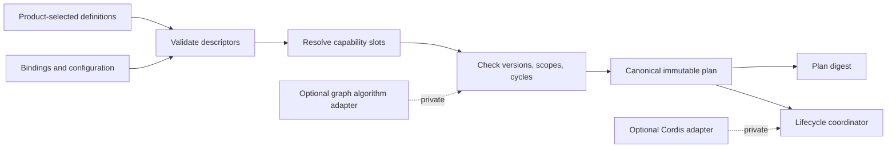
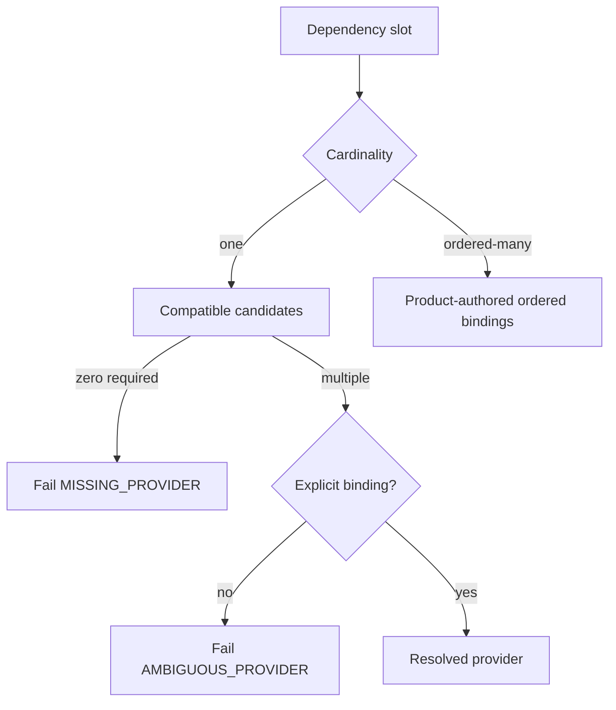

# Module Graph

## Recommendation

Use a small native TypeScript graph compiler as the canonical implementation
for the first slice. Keep its inputs and outputs serializable and independent of
Cordis, Awilix, Effect, or a graph library. Commodity graph libraries may be
used behind a private algorithm adapter and as differential-test oracles.

This is a recommendation under OD-003, not an accepted public SPI.



The graph compiler performs no imports, factories, provider calls, timers,
filesystem access, network access, or product mutations. Invalid input produces
diagnostics and zero effects.

## Roles And Identities

The model keeps distribution, installation, composition, and execution
identities separate.

| Identity | Meaning | Changes when |
| --- | --- | --- |
| `ArtifactIdentity` | Immutable plugin bytes and provenance | Digest changes |
| `InstallationIdentity` | One admitted artifact installation or built-in activation source in one authority scope | Installation or built-in implementation binding is recreated |
| `ContributionIdentity` | One implementation offered by an installation or built-in source | Declared implementation changes incompatibly |
| `ModuleIdentity` | Stable composition and lifecycle unit | Logical module is replaced |
| `CapabilityIdentity` | Product-owned semantic contract | Owning contract changes identity |
| `GraphGeneration` | One compiled and admitted plan in one authority scope | A new candidate is compiled |
| `ModuleActivationGeneration` | One activation attempt for one module in a graph generation | Module is prepared again |

Publisher, artifact, installation, contribution, module, graph generation, and
module activation generation are never aliases. A built-in module has no
publisher, artifact, manifest, catalog, or artifact-installation identity. It
does have a `BuiltInModuleInstallation` activation-source identity bound to the
product authority scope, stable module identity, and immutable implementation
digest as required by ADR-0009 and retained by ADR-0010.

Capability identity is a stable URI-like string owned by the product feature,
for example `agent-teams.orchestrator/work-placement-proposal`. Under the
recommended product-local path, the owning product also owns its private grammar
and comparison rules only after ADR-0013 is accepted. While ADR-0012 remains
effective, Foundation retains module-semantic ownership and implementation is
blocked until `UMEQ-011` and `UMEQ-013` are resolved through `OD-003`. Effective
ADR-0012 permits later Foundation extraction through any of its explicit
evidence gates and a separate accepted extraction decision. Foundation never
owns product vocabulary.

## Descriptor Boundary

A descriptor is inert data. The exact public schema remains open, but the
qualification uses this conceptual shape:

```text
ExtensionModuleDefinition
  moduleId
  implementationId
  provides[]
    capabilityId
    compatibilityFamily
    version
    cardinality: single | ordered-many
    scope
  requires[]
    slotId
    capabilityId
    compatibleRange
    presence: required | optional
    cardinality: one | ordered-many
    allowedScopeRelation
  lifecyclePolicyRef
  configurationSchemaRef?
  sourceRef
```

The descriptor does not contain executable factories, container tokens,
framework contexts, credentials, permission grants, or mutable runtime state.
Executable activation is resolved only after verification, admission, graph
compile, and product authorization.

## Closed-World Resolution

The product composition profile selects the complete candidate module set and
binds each dependency slot. The compiler does not scan a global registry.

Rules:

1. A required-one slot resolves to exactly one compatible contribution.
2. An optional-one slot resolves to zero or one contribution.
3. Ordered-many is a distinct contract. Its order is declared by the product
   profile, not inferred from registration or provider priority.
4. An ambiguous one-provider slot fails. A unique compatible provider may be
   selected only if the final OD-003 decision explicitly permits that policy.
5. Missing, duplicate, incompatible, or out-of-scope providers fail closed.
6. A bound optional edge participates in cycle and scope analysis.
7. Unknown descriptor fields follow the selected compatibility policy; they are
   never silently interpreted as grants or executable instructions.



## Authority Scope And Module Lifetime

Authority identity and runtime lifetime are orthogonal. `AuthorityScopeId` is an
opaque product-owned authorization and custody identity. It may represent a
deployment, tenant, project, workspace, or session boundary, but it never asks
the DI container or module runtime to create a corresponding scope.

The first implementation has one `ModuleLifetime`: one admitted module instance
per immutable graph generation. Replacement creates a new generation, performs
staged readiness and cutover, then drains the old generation. Transient, pooled,
per-tenant, per-project, per-workspace, per-run, and per-session module lifetimes
are deferred until independent product evidence requires and qualifies them.
Foundation validates declared authority-scope relations but does not define
product tenancy or derive lifetimes from product identifiers.

A module receives a frozen dependency object containing only its declared,
resolved direct capabilities. It cannot access:

- a resolver or container;
- undeclared transitive providers;
- parent scopes;
- the complete graph registry;
- raw secrets or ambient environment;
- product repositories or Unit of Work unless the product intentionally grants
  a narrow non-transactional capability.

## Cycles And Ordering

Hard required edges form a directed graph. The compiler rejects every strongly
connected component with more than one node and every self-edge. Production
diagnostics must include a minimal useful cycle path and source locations for
all edges. The disposable ID-DAG spike currently proves a stable deterministic
witness, not shortest-path optimality or source attribution.

Optional and ordered-many edges become hard edges when bound. Observation
hooks do not create graph edges unless invocation requires the target to be
ready before the source.

The compiler emits deterministic activation levels:

```text
level 0: modules with no unresolved dependencies
level N: modules whose dependencies are in earlier levels
```

Modules in one level may prepare concurrently. Canonical serialization sorts
identities for evidence only; it does not invent business ordering. Stop and
rollback traverse the actual successful activation DAG in reverse levels.

## Plan And Digest

The plan is immutable, serializable evidence containing:

- schema version;
- authority scope hash;
- graph generation;
- selected module and implementation identities;
- exact contribution bindings and declared order;
- compatibility decisions;
- activation levels and dependency edges;
- configuration fingerprints, never raw secrets;
- required host tiers and capability requests;
- source evidence and stable diagnostics;
- canonicalization algorithm version.

The digest is computed from canonical bytes. It identifies the plan, not its
authorization. A valid digest cannot bypass admission, grant revision,
entitlement, product policy, readiness, or generation fences.

## Diagnostics

Every failure has a stable code and machine-readable evidence:

```text
code
summary
moduleId?
slotId?
capabilityId?
sourceRefs[]
dependencyPath[]
expected
observed
owner
remediation
```

Minimum diagnostic codes include `INVALID_DESCRIPTOR`, `DUPLICATE_IDENTITY`,
`MISSING_PROVIDER`, `AMBIGUOUS_PROVIDER`, `INCOMPATIBLE_VERSION`,
`INCOMPATIBLE_SCOPE`, `HARD_CYCLE`, `INVALID_ORDER`, and
`NON_CANONICAL_INPUT`.

The same validated model produces the graph digest, human report, AI-readable
index, Mermaid diagram, and conformance fixture. A hand-maintained registry or
diagram is not another source of truth.

## Runtime Implementation

| Option | Assessment | Decision |
| --- | --- | --- |
| Native minimal kernel | Smallest semantic overlap and best diagnostics control | Recommended for V1 |
| Cordis directly | Ambient context and lifecycle become product-visible | Reject |
| Cordis private adapter | Useful only if conformance proves at least 25% equivalent-code reduction without a second lifecycle | Qualification candidate |
| Effect Layers | Strong scoped-resource reference, but public type and execution-model coupling is high | Design reference only |
| Awilix | Useful in product composition roots, not a graph or lifecycle authority | Composition-only |
| Graph library | Useful behind an algorithm adapter and as an independent oracle | Optional private primitive |

The expected native compiler is deliberately small: descriptor validation,
binding resolution, scope/version checks, cycle detection, deterministic levels,
canonical serialization, and diagnostics. It does not implement installation,
security policy, DI reflection, hot reload, process management, or distributed
coordination.

The executable evidence remains narrower than this target. The ID-DAG spike
proves deterministic scheduling, immutable plan data and graph diagnostics. A
separate disposable binding compiler now proves explicit `required`, `optional`
and `ordered-many` bindings plus selected cardinality, compatibility, ambiguity
and binding-induced-cycle negatives. It does not admit a production grammar,
scope/source model, package, public SPI or runtime owner. Production Phase 1
therefore remains blocked. Ownership follows the single approved Phase 1 path:
product-local only after ADR-0013 and the owning feature decision are accepted,
or Foundation-owned while ADR-0012 remains effective only after `UMEQ-011` and
`UMEQ-013` are resolved through `OD-003`.

## Scale And Complexity

For `V` modules and `E` resolved edges, validation and topological compilation
should remain `O(V + E)` aside from deterministic sorting, which may add
`O(V log V + E log E)`. Synthetic qualification targets are 1,000 and 10,000
modules, while normal product profiles should remain much smaller.

The compiler must enforce explicit profile limits before allocation:

- maximum descriptors and edges;
- maximum descriptor and diagnostic byte size;
- maximum dependency depth;
- maximum ordered-many providers per slot;
- bounded diagnostic path count.

## Related Approval Forks

Provider binding and contract compatibility remain unresolved. Their only
normative option sets, estimates, and approval authorities are
[UMEQ-011](unresolved-decisions.md#umeq-011-provider-binding-policy) and
[UMEQ-012](unresolved-decisions.md#umeq-012-contract-source-and-compatibility-model).
This graph document does not duplicate or narrow those approval surfaces.

## Conformance Minimum

- Equivalent inputs in different source orders produce identical plans,
  diagnostics, traces, and digests.
- Invalid graphs execute zero factories and effects.
- Native and Graphlib algorithms agree on cycle validity, and each emitted order
  independently satisfies every source edge over generated DAGs.
- Framework adapters cannot add undeclared dependencies or change ordering.
- Packed consumers do not receive Cordis, container, host, or product types.
- A 10,000-module synthetic graph stays within the final memory and latency
  budgets recorded in [Performance and SLOs](performance-and-slo.md).
