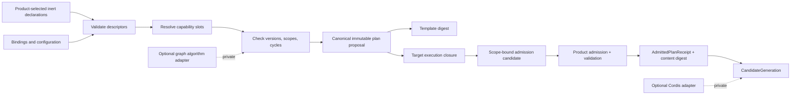
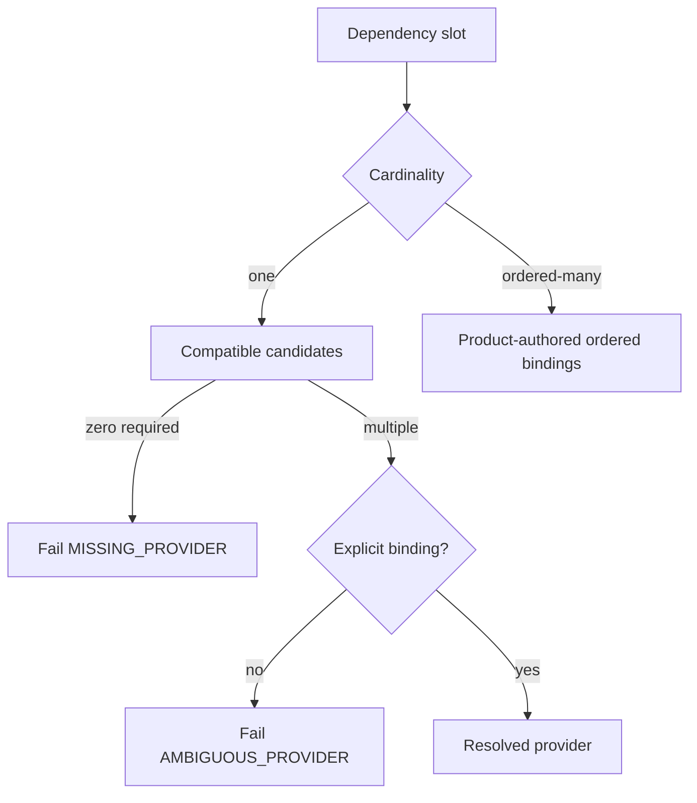
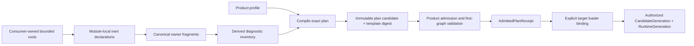

# Module Graph

## Recommendation

The current baseline is product-first static composition: Pure DI, explicit
factories and a handwritten target-local literal table. There is no production
graph compiler or Foundation module runtime today. The model below is the
qualified target if a real product slice later triggers a private runtime
graph. Its inputs and outputs stay serializable and independent of Cordis,
Awilix, Effect, or a graph library. Commodity graph libraries may be used
behind a private algorithm adapter and as differential-test oracles.

This is a recommendation under OD-003, not an accepted public SPI.



Any future graph compiler performs no imports, factories, provider calls, timers,
filesystem access, network access, or product mutations. Invalid input produces
diagnostics and zero effects.

## Roles And Identities

The model keeps distribution, installation, composition, and execution
identities separate.

| Identity | Meaning | Changes when |
| --- | --- | --- |
| `ArtifactIdentity` | Immutable plugin bytes and provenance | Digest changes |
| `InstallationIdentity` | One admitted artifact installation or built-in activation source in one authority scope | Installation or built-in implementation binding is recreated |
| `ContributionIdentity` | One implementation offered by an installation or built-in source | Declared implementation changes incompatibly |
| `ModuleIdentity` | Stable composition and lifecycle unit | Logical module is replaced |
| `CapabilityIdentity` | Product-owned semantic contract | Owning contract changes identity |
| `PlanTemplateDigest` | Content identity of canonical target-independent graph intent | Semantic template input changes |
| `PlanContentDigest` | Admission-authority receipt digest over the canonical content actually admitted, including explicit provider bindings | The admitted canonical content changes; it does not exist before admission |
| `ActiveHeadRevision` | Monotonic compare-and-set revision of the active-head record | The authority's active-head record changes |
| `CandidateGeneration` | Monotonic operational identity projected from exactly one admitted plan receipt in one product authority scope | A candidate is allocated for activation, replacement, disablement, restart, or forward rollback, even for identical admitted content |
| `RuntimeGeneration` | One concrete runtime incarnation that may be referenced by one or more staged or published candidates | Runtime startup or replacement creates another incarnation |
| `ModuleActivationGeneration` | One activation attempt for one module within a candidate and runtime generation | Module is prepared again |

Publisher, artifact, installation, contribution, module, plan digest,
active-head revision, candidate generation, runtime generation, and module
activation generation are never aliases. Equivalent normalized inputs produce identical
`PlanTemplateDigest` values. Equivalent content admitted by the same admission
authority under the same canonicalization and provider binding produces the
same `PlanContentDigest` receipt value. Operational generations
and revisions are allocated monotonically and are never hash inputs. Reusing
content, including rollback to prior content, therefore keeps its content
digest while receiving a higher candidate generation and active-head revision.
Each staged runtime reference pin binds both the candidate generation and the
exact runtime generation under the shared retirement fence required by
ADR-0010; candidate abandonment, publication, and runtime retirement never
infer one identity from the other.
A built-in module has no
publisher, artifact, manifest, catalog, or artifact-installation identity. It
does have a `BuiltInModuleInstallation` activation-source identity bound to the
product authority scope, stable module identity, and immutable implementation
digest as required by ADR-0009 and retained by ADR-0010.

Capability identity is a stable URI-like string owned by the product feature,
for example `agent-teams.orchestrator/work-placement-proposal`. Under the
accepted product-local path, the owning product also owns its private grammar
and comparison rules. Foundation may own only a neutral semantic intersection
proven by two independently authored consumers, executable cross-consumer
conformance, and a separate accepted extraction decision. Package extraction
under another ADR-0013 evidence basis does not prove that semantic intersection.
Foundation never owns product vocabulary.

## Declaration And Executable Boundaries

A module has exactly one metadata authority: a fixed-name, module-local,
serialized declaration whose bytes are inert data. The exact filename and
public schema remain open; a consumer rehearsal may choose a private name such
as `extension-module.json`. Discovery parses that bounded file and never imports
TypeScript, executes a getter or decorator, or resolves the activation
entrypoint. The qualification uses this conceptual shape:

```text
ExtensionModuleDefinition
  moduleId
  implementationId
  provides[]
    capabilityId
    compatibilityFamily
    version
    cardinality: single | ordered-many
    scope
  requires[]
    slotId
    capabilityId
    compatibleRange
    presence: required | optional
    cardinality: one | ordered-many
    allowedScopeRelation
  lifecyclePolicyRef
  configurationSchemaRef?
  sourceRef
```

The declaration does not contain executable factories, container tokens,
framework contexts, credentials, permission grants, or mutable runtime state.
The executable activation factory is a separate target-specific binding. Its
bytes, import, factory, getter, or provider callback are not evaluated until the
exact provider binding, artifact verification and revocation status, plan
admission, product-owned graph validation, product authorization, capability
grants, host policy, and current generation fence all intersect for the same
scope and immutable digests. Approval by any one of those authorities is never
enough. Generated TypeScript handles and dependency types, aggregate
inventory, reverse-dependency index, diagrams, and diagnostics are disposable
projections of the serialized declarations and selected profile. Authors do not
repeat the metadata in `defineExtensionModule(...)` or any executable module.

## Identity Authoring And Projections

Identity authority stays with the semantic owner:

| Fact | Authored source |
| --- | --- |
| `ModuleId`, requirements, offers, and bounded source reference | The owning module's colocated inert declaration |
| `CapabilityId`, compatibility family, and semantic owner | The owning product capability contract |
| Provider selection and collection order | The product composition profile |
| TypeScript handles and dependency types, inventory, reverse dependencies, diagrams, and diagnostics | Deterministic generated projections |
| Implementation, loader, and artifact digests | Build or verification receipts |
| `PlanContentDigest` and admitted provider-binding digest | Post-admission `AdmittedPlanReceipt` issued by the product admission authority |

Module and capability identities are stable, authority-qualified strings. They
do not change when a directory, package, repository, display name, or
implementation digest changes. A semantic replacement receives a new identity;
retired identities are never reused.

`enum` remains suitable for a small closed set such as lifecycle status, but it
is not the authority for an extensible cross-repository ID namespace. Runtime
`Symbol()` and `Symbol.for()` are not serializable across persistence, Worker,
process, Electron IPC, or WASM boundaries. Generated TypeScript handles may use
an erased `unique symbol` brand to prevent accidental type mixing while runtime
equality and wire data continue to use validated strings.

`Symbol.prototype.toString()` is only a display conversion, not durable
serialization. For example, `Symbol("x") !== Symbol("x")` even though both values
render as `Symbol(x)`; the display string cannot reconstruct either original
identity, and JSON omits symbol-valued fields. `Symbol.for()` adds lookup by a
string key within its registry, but serializing that key simply makes the string
the durable identity and still does not carry the symbol across a Worker,
process, persistence, or restart boundary. The design therefore keeps the
validated string canonical and uses nominal TypeScript handles for authoring
safety.

The canonical declaration is colocated with the module. A generated aggregate
index may expose the same identity for navigation, dependency reports, and
typed imports, but it is disposable output and cannot be edited as a registry.
No global `moduleIds` object is an authoring source.

`provides` names product-owned capability contracts implemented by the module;
it does not name modules. Generated code may give application code a typed view
of the declaration, but is not another metadata authoring facade. Conceptually:

```ts
type ActivityFeedDependencies = {
  events: RuntimeEventStreamV1;
  search: LogSearchV1 | undefined;
  transforms: readonly [LogTransformV1, ...LogTransformV1[]];
};

export const activateActivityFeed = (
  dependencies: ActivityFeedDependencies,
): ActivityFeedRuntime => { /* executable code, no metadata */ };
```

The dependency type and handles are derived from inert declaration data. The
example fixes only the separation, not a published API.

- `required(C)` resolves exactly one explicitly bound compatible provider and
  injects `C`; zero or multiple unresolved candidates fail compilation.
- `optional(C)` resolves zero or one provider and injects `C | undefined`. A
  selected provider that fails is a failure, not optional absence.
- `many(C, ...)` resolves an immutable ordered collection. `minProviders` and
  `maxProviders` are graph-validity and fan-in bounds, not retry or runtime
  concurrency limits. `ordering: "profile"` requires the profile to state the
  exact behaviorally meaningful order; registration order and provider priority
  never supply it. A non-semantic collection may instead use a canonical
  identity order in the normalized contract.

The future compiler may type a collection with `minProviders: 1` as a non-empty tuple.
The value `8` above is illustrative; every real limit is product policy plus a
deployment-wide safety ceiling.

## Closed-World Resolution

The product composition profile selects the complete candidate module set and
binds each dependency slot. A future compiler does not scan a global registry.

Rules:

1. A `required` single-provider slot resolves to exactly one compatible
   contribution.
2. An `optional` single-provider slot resolves to zero or one contribution.
3. Ordered-many is a distinct contract. Its order is declared by the product
   profile, not inferred from registration or provider priority.
4. An ambiguous one-provider slot fails. Installation state or apparent
   uniqueness never selects a provider; every selected provider requires an
   explicit product-profile binding. Changing this accepted rule requires a
   superseding ADR, not an open-decision interpretation.
5. Missing, duplicate, incompatible, or out-of-scope providers fail closed.
6. A bound optional edge participates in cycle and scope analysis.
7. Unknown descriptor fields follow the selected compatibility policy; they are
   never silently interpreted as grants or executable instructions.

Every resolved slot is recorded at the explicit coordinate
`(consumerModuleId, localSlotId)`. Its value is exactly one
`providerContributionId`, literal `null` for optional absence, or an ordered
list of provider contribution IDs. Missing coordinates and `null` are not
interchangeable. The declaration supplies `required`, `optional`, or `many`;
the profile supplies selections; and the compiled binding preserves both.
Every non-null provider value also carries its provider authority, installation
or built-in activation-source identity, contribution identity, implementation
digest, and target loader key. The canonical provider-binding digest is copied
into the admission receipt and every derived generation receipt. A plan,
receipt, or generation is invalid without that explicit binding and cannot be
rebound through inference, a registry, ambient lookup, or a matching capability
name.
For `many`, minimum, maximum, and order constrain graph cardinality and semantic
iteration order only. They never specify activation parallelism, worker count,
dispatch concurrency, or backpressure.



## Candidate Enumeration And Execution Binding

The target pipeline is closed-world without making one package catalog or
runtime registry a universal source of truth:



This is a target model, not a description of a pipeline implemented today.
Build and CI for a future graph would:

1. Resolve bounded roots from consumer-owned topology and admitted package
   paths. The Foundation package catalog may contribute roots after package
   admission, but it is not the product module catalog.
2. Read only fixed-name serialized declarations. Reject duplicate keys,
   symlinks, path escapes, case-fold collisions, unknown fields, duplicate IDs,
   oversized inputs, and executable declaration imports.
3. Emit canonical per-owner fragments and a disposable aggregate inventory.
   Coverage checks fail on orphan declarations and cataloged roots without a
   matching fragment.
4. Compile one exact profile and lock. Provider selection happens once; normal
   startup verifies and materializes that result rather than resolving again.
5. For co-released built-ins, start with a handwritten private lazy
   literal-import table per host target: Node/server, Electron main, preload,
   renderer/Worker, and browser targets never share one authority table.
6. Bind declaration-input, resolved-plan, loader-source, implementation, and
   emitted-bundle digests through receipts. The selected executable IDs and
   loader keys form an exact bijection. Invalid and unselected sentinel modules
   must prove zero top-level evaluation in every supported target.
7. Only after repeated wiring or profile variants demonstrate drift, generate
   the target table into a digest-named temporary location and publish atomically only
   after a clean target build, byte-for-byte regeneration check, stale-output
   check, and emitted dependency-graph audit.

The future runtime receives only the exact plan and matching target loader receipt. It
does not scan the filesystem, package catalog, aggregate inventory, decorators,
or a global container. Changing a built-in loader closure requires a new build
or host restart; ESM query-string cache busting is not a lifecycle mechanism.

Independently installed plugin artifacts use a separate verified isolated-host
adapter keyed by immutable artifact and contribution identity. They are never
added to the trusted built-in table by runtime string interpolation. Tree
shaking and chunk count are optimization evidence, not authorization evidence.

The current fixed slice uses static Pure DI and a handwritten private
literal-import table. Declaration/table bijection checks are the first useful
automation. Deterministic loader generation is introduced only after repeated
wiring or profile drift justifies it; the target receipt and isolation
invariants do not change.

## Staged Plan Decomposition

Scale does not justify one deployment-wide graph. A future compiler decomposes
work into five explicit stages:

1. `PlanTemplate` validates inert declarations and profile bindings and emits a
   target-independent semantic template identified by `PlanTemplateDigest`.
2. A target execution closure selects exactly the built-in entrypoints or
   isolated artifact blobs usable by one host target. Each target graph is
   local to that process/Worker/isolated-host boundary.
3. Scope binding creates an inert admission candidate containing one authority
   scope, exact provider bindings, configuration fingerprints, requested grants,
   applicable policy inputs, and verified artifact evidence. It has a canonical
   candidate digest for comparison but no `PlanContentDigest` identity.
4. The product admission authority validates that complete candidate, including
   the product-owned invariants for the product's first graph, and issues an
   immutable `AdmittedPlanReceipt`. Only this post-decision receipt establishes
   `PlanContentDigest` over the exact admitted canonical content and binds the
   admission decision, authority, provider-binding digest, and expiry.
5. Candidate allocation projects `(authorityScope, AdmittedPlanReceipt,
   PlanContentDigest, providerBindingDigest)` to a fresh monotonic
   `CandidateGeneration`. The mapping is durable and immutable. Every activation,
   replacement, disablement, restart, and forward rollback allocates a new
   generation; retries for the same durable candidate retain it, while a new
   candidate never reuses one. Content equality may reuse the digest but never
   the generation. Publication binds that tuple through `ActiveHeadRevision`
   CAS.

Cross-target and cross-service placement, rollout, routing, compatibility, and
failure relationships belong to a separate product-owned deployment plan. They
are not edges smuggled into a Foundation module DAG.

## Authority Scope And Module Lifetime

Authority identity and runtime lifetime are orthogonal. `AuthorityScopeId` is an
opaque product-owned authorization and custody identity. It may represent a
deployment, tenant, project, workspace, or session boundary, but it never asks
the DI container or module runtime to create a corresponding scope.

The first triggered implementation would have one `ModuleLifetime`: one
admitted module instance per immutable `(CandidateGeneration,
RuntimeGeneration)`. Replacement creates a new candidate and, unless it pins a
compatible existing runtime through ADR-0010's retirement fence, a new runtime
generation. It performs staged readiness and cutover, then drains the old
candidate/runtime references. Transient, pooled,
per-tenant, per-project, per-workspace, per-run, and per-session module lifetimes
are deferred until independent product evidence requires and qualifies them.
Before semantic extraction, the owning product validates declared
authority-scope relations against its own tenancy, authorization, and custody
invariants. Foundation does not define product tenancy or derive lifetimes from
product identifiers. After the ADR-0013 cross-consumer and ownership gates, it
may validate only the explicitly extracted product-neutral relation envelope;
the product still validates the concrete scope meaning.

A module receives a frozen dependency object containing only its declared,
resolved direct capabilities. It cannot access:

- a resolver or container;
- undeclared transitive providers;
- parent scopes;
- the complete graph registry;
- raw secrets or ambient environment;
- product repositories or Unit of Work unless the product intentionally grants
  a narrow non-transactional capability.

## Typed Edges, Cycles, And Orders

The target model preserves the reason for every edge, rather than flattening
all relationships into `dependsOn`. Edge kinds include capability readiness,
drain safety, retirement/resource custody, and state-migration sequencing.
Other kinds require explicit semantics and validation before admission.

Hard capability-readiness edges form a directed graph. A future compiler
rejects every strongly connected component with more than one node and every
self-edge. Its production diagnostics must include a minimal useful cycle path
and source locations for all edges. The disposable ID-DAG spike currently
proves a stable deterministic witness, not shortest-path optimality or source
attribution.

Optional and ordered-many edges become hard edges when bound. Observation
hooks do not create graph edges unless invocation requires the target to be
ready before the source.

Typed relations feed distinct deterministic operation projections:

- the static compiler may derive activation readiness constraints because their
  declared provider bindings are part of the admitted graph;
- the product lifecycle coordinator materializes drain from current invocation
  and resource-use evidence so consumers seal before providers they can still
  call;
- the product lifecycle coordinator materializes target-specific retirement
  from current routes, staged pins, leases, runtimes, contributions,
  installations, custody references, and the ADR-0010 discriminated target;
- the product migration coordinator materializes migration from current schema
  lineage, state-space custody, and migration-step evidence, which need not
  match activation edges.

The compiler validates declared typed relations and deterministic derivation
rules. It does not claim compile-time knowledge of current routes, invocations,
leases, resources, cleanup debt, or custody. Operation-specific projections are
sealed only after their owning product coordinator reads the authoritative
current state and records the comparison revisions used by the fenced action.

Stop and rollback use the successful typed-edge receipts, not a universal
reverse topological order. T0 may implement only capability-readiness edges,
but neither its stored schema nor any published claim may assert that one DAG
defines activation, drain, retirement, and migration.

A future compiler may emit deterministic activation levels:

```text
level 0: modules with no unresolved dependencies
level N: modules whose dependencies are in earlier levels
```

Modules in one level may prepare concurrently. Canonical serialization sorts
identities for evidence only; it does not invent business ordering. `many`
provider order remains semantic collection order and does not authorize
concurrent preparation.

## Plan Evidence And Operator Read Model

The future plan template and bound plan are immutable, serializable evidence
containing:

- schema version;
- authority scope hash;
- selected module and implementation identities;
- every binding coordinate, including explicit optional `null`, and declared
  ordered-many order;
- compatibility decisions;
- declared typed relations, deterministic static constraints, and any
  operation-specific projections already materialized by the owning product
  coordinator;
- configuration fingerprints, never raw secrets;
- required host tiers and capability requests;
- source evidence and stable diagnostics;
- canonicalization algorithm version.

`PlanTemplateDigest` is computed from canonical template bytes before
admission. A scope-bound admission candidate has comparison identity only.
After admission succeeds, the admission authority computes
`PlanContentDigest` from the canonical bytes named in `AdmittedPlanReceipt`;
callers cannot supply or select it. Graph generation, active-head revision,
timestamps, attempts, and mutable status are excluded from both. A digest
identifies content, not its authorization. A valid digest cannot bypass
admission, grant revision,
entitlement, product policy, readiness, or generation fences.

A future operator read model must join, without conflating, profile intent,
resolved lock, plan template/admitted-content digests, admission receipt,
provider-binding digest and graph generation,
and active-head revision. For each contribution and binding it explains why it
was selected, denied, or inactive and exposes reverse dependencies. Every
proposed change emits an immutable change-impact artifact describing retained,
restarted, replaced, degraded, and disabled modules; peak old/new coexistence;
required state operations and compatibility; rollback availability and limits;
and target/scope blast radius. This artifact is planning evidence, not approval
or execution authority.

## Diagnostics

Every failure has a stable code and machine-readable evidence:

```text
code
summary
moduleId?
slotId?
capabilityId?
sourceRefs[]
dependencyPath[]
expected
observed
owner
remediation
```

Minimum diagnostic codes include `INVALID_DESCRIPTOR`, `DUPLICATE_IDENTITY`,
`MISSING_PROVIDER`, `AMBIGUOUS_PROVIDER`, `INCOMPATIBLE_VERSION`,
`INCOMPATIBLE_SCOPE`, `HARD_CYCLE`, `INVALID_ORDER`, and
`NON_CANONICAL_INPUT`.

The same validated model produces the graph digest, human report, AI-readable
index, Mermaid diagram, and conformance fixture. A hand-maintained registry or
diagram is not another source of truth.

## Runtime Implementation

| Option | Assessment | Decision |
| --- | --- | --- |
| Native minimal kernel | Smallest semantic overlap and best diagnostics control | Recommended for V1 |
| Cordis directly | Ambient context and lifecycle become product-visible | Reject |
| Cordis private adapter | Useful only if conformance proves at least 25% equivalent-code reduction without a second lifecycle | Qualification candidate |
| Effect Layers | Strong scoped-resource reference, but public type and execution-model coupling is high | Design reference only |
| Awilix | Useful in product composition roots, not a graph or lifecycle authority | Composition-only |
| Graph library | Useful behind an algorithm adapter and as an independent oracle | Optional private primitive |

If triggered, the expected native compiler is deliberately small: descriptor validation,
binding resolution, scope/version checks, cycle detection, deterministic levels,
canonical serialization, and diagnostics. It does not implement installation,
security policy, DI reflection, hot reload, process management, or distributed
coordination.

The executable evidence remains narrower than this target. The ID-DAG spike
proves deterministic scheduling, immutable plan data and graph diagnostics. A
separate disposable binding compiler now proves explicit `required`, `optional`
and `ordered-many` bindings plus selected cardinality, compatibility, ambiguity
and binding-induced-cycle negatives. It does not admit a production grammar,
scope/source model, package, public SPI or runtime owner. Phase 1 is the single
approved product-local static Pure DI rehearsal under ADR-0013, ADR-0014, and an
accepted owning feature decision. A production runtime graph remains blocked
until a measured trigger and accepted owning-product runtime decision satisfy
the later gate.

## Scale And Complexity

For one target-local graph with `V` modules and `E` resolved typed edges,
validation and topological compilation
should remain `O(V + E)` aside from deterministic sorting, which may add
`O(V log V + E log E)`. Synthetic qualification targets are 1,000 and 10,000
modules, while normal product profiles should remain much smaller.

A future compiler must enforce explicit profile limits before allocation:

- maximum descriptors and edges;
- maximum descriptor and diagnostic byte size;
- maximum dependency depth;
- maximum ordered-many providers per slot;
- bounded diagnostic path count.

## Related Approval Forks

ADR-0014 fixes explicit product-profile provider binding for the static
rehearsal and constrains any future private graph. Contract source and
compatibility remain unresolved; their only normative option set, estimates,
and approval authority are
[UMEQ-012](unresolved-decisions.md#umeq-012-contract-source-and-compatibility-model).
This graph document does not duplicate or narrow that approval surface.

## Conformance Minimum

- Equivalent inputs in different source orders produce identical templates,
  target/scope admission candidates, diagnostics, traces, and
  `PlanTemplateDigest`. Equivalent successful admissions produce identical
  `PlanContentDigest` receipts; rejected candidates produce none. Allocating
  another candidate changes neither digest but always changes
  `CandidateGeneration`.
- Every candidate generation round-trips to exactly one admitted receipt and
  exact provider binding. Every staged or published runtime reference names a
  distinct `RuntimeGeneration`; missing, inferred, ambient, or cross-provider
  bindings and pins fail closed.
- The owning product validates its first graph against product invariants before
  admission and activation; Foundation supplies neutral mechanics only.
- Invalid graphs execute zero factories and effects.
- Native and Graphlib algorithms agree on cycle validity, and each emitted
  activation, drain, retirement, or migration order independently satisfies
  the typed edges that govern it.
- Framework adapters cannot add undeclared dependencies or change ordering.
- Packed consumers do not receive Cordis, container, host, or product types.
- A 10,000-module synthetic graph stays within the final memory and latency
  budgets recorded in [Performance and SLOs](performance-and-slo.md).
