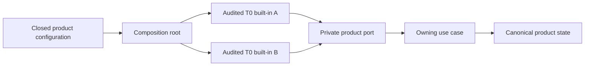

# Dependency Graph And DI Decision

> Historical qualification evidence. This page is non-operative. Use the
> [current productization gate](../../module-system-v1-productization/README.md),
> [ADR-0014](../../../decisions/0014-product-local-module-authoring-composition-and-generation-guardrails.md),
> and [ADR-0015](../../../decisions/0015-authorize-get-modular-semantic-extraction.md)
> for current authority and implementation gates.

## NOW

Use static imports, Pure DI, explicit constructors or factories, and one
product-owned composition root. Materialize provider selection as checked-in or
deployed closed configuration before execution. Do not use an ambient container,
service locator, runtime registration, priority, fallback, or registration-order
semantics.

There is no module graph in this rehearsal. Ordinary construction is not
described as a runtime platform.

## Triggered Private Graph

A graph becomes eligible only if a real slice demonstrates measured runtime
provider selection or independently managed lifecycle that a literal table
cannot express. Dependency variability is evidence only when it concretely
demonstrates that accepted runtime-selection trigger; it is never a third
trigger. Before implementation, one accepted governance
path must resolve ownership. The private graph must bound input size, reject
duplicate and missing identities and cycles, materialize exact bindings, produce
deterministic complete diagnostics, seal source-to-factory identity, and remain
replaceable. Generic glue must be recorded separately under a predeclared
counting method and justified by a named product outcome.

The provisional implementation direction is a minimal native private kernel.
Cordis and a native/Cordis hybrid remain rejected. The runtime graph remains
private and trigger-based; it is not a Foundation or public contract.

If triggered, the target model has these non-negotiable separations:

- one fixed-name module-local inert serialized declaration is metadata
  authority; typed handles/types, inventory, reverse dependencies, diagrams,
  and diagnostics are derived, while activation factories remain separate;
- each `(consumerModuleId, localSlotId)` binds to one contribution ID, explicit
  optional `null`, or ordered contribution IDs, preserving required/optional/
  many semantics without treating many bounds/order as concurrency;
- `PlanTemplateDigest` identifies canonical intent; only a successful product
  admission issues `PlanContentDigest` over canonical admitted content, and a
  monotonic `CandidateGeneration` maps immutably to that receipt and explicit
  provider binding, while a distinct `RuntimeGeneration` identifies the runtime
  pinned by that candidate. Neither enters the content hash or aliases
  `ActiveHeadRevision`;
- compilation stages are `PlanTemplate`, target execution closure, inert scope
  binding, product-owned first-graph validation/admission, and graph generation.
  Graphs are target-local; a product-owned
  deployment plan owns cross-target/service relationships;
- typed edges derive distinct activation, drain, retirement, and migration
  orders. T0 may support only readiness edges but may not publish a universal
  DAG contract; and
- built-ins start with one handwritten literal loader table per target.
  Generation follows only demonstrated wiring/profile drift, and discovery
  reads inert data without executable imports.

Future operator evidence must explain selection, denial, and inactivity across
profile, lock, plan, generation, active-head revision, and reverse dependencies.
Its immutable change-impact artifact classifies retained, restarted, replaced,
degraded, and disabled modules and reports peak coexistence, state operations,
rollback constraints, and blast radius. A future immutable
`ArtifactContributionIndex` may bind artifact and descriptor digests,
contribution ID, target/tier, entrypoint/blob closure, schemas, compatibility,
requested capabilities, and isolated-host loader key. Neither artifact exists
as a production Foundation contract today.

## Cross-Lane Anti-Pattern Report

The security-owned anti-pattern catalog already prohibits executable metadata
discovery, shared all-target loader tables, handwritten central identity lists,
and conflating static modules, runtime definitions, and artifacts. A later
security-lane update should additionally forbid: hashing candidate generations
or active-head revisions into plan content identity; treating ordered-many as a
concurrency control; flattening activation, drain, retirement, and migration
edges into one universal DAG; and treating package-boundary evidence as proof of
Foundation semantic ownership. This lane does not edit `anti-patterns.md`.

## Extraction

After a genuine independent second consumer, compare both product-local seams.
Extract only repeated product-neutral structure with independent expected
outputs and black-box conformance. A second repository using identical bytes,
a mock, or a delegating wrapper does not prove runtime independence. Public SPI
publication is a later, separate decision.

See [Cordis](04-cordis-verdict.md),
[architecture roadmap](10-architecture-and-loc-roadmap.md), the existing
[module graph qualification](../module-graph.md), and the
[executive report](01-executive-report.md).
