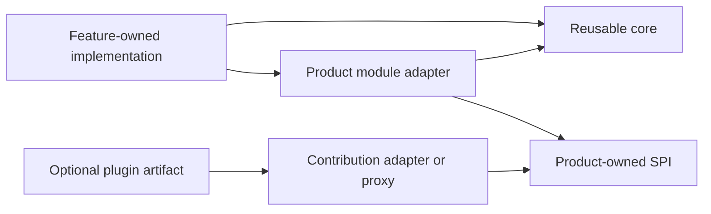

# Packaging And Reuse

## One Capability, Orthogonal Roles

Feature, library, module, package, and plugin describe different concerns.



- **Feature** owns language, contracts, behavior, adapters, tests, and product
  navigation.
- **Library core** is ordinary reusable code with explicit dependencies and no
  module-runtime or plugin dependency.
- **Module adapter** connects a feature or library to one product's graph and
  lifecycle.
- **Package** is a build and release boundary.
- **Plugin artifact** is an independent distribution, trust, installation, and
  update envelope that may provide several contributions.

Plugin contributions may become runtime modules or remote proxies after host
verification. Built-in modules reuse the same semantic contracts but do not
pretend to be installed artifacts.

## Colocation First

Before extraction, keep contracts, core, module adapter, technology adapters,
and tests in the owning feature slice. A module adapter belongs in that
feature's composition boundary. Product-to-extension calls use an outbound
host/proxy adapter; extension-to-product commands or events enter through a
validated inbound broker adapter. A translator is classified by the direction
of the product port it implements, not by transport. Product domain contracts
do not move into Foundation.

```text
features/<capability>/
  domain/                 # only when the capability has real domain behavior
  application/
    ports/
    use-cases/
  adapters/
    inbound/
    outbound/
  composition/
    module.ts
  tests/
```

Not every feature needs every directory. Empty DDD layers are forbidden.

## Extraction Gates

| Stage | Required evidence |
| --- | --- |
| Product feature | One real use case and stable owning feature |
| Reusable core | Second real consumer or independent use without product host |
| Module-adapter package | Independent host/runtime dependency or release boundary |
| Test kit | Two independently authored implementations need shared conformance |
| Plugin artifact | Independent install, update, rollback, trust, or isolation lifecycle |
| Process/service | Trust, deployment, scaling, failure, or data-ownership boundary requires it |

An imagined future consumer is not evidence. Security isolation may justify an
earlier process boundary, but it must be explicit.

There are two distinct extractions. A product may first extract a product-scoped
library or adapter inside its own repository when that boundary has independent
value. Admission into Extension Foundation is a later cross-product decision and
requires two independent consumers proving the same product-neutral semantics.
Product-local extraction is not Foundation admission.

When extraction is justified, related packages remain discoverable:

```text
packages/<capability>/
  core/
  module-adapter/
  test-kit/
  adapters/<technology>/
```

These are roles, not mandatory folders. A package is moved back or combined
when its independent lifecycle disappears and the compatibility surface costs
more than it protects.

Before the first Foundation package is admitted, the machine-readable package
catalog must record its neutrality claim, canonical owner repository, consumer
evidence, release policy and conformance profile. The current empty catalog
cannot reserve or admit packages on the strength of this qualification alone.

## Dependency Rules

1. A reusable core never imports Foundation runtime, product host, Cordis,
   Awilix, DI tokens, plugin manifests, or host protocols.
2. A module adapter may import the core, Foundation contracts, and one
   product-owned capability contract.
3. Product feature code imports another product capability through its public
   feature entrypoint or consumer-owned port, not an internal module adapter.
4. A plugin protocol package contains serializable transport contracts only.
5. A technology adapter is separate only when its dependency, release,
   replacement, or deployment lifecycle is independently meaningful.
6. `peerDependencies` are reserved for true host-provided runtime APIs; they
   are not used to hide normal dependencies.
7. Package exports are curated. Internal paths are not supported API.

## Compatibility

Version independently:

- library API;
- product capability contract family;
- module descriptor schema;
- host protocol;
- plugin artifact manifest;
- profile and lockfile schema;
- conformance suite version.

SemVer alone does not establish behavioral compatibility. Every supported
range needs producer/consumer fixtures and declared direction. N/N-1 support is
required for rolling process-host or service updates; in-process built-ins may
move atomically with the product.

Unknown fields, unknown enum values, deprecated capabilities, and response
compatibility are tested independently in both directions. An incompatible
plugin is rejected before executable loading.

## Packed Consumer Proof

Every publishable package is packed and installed into an empty fixture. Tests
must prove:

- only declared files and exports are present;
- declarations do not leak internal framework or product types;
- the library works without the module/plugin stack installed;
- ESM imports and Node/browser conditions resolve as declared;
- oldest and newest supported dependency combinations typecheck and run;
- installation scripts are absent unless explicitly approved;
- package provenance, license, repository, and engine metadata are correct;
- side-effect metadata matches actual top-level behavior.

The source workspace is not evidence of a valid published package because
workspace links can hide missing files, undeclared dependencies, and invalid
exports.

## Local Development

Consumers depend on exact released Foundation versions. Local development may
temporarily attach a neighboring checkout through the Engineering Foundation
workflow. The attachment is explicit, inspectable, excluded from commits, and
reversible. CI and packed-consumer tests always resolve registry artifacts.

This gives one source of truth without making unpublished neighboring source a
silent production dependency.

## Package Explosion Controls

- No package is reserved before a real slice and accepted owner exist.
- No common `contracts`, `utils`, or `adapters` dump is created.
- A public SPI needs two implementations and conformance evidence.
- A package with one consumer remains product-owned unless isolation or release
  independence is proven.
- A split that adds more framework glue than capability code triggers review.
- Similar names or data shapes across bounded contexts do not justify a shared
  package when language or invariants differ.

## Estimated Cost

| Slice | Approximate LOC including tests | Complexity |
| --- | ---: | ---: |
| Pure core plus packed-consumer fixture | 500-1,500 | 4/10 |
| Product module adapter | 200-700 | 4/10 |
| Reusable conformance test kit | 600-1,800 | 6/10 |
| Process-host protocol adapter | 1,500-4,000 | 8/10 |
| Full plugin artifact lifecycle | 4,000-10,000 | 9/10 |

The numbers are planning ranges, not quotas. The first implementation must stay
inside one thin product slice and extract only what that slice proves.
