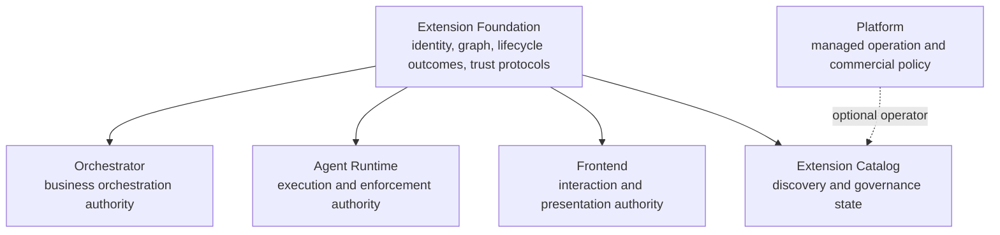
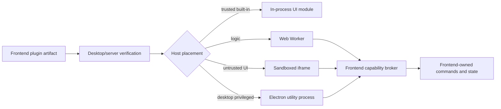

# Product Adoption

## Ownership Model

Foundation never imports product models. Each product owns its extension-point
contracts, adapters, composition profiles, grants, conformance additions, and
authority decisions. Shared Foundation semantics make host behavior comparable;
they do not make products one bounded context.

## Orchestrator

Strong candidate extension points are narrow proposal, evidence, or
post-commit-effect seams:

| Owning area | Candidate contribution | Authority retained by Orchestrator |
| --- | --- | --- |
| Run Orchestration | Workflow scheduling mechanics | Run lifecycle, accepted transitions, recovery policy |
| Work Coordination | Work-placement proposal strategy | Assignment invariants, eligibility, final placement |
| Work Coordination | Completion-evidence provider | Completion readiness, terminal winner, canonical outcome |
| Review Management | Review/evaluation strategy | Review state, acceptance policy, canonical outcome |
| Agent Context | Context source or transformation | Data access, redaction, final assembled context |
| Automation | Condition evaluator and post-commit effect | Trigger ownership, deduplication, authorization |
| Integrations | Provider-specific ACL and transport adapters | Product command and event semantics |
| Execution Observation | Parser, normalizer, redactor, renderer metadata | Canonical observation schema and retention |

The extension returns a proposal, evidence, transformation result, or effect
receipt. The owning use case validates it before mutation. A workflow engine
adapter never owns Run aggregates, product approvals, work completion, or
business recovery.

The leading first-pilot candidate is Work Coordination completion evidence. A
private provider may return evidence, pending, unknown/reconciliation, or
unsupported; it never returns a bare completion Boolean and cannot complete
Work. The pilot uses one built-in and one independently packaged reference
implementation, post-commit dispatch, stable operation identity, explicit
provider binding, and no dual mutation authority during migration.

This pilot starts only after its owning feature has an accepted internal model.
Publishing the contract remains a separate decision after compatibility and
substitutability evidence; Foundation does not own its product DTOs.

## Agent Runtime

Agent Runtime has stricter authority. Candidate planes include:

- provider integration bundles split into execution, installation, access,
  observation/reconciliation, permission, usage, and artifact contributions;
- runtime or process adapters;
- artifact storage backends;
- observation normalization and redaction adapters;
- privileged sandbox implementations only under AR-owned qualification.

AR always retains runtime sessions, operations, execution identity, provider
process custody, binary closure, credential generations, workspace and sandbox
policy, capability enforcement, private fences, canonical output acceptance,
recovery, and reconciliation.

A sandbox adapter enforces an AR-issued scope. It cannot choose policy, grant
itself capabilities, expose raw credentials, or claim stronger isolation than
the platform evidence proves. Provider bundles are one release envelope with
several narrow contributions, not one broad adapter interface.

The bundle manifest names each execution, installation, access, observation,
permission, usage, artifact, or sandbox role separately. Shared provider clients
may remain private implementation detail, but authorization, lifecycle and
conformance stay per role. Provider correlation IDs, timestamps, exits and
`not_found` responses are observations, never runtime authority.

The safest first AR slice is non-executable: one internal provider-bundle
descriptor plus one pinned OpenCode instruction classifier/compiler with an
empty executable closure. It proves strict schemas, deterministic digests,
secret-shaped-field rejection and fail-closed omission without provider launch,
credentials, workspace mutation or sandbox claims. Executable adoption remains
blocked by AR's own Agent Execution decisions.

## Frontend

This is a proposal only and requires separate product approval.

Candidate contributions:

- commands and command-palette entries;
- views, panels, navigation items, and settings schemas;
- activity renderers and artifact previews;
- themes and declarative UI metadata;
- product-owned actions invoked through a capability broker.

React components, Electron IPC objects, Cordis Context, browser globals, and
product stores do not enter Foundation contracts. Product adapters may expose
framework-specific contribution helpers. Browser and Electron hosts must share
semantic fixtures while keeping different containment and authority.

Web Workers do not automatically remove origin network/storage authority.
Iframes need explicit sandbox/CSP/origin policy. Electron renderers keep
`contextIsolation` and sandboxing; privileged calls cross a validated narrow
preload or utility-process broker.

The safest first Frontend slice is additive and trusted: describe the four
existing Extension Store tabs in one immutable compiled catalog, while the
React component map, Zustand state, existing APIs and mutations remain behind
product adapters. Current Claude/Codex plugins, MCP servers, skills and API keys
remain managed data, not application modules. Shadow parity covers ordering,
visibility and Web capability absence before one tab migrates.

Before any untrusted UI pilot, the product must independently harden sender,
frame and origin validation, a narrow versioned broker, navigation/permission
denial, CSP/resource origins and state namespaces. Passing Foundation manifest
validation cannot compensate for those host controls.

## Platform And Catalog

The future Extension Catalog owns catalog semantics and the canonical state of
each writable source. Platform may operate a managed catalog source and own:

- managed tenant and deployment identity linkage;
- commercial entitlement decisions;
- managed rollout and availability policy;
- hosted billing and operational controls.

Platform does not own artifact bytes, product authorization, product
aggregates, module service resolution, or self-hosted composition. Direct
digest and self-hosted catalog use work without Platform.

## Adoption Contract

Every product adoption ADR must declare:

- owning feature and authority that cannot be delegated;
- contribution contract and version family;
- built-in and independent implementation evidence;
- applicable Foundation conformance version;
- host tier and containment claim;
- requested capabilities and product grant mapping;
- configuration, secret, state, retention, and deletion ownership;
- failure, timeout, cancellation, drain, and recovery behavior;
- observability and redaction contract;
- packed compatibility fixtures;
- uninstall and product-data behavior.

No product is required to expose all candidate extension points in V1.
