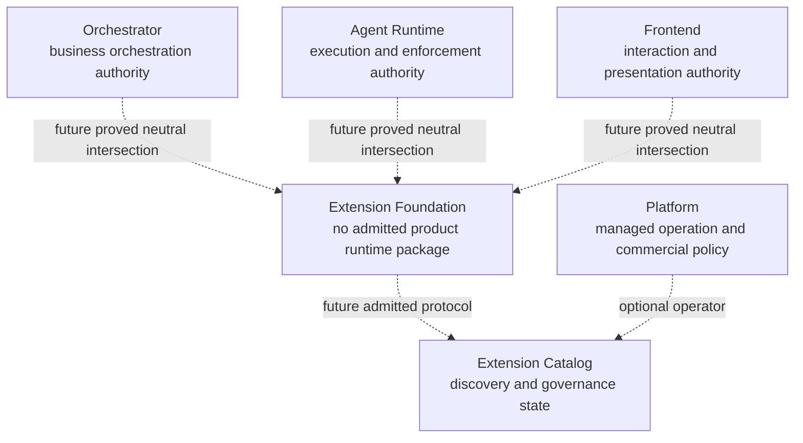
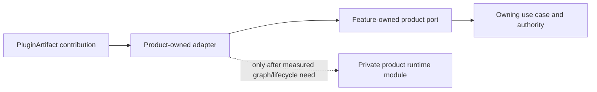
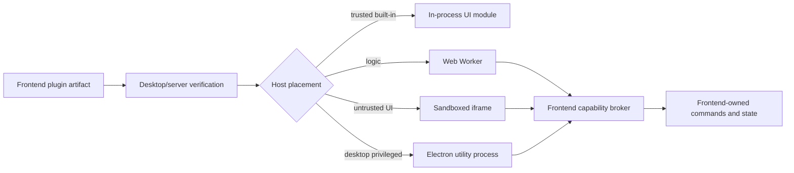

# Product Adoption

## Ownership Model

Foundation never imports product models. Each product owns its extension-point
contracts, adapters, static composition, grants, conformance additions, and
authority decisions. The first rehearsal consumes no Foundation runtime
package. Any later shared semantics require the second-consumer, reconciliation,
extraction, admission, and publication gates in the
[final recommendation](final-recommendation.md); they do not make products one
bounded context.

## Two-Level Composition

The owning feature exports a pure `FeatureModuleFactory`. It accepts explicit
feature dependencies and returns the feature's product-owned port or use-case
surface without reading configuration, selecting a provider, or managing an
application lifetime. The application composition root statically imports the
two implementations, materializes the implementation choice and configuration,
chooses lifetime, and calls the factory.

This division keeps feature composition testable while leaving deployment
policy at the application edge. A factory is not an
`ExtensionModuleDefinition`, resolver, container, registry, or service locator.
Tenant, project, workspace, run, and session identities do not implicitly
create DI scopes.

## Orchestrator

Strong candidate extension points are narrow proposal, evidence, or
post-commit-effect seams. The owning-area labels below are capability-map
candidates, not declarations that every named bounded context is accepted:

| Owning area | Candidate contribution | Authority retained by Orchestrator |
| --- | --- | --- |
| Run Orchestration | Workflow scheduling mechanics | Run lifecycle, accepted transitions, recovery policy |
| Work Coordination | Work-placement proposal strategy | Assignment invariants, eligibility, final placement |
| Work Coordination | Completion-evidence provider | Completion readiness, terminal winner, canonical outcome |
| Review Management | Review/evaluation strategy | Review state, acceptance policy, canonical outcome |
| Agent Context | Context source or transformation | Data access, redaction, final assembled context |
| Automation | Condition evaluator and post-commit effect | Trigger ownership, deduplication, authorization |
| Integrations | Provider-specific ACL and transport adapters | Product command and event semantics |
| Execution Observation | Parser, normalizer, redactor, renderer metadata | Canonical observation schema and retention |

The extension returns a proposal, evidence, transformation result, or effect
receipt. The owning use case validates it before mutation. A workflow engine
adapter never owns Run aggregates, product approvals, work completion, or
business recovery.

The leading first-pilot candidate is Work Coordination Work Completion evidence.
It is a candidate product-owned static `T0` rehearsal, not a graph-first module
pilot and not an accepted new SPI. A private provider may return evidence,
pending, unknown/reconciliation, or unsupported; it never returns a bare
completion Boolean and cannot complete Work. The rehearsal starts with two
fixed audited built-ins, including one independently authored feature-local
implementation. The application composition root statically imports both,
materializes the selection, configuration, and lifetime, and injects the
selected implementation through the feature's pure `FeatureModuleFactory`.

The rehearsal uses post-commit dispatch, stable operation identity, stale-result
revalidation, and no dual mutation authority. It has no runtime graph, module
descriptor grammar, global container, plugin loading, Foundation package, or
public contract. Packaging remains a later evidence-backed decision. If direct
composition later fails a measured runtime-selection or independent-lifecycle
need, the owning product may separately approve the smallest private graph; it
does not start with one.

## Agent Runtime

Agent Runtime has stricter authority. Candidate planes include:

- provider integration bundles split into execution, installation, access,
  observation/reconciliation, permission, usage, and artifact contributions;
- runtime or process adapters;
- artifact storage backends;
- observation normalization and redaction adapters;
- privileged sandbox implementations only under AR-owned qualification.

AR always retains runtime sessions, operations, execution identity, provider
process custody, binary closure, credential generations, workspace and sandbox
policy, capability enforcement, private fences, canonical output acceptance,
recovery, and reconciliation.

A sandbox adapter enforces an AR-issued scope. It cannot choose policy, grant
itself capabilities, expose raw credentials, or claim stronger isolation than
the platform evidence proves. Provider bundles are one release envelope with
several narrow contributions, not one broad adapter interface.

The bundle manifest names each execution, installation, access, observation,
permission, usage, artifact, or sandbox role separately. Shared provider clients
may remain private implementation detail, but authorization, lifecycle and
conformance stay per role. Provider correlation IDs, timestamps, exits and
`not_found` responses are observations, never runtime authority.

The safest first AR slice is non-executable: one internal provider-bundle
descriptor plus one pinned OpenCode instruction classifier/compiler with an
empty executable closure. It proves strict schemas, deterministic digests,
secret-shaped-field rejection and fail-closed omission without provider launch,
credentials, workspace mutation or sandbox claims. Because it has no executable
provider selection, independently managed resources, activation, or lifecycle,
this descriptor is not an independent graph/lifecycle consumer and cannot
satisfy the second-consumer gate for extracting runtime semantics. Executable
adoption remains blocked by AR's own Agent Execution decisions.

## Plugin Contribution Mapping

A future `PluginArtifact` is a distribution and trust envelope, not an
application module or product port. After verification and product admission,
each artifact contribution is translated by a product-owned adapter into a
consumer-owned product port. The owning use case still authorizes and validates
the result.

A contribution becomes a runtime module only when runtime selection or
independent lifecycle management is actually required and the product has
approved the private graph described in Phase 2. Artifact installation alone,
multiple contribution records, or a declarative descriptor does not create
that need.

## Frontend

This is a proposal only and requires separate product approval.

Candidate contributions:

- commands and command-palette entries;
- views, panels, navigation items, and settings schemas;
- activity renderers and artifact previews;
- themes and declarative UI metadata;
- product-owned actions invoked through a capability broker.

React components, Electron IPC objects, Cordis Context, browser globals, and
product stores do not enter Foundation contracts. Product adapters may expose
framework-specific contribution helpers. Browser and Electron hosts must share
semantic fixtures while keeping different containment and authority.

Web Workers do not automatically remove origin network/storage authority.
Iframes need explicit sandbox/CSP/origin policy. Electron extension renderers
use `nodeIntegration: false`, `contextIsolation: true`, `sandbox: true`,
`webSecurity: true`, response-delivered CSP, isolated sessions, and a narrow
preload or utility-process broker. The product validates sender frame, extension
instance and origin on every privileged request; denies unexpected navigation,
new windows and permissions; and restricts external protocols.

The safest first Frontend slice is additive and trusted: describe the four
existing Extension Store tabs in one immutable compiled catalog, while the
React component map, Zustand state, existing APIs and mutations remain behind
product adapters. Current Claude/Codex plugins, MCP servers, skills and API keys
remain managed data, not application modules. Shadow parity covers ordering,
visibility and Web capability absence before one tab migrates.

The next read-only slice normalizes catalog, managed-installation, and observed
native-provider entries without merging identities by display name. Catalog,
installed state, discovery and health are independent sources: one unavailable
source produces a provenance-labelled partial or stale view, never an empty
success. Electron IPC and Web HTTP call the same product use case, but Web does
not inherit local-machine capabilities or replay browser-stored mutations.

Install and update remain deferred until the product can represent a durable
`check -> review -> apply -> verify -> activate` operation with target-granular
partial, rollback and degraded outcomes. Reload, provider restart, new-thread,
app restart and administrator action are typed activation effects rather than a
single success Boolean. The first profile is an implicit product-owned Default
profile; profile CRUD, arbitrary UI code loading and offline mutation queues are
not part of the first slice.

Before any untrusted UI pilot, the product must independently harden sender,
frame and origin validation, a narrow versioned broker, navigation/permission
denial, CSP/resource origins and state namespaces. Passing Foundation manifest
validation cannot compensate for those host controls.

## Platform And Catalog

The future Extension Catalog owns catalog semantics and the canonical state of
each writable source. Platform may operate a managed catalog source and own:

- managed tenant and deployment identity linkage;
- commercial entitlement decisions;
- managed rollout and availability policy;
- hosted billing and operational controls.

Platform does not own artifact bytes, product authorization, product
aggregates, module service resolution, or self-hosted composition. Direct
digest and self-hosted catalog use work without Platform.

## Adoption Contract

Every product adoption ADR must declare:

- owning feature and authority that cannot be delegated;
- contribution contract and version family;
- built-in and independent implementation evidence;
- applicable Foundation conformance version;
- host tier and containment claim;
- requested capabilities and product grant mapping;
- configuration, secret, state, retention, and deletion ownership;
- failure, timeout, cancellation, drain, and recovery behavior;
- observability and redaction contract;
- packed compatibility fixtures;
- uninstall and product-data behavior.

No product is required to expose all candidate extension points in V1.
