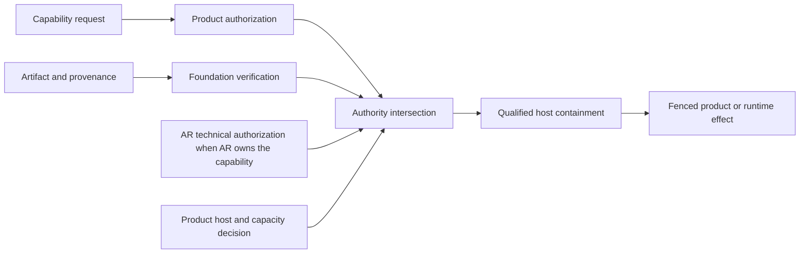

# Trust And Security

## Security Boundary

Extension Foundation verifies and transports evidence. It never turns a request,
manifest, signature, catalog entry, entitlement, or installation into product
or runtime authority.



Effective authority is the intersection of product grant, Foundation-produced
verification evidence accepted by the product, applicable AR technical
authorization, current generation/fence and host containment. Any
missing, stale, ambiguous, differently canonicalized or unknown input denies.

## Identity Chain

Keep these identities distinct and tenant-bound:

| Plane | Immutable identity | Never authority by itself |
| --- | --- | --- |
| Catalog | source authority, opaque entry ID, revision, metadata digest | display name, slug, mutable channel |
| Artifact | canonical digest, size/media type, signer subject, provenance | URL, filename, tag, signed badge |
| Profile | immutable revision, ordered bindings, semantic digest, compiler version | requested permissions, mutable profile head |
| Installation | tenant, target, generation, installed-tree digest, installer receipt | package path or host-reported presence |
| Module | installation, module digest, kind and contract revision | module name or import specifier |
| Runtime | tenant, session, operation, generation, host boot and private fence | PID, provider session, cwd or public epoch |

Mutable aliases resolve to immutable identities before review. Content-addressed
bytes may be shared, but visibility, handles, grants and existence responses
remain tenant-scoped. Rollback and restore cannot lower revision, signer, fence,
nonce or retirement high-water marks.

## Request And Grant Separation

A manifest declares requested capabilities. A separate authority owner issues a
short-lived grant bound to exact tenant, product/audience, subject, extension
identity chain, typed capability/action, resource scope, policy revision,
issuer generation, validity interval and replay identity.

- Catalog trust proves provenance, not permission.
- Entitlement controls availability, not authorization.
- Product approval permits business intent, not technical safety.
- AR grants and enforces runtime capability; Foundation cannot widen it.
- Wildcards are typed domain values, never raw string-prefix matches.
- Provider-supplied IDs and claims remain untrusted correlation data.

Secret access returns a scoped broker operation or opaque `SecretRef`, not raw
credential material. A plugin never receives a global secret store, bearer
token, private fence or ambient environment.

The consuming product owns the secret catalog, resolution policy, egress
allowlist and authorization. A neutral Foundation contract may describe a
lease or broker port only after two consumers prove matching semantics; it must
not become a Foundation-owned production secret service.

## Host Tier Matrix

| Tier | Honest claim | Candidate placement |
| --- | --- | --- |
| `T0` trusted | Same authority and crash radius as host application | audited built-in in-process module |
| `T1` fault-contained | Ordinary failures separated; malicious code still has user/app authority | Node Worker, Electron utility process, same-user child process |
| `T2` capability sandbox | Guest limited to explicit imports by an independently enforced boundary | dedicated cross-origin/opaque-origin document or deny-by-default Wasm; an ordinary Worker remains `T1` |
| `T3` OS-enforced | Kernel policy constrains identity, files, network, IPC, descendants and resources | hardened Linux sandbox, macOS sandboxed helper, Windows AppContainer/Job |
| `T4` workload-isolated | Separate kernel or machine behind a narrow broker | microVM, VM or remote disposable host |

Node Permission Model, Worker threads, `utilityProcess`, process PIDs,
containers, origins and Wasm labels do not upgrade a tier automatically. The
weakest granted capability determines the effective claim. Unsupported required
containment fails before activation.

Frontend adoption remains a product decision. An opaque-origin iframe is bound
through exact `WindowProxy` source, nonce and a freshly transferred
`MessagePort`; it cannot authenticate by origin. A dedicated cross-origin
iframe uses an exact `targetOrigin`, partitioned storage and a distinct site.
Both need response-header CSP, safe sandbox flags and a broker that validates
instance, source/origin profile, object ownership, schema, size, deadline and
grant on every privileged request. An ordinary Worker removes DOM access but
normally retains origin network/storage authority.

## Artifact Supply Chain

The recommended distribution stack remains conditional:

- OCI/ORAS stores and transports immutable bytes;
- Cosign/Sigstore authenticates signature, attestation and transparency
  evidence; acceptance policy must still validate builder, source, predicate,
  subject digest and dependency closure, and never treats a signature as proof
  that code is trustworthy;
- TUF supplies freshness, rollback/freeze protection, revocation and namespace
  delegation when managed channels or automatic updates exist;
- GHCR or Harbor is an untrusted byte source, never the final trust decision;
- runtime sandbox and product grant remain independent after verification.

```text
accept artifact =
  canonical digest
  AND namespace-authorized signer
  AND verified provenance
  AND exact dependency closure
  AND fresh non-revoked release record

execute artifact =
  accept artifact
  AND product grant
  AND AR authorization
  AND host policy
```

V1 may remain strictly digest-pinned with a signed release/revocation record,
but that profile makes no timely revocation or freeze-resistance guarantee.
If it adds mutable channels, multiple delegated publishers, mirrors or automatic
updates, TUF becomes part of that profile rather than an optional badge.

OCI tags support discovery only. The installer pulls by digest, hashes raw
manifest bytes and every descriptor, verifies provenance subject and dependency
closure, and records an installation receipt. Signature deletion or tag movement
is not revocation; a newer signed revocation record carries forbidden digests,
publisher cutoffs and minimum release/policy sequences.

Namespace admission canonicalizes publisher and package identities before any
lookup, rejects confusable names and unauthorized scope aliases, and binds every
dependency to an approved namespace owner plus exact digest. Search ranking,
display names and package-manager fallback cannot resolve dependencies. This
keeps typosquatting and dependency-confusion attacks outside runtime resolution.

## IPC And Capability Broker

Every host protocol method declares:

- frozen versioned request, response, event and error schema;
- peer, extension instance, authority scope and current generation;
- request and operation identities with payload-conflict detection;
- one absolute deadline, cancellation and bounded concurrency;
- strict frame size, nesting, stream credit and output limits;
- capability and object-ownership check at use time;
- redacted audit and outcome classification;
- `rejected`, `applied`, `in_progress`, `unknown`, or
  `termination_unproven` semantics.

Direction is part of authenticated identity. A response preserves request and
operation correlation but swaps the authenticated endpoints: the receiving host
becomes `sender`, and the authenticated requester becomes `audience`. Shape-only
validation is insufficient; each direction validates its own peer/audience
tuple before accepting a frame.

Portable protocol identifiers use one bounded printable ASCII grammar. Control
characters, surrounding whitespace and log-delimiter injection are rejected
before dispatch or durable audit recording.

Control and data lanes are separate. Stop, abort, inspect and credit messages
retain reserved capacity when output is backpressured. Canonical output cannot
be silently dropped; explicitly diagnostic streams may declare bounded
truncation. A timeout after dispatch is unknown and reconciled before retry.

V1 disables transport compression. Any later compressed profile separately
bounds compressed bytes, expanded bytes, ratio, nesting/member count, decoder
CPU and aggregate stream bytes. Budgets are hierarchical across host, tenant,
session, grant and execution, and cover wall/CPU time, memory, processes,
threads, descriptors, stream bytes, disk/inodes, network and queue depth.

## Revocation

Revocation closes new authority before asynchronous cleanup:

```text
Grant or artifact revoked
  -> durable authority/cutoff revision advances
  -> queued and new admission fails
  -> stale canonical output fails its fence
  -> host containment runs idempotently
  -> ambiguous effects reconcile
  -> enforced or uncertain receipt is recorded
```

Changing a policy row is not enforcement completion. Completion begins at the
owning product or AR receipt. Reinstall, successor activation and rollback all
use a new identity and fresh authorization. Uninstall never deletes product data
implicitly.

## Data Classes

| Class | Examples | Rule |
| --- | --- | --- |
| `PUBLIC_INTEGRITY` | public catalog metadata, schemas, provenance | publishable but tamper-sensitive |
| `TENANT_CONFIDENTIAL` | tenant overlays, profile configuration | tenant-keyed storage and export policy |
| `SECURITY_RESTRICTED` | grants, install receipts, generations, cutoffs | least privilege, durable audit, no public feed |
| `SECRET` | credentials, private keys, private fences | opaque references outside custody adapter |
| `USER_CONTENT` | prompts, files, outputs, transcripts | purpose, retention, redaction and deletion owned by product |
| `AUDIT_RESTRICTED` | decision and enforcement evidence | immutable/redacted source record; projections have no authority |

Storage location does not transfer ownership. Telemetry never becomes the only
record of grants, admission, publication, cleanup debt or revocation.

## Mandatory Negative Evidence

The production conformance suite must cover at least:

- cross-tenant and cross-product substitution without an existence oracle;
- catalog rollback, tag movement, artifact/provenance mismatch and signer
  revocation;
- typosquatting, Unicode-confusable publisher identity, unauthorized namespace
  alias and dependency-confusion fallback to a public registry;
- request presented as grant, stale/expired/replayed grant, sender mismatch and
  typed resource-scope expansion;
- installation-tree, module-binding, classifier and runtime-boot substitution;
- stale generation/fence, late output, ambiguous effect and restore
  resurrection;
- filesystem traversal/link race, egress/DNS rebinding, secret recovery,
  inherited handles and process-tree escape;
- forged/replayed IPC, malformed/oversized frames, reentrancy and object-ID
  reuse;
- CPU, memory, PID/thread, descriptor, disk, log and queue exhaustion;
- crash, native abort, OOM and rapid restart loops without host or sibling
  authority loss.

Applicable host-isolation fixtures run on Linux, macOS and Windows. A passing
test must observe a denied external effect, not only an adapter return value.
These are required gates, not claims that the current disposable spike has
implemented every fixture.

## MVP And Deferred Work

MVP qualification includes canonical IDs, digest-pinned OCI artifacts, one
verified signer policy, installation receipts, revocation records, explicit
`T0/T1` labels, strict IPC, secret broker contracts and negative fixtures.

Untrusted third-party execution is not implied by the first module-graph slice.
`T2` Wasm/browser hosts, `T3` platform launchers, TUF-managed channels,
publisher self-service, threshold promotion, transparency monitoring and `T4`
native execution remain separately gated.

## Primary References

- [NIST Zero Trust Architecture](https://csrc.nist.gov/pubs/sp/800/207/final)
- [OAuth 2.0 Security Best Current Practice](https://www.rfc-editor.org/rfc/rfc9700)
- [The Update Framework](https://theupdateframework.github.io/specification/latest/)
- [SLSA provenance](https://slsa.dev/spec/v1.1/provenance)
- [Sigstore verification](https://docs.sigstore.dev/cosign/verifying/verify/)
- [OCI Distribution Specification](https://github.com/opencontainers/distribution-spec/blob/main/spec.md)
- [Electron security recommendations](https://www.electronjs.org/docs/latest/tutorial/security)
- [Wasmtime security](https://docs.wasmtime.dev/security.html)
