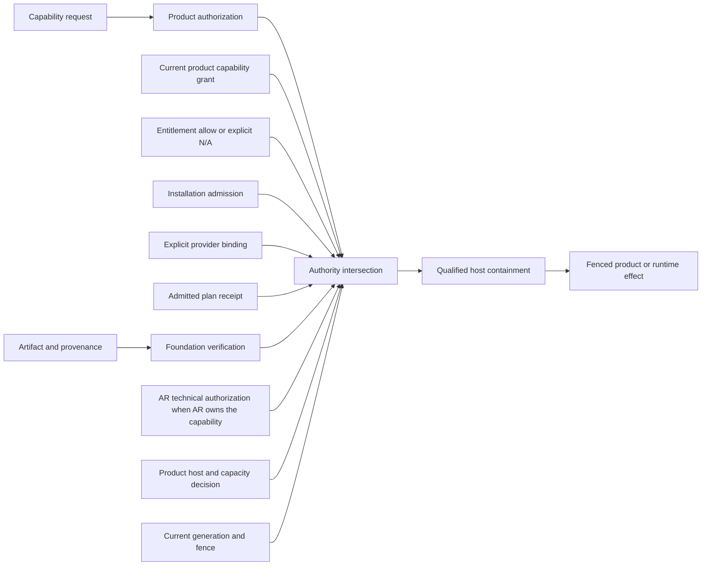

# Trust And Security

## Security Boundary

Extension Foundation verifies and transports evidence. It never turns a request,
manifest, signature, catalog entry, entitlement, or installation into product
or runtime authority.

The current qualified surface is deliberately smaller than the target
architecture. It covers audited, co-released `T0` built-ins and the fail-closed
authority joins exercised by the rehearsal. It does not qualify remote artifact
adapters, arbitrary third-party execution, managed update channels, stateful
plugin update or uninstall, or production secret and egress brokers.



For a triggered runtime graph or dynamically loaded artifact, effective
authority is the intersection of product authorization, a separate current
product capability grant, applicable entitlement and installation admission,
Foundation-produced verification evidence accepted by the product, an exact
provider binding and current unexpired admitted plan receipt, applicable AR
technical authorization, current candidate/runtime generations and fence, host
policy and containment. Any missing, stale, ambiguous, differently
canonicalized or unknown input denies.

No dynamic executable bytes, import, getter, provider callback, or declarative
payload with executable semantics is evaluated while that intersection is
incomplete. Verification, catalog presence, signature, admission, graph
construction, entitlement, or a grant alone cannot cross the dynamic execution
boundary. The host resolves and evaluates only the executable named by the
current admitted provider binding after it rereads all current inputs.

Static T0 built-ins use a separate accepted route: build provenance, literal
target selection, immutable built-in implementation binding, and the trusted
product composition root may evaluate a passive factory without inventing a
runtime graph receipt. That evaluation grants no privileged effect authority.
Every privileged invocation still requires current product authorization,
grant, candidate/runtime generations and fence, host policy, and any applicable
AR authorization or containment. A static built-in cannot silently become a
dynamic provider or bypass those invocation checks.

| Receipt or decision | Precise fact established | Does not establish |
| --- | --- | --- |
| Artifact verification | Bytes, signature and provenance satisfy verification policy | Admission, benign behavior, authorization or execution |
| Plan admission | Canonical content and explicit providers were admitted for one scope and validity interval | Provider success, activation or runtime enforcement |
| Provider execution receipt | One bound provider attempt produced the stated result by its deadline | Product invariant validity, handoff or effect authority |
| Graph construction evidence | One inert graph candidate is deterministic and structurally valid | Product-owned first-graph validity or admission |
| Activation/handoff CAS | One admitted generation became the selected active head | Continuing authorization or enforcement at later sinks |
| Product authorization or grant | The named business action or capability is allowed at one revision | Artifact trust, graph validity, activation or enforcement |
| Runtime enforcement receipt | One named operation was accepted or denied using current inputs | Any other operation or lifecycle fact |

Tenant, authority scope, graph generation, host runtime incarnation and grant are
checked again at publication, invocation-lease acceptance and every privileged
sink. An extension, provider, broker, registry or network call never occurs
inside the product Unit of Work: the Unit of Work records canonical state and
durable intent, then dispatch and reconciliation occur after commit.

## Identity Chain

Keep these identities distinct and tenant-bound:

| Plane | Immutable identity | Never authority by itself |
| --- | --- | --- |
| Catalog | source authority, opaque entry ID, revision, metadata digest | display name, slug, mutable channel |
| Artifact | canonical digest, size/media type, signer subject, provenance | URL, filename, tag, signed badge |
| Profile | immutable revision, ordered bindings, semantic digest, compiler version | requested permissions, mutable profile head |
| Installation | tenant, target, generation, installed-tree digest, installer receipt | package path or host-reported presence |
| Module | installation, module digest, kind and contract revision | module name or import specifier |
| Runtime | tenant, session, operation, generation, host boot and private fence | PID, provider session, cwd or public epoch |

Mutable aliases resolve to immutable identities before review. Content-addressed
bytes may be shared, but visibility, handles, grants and existence responses
remain tenant-scoped. Rollback and restore cannot lower revision, signer, fence,
nonce or retirement high-water marks.

## Request And Grant Separation

A manifest declares requested capabilities. A separate authority owner issues a
short-lived grant bound to exact tenant, product/audience, subject, extension
identity chain, typed capability/action, resource scope, policy revision,
issuer generation, validity interval and replay identity.

- Catalog trust proves provenance, not permission.
- Entitlement controls availability, not authorization.
- Product approval permits business intent, not technical safety.
- AR grants and enforces runtime capability; Foundation cannot widen it.
- Wildcards are typed domain values, never raw string-prefix matches.
- Provider-supplied IDs and claims remain untrusted correlation data.

Secret access returns a scoped broker operation or opaque `SecretRef`, not raw
credential material. A plugin never receives a global secret store, bearer
token, private fence or ambient environment.

The consuming product owns the secret catalog, resolution policy, egress
allowlist and authorization. A neutral Foundation contract may describe a
lease or broker port only after two consumers prove matching semantics; it must
not become a Foundation-owned production secret service.

## Host Tier Matrix

An **audited `T0` built-in** is part of one signed product build and is reachable
only through that build's literal, target-specific loader closure. Its exact
transitive executable closure has a recorded digest, provenance, review owner
and approval evidence. It cannot gain executable bytes, imports or loader
entries through post-deployment mutation. Configuration and every effective
grant remain product-controlled. A package being statically present, signed or
named in generated metadata does not satisfy this definition.

| Tier | Honest claim | Candidate placement |
| --- | --- | --- |
| `T0` trusted | Same authority and crash radius as host application | audited built-in in-process module |
| `T1` fault-contained | Trusted fault containment for ordinary failures; not arbitrary third-party isolation | Node Worker, Electron utility process, same-user child process |
| `T2` capability sandbox | Guest limited to explicit imports by an independently enforced boundary | dedicated cross-origin/opaque-origin document or deny-by-default Wasm; an ordinary Worker remains `T1` |
| `T3` OS-enforced | Kernel policy constrains identity, files, network, IPC, descendants and resources | hardened Linux sandbox, macOS sandboxed helper, Windows AppContainer/Job |
| `T4` workload-isolated | Separate kernel or machine behind a narrow broker | microVM, VM or remote disposable host |

Node Permission Model, Worker threads, `utilityProcess`, process PIDs,
containers, origins and Wasm labels do not upgrade a tier automatically. The
weakest granted capability determines the effective claim. Unsupported required
containment fails before activation.

`T1` process hosting assumes code trusted with the operating-system user's and
application's ambient authority. It can improve crash, restart and cleanup
containment, but it is not a malicious-code sandbox. Untrusted native code
requires a stronger product/platform boundary with independently enforced
`T3` or `T4` controls and per-platform escape tests. That boundary is not
implemented or qualified here; a product must defer activation rather than
label a `T1` process as untrusted isolation.

Frontend adoption remains a product decision. An opaque-origin iframe is bound
through exact `WindowProxy` source, nonce and a freshly transferred
`MessagePort`; it cannot authenticate by origin. A dedicated cross-origin
iframe uses an exact `targetOrigin`, partitioned storage and a distinct site.
Both need response-header CSP, safe sandbox flags and a broker that validates
instance, source/origin profile, object ownership, schema, size, deadline and
grant on every privileged request. An ordinary Worker removes DOM access but
normally retains origin network/storage authority.

## Artifact Supply Chain

The following distribution stack is target architecture. This qualification
does not contain or qualify production OCI/ORAS, Cosign/Sigstore or TUF
adapters, and their names must not be read as current implementation evidence:

- OCI/ORAS stores and transports immutable bytes;
- Cosign/Sigstore authenticates signature, attestation and transparency
  evidence; acceptance policy must still validate builder, source, predicate,
  subject digest and dependency closure, and never treats a signature as proof
  that code is trustworthy;
- TUF supplies freshness, rollback/freeze protection, revocation and namespace
  delegation when managed channels or automatic updates exist;
- GHCR or Harbor is an untrusted byte source, never the final trust decision;
- runtime sandbox and product grant remain independent after verification.

```text
verify artifact =
  canonical digest
  AND namespace-authorized signer
  AND verified provenance
  AND exact dependency closure

accept managed artifact =
  verify artifact
  AND TUF-protected current non-revoked release metadata

accept manual exact-digest artifact =
  verify artifact
  AND exact recursive digest closure
  AND configured local revocation authority at its latest imported monotonic revision
  AND route explicitly records no publisher-currentness claim

accepted artifact =
  accept managed artifact OR accept manual exact-digest artifact

execute dynamically loaded provider =
  accepted artifact
  AND compatibility decision = allow
  AND catalog or direct-digest trust route = allow
  AND (entitlement decision = allow OR entitlement plane = explicitly not-applicable)
  AND installation admission = allow
  AND current unexpired AdmittedPlanReceipt matches authority scope,
      PlanContentDigest, and provider-binding digest
  AND exact provider binding matches installation, contribution, artifact,
      implementation, and target loader identity
  AND product authorization = allow
  AND current product capability grant
  AND (AR authorization = allow when AR owns the capability
       OR AR plane = explicitly not-applicable)
  AND current candidate generation, runtime generation, and fence
  AND host policy = allow
  AND required containment = ready

invoke static built-in =
  build provenance and literal target selection = allow
  AND exact BuiltInModuleInstallation implementation binding
  AND product authorization = allow
  AND current product capability grant
  AND (AR authorization = allow when AR owns the capability
       OR AR plane = explicitly not-applicable)
  AND current candidate generation, runtime generation, and fence
  AND host policy = allow
  AND required containment = ready or explicitly not-applicable by product policy
```

Every conjunct is an independent, current decision. A product authorization is
the product policy result; a capability grant is its narrower technical
invocation authority, and neither implies the other. `Explicitly
not-applicable` means the owning product declares that the plane does not
participate for this capability. Unknown applicability, a bare decision without
an `allow` result, missing evidence, stale revisions or contradictory decisions
deny execution.

A direct digest route is explicitly `manual-pin/no-currentness`. Authenticating
the selected digest can prove which bytes were selected; it does not by itself
prove publisher freshness, publisher-currentness, or freeze and rollback
protection. The manual exact-digest profile below separately requires a
configured authoritative local revocation set, a monotonic revision, and
fail-closed host propagation before that digest can execute. This proves only
the revocation policy actually imported by the operator; it does not prove that
the operator has the publisher's newest notice. TUF is required before any
remote mutable channel, delegated publisher, automatic update, or
publisher-currentness claim. A signed release or revocation record beside a
manual pin remains evidence until the configured authority imports it and does
not silently upgrade the route to a currentness protocol.

OCI tags support discovery only. The installer pulls by digest, hashes raw
manifest bytes and every descriptor, verifies provenance subject and dependency
closure, and records an installation receipt. Signature deletion or tag movement
is not revocation; a newer signed revocation record carries forbidden digests,
publisher cutoffs and minimum release/policy sequences.

Namespace admission canonicalizes publisher and package identities before any
lookup, rejects confusable names and unauthorized scope aliases, and binds every
dependency to an approved namespace owner plus exact digest. Search ranking,
display names and package-manager fallback cannot resolve dependencies. This
keeps typosquatting and dependency-confusion attacks outside runtime resolution.

## IPC And Capability Broker

Every host protocol method declares:

- frozen versioned request, response, event and error schema;
- peer, extension instance, authority scope and current generation;
- request and operation identities with payload-conflict detection;
- one absolute request deadline, cancellation and bounded concurrency;
- strict frame size, nesting, stream credit and output limits;
- capability and object-ownership check at use time;
- redacted audit and outcome classification;
- `rejected`, `applied`, `in_progress`, `unknown`, or
  `termination_unproven` semantics.

Direction is part of authenticated identity. A response preserves request and
operation correlation but swaps the authenticated endpoints: the receiving host
becomes `sender`, and the authenticated requester becomes `audience`. Shape-only
validation is insufficient; each direction validates its own peer/audience
tuple before accepting a frame.

Portable protocol identifiers use one bounded printable ASCII grammar. Control
characters, surrounding whitespace and log-delimiter injection are rejected
before dispatch or durable audit recording.

Control and data lanes are separate. Stop, abort, inspect and credit messages
retain reserved capacity when output is backpressured. Canonical output cannot
be silently dropped; explicitly diagnostic streams may declare bounded
truncation. A timeout after dispatch is unknown and reconciled before retry.

V1 disables transport compression. Any later compressed profile separately
bounds compressed bytes, expanded bytes, ratio, nesting/member count, decoder
CPU and aggregate stream bytes. Budgets are hierarchical across host, tenant,
session, grant and execution, and cover wall/CPU time, memory, processes,
threads, descriptors, stream bytes, disk/inodes, network and queue depth.

## Revocation

Revocation closes new authority before asynchronous cleanup:

```text
Grant or artifact revoked
  -> durable authority/cutoff revision advances
  -> queued and new admission fails
  -> stale canonical output fails its fence
  -> host containment runs idempotently
  -> ambiguous effects reconcile
  -> enforced or uncertain receipt is recorded
```

Changing a policy row is not enforcement completion. Completion begins at the
owning product or AR receipt. Reinstall, successor activation and rollback all
use a new identity and fresh authorization. Uninstall never deletes product data
implicitly.

### Manual Exact-Digest Revocation Profile

A manual import identifies its revocation subject only as the complete immutable
OCI descriptor `(registry authority, repository, manifest digest algorithm and
value, manifest media type, manifest size)`, plus every executable child digest
selected from that manifest. A tag, version, package name, display name, URL, or
catalog slug is never revocation identity and is resolved before review.

The authoritative input is a product-configured, authenticated local revocation
set with monotonic `revocationRevision`, issuer identity, issued/received times,
and entries containing exact forbidden digests and an optional cutoff. The
import receipt records the exact revision checked. A remote publisher notice or
catalog view is evidence only until the configured authority imports it; a
manual profile makes no freshness or publisher-currentness claim.

Before admission, provider evaluation, activation/handoff, invocation lease,
and every privileged sink, the product host checks the exact digest closure
against the latest durable local revision. Advancing that revision durably
closes new admission and execution for matching digests, advances the affected
authority fence, invalidates queued work, and propagates to every affected host
and sink. A host that cannot prove it has observed at least the required
revision fails closed for the affected digest. Existing work is drained or
terminated under lifecycle rules, and stale output fails the dynamically read
sink fence. Enforcement is complete only when the owning product or AR records
the revision-bound enforcement receipt; distribution or policy storage alone
is not completion. Removing a digest requires a higher explicit authority
revision and fresh admission; absence from a later feed never removes the
revocation.

## Data Classes

| Class | Examples | Rule |
| --- | --- | --- |
| `PUBLIC_INTEGRITY` | public catalog metadata, schemas, provenance | publishable but tamper-sensitive |
| `TENANT_CONFIDENTIAL` | tenant overlays, profile configuration | tenant-keyed storage and export policy |
| `SECURITY_RESTRICTED` | grants, install receipts, generations, cutoffs | least privilege, durable audit, no public feed |
| `SECRET` | credentials, private keys, private fences | opaque references outside custody adapter |
| `USER_CONTENT` | prompts, files, outputs, transcripts | purpose, retention, redaction and deletion owned by product |
| `AUDIT_RESTRICTED` | decision and enforcement evidence | immutable/redacted source record; projections have no authority |

Storage location does not transfer ownership. Telemetry never becomes the only
record of grants, admission, publication, cleanup debt or revocation.

## Mandatory Negative Evidence

The production conformance suite must cover at least:

- cross-tenant and cross-product substitution without an existence oracle;
- catalog rollback, tag movement, artifact/provenance mismatch and signer
  revocation;
- typosquatting, Unicode-confusable publisher identity, unauthorized namespace
  alias and dependency-confusion fallback to a public registry;
- request presented as grant, stale/expired/replayed grant, sender mismatch and
  typed resource-scope expansion;
- installation-tree, module-binding, classifier and runtime-boot substitution;
- stale generation/fence, late output, ambiguous effect and restore
  resurrection;
- filesystem traversal/link race, egress/DNS rebinding, secret recovery,
  inherited handles and process-tree escape;
- forged/replayed IPC, malformed/oversized frames, reentrancy and object-ID
  reuse;
- CPU, memory, PID/thread, descriptor, disk, log and queue exhaustion;
- crash, native abort, OOM and rapid restart loops without host or sibling
  authority loss.

Applicable host-isolation fixtures run on Linux, macOS and Windows. A passing
test must observe a denied external effect, not only an adapter return value.
These are required gates, not claims that the current disposable spike has
implemented every fixture.

## Future Qualification Gates

The current rehearsal does not qualify a plugin platform. Each expansion fails
closed until its own implementation and negative conformance evidence exist:

- **Artifact admission and materialization:** prove exact transitive executable
  dependency closure, target-specific loader and bundle receipt chains, bounded
  extraction, traversal/link rejection, digest-before-execute, atomic promotion
  and cleanup of partial materialization. Only then may OCI/ORAS and
  Cosign/Sigstore adapters be described as implemented or qualified.
- **Remote currentness:** implement and qualify TUF roles, delegation, expiry,
  revocation, rollback/freeze protection and trusted high-water recovery before
  mutable channels, publisher currentness or automatic updates.
- **Hosting:** keep `T1` limited to trusted fault containment. Qualify `T2`
  Wasm/browser or per-platform `T3` launchers before hostile code, and a `T4`
  boundary before untrusted native workload claims.
- **Egress and secrets:** use product-owned destination policy, DNS/redirect and
  response limits, opaque secret references, one-operation leases, redacted
  audit and revocation. No ambient network, credential or environment access is
  an acceptable interim mode.
- **State custody and migration:** define the exact state subject, owner,
  authority and schema lineage; require current custody authorization and a
  fenced migration lease; reconcile ambiguous effects before publication or
  rollback.
- **Uninstall and retained state:** enumerate every exact retained-state
  reference and owner decision. Retirement remains non-terminal while a staged
  pin, route, invocation, runtime, effect or attachment is unresolved, and
  uninstall never infers deletion.
- **Resources and cleanup debt:** enforce hierarchical CPU, wall-time, memory,
  process/thread, descriptor, disk/inode, network, stream and queue budgets.
  Persist cleanup debt, bound restart loops, prove descendant/resource terminal
  receipts and make unresolved debt block unsafe reuse or retirement.

Untrusted third-party execution is not implied by the module-graph slice.
Publisher self-service, threshold promotion, transparency monitoring, stateful
updates and public SPI remain separately gated by product evidence and an
independent conformance implementation.

## Primary References

- [NIST Zero Trust Architecture](https://csrc.nist.gov/pubs/sp/800/207/final)
- [OAuth 2.0 Security Best Current Practice](https://www.rfc-editor.org/rfc/rfc9700)
- [The Update Framework](https://theupdateframework.github.io/specification/latest/)
- [SLSA provenance](https://slsa.dev/spec/v1.1/provenance)
- [Sigstore verification](https://docs.sigstore.dev/cosign/verifying/verify/)
- [OCI Distribution Specification](https://github.com/opencontainers/distribution-spec/blob/main/spec.md)
- [Electron security recommendations](https://www.electronjs.org/docs/latest/tutorial/security)
- [Wasmtime security](https://docs.wasmtime.dev/security.html)
